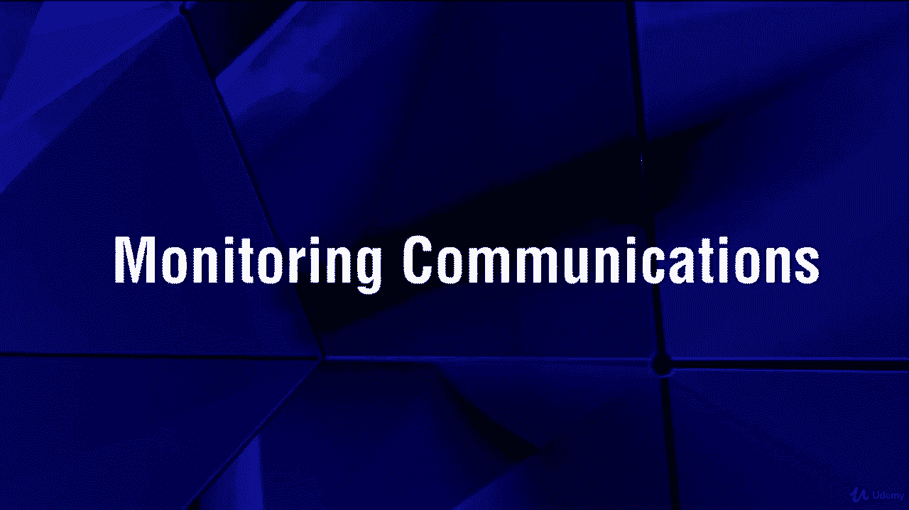

# 【Udemy】项目管理师应试 PMP Exam Prep Seminar-PMBOK Guide 6  286集【英语】 - P222：14. Monitoring Communications - servemeee - BV1J4411M7R6

When we talk about monitoring communications， you're ensuring that everyone is participating in communication as required。

 you ensure that you and the project team are following your communications management plan。

So you're concerned about the quality of communications and how do you daily communicate and with whom and how effective is that communication？

And keeping in mind who needs to be informed， so it's not just a blanket at of communication but having a specific approach to the right stakeholders based on the information you need to share then how is that information packaged。

 delivered and protected， so that's all part of monitoring communications。

Our EO for monitoring communications， your project management plan。

 specifically the communications management plan， the stakeholder Eage plan。

 project documents like the Is log， the lessons learned to registerister and Project Coms。

 work Per data， and EEF and OPA。Tools and techniques， expert judgment， the PMMIS。

 data analysis like the stakeholder engagement matrix。

 interpersonal and team skills like observation and conversation and meetings。

My outputs will be work performance information， change requests could come out of monitoring communications。

Big management updates， updates to your communications management plan and the stakeholder engagement plan。

You might have updates to project documents like the issue log。

 lessons learned to register and the stakeholder register。Some facets of monitoring communication。

 you might do customer satisfaction surveys， how satisfied are you about the news in the project or how you're being communicated。

 how can we improve upon that？Lessons learned opportunities here to improve upon our communication。

 observations of the team， so what do they see as communication downfalls or weaknesses。

 or what are you doing really well？Reviewing data from the issue log and then the stakeholder engagement assessment matrix。

 remember that's that table， where are you now and where do you want to end up so current and desired so hopefully our communications are helping move people closer and closer to our desired level of engagement。

There are some OPA factors when it comes to communication。

 things like your corporate policies may control how you communicate like social media may be out。

Organizational communication requirements， you have particular forms that you have to use。

You may have to follow the development， exchange， storage and retrieval processes that every project follows。

 like if you're part of a PMO where there's a governance for communications management approach。

 what about historical information and lessons learned， how do you store and archive that？

And then stakeholder， communications data and any information from previous projects are part of OPA。

 so what you do now， the communication you have now is future historical information。

Project performance we're probably going to be talking about earn value management in light of your exam in your projects。

 you may not use EVM。 Most stakeholders， when they're interested in performance， though。

 it's these five biggies cost schedule risk issues and quality。

 So how are you doing in the project on cost schedule risk issues and quality。

When we have earned value management， we may be creating some performance reports to communicate on our cost variances。

 our schedule variances， our indexes， predictions of where we're going to be in the project。

 or just overall health of the project， so doing some forecasting。

 and that can cause some change request or recommended corrective actions。All right。

 great job here in talking about communication and talking about managing communications and controlling communications。

