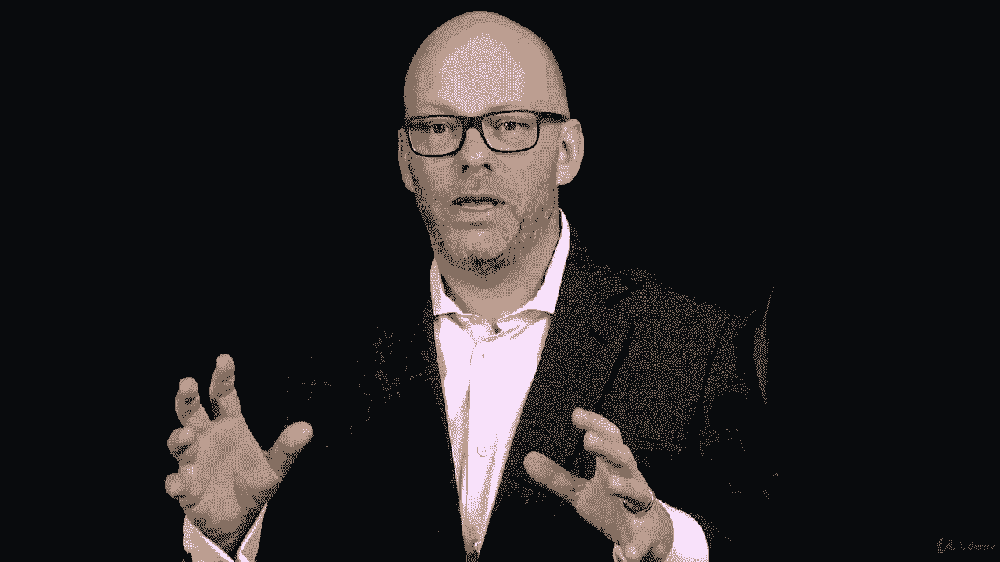

# 【Udemy】项目管理师应试 PMP Exam Prep Seminar-PMBOK Guide 6  286集【英语】 - P223：16. Section Wrap Project Communications Management - servemeee - BV1J4411M7R6

🎼，You're making great progress as you work towards earning the PM&P。

I think it's really important to check in every now and then on yourself， how are you doing？

You're getting tired， you're getting worn down， or you're getting more and more excited about passing the PMP。

 you're beginning to see the possibility that this is something that you can achieve。

 or have you already established that that you can do this and you know you can do it and you're going to get it done。

So wherever you are in your progress to earning the PMP。

 I think it's important to periodically have a reality check。

 we don't want to be overconfident and ease up on our studying efforts and we also don't want to have so much anxiety that we're trying to study everything that's out there in the world on the PMP we want to keep a methodical approach much like we do in project management。

 a methodical approach to getting the work done that yes there's a sense of urgency。

 and yes this is a difficult thing to do but we know by moving to the material。

 a methodical approach and sticking with it having perseverance and dedication you can get this done。

So keep after it， keep doing what you're doing， stay invested in the course。

 keep learning your terms and have that PMA， that positive mental attitude that you can do this。

Great job finishing this section on Project communications management。

We talked about a lot of things in this section that are important for your PMP exam and for you as a project manager。

We looked at the big picture of communications management， the communications model。

 we talked about how does communications work in a predictive versus an agile environment。

 so what are some considerations there and some trends that are happening in communications management。

We created a communications management plan which helps us to distribute information to manage the access to the communication。

 and it really answers some questions like who needs what information。

 when do they need it and what modality， who has access to that information。

 what about communication with the public so questions like that are in the communications management plan which will affect how do we distribute the information。

We looked at creating successful communications。 Well what does that mean。

 How do we know the communication is successful and what constitutes success。

 We also talked about managing communications in our project that we want to make certain that we have a clear line of communication and that people understand who communicates with whom and being available and having a good grasp on the amount of knowledge and information that's going to be created in our project。

😊。

Okay， great job finishing this section on project communications management。

 Let's keep moving forward。 So next， we're going to talk about project risk management。

 So something to look forward to。 I'll see you in the next section。😊。

