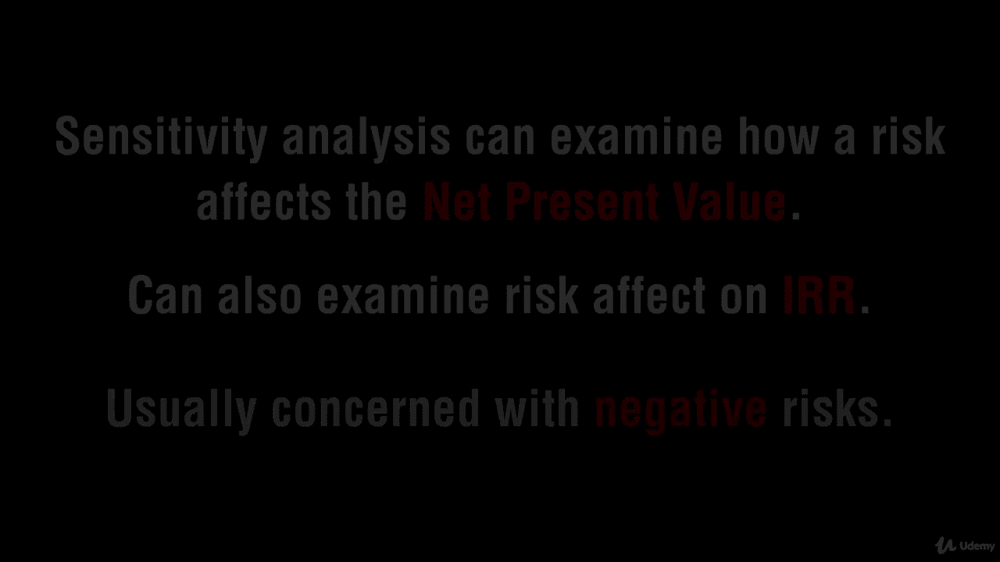

# 【Udemy】项目管理师应试 PMP Exam Prep Seminar-PMBOK Guide 6  286集【英语】 - P238：16. Applying Sensitivity Analysis - servemeee - BV1J4411M7R6

🎼。Sensitivity analysis is a study where we see。What's the real impact the real effect of one risk on the project goals so how sensitive are we to that one risk event so which one's most critical and then how do we prioritize based on sensitivity analysis so the process that you go to if you want to do sensitivity analysis you look at each risk on its own we don't consider it in come combination with other risk events。

And so which risk event has the greatest effect on the project。

 So you ignore or baseline all of your other risk events。

 And then we see how will that one risk affect our overall success。

 The goal is to see which one of your risk really has the largest effect on the project。😊。

If we're just rating our risk like we did there in qualitative。

 you just have everything's a moderate。 But really。

 some of those are heavier than just a moderate have a greater effect than just moderate。

 So risk aren't always equal。 Raly are they equal。 So which one is really the biggest risk event of all of the risks we have in the project。

 that's our goal of sensitivity analysis。Thank you very much。

Often when you do sensitivity analysis you get this tornado diagram kind of looks like a tornado so what you're seeing here are the pros and cons of different risks so you're looking for the one that has the biggest probability and the biggest effect and that would be the one that you would go and attack first so that's a tornado diagram you might get a question like which quantitative analysis approach would create a tornado diagram it would be sensitivity analysis All right good job。

