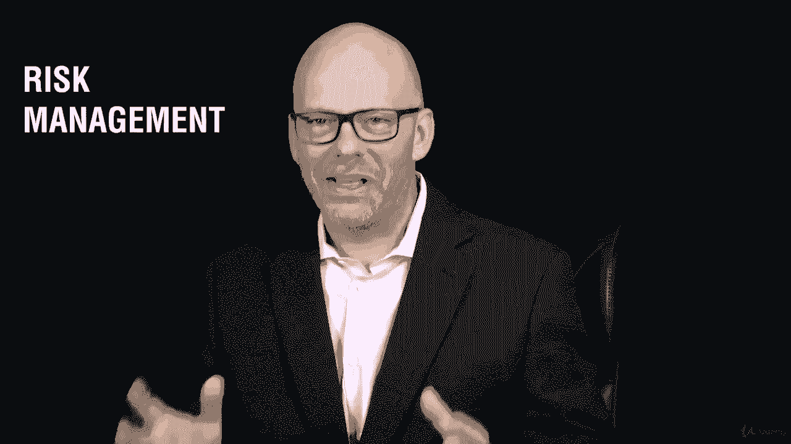
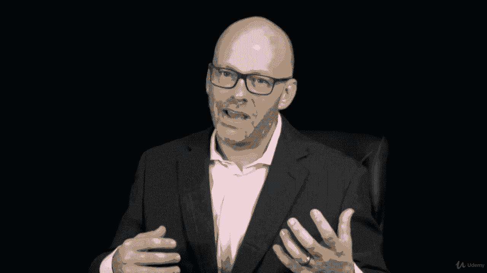

# 【Udemy】项目管理师应试 PMP Exam Prep Seminar-PMBOK Guide 6  286集【英语】 - P246：26. Section Wrap Project Risk Management - servemeee - BV1J4411M7R6

🎼。Great job finishing this section ton of information here on risk management I know we're getting towards the end of the course still a bit more information to go。

 but this is one of the largest sections in our course so I really want you to spend a little bit more time here in your study efforts you don't have to do it right now but just as you go back and study really come back to chapter 11 on risk a lot of terms a lot of opportunities for test questions so put that on your schedule to return to chapter 11 in the pembaok guide and make certain you know these terms and how you respond to risk is all those risk responses you want to be familiar with and understand those。

I also want you to think about as you complete this course。

 what risk is introduced in your study strategy？So you're getting tired， you're getting worn down。

 you're getting a little bored with project management。

I understand that this is sometimes pretty dry material so and it's a lot of material so it's easy to get worn down。

 but now's the time to come back with a renewed sense of commitment as you're completing these last few modules and you've got to go and study and spend some time studying to pass the exam Now's the time to go all the way back we talked about why are you doing this。

 what's your business value remind yourself why this is important and why you want to get this done and why this is good in your life so take heart be competent。

 keep that PMA you can do this。Great job， you did it。

 you finished this really big section I know on project risk management。

 a lot of information we talked about in this section。

The theme that we talked about was risk management。 we have opportunities and threats。

 so we compared in contrast to those we even had responses for opportunities and responses for threats。

 but before we create a responses， remember we had to create a risk management plan and the risk management plan address the environment that we're in the policies that we have for risk management。

 those enterprise environmental factors and organizational process assets that that really influenced our risk management approach then we talked about risk identification that we have to get out and identify risk events。

 and then we create the risk register that's an ongoing activity to identify risk events that add them to the register to do some qualitative risk analysis and then quantitative that I qualify the risk and that if necessary。

 I quantify the risk and that will help me better respond and create。

Risk responses， and then I monitor the ongoing risk。All right， good job。 You finished it。

 You're almost done with the course。 We have just a few more sections to go， so keep moving forward。

 You can do this。

