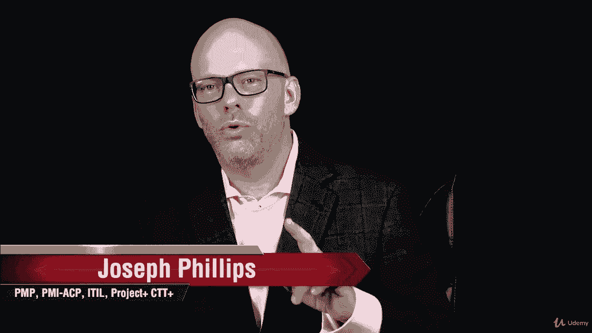
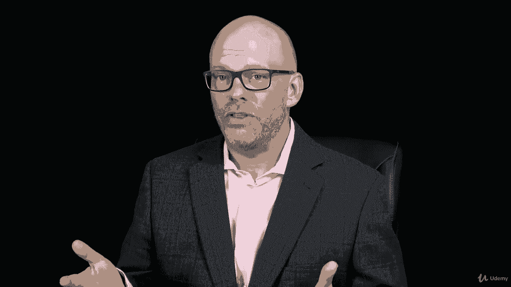
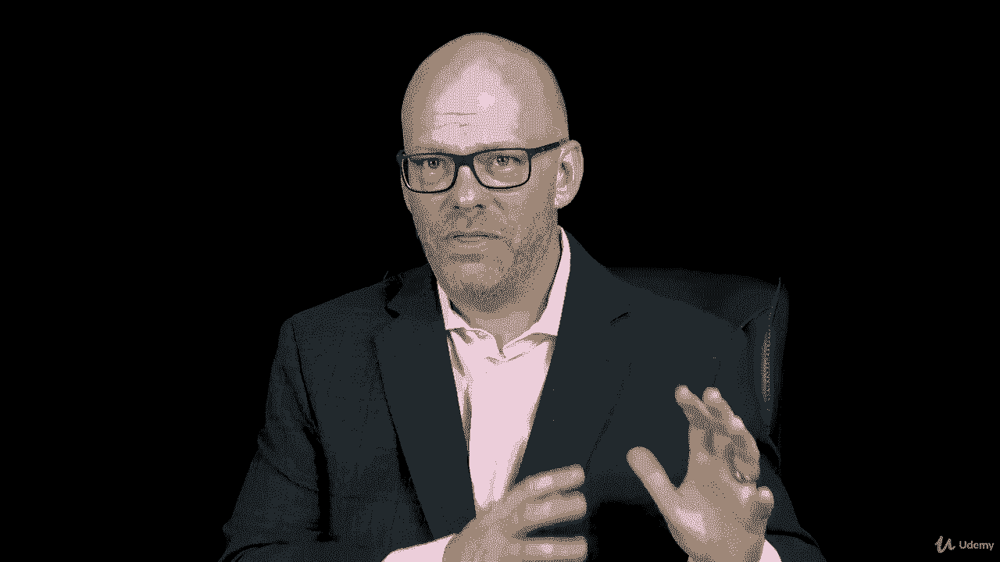
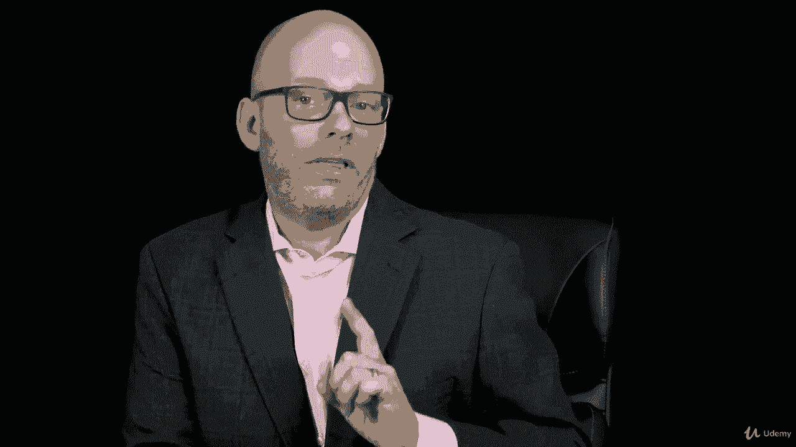
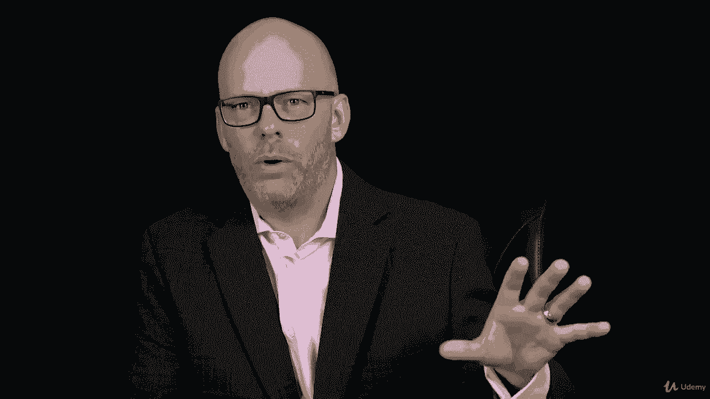
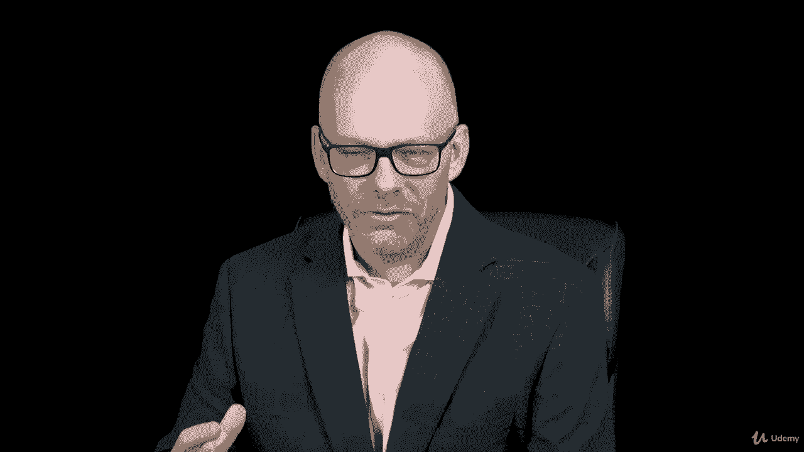
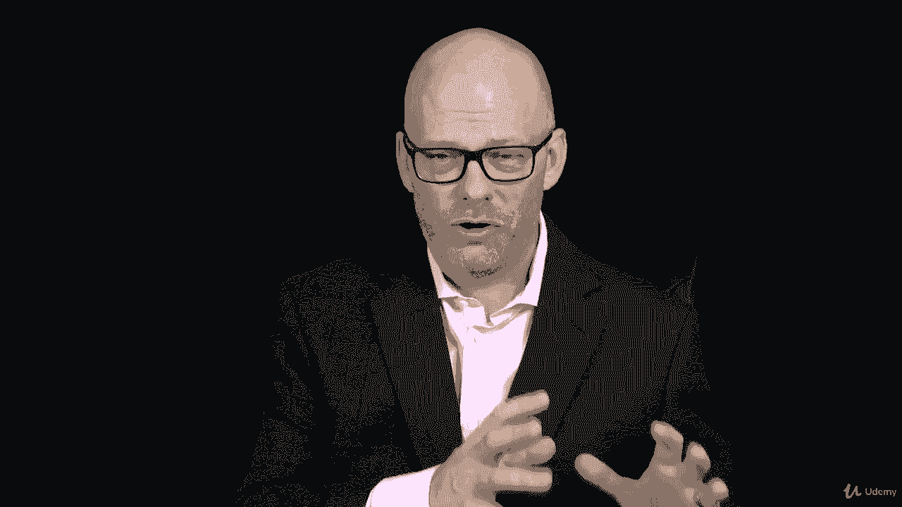
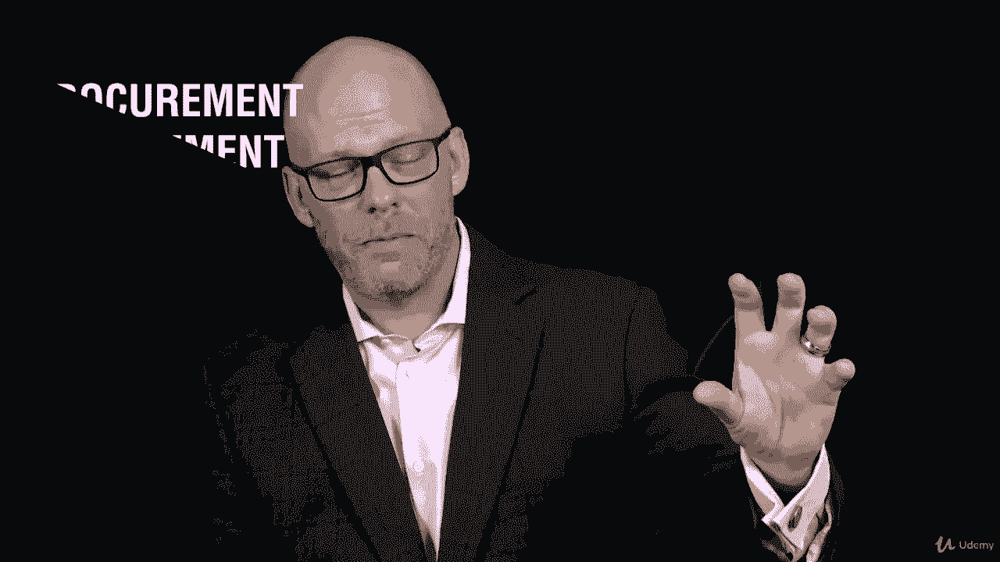

# 【Udemy】项目管理师应试 PMP Exam Prep Seminar-PMBOK Guide 6  286集【英语】 - P247：1. Section Overview Project Procurement Management - servemeee - BV1J4411M7R6

Welcome to this section on Project Procurement Management。

Do you buy stuff as a project manager， If you do， you probably are dealing with your procurement office or a contracting office。

 or maybe you're doing， maybe you're the one that's doing the procurement activity。 Well。

 a lot of project managers that I meet， they don't do any of that business。

 that's handled by other parts of their organization。

So I think that sets up a lot of project managers to get frustrated with this chapter on procurement because they don't do it。

Another thing that I see that happens is we're nearing the end of the course and this is kind of a boring。

 frankly it's kind of a boring section so people don't pay attention and then they go take their exam。

 notice I said take their exam and they don't pass because the procurement beats them up don't let that be you if you're feeling tired right now get up and do a stretch。

 get yourself some coffee or whatever it takes， but you want to really pay attention to this section on procurement managements Chapt 12 in the pemmb guide on procurement a lot of information you must know for your PMP so I know you've put a lot of time in you've invested time。

 continue to invest， you need to know procurement management so let's hop in here。

 we're going to talk about。

Procurement management in an adaptive environment， creating a procurement management plan。

 we have to know the contract types and how those contract types。

 the different nuances creating those procurement documents。

 we'll talk about some terms that you may not have heard before with procurement documents then controlling the procurement in doing contract administration really important for you as a project manager and then we'll do a case study about procurement So some important things to talk about keep positive。

 you can do this。 You're almost there。 keep pressing forward。

