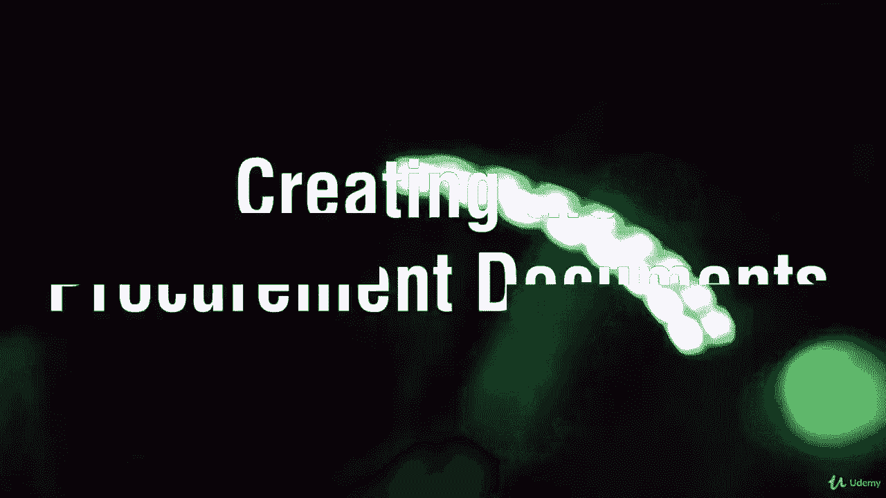

# 【Udemy】项目管理师应试 PMP Exam Prep Seminar-PMBOK Guide 6  286集【英语】 - P255：10. Creating the Procurement Documents - servemeee - BV1J4411M7R6

。

There are many documents that you will need to be familiar with for your exam and they're not tough to understand or nail down。

 They just have some different characteristics here。

 So in this table are the documents you really need to know。 This is in addition to the contracts。

 So let's walk through these now， a bid and a quotation are nearly identical。

 A bid is from the seller to the buyer and it's all about just a price。 same thing with a quote。

 it's all about the price。 that the price is what you're going to pay and whoever is the lowest bid or prices who you choose from。

A proposal is much more complex。 A proposal is like a big idea。

 So I'm going to build a new house and I go to three different architects and I ask for a proposal。

 and so they create a proposal for this house。 and they all have different ideas of what I want。

 and then they present those proposals and then I choose the one that appeals the most to me。

 So price could still be a factor， but it's more than just price。

 It's about the ideas and the proposed solution I should say。

An invitation from bid if I want you to bid， I would give you an IFB。

 So it's a document that describes our statement of work， and I'm interested in just a price。

 same thing with an RFQ。 I give you an RFQ。 Here's what we want。 I what four tons of P gravel。

 How much。 or here's exactly the specs for this piece of software or this website。 How much。

An RFP is， I want you to create a proposal for me， so give me some ideas and solutions based on this statement of work。

A request for information is I'm interested， but I may not be ready to buy。

 so an RFI is give me some white papers， give me some documentation， some brochures。

 some insight into the services and the products that you can offer that would help us out。

So those are the documents you need to be familiar with for your exam。

