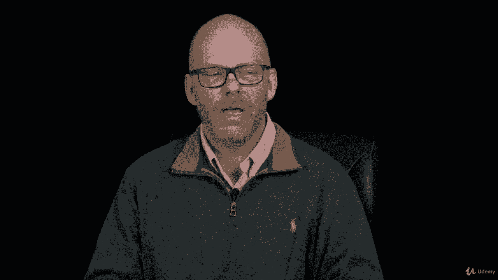
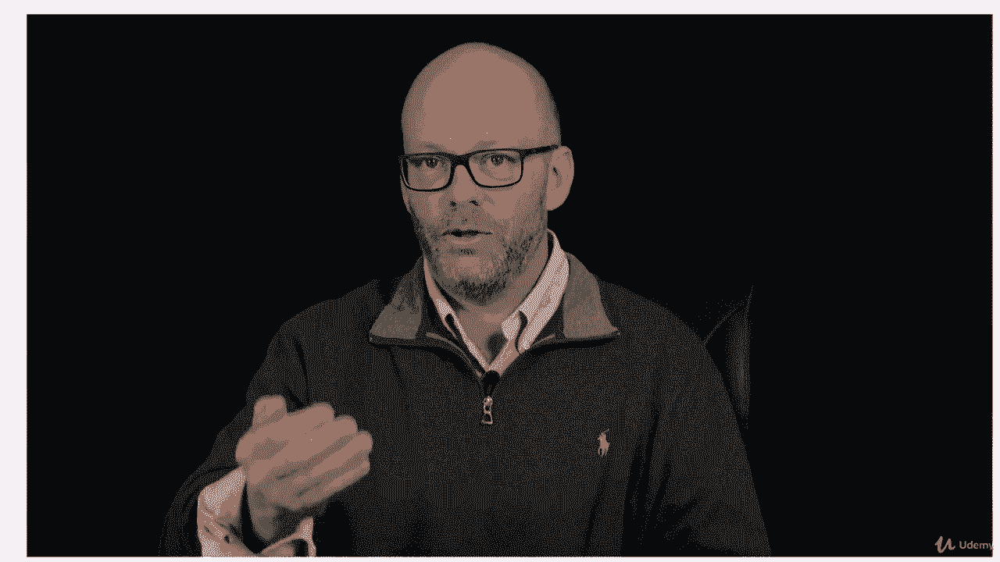
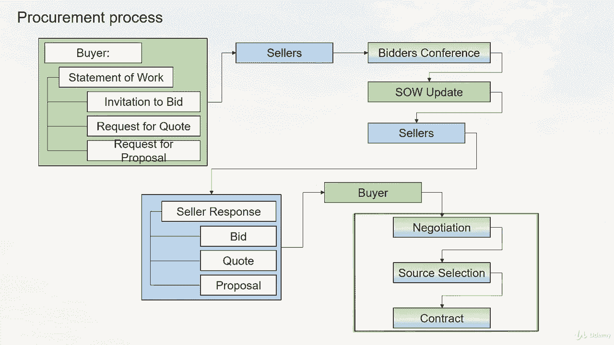
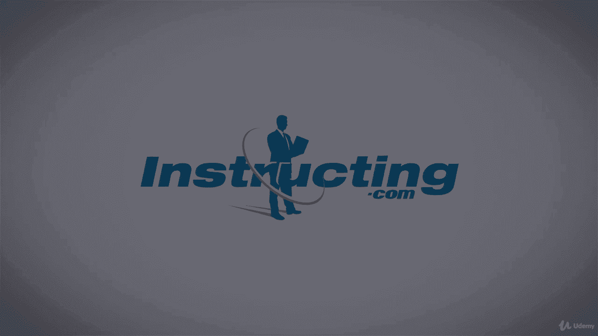

# 【Udemy】项目管理师应试 PMP Exam Prep Seminar-PMBOK Guide 6  286集【英语】 - P256：11. Conducting Procurements - servemeee - BV1J4411M7R6

Now that we have a procurement management plan and we've done some buy versus build decisions。

 let's talk about actually doing the procurement what we're after here is for the seller to give us a response。

 to give us a bid， a quote or proposal then from that I choose the seller and I award them the contract。

So to conduct procurements we're talking about doing these three processes or these three activities。

 so let's look at our EOs for conduct procurement first off our inputs。

 you'll need your project management plan， lots of plans here and documents so scope requirements。

 communications risk procurement and configuration management those are all plans that we're going to need because that's what we're finding requirements and that's what we're finding how the what the project needs that will affect procurement。

Also， your cost baseline。Project documents， lessons learned register， your schedule， again。

 requirements documentation， the risk register and stakeholder register。

 you'll need the actual procurement documentation to conduct procurement。

You'll need seller proposals and EEF and OPA。Tools and techniques， expert judgment， advertising。

 bidder conferences， you'll do some data analysis， the proposal evaluation。

 you're going to study the proposals to make a determination of who should get the contract。

Interpersonal and team skills， and then you may have some negotiation。

The outputs of conducting procurement， you choose your seller and you have a deal， the agreement。

You might have change request and then you'll update your project management plan as needed。

 so requirements， quality， communications， risk， procurement。

 all of those plans could be updated you might also have to update your scope。

 schedule and cost baseline。Project documents could be updated， lessons learned。

 your requirements documentation， your RTM， the resource calendar， the risk register。

 and stakeholder Regs， and you might have OPA updates。

Now let's talk about the documents that we've already seen。 we saw these in a previous lecture。

 but let's talk about the process here。 so from the buyer。

 I'm going to be the buyer and you're the seller now。

 so I'm going to give you a statement of work or a terms of reference。

 a toOR along with that I will give you a request for quote or an invitation for bid。

 which means I just want a price I might give you an RFP a request for proposal。

 which means I want ideas and solutions。And then you might have an RFI。

 and RFI just means give me more information。 Probably not。 We're talking about buying stuff here。

 though， for real。You would then look at that information and then you would respond with what I asked for。

 you'd give me a quote， a bid， okay， information if I gave you an RFI and a proposal。

 so that's what you would return to me。All of the different vendors that gave me a proposal or a bit a quote。

 I'm going to have to look at that and say， now which one am I going to buy from。

 Which one's the best for our project， So I have lots of different things I can do here to choose。

Though first one is a waitinging system。 Aing system is where I take all of the proposals。 And I say。

 well， the most important factor is priced。 and that's worth 80 points。 next is schedule。

 That's pretty important。 That's worth 60 points。 And so is the cost。 where got cost。

 So is their technical abilities， And that's worth 60 points， And then the solution。

 and that's worth 30 points and so on。 So I can have all these categories that I define up front。

 And I get points to them。 Then I take each proposal。 and I evaluate each one。 Well。

 how are they on price。 Okay， this guy gets 70 out of 80 points。

 How are they on how are they on their schedule， Oh， really good schedule， He gets 60 points。

 So in each one of those， I grade them by these predefined categories that are that I know about or our organization knows of。

And then whoever gets the most points， that's the proposal that wins It's called weighted because I'm putting more points towards the price in this instance and each category can really have its own price。

 but it's weighted where some are worth more than others， some categories are。

Remember independent estimates。Screening systems， you have to have a PMP on board。

 you have to have a licensed PE on board， a professional engineer。

 or you don't qualify or X amount of years of experience or whatever you want to screen out people who don't qualify。

And then you go into contract negotiation and you negotiate the terms so you could go to two or three vendors you've narrowed it down to and negotiate for a better price or a better schedule or whatever you want。

 and that's contract negotiation。Aele system is like Yelp。

 you ever go on Yelp to find a restaurant you want to go to。

 and you look at the reviews and the ratings， same idea here when we're purchasing internally。

 you might have aele system where you look at what other people have their experiences from that vendor will help you choose which vendor based on past experience from other people。

Expert judgment， if you don't know， you get a consultant to help you choose and then proposal evaluation is just that studying and reading attention to detail。

 things like that。Here's the entire procurement process we've talked about so far all the way to the contract。

So anything in green deals with the buyer。 Anything in blue is the seller。 So the buyer。

 I'm going to purchase from you。 I give you that statement of work， an IFB， an RFQ or an RFP。

 I send that out to you， the seller。You all the sellers are invited to come to a conference at our facility and it's a bidders conference。

 It's an opportunity to ask questions about that statement of work so you want some clarity here so everybody has the same information you're all asking questions about what we are going to purchase。

After the bidders conference， I update the statement of work and redistribute that。Generally。

 to only the people that showed up to the bidders Conference。

 I make the assumption others don't want to participate。

 but I only give it to the sellers that attend it。The sellers then take that updated statement of work。

 and now they have all the answers that they asked。

 and then that goes into their process to create the bid。

 the quote or the proposal in kind with what I asked for。You give that back to me the buyer。

 I do some analysis and study， and then I might negotiate with two or three of you。

 two or three of you sellers out there， and then we go through this negotiation process and I finally make up my mind and I choose you so you and I then have a deal and we write up a contract and we're ready to get the work so that's the whole procurement process。

 the workflow of how we choose a vendor。

In the contract， our agreement， as we've seen in our Edos， we get a lot of information here。

 so just quickly I'll run through these， you have the requirements， you have your schedule baseline。

 how you do reporting。What's the time frame for this work。

 like this contract's good for 60 days or whatever， What are the roles and responsibilities。

 Where will the work happen， the pricing and payment， What about inspection。

 What's that process like， Do you offer a warranty， If so， it's in the contract， Will you support it。

 If so， it's in the contract， limitation of liability， at some point， I own it， not you。

 So what's the limitations of liability。Do I have to give you a fee just to get started or put you on like a retainer。

 are there any penalties so if you're late， you could have a disincentive， if you're early。

 you get a bonus， an incentive。Insurance and performance bonds， if you want to hire subcontractors。

 do I get to approve those， change request， and then if things don't go well。

 how do we terminate the contract。And rather than go to court。

 we would first try to do an alternative dispute resolution where we try to work things out rather than getting the attorneys and the court system involved。

 so that's always a good approach， but all of that's defined in the contract。

All right， great job， keep moving forward。

