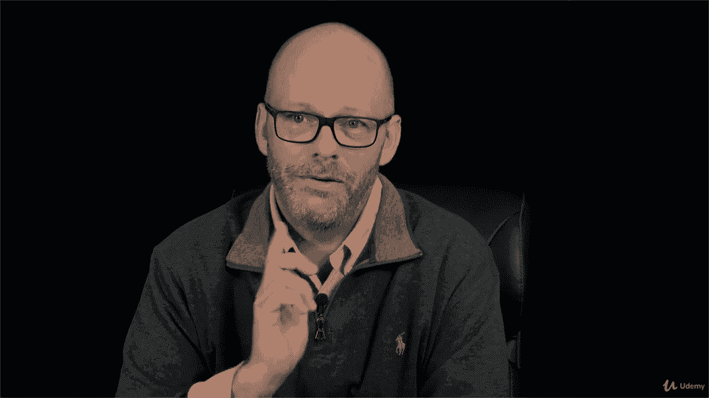

# 【Udemy】项目管理师应试 PMP Exam Prep Seminar-PMBOK Guide 6  286集【英语】 - P258：13. Controlling Procurements - servemeee - BV1J4411M7R6

。Now that we have a contract， we have a deal， it's time to control the procurements time to make sure we're both living up to the terms of the contract so that's what this is all about the project manager and the contract administrator in the organization they work together so we're talking about the contracting department or procurement department here。

If the seller doesn't live up to the terms of the contract， then we have some problems， right。

 we might have legal remedies。 We might have some alternative dispute resolution or we might cancel it。

 whatever the contract allows us to say， the contract overrides everything else。

 So you have to have that clause in your contract about the what if if we don't live up to the terms。

 Well， what are we going to do now。The Es for controlling procurement， lots of es here。

 I'm just going to hit the headlines。 A lot of this is the same for our planning procurement。

 All right， you need your PM plan。 you need your project documents， You see the major stuff there。

 the milestone list and quality reports will be two Q things are people hitting their milestones or getting deliverables for our milestones。

 and then is it of quality， your agreement， the contract， the procurement documents needed。

 approve change request， work performance data， EEF and OPA。Tools and techniques， expert judgment。

 claims administration， a claim is a disagreement， so we've got to resolve that。Data analysis。

 so we talking about performance reviews， earned value analysis and trend analysis。

 inspection and audits。The outputs of controlling procurements， your closed procurement were done。

 You satisfied it。 We sign off。 Everybody's happy work performance information。

Procurement documentation updates， change request， and you may have updates to your plan like your risk management plan。

 the procurement plan， the schedule baseline， the cost baseline。

You could also have updates to your project documents， lessons learned， resource requirements。

 the RTM， the risk registerister， the stakeholder Reg， and even OPA。

Those are all things that could be updated by controlling procurements。

Some key things to look at here for preparing to control， obviously your PM plan。

The project documents are needed as well， really， though the big thing will be our contract。

 what's the agreement between the two parties？We need a procurement documentation like the bid。

 the quote the proposal。Any approved change request， work performance data。

 so raw data about the performance that the vendor has done and EEF and OPA。

 you may have rules or policies on how you control。Procurement and processes， okay。

 we think about directing and managing project execution， how vendors affect that。

 if they're late or support poor quality， that's going to affect us。

 us being we still have the rest of the project to do。We're going to report performance。

 so how does that done an EVM or a status or an inspection， how you report performance。

 how you do quality control on what the vendor delivers。

 and then if there's a change you have to do integrated change control and then does the vendor introduce any risk so we have to monitor and control risk that may be caused because of the vendor's work。

All important things to know for your exam。