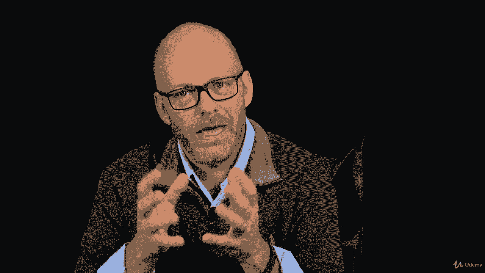

# 【Udemy】项目管理师应试 PMP Exam Prep Seminar-PMBOK Guide 6  286集【英语】 - P260：15. Performing Claims Administration - servemeee - BV1J4411M7R6

Sometimes in a contractual relationship there is a claim a claim means the two parties have a disagreement。

 so it's not always a it's rarely a very comfortable thing you know it usually can be heated or a disagreement because one party is going to have to pay or redo work or something and often we're trying to maintain that relationship with the vendor and with the buyer so a claim has to be handled you know delicately and accurately and professionally。

One way that can happen in a claim could be the contract is canceled。

 So it may be the quality of the performance is not good。

 so they aren't leaving up to the terms of the contract it's canceled。

 It could be that the contract no longer need it。 So we're building a house and we've hired someone to come paint the house。

 Well， the customer we're building the house for。 they say， you know what。

 we don't have any money after all。 so we can't finish building the house。

 Well now there's nothing to paint so we cancel the contract for the painter。

The terms of the contract would define the allowance to cancel the contract。

 if there's a penalty involved or not， that should all be in the contract。Claims administration。

 we're talking about a claim as the most common term， could also be a dispute or an appeal。

Contested changes are often where you have claims where the walls were to be painted eggshe white and the vendor painted them bone white or whatever。

 So it's a change that wasn't approved。 So it has to be redone or can we live with it。

 But you've got to take a little bit off your fee because it's still wrong rather than do all the work over。

 So a contested change。 Just a disagreement about anything that's subjective。 We want a fast network。

That's setting yourself up for trouble。 What does it mean to be fast so like those quality terms that we don't want subjective terms here either。

What are the terms of the contract for claims how does it escalate do you try to do this alternative dispute resolution。

 do you have to go to a mediator or a moderator that will help you resolve this。

 do you go right to court， you know what are the terms of the contract， what are your options。

Negotiation， especially for your exam， is always the preferred method you want to negotiate to settle the claim。

All right， good job。