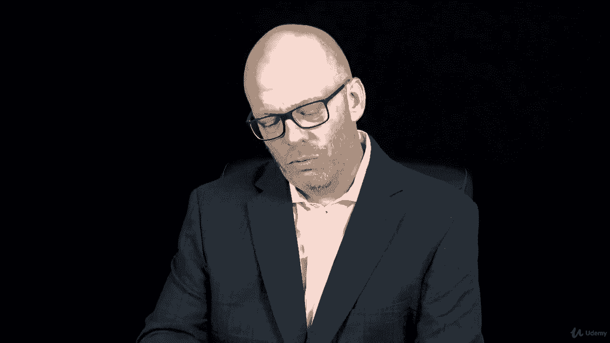

# 【Udemy】项目管理师应试 PMP Exam Prep Seminar-PMBOK Guide 6  286集【英语】 - P262：19. Section Wrap Project Procurement Management - servemeee - BV1J4411M7R6

🎼。All right， you really are making great progress， you're doing a good job。

 you're keeping that positive mental attitude that you can do this I know there are a lot of terms。

 a lot of facts and things that you have to know for your exam and procurement has a lot of special terms in it so I really want to encourage you to spend some extra time knowing these terms and procurement。

As a vendor， which I am the seller in our relationship， I just want to say thanks。

 you have a lot of choices when it comes to preparing to pass your exam。

 And so I want to say thank you for choosing this course。

 and for having some confidence in me and trusting me to get you this far。

 I know that you can do this。 but you need to know that you can do this。 So thank you。

 And once again， I'm going to tell you you can do this。 keep that positive mental attitude。

 keep working towards earning your PMP。 I know you can get it done。 I know it's a lot of work。

 but it's definitely something within your grasp。😊。

See that wasn't so bad you finished this section on project Procurement management I didn't say it was fun right remember I told you it was a little bit boring but you did it Procurement management's really important to know for your exam you have to know procurement even if you're not the person doing procurement in your organization We talked about procurement in an adaptive environment and creating a procurement management plan and the different rules and policies that you have to follow where you work so it's very important。

We looked at determining the contract type， make or buy decisions and those procurement documents then once we select the seller。

 we have to control procurement that we want to make sure that both parties are living up to the terms of the contract and we do contract administration we talked about contract closure and then we wrapped it up with this idea that you can't buy the PMP。

Okay， great job。 Let's keep moving forward。 We're almost there。

 We're done with procurement management。 So now let's go talk about stakeholder management。

 something much more enjoyable。😊。

