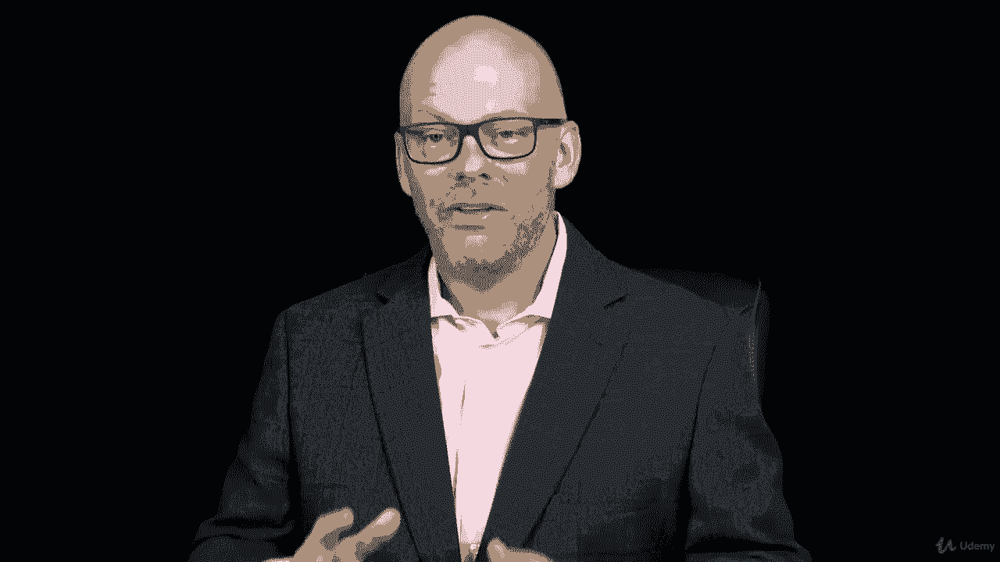

# 【Udemy】项目管理师应试 PMP Exam Prep Seminar-PMBOK Guide 6  286集【英语】 - P263：1. Section Overview Project Stakeholder Management - servemeee - BV1J4411M7R6

Welcome to this section on Project stakeholder management This is Cha 13 the last real chapter in the Pimbach guide on project stakeholder management we talk about stakeholder management we're talking about really engaging and managing the engagement。

 not managing the people but managing the engagement with our stakeholders so that's what we're going to be discussing here in this section some key concepts identifying project stakeholders。

 one of the first activities that we do in our project we are talking about it at the end of the course but it's one of our first activities that're going to take on early in the project。

A stakeholder is any individual or group or entity that's affected by your project。

Or they can affect it influence your project。So stakeholder management is a really important activity that starts way back in initiating when we identify stakeholders and then it works its way throughout the project。

 so we always want to be on the lookout for stakeholders and worried about stakeholdersholder engagement and keeping stakeholders engaged。

Performing stakeholder analysis and planning stakeholder management and then monitoring stakeholder engagement and setting some goals of current level。

 desired level of engagement， so something really important that we want to do as project managers。

 so a lot of important information here about identifying and planning and keeping those stakeholders engaged。

So let's hop in and knock that out right now。 You can tell I'm getting tired， too。 All right。

 you're doing great。 Let's both commit to finishing this course and being successful and our target that you can do it。

 I have confidence。 You've got the hard part here， though， is the learning。 All right。

 let's hop in and talk about introducing project stakeholder management。😊。

