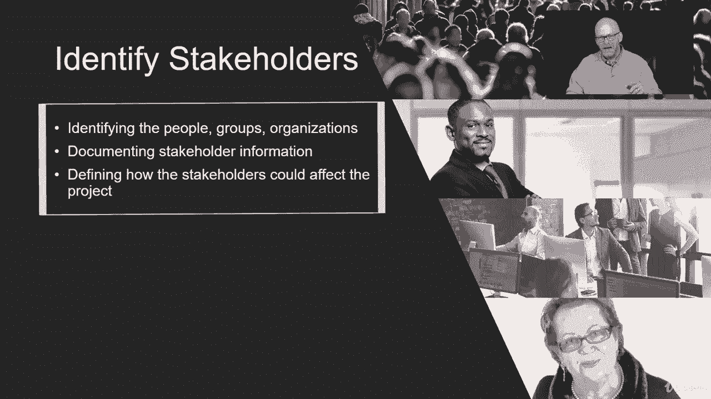
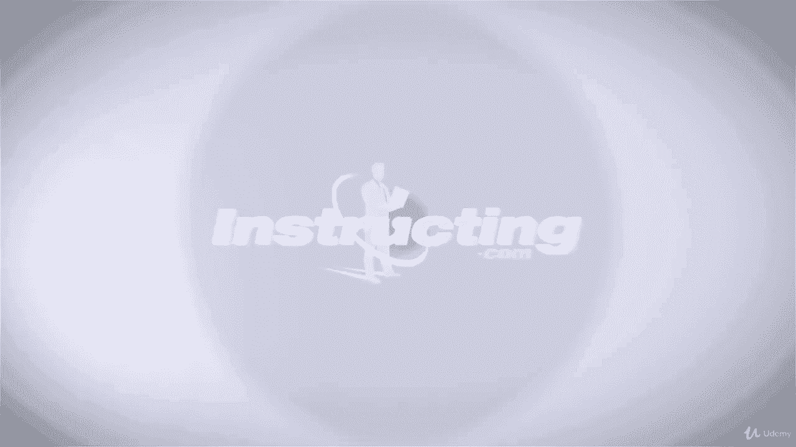

# 【Udemy】项目管理师应试 PMP Exam Prep Seminar-PMBOK Guide 6  286集【英语】 - P265：3. Identifying the Project Stakeholders - servemeee - BV1J4411M7R6

。In project initiation we have two processes， create the project charter and identify stakeholders stakeholder identification we want to happen as early as possible in the project because we know what happens if you missidifying a stakeholder and you have to find them later they're not going to be very happy they may have new requirements and that can have a big ripple effect through the project so stakeholder identification we try to capture and complete this process as early as possible in the project。

When we do stakeholder identification， we want to identify the groups and the individuals that are affected by our project and the groups and individuals that can affect our project。

 so we want to document that stakeholder information so we think about the public at large。

 you think about the people actually paying for the project。Think about your project team。

 they are stakeholders， and then you think about the recipient and how they will use what you're creating。

 that they are stakeholders as well。So we identify stakeholders and then we document the information in the stakeholder register。

 and we've seen the stakeholder register pop up many times through our course。

Let's look at the EOs for identifying stakeholders。Our inputs， the project Charter。

 the business documents like the business case and the benefits management plan。

 the project management plan， communications management plan， stakeholder engagement plan。

Project documents， change log， the issue log， requirements documentation。

 and the agreements for contractual relationships and EEF and OPA。Tools and techniques。

 you need expert judgment。 You're going to do some data gathering like questionnaire， surveys。

 brainstorming。Data analysis you're going to study the information， so you have document analysis。

 but also stakeholder analysis， really understanding stakeholders concerns and interest in the project。

We'll do some data representation， there's a few charts that you want to know with stakeholder engagement。

We'll do some stakeholder mapping and representation。

 those are some of those charts as well and meetings you're going to go out and meet with stakeholders and you'll meet with them on a regular basis。

The outputs of identifying stakeholders will be the stakeholder register that's the primary output。

You might have change requests as you identify stakeholders， you may also identify requirements。

The PM plan updates。Requirements， management plan updates， communications， management plan updates。

 the risk plan could be updated and your stakeholder engagement plan could be updated。

 remember this is an iterative activity so we don't have the plan right now。

 but as we go into plan it will create it， but this is iterative so we may have updates to the plan。

You might also have some updates to some project documents， the assumption log。

 the issue log and the risk register could all be updated。So who are stakeholders。

 we can know that stakeholders are the people and the organization that are involved in your project。

They can be affected positively or negatively， and it's anyone or any group that has influence over the project。

So some tricky things can happen here， you think about the inspector。

 you think about the people in the procurement department or whatever。

Framework you have or workflow that you have to get work done in your organization those people are stakeholders they can have an influence over your project so be careful we think about stakeholders they're not just the team and not just customers。

 it can be people that are kind of on the fringe of the project。

 but they certainly influence the project。So we look for people that are affected who will this project affect what people can exert influence like the inspectors。

 I try to identify stakeholders as early as possible You don't want to miss people when you go out and identify stakeholders This helps to create a stakeholder management strategy or a stakeholder engagement strategy。

 So how will we engage stakeholders and keep them excited。

 keep them bought into the project and to keep moving towards creating the solution。

We want to classify stakeholders according to their interest in the project。

 their influence and their involvement， so what's their level of interest。

 what's their level of influence， so high interest。

 high influence and high involvement that's a very important stakeholder so people will have varying levels here of interest influence in involvement。

Data gathering is one of our tools and techniques， so you have a lot of stakeholders that you need to talk to and engage。

 so it's not always feasible to have a one on one interview so maybe we do some questionnaires and surveys to help identify are you a stakeholder or not。

Brainstorming， remember we can get our project team together and we can do some brainstorming or there's another variation of this called brain writing where I take an opportunity to brainstorm in private and then we come to the meeting with all of our brainstorming ideas ready to go so data gathering techniques to identify stakeholders is a key tool and technique you should know。

All right， great job， I'll see you in the next lecture。

