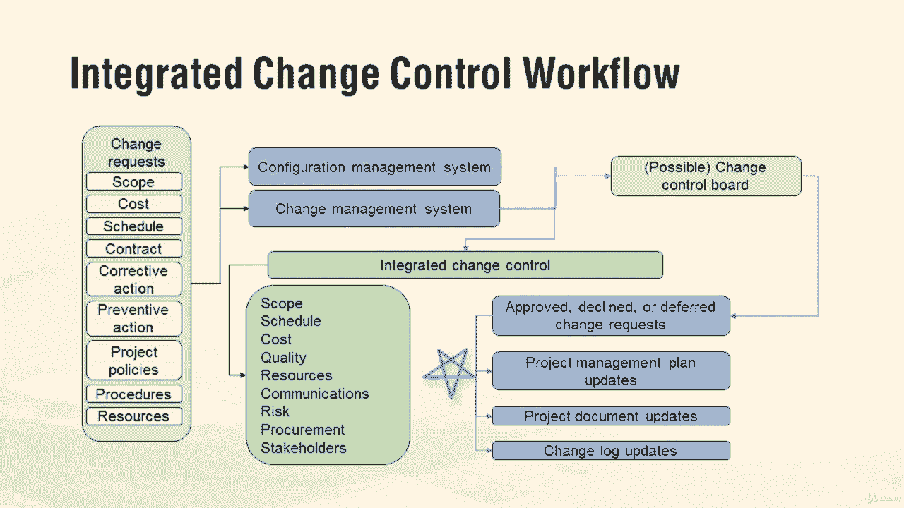

# 【Udemy】项目管理师应试 PMP Exam Prep Seminar-PMBOK Guide 6  286集【英语】 - P275：2. Project Integration Management - servemeee - BV1J4411M7R6

Now let's talk about some project integration management terms you'll need to know that are used throughout the project first off actions and execution remember corrective action。

 your realigning project performance， preventive action。

 you don't want that to enter the project you want to make certain that future performance remains in alignment with the project defect repair but painted the room the wrong color or the materials were bad so you have to fix it。

All of these typically require a change request， so corrective。

 preventive and defect repair need a change request。Knowledge management。

 remember we have two types of knowledge。 We have explicit knowledge and we have tacit knowledge。

 explicit is knowledge that can be given very quickly。 like explicit knowledge in our course。

 I can tell you the 10 knowledge areas， you know， project integration management， scope， schedule。

 cost， quality， that's explicit knowledge tacit knowledge is let me share with you how we did quality control in an I project。

 So it's a little bit more in depth that's based on experience。

 It's sometimes difficult to give tacit knowledge。 It's just that know how in years of experience。

 So recognize those too explicit's kind of just a quick list very easy to say 1，2。

3 or these are the steps to do this activity。 or tacit is more like your personal beliefs and values。

 So recognize those probably see those on your exam。You must know。

 you must know integrated change change control or workflow here， so let's take a look。

 we have change request that can come from anywhere in the project， scope cost。

 schedule contract typically， you might have one of those actions。

 might be some procedures or policies that require change request。

Those go into if they affect the features and functions of the product。

 they'll go into configuration management and the change management system everything else just flows to the change management system now what's the change management system I'm really just talking about your project management information system where you capture and document the change。

Then it goes into integrated change control。Or it could go to a change control board。

 and you may have some metrics that say anything over $10。

000 has to go to the board or anything that touches the scope has to go the change control board。

If you don't have a change control board， it flows through integrated change control In change control is the examination of what does this change do to scope。

 schedule our cost， quality resources， communications， risk。

 procurement and stakeholders so what effect does any change have on the project as a whole。

Then the change， whether you're doing this through integrated change control or through the change control board。

 the change will then be approved， decline or deferred。If it's approved。

 you update your project management plan， you may have to update your project documents like your scope statement。

W yourWBS， your cost baseline， your schedule baseline。

And you'll have to update the change log no matter what， if it's approved or declined or deferred。

 you still document that so those are some really key terms and the things you want to know for your exam so if you aren't familiar with this go back to chapter4 in the Pimbaok guide and spend a little bit more time here。

All right， great job， keep moving forward。