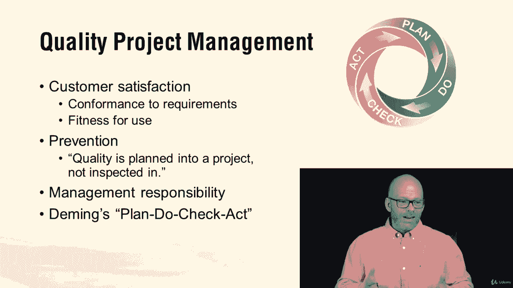
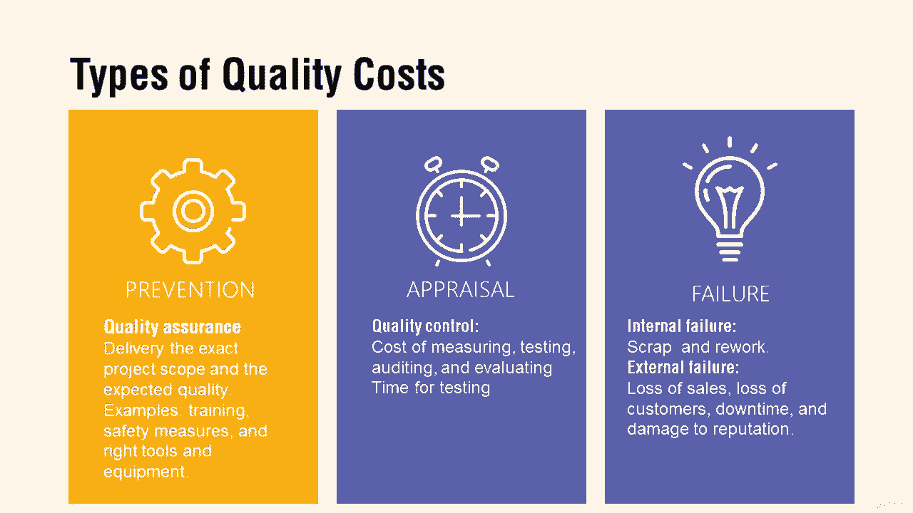
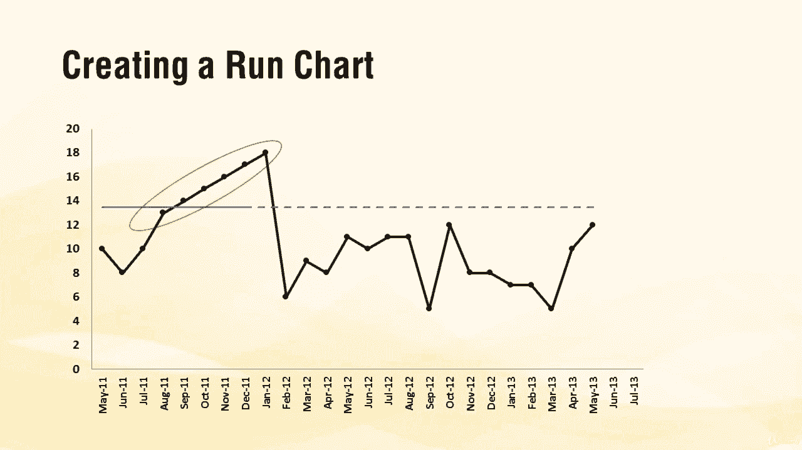

# 【Udemy】项目管理师应试 PMP Exam Prep Seminar-PMBOK Guide 6  286集【英语】 - P279：6. Project Quality Management - servemeee - BV1J4411M7R6

。Quality I don't know a lot of terms about quality。

 but really we're just talking about quality planning we're talking about managing quality and controlling quality so within this knowledge area。

 remember our dimming plan do check act our PDCA plan do check act that's pretty standard approach to quality is what we do in our projects customer satisfaction means we are conforming to requirements we're delivering exactly what was requested and it's fit for use。

Prevention is one of our goals in project quality management that we do the work correctly that quality is planned into the process。

 not inspected in。Management responsibility， management has responsibility to give us the tools the mechanisms to achieve the expected level of quality。

 so zero defects， all right we can do that， but we'll need to slow down our process so much to ensure zero defects or have the right tools。

 the right resources， the right people so management responsibility needs to be in proportion to the expectations of quality。

Quality and grade are not the same thing。 Quality is about meeting and fulfilling requirements。

 delivering the product scope。 It's implied needs as well。

 low quality is always a problem grade is a category or ranking or a classification of services like first class versus coach or a particular type of material and then like a different grade of that material So oak is wood and plywood is wood so you have a particular type a tile and you can get cheaper tile and so on。

 so marble versus you know ceramic So those are grades of materials Sometimes low grade is what's needed。

 it fits the budget it fits the purpose it's what the customer agrees to but low grade isn't necessarily a problem。

Low quality is always a problem。You'll need to know these types of quality costs。 we have prevention。

 appraisal and failure prevention we're talking about we don't want mistakes to enter。

 so quality assurance type programs appraisal is inspection， so quality control inspecting。

 and that takes time。Failure is the worst case scenario， you have scrap and reword。

 so you've found a mistake and you have to throw it away and start over so you have to pay for it the wrong one now you have to pay to do it again。

Prevention do it right， appraisal is inspection and failure is the worst case。

A term you either know is designed for X， Design for X or DFX is x represents one characteristic。

 one variable that the project is trying to address。 So cost uptime， return and investment。

 What is X， What are you trying to do So this is a term that you want to know。

Remember cause in effect charts， also known as a fishbone chart or an Ihiikawa。

 don't try to say all those at once cause and effect。Fishbone Ihiikawa， There you go。

Remember our control chart。 We have our upper specs and lower specs。

 our upper and lower control limit and our mean。 and then we have measurements。

 Each one of those peaks and valleys is a measurement。

 Anything below our control limit is considered out of control and aable cause。

 The results of seven measurements all on one side of the mean，7 consecutive measurements。

 all on one side of the mean up or down is called the rule of7， that's a trend。 It's nonrandom。

 So that's a control chart。Our Pietto chart， categories of defects from largest to smallest。

 so that's our Pietto chart， Paretto。knownown for  eighty0 twenty0。

 but this is tracking our largest down to our smallest。

A scatter diagram shows the correlation between two or more variables， so correlation here。

 height and shoe size， soup in temperature， shoe and annual incomes。

 you can see the closer they trend together where this example。

 the taller you know height in the shoe size they correlate in soup sales。

 the hotter it is the fewer sales that we really sell。

 the colder it is we sell more and then shoe size in the income， there's no correlation。

 so that's a scatter diagram， the closer they trend together。

 the more likely there is a relationship。A run chart shows。The results of measurements over time。

 the closer the dots are， the more you've accumulated in a shorter amount of time。

 so each dot would be 100 run， for example， well， the closer they are and on the calendar you can see it didn't take very long to accumulate。

 if you have five going up consecutively or five going down consecutively that's a trend。

 So you can see here we have a trend。 We have five measurements in a row going up and then it just crashes。

 it just drops off there。 So what's happening。

All right， so those are some things with quality control and quality assurance and planning for quality or the processes in the Pibaok plan for quality manage quality and control quality All right。

 keep going。

