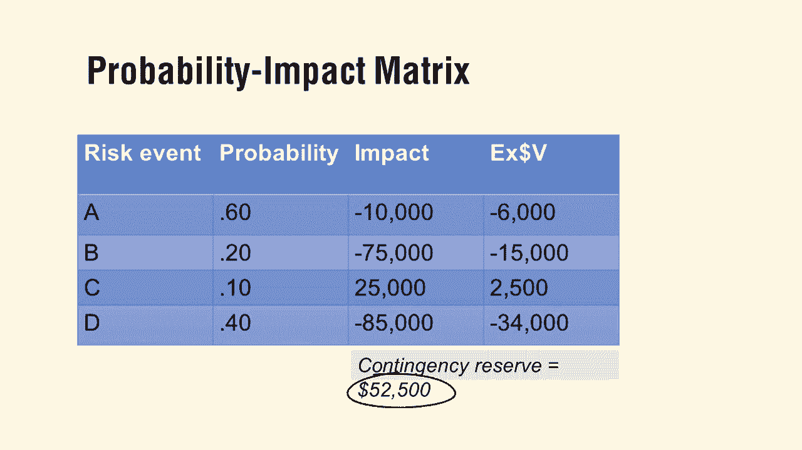

# 【Udemy】项目管理师应试 PMP Exam Prep Seminar-PMBOK Guide 6  286集【英语】 - P282：9. Project Risk Management - servemeee - BV1J4411M7R6

Chapter 11 in the Pimbaok guide is all about risk management and a lot of processes here in risk management so make certain you know these terms。

 so here are the important terms you must know some different levels of risk。

 remember we have individual project individual project risk so individual risk but also the overall project risk the odds of the project being successful our goal in risk identification is to identify risk our goals in qualitative and quantitative analysis is to see what our risk exposure is so what are the threats and opportunities associated with those risks。

 not all risks are negative so we could have positive risk as well。Some prompt list。

 this is something that seems like it could be a really good exam question， so you have this VA。

 VUCA， is it volatile and certain complexity or ambiguous that helps you define risk， a TO。

 technical， environmental， commercial， operational， political。

 so that makes you think about what risk would be in those areas and pestso， political， economic。

 social， technological， legal and environmental。So those are some prompt lists to help you think about and help the project team think about。

Where our risk in the project remember our probability impact matrix。

 you have the risk probability times impact gives a score this is qualitative using an ordinal scale we do the same thing but we do this in quantitative and we really study and we have evidence of that probability and we really study and we look at the impact and then that tells us our expected monetary value you sum up that expected monetary value and that helps you find your contingency reserve。

Pay attention that some of those impacts could be positive。

 so that could change the expected monetary value。 These are negative。

 but look at risk C as positive。

Also in risk management， we talked about negative and positive risk responses。

 so negative you could escalate it， avoid it， transfer it， mitigate it， or accept it。

And then we had positive risk events。 remember we had escalate， we have exploiting。

 sharing and enhancing and accepting so those are positive risks， so know those risks。

 know the characteristics of those。 if you need little brush up。

 It's chapterpt 11 of the pinbook or go back and watch our course on risk management。 All right。

 great job， keep moving forward。

