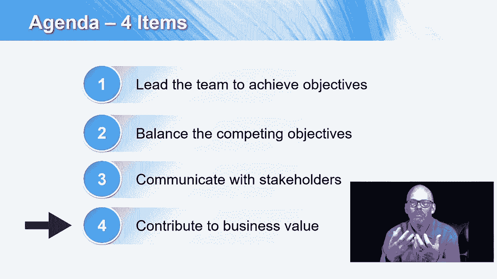

# 【Udemy】项目管理师应试 PMP Exam Prep Seminar-PMBOK Guide 6  286集【英语】 - P28：4. Role of the Project Manager - servemeee - BV1J4411M7R6

PinbokeSix版本的新篇章是项目经理的角色，项目经理的角色真正描述了角色和责任，标准期望，当项目经理意味着什么，真正理解这一章是个好主意，我们会在整个课程中讨论项目经理的角色。

但让我们来看看这一章的内容是什么，作为项目经理意味着什么，你将在第三章中看到的主题之一，项目经理的角色是项目经理可以在项目之前参与进来，项目结束后，在项目之前。

您可能正在与业务分析师一起收集需求并记录需求，并在项目结束后撰写项目章程，您可能是您创建的解决方案的支持团队的一员，其他人可以来找你，你在类似的项目中担任smee，所以项目经理可以在项目前后参与进来。

就项目经理的角色而言，我们首先需要知道四个关键项目，我们想带领团队把事情做完，带领团队实现目标，真的很重要对吧，这就是我们做这个项目的原因，质量和风险，这些总是相互竞争的目标。

可能你从铁三角中知道的三个是时间的概念，费用和范围，所以进度总是和成本竞争，并且有足够的时间和足够的资金来完成这个范围，因此，平衡相互竞争的目标，这也可能是相互竞争的目标，其中有两个利益相关者。

他们的选择是相互排斥的，所以你不能有地毯地板和瓷砖地板，你必须有另一个，你必须与利益相关者沟通，项目经理百分之九十的工作是沟通，所以有空和交流是如此重要，出去和人们交谈，这样交流。

并遵循我们的通信管理计划，那么你必须为商业价值做出贡献，新术语业务价值，商业价值是指你的项目为组织创造的价值，所以商业价值就是你的项目的价值，这怎么算好处呢，这对您的组织的有形或无形资产有什么价值。

因此，为商业价值做出贡献，我们正在讨论它对贵公司有什么价值？也不总是钱，可能是品牌知名度或社区商誉，所以并不总是钱，但通常情况下，我们希望获得投资回报，我们想要商业价值，它必须创造和支持我们的战略。

所以我们将在课程中看到更多的商业价值。

所有的权利，干得好。