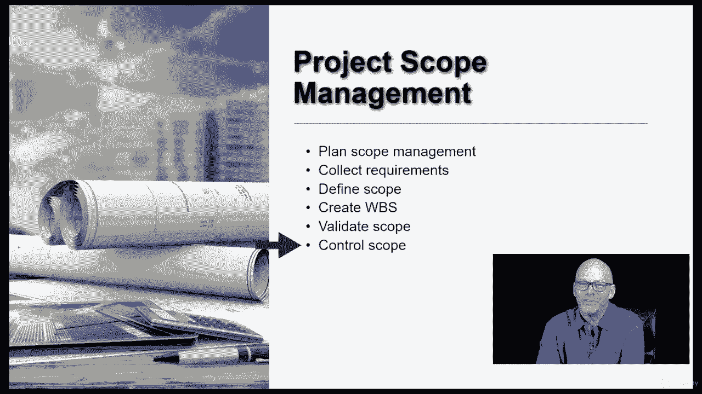

# 【Udemy】项目管理师应试 PMP Exam Prep Seminar-PMBOK Guide 6  286集【英语】 - P30：6. Project Scope Management - servemeee - BV1J4411M7R6

你，PinboGuide的第五章是关于项目范围管理的，项目范围管理是关于定义所有的项目工作，实际上只有满足项目目标所需的工作，在项目范围管理中，我们正在处理六个过程，所以在第五章的针盒里。

在这个知识领域有六个过程，让我们看看那些现在我们有计划范围管理，收集需求，界定范围，创建工作分解结构，验证范围和控制范围，所以这里的一切我们都在处理项目的范围，让我们先谈谈计划范围管理。

我们将在本概述中看到的每一个知识领域，稍后，当我们深入到每一章时，将处理该知识领域的计划，所以这个特殊的知识领域，项目范围管理是关于计划的，我们如何做其他过程，所以范围管理计划会告诉我们。

或者我们定义如何收集需求，我们将如何定义scope语句，我们将如何创建工作分解结构，如何验证作用域，你将如何控制范围，这就是项目范围管理计划，所有这些事情，您现在将如何收集需求。

这通常是在项目的前期或早期完成的，你可能会和一个业务分析师一起做这件事，甚至在项目开始之前，在某些情况下，您可能对项目将要创建的内容有一个高级概述，但现在你需要非常具体的，因此。

您收集需求以获得非常具体的信息，定义范围是实际创建项目范围语句，所以把它写出来，项目范围说明不是计划范围管理的一部分，这是一份单独的文件，这是项目计划的一部分，但这是一份单独的文件。

一旦我们定义了作用域，然后我们可以进行分解，将范围语句分解为实际的可交付成果，所以我们创建工作分解结构，WBS是一种可视化我们在项目中创建的内容的方式，所以我们创建WBS，我先给你们一点时间。

以及创建工作分解结构，我们将创建另一个名为WBS词典的文档，WBS词典一直跟着我们，但就像普通词典一样，它定义了WBS中的这些项，所以创建工作分解结构意味着我们采用项目范围语句。

我们把它分解成越来越小的碎片，它不仅帮助我们将项目工作形象化，但它允许我们对时间和成本做出更准确或明确的估计，更好地了解我们的资源，这也将帮助我们进行成本汇总，所以我们将在第五章中大量讨论范围。

但我们也会在第六章进度和第七章成本中看到，它还在其他几个地方探出头来，发生在我们创建项目可交付之后，顾客来检查我们创造的东西，因此，他们验证范围，这是一个由客户驱动的检查活动，它导致接受。

然后我们有控制范围，我们想控制范围，保持目标，不断兑现对客户的承诺，并防止未经批准的更改进入我们的项目，所以我们控制范围，然后如果有更改请求，它将回到我们在第四章中已经看过的集成变更控制，好的。

这是范围管理的第五章。

只是一个大的概述，当我们进入这一章时，我们将讨论这些细节，在我们的课程和PIN BO中，好的。