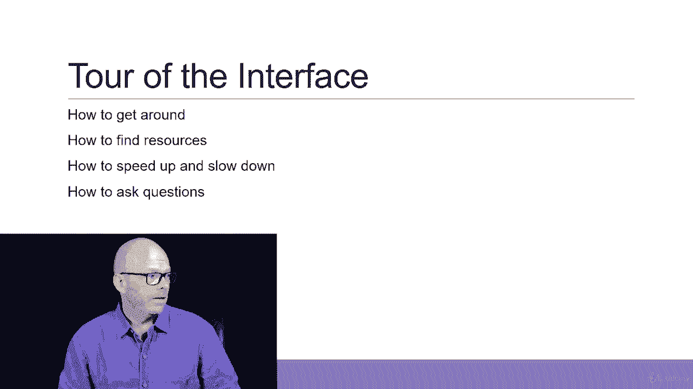
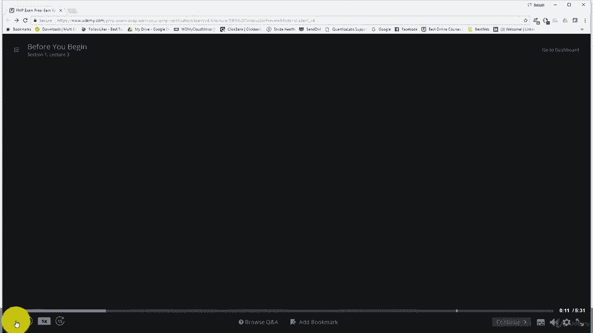
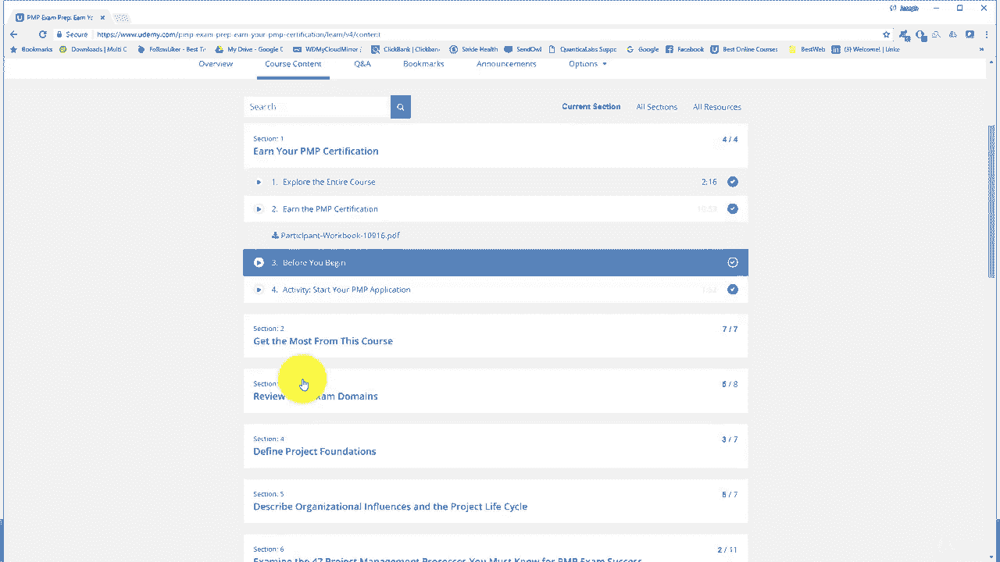

# 【Udemy】项目管理师应试 PMP Exam Prep Seminar-PMBOK Guide 6  286集【英语】 - P3：3. Explore the Entire Course - servemeee - BV1J4411M7R6

在这节课中，我想回顾一下你们在这门课中所期待的一切，所以我们将探索整个过程，以及你能期待的，你会看到什么，所以你可以先设定预期，从章节概述的课程开始，所以每一节课程是如何分配的，里面有讲座。

所以这些是不同的部分，所以准备通过PP，从这门课程中获得最大的收获，我们将在这里谈论所有的资源和一些策略，如何从课程中获得最大的收获，我们将查看PMP考试域，弹球第六版，我们将通过项目管理基础。

谈项目管理的相关领域，项目经理的角色，然后我们进入针背的细节，现在我们实际上，你知道吗，组件环境，以及首相的角色，这是第一章，针背的两个和三个，但是Pinbuck里真正具体的东西，我从针背的第四章开始。

这就是实现集成管理，所以我们会有一整节关于这个，然后我们进入针盒管理范围的第五章，然后我们将讨论进度管理，比PMI道德和职业行为守则，所以你可以看到它真的跟着针背家伙，以下是本课程的每一节。

然后我做了一个闪电战评论，作为最后一分钟的临时抱佛脚，或者封装的方法，我们在课程中讨论的一切，然后我们把它包起来，所以这些是轮廓，我将在这里向你们展示一个时刻，如何导航到特定主题，如果要快进或查看。

如何进入课程中的特定部分，所以我们就这么做吧，现在我想给你一个快速的界面，现在我要给你们看的是我以前的课程，所以不要去找这些内容相同的讲座，我主要想向你展示如何在播放器内部走动，所以现在让我们跳过去。

这是这里的老玩家，我暂停了它，所以如果我点击左下角的播放，所以这就是玩。

为了我们，我要把这家伙关掉，所以这是一个老视频，但我只是给你看力学，所以在角落里是玩还是暂停，如果你还想再听一次，或者你想用一个圆圈来回顾这个小十五，你可以点击它，它会回到15秒前，或者你可以点击它。

它会前进十五秒，如果我真的很无聊或真的很慢，据我妻子说，发生的事情，有时你可以加快或放慢速度，这就是我们在角落里看到的，所以如果你想以两倍的速度听我说话，你可以点击那里的两个x，它会以两倍的速度播放。

所以也许为了快速回顾一下，这很好，或者如果你想让它慢下来，真正吸收它，所以你选择对你有好处的，当然一次是正常的，速度，左上角是您正在观看的视频的名称，这是在你现在开始之前，在讲座编号中有一节。

当你把鼠标悬停在上面的时候，在左手边的角落，你点击这个小菜单，一直向左，不管那家伙叫什么，这将向你展示整个，课程布局，所以如果有一个部分你想跳转到你只需点击它，这将显示整个课程的基本轮廓。

然后你可以点击任何部分，然后你可以看到下面的讲座，注意到有些讲座有蓝色的东西，所以在这个老的课程中，当然我们的课程会有所不同，现在这是一个古老的例子，清酒，如果你点击这些蓝色的东西，这些是讲座中的资源。

我会提到一个资源，所以你知道这就是你要去获得资源的方法，所以这是找到资源的地方之一，所以你可以在这里同时看到它们，如果你一直滚动到底部，然后你就可以看到你要走多远，然后你可以看到每个部分你完成了多少。

当你想把那家伙关起来的时候，刚刚退出，你又回到了底部的赛道上，我们有一些有趣的东西浏览Q和A，所以如果你有问题，你可以去这里，也许其他人也有同样的问题，所以这是你和我互动的地方，这是最好的地方。

不要给我发电子邮件，别通过脸书追踪我，在这里发送信息，因为其他人可能有同样的信息或已经问过了，此外，我还有一些助教和我一起工作，因为我没空，二四七，我知道这些信息是至关重要的，用你的工作来通过考试。

所以我有其他人也帮忙，除了我之外，在课程中回答问题，所以如果你给我发邮件，它会被备份到我的电子邮件队列中，最好先到这里来，在浏览中，问A，看看其他人是否有同样的问题，你也可以问你的问题。

然后他们会回应你，他们是我或者在这门课上和我一起工作的助教，您可以添加书签，如果你想晚点再来看的话，你需要暂停一下，虽然我认为你会发现这些讲座中的大多数都足够短，你可以在一个设置中观看它们。

但是你可以添加一个书签，特别是为了审查，你知道，回顾一下这个，好了，等等，当你想回到你的书签，它就会出现，让我在这里暂停一下，把这家伙挪开，它会显示在书签所在的地方，所以这是一个方便的小功能。

你可以来回跳来跳去，你可以把不同的东西加入书签，所以这里有一百三十四个人把这一点加入书签，让我们看看其他人有什么书签，哦，而是如何去上那门老课程，证书，我会在接下来的时间里讨论这个问题，所以很有趣好吧。

然后我们这里有一些标题，他们不是最好的，我要说他们在进步，所以也许当你通过这里的时候，他们进步了，但我们有一些标题，你可以打开或关闭，有声音，我们这里有一些关于这些齿轮的技术东西，质量不好看的地方。

还是真的在缓冲，有时候，如果你降低质量，它会改善的，有一些键盘快捷键，这也是您报告技术问题的地方，你知道如果你联系我或在这里发帖嘿，缓冲的时间太长了，或者我无法下载此资源，否则我无法登录。

否则我想你会登录的，如果你能来这里，但一些技术性的东西，我无法控制它，所以最好在这里给出一个技术问题的报告，因为如果你如果你给我发邮件或张贴它，我们只是要告诉你，你得联系你得到我的支持。

我很想帮你进去解决问题，我无法控制它，技术支持和实际上Udemy支持非常非常好，所以要意识到这一点，然后如果你想全屏显示把所有东西都隐藏起来，就像你在看电影，所以你去那里，然后我们就可以离开那里了。

你可以按出口或逃跑，宁愿出去，你也可以在右上角，转到仪表板，所以仪表板是整个过程，我们可以跳到特定的事情上，也可以在仪表板中看到，你可以去Q A，你可以看看不同的书签，我定期发布公告。

然后这里有一些选择，在那里你可以查看关于课程内容的选项，您所在的当前部分，或者你可以看看所有的部分，然后你也可以看到所有的资源，所以在这里你可以看到，获取所有资源下载，本课程所包括的，当然。

这是你可以搜索什么的地方，当前区段是所有区段，您可以搜索特定的关键字。

或者滚动轮廓好的，所以这就是你在课程中四处走动的方式，这很简单，但我认为这样做很重要，我收到很多电子邮件问题，或者怎么联系我这些东西，嗯，所以你去那里，那很简单，现在，你知道吗，课程里有什么好吧。

把一些生意排除在外，让我们继续前进，进入好的东西。

