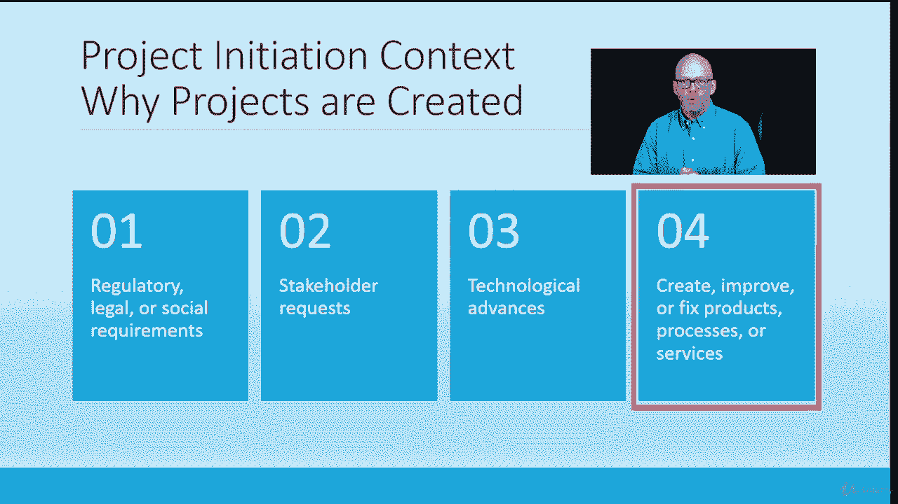

# 【Udemy】项目管理师应试 PMP Exam Prep Seminar-PMBOK Guide 6  286集【英语】 - P45：5. Project Initiation Context – Why Projects are Created - servemeee - BV1J4411M7R6

在上一堂课里，我暗示了这个术语，称为项目启动上下文，基本上为什么项目创建得很好，我们知道项目是创建的，为什么因为他们创造了，我希望你把它，至少在你心里，商业价值，我们正在做一个项目来产生一些利益。

这就是我们做项目的唯一原因，现在，你可能会说，因为法律，我们必须做一个项目，好处是你做这个项目，因为法律，这样你就不会进监狱、罚款或法规，所以即使遵守法律也有好处，如果你不想做这个项目，最好做这个项目。

然后通常必须支付罚款或违法，我说通常不要在这里不离开切线。

但有时交罚款更容易也更好，比必须遵守规定，我是说总是，我在说我们想做的事，当然，我们不能继续这样做，但有那些例子，所有权利，那是旁白，让我们回到我们的主要思想，这里是项目创建的项目启动上下文。

所以我们首先需要知道关于商业价值和项目的四件事，我们这样做，因为我刚才提到了监管，法律或社会要求我们有义务做这个项目，但仍然有商业价值，如你所知，在这种义务中。

利益相关者要求客户要求我们为他们创造一些东西，所以这是这些组织的一个很好的例子，他们为别人做项目是为了利润，所以我们得到一个利益相关者的请求可能是内部的，利益相关者来到你的部门，IT部门。

他们想让你做一个更新或更换他们的笔记本电脑，或者不管是什么情况，都可能是技术进步，所以你在Windows X上，你真的觉得Windows Y是一个更好的软件或操作系统，这是你想作为一个项目实现的东西。

所以现在技术有了进步，我们考试的技术进步不仅仅意味着硬件、软件、数据网络，我们可以谈论技术进步和制造环境中的一件设备，或建筑环境，或者是新的进步，在你的学科中使用的一种材料中。

所以它并不总是只是硬件软件，这是技术和改进的步骤，第四个或第四个选择，不是关于为什么创建项目的一个步骤，你要创造，改进，或者固定，所以记住我们的Mac D Mooed变化，删去，所以你在创造。

改进或修复流程或服务，所以存在的东西从当前状态移动到期望的未来状态，所以这是把它放在背景下，我们为什么要做这个项目，把它放在上下文中，把它放在规定的范围内，这是利益相关者的请求，这是技术的进步。

或者我们正在创造一些新产品。

服务或解决方案，所有的权利，干得好。