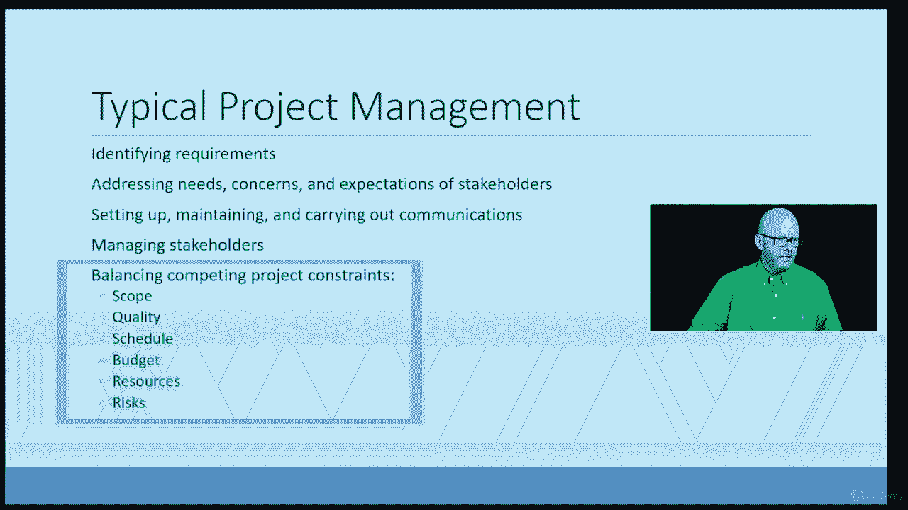

# 【Udemy】项目管理师应试 PMP Exam Prep Seminar-PMBOK Guide 6  286集【英语】 - P46：6. Defining Project Management - servemeee - BV1J4411M7R6

欢迎回来，所以你完成了一项关于定义什么是项目的任务，我们已经讨论过什么是项目，可能根据你的经验，你已经对什么是项目有了很好的想法，但现在让我们谈谈等式的另一部分，如果我们有项目，我们需要项目管理。

那么什么是项目管理，永远不要发现自己在派对上，有人说，哦，那么你是做什么的，然后你说项目经理他们就像，为什么听起来像你说的，你是项目经理，或者他们就像，好的，那么这意味着什么呢，你是项目经理。

那是什么意思，那是我最喜欢的，就像那是什么，是管理项目的个人，嗯，一个项目经理，是管理组织中的个人，它管理变更，从当前状态移动到期望的未来状态，还有所有的物流。

这个组织的所有不同部分都受到了这种变化的影响。

我总是这样形容它，为了你的考试，项目管理是知识的应用，满足项目要求的工具和技术，所以人们有时还是不明白，虽然我们的项目经理，我说，好的，你要盖房子了，所以我们要盖房子，你有一个房子的愿景，嗯，3。

我不得不提要求，我真的得有你的远见，我们必须与你想让我创造的愿景同步，这是第一部分，我现在得明白你想要什么，作为首相，我得做所有的后勤工作，所以你想想蓝图中的所有许可，有这种技能的工人来做基础，和框架。

电气等等，所有那些必须同步并协同工作的运动部件，成本效益高，由于该项目，在这种情况下，我会使用4-9-4-9项目管理流程，所以我会做一些事情从计划开始，我得执行，显然我们要监视和控制。

然后在某个时候我们要结束那个项目，你的房子就这样做了，这是描述项目经理工作的一种方式，所以项目管理根据需要利用所有这些过程，你必须使用针盒中的每一个过程吗，你必须使用所有四个九个过程吗，否，你没有。

如果我在我的项目中不买任何东西，我当然不需要做采购，如果我有一个低优先级的项目，我可能不必做定量风险分析，我只做那个项目中需要的过程，所以我们稍后会更多地讨论这个问题，典型的项目管理是。

当我们讨论确定需求时，所以我想给你盖一栋房子，还是你雇了我的公司盖房子，我需要收集需求，我需要真正理解你想让我们创造什么，那我必须这么做，因为项目正在进行中，解决你的需要和关注，还有期望。

所以你可能有一个我不太明白的愿景，或者期望是可以的，我们要建一个游泳池，但我们付钱不是为了装满水，你得找人来做这件事，所以你知道，有点不匹配，所以我们不清楚，我们必须建立、维护和进行通信。

首相的大部分工作是沟通，管理利益相关者，就像在那个房子项目中，利益攸关方，他们是，他们不仅仅是房主，我们建房子是为了，也是项目组，承包商，供应商，城市检查员，甚至可能是房子周围的邻居项目。

所以他们都是利益相关者，任何能影响项目的人，或作为利害关系方受项目影响，然后我们必须平衡相互竞争的项目限制和你有范围的大项目，质量，时间表，预算费用，资源，人身和人身风险，所以这些是相互竞争的项目限制。

通常我们会想到铁三角，尽管你想到了时间，费用和范围，这是三大制约因素，但我们也要考虑质量我们的质量可能会受到影响，和资源，然后风险是我们必须平衡的，因为它们肯定会影响其他约束。

你应该熟悉的术语，我真的描述过，在这个房子里，项目是渐进的阐述，渐进的阐述是我开始非常广泛的地方，比如演绎推理，我开始很宽泛，我得到越来越多的信息，直到我非常具体，所以在那个房子项目中，房主说得很好。

这要花我多少钱，这是他们的第一个问题，对呀，像任何利益相关者一样，嗯，我可以给一个，你知道一个猜测一个赃物，如果你愿意，他们问，我说好，大概要五十万元左右，他们说好，大概多少钱，当然。

我们可以在课程的后面得到更具体的，所以我想我需要更多的信息，什么样的地板，你要不要，什么类型的橱柜，你要不要，什么类型的电器，什么类型的材料，所以当我得到越来越多的信息，2。我比较有信心做出估计。

现在我们将更多地讨论成本估算，我们在针盒里读到第七章，只是给出一个渐进阐述的想法，我可以从一个想法或概念开始，通过需求收集开始制定想法，也许我需要一个商业案例，我们为什么要投资，这就是。

创造的价值是什么，我需要做可行性研究吗，然后我进入项目，但这是一个渐进阐述的例子，每当我开始宽泛，变得越来越具体，我在详细说明，因为我有更多的信息要详细说明，所有的权利，干得好，勇往直前。

