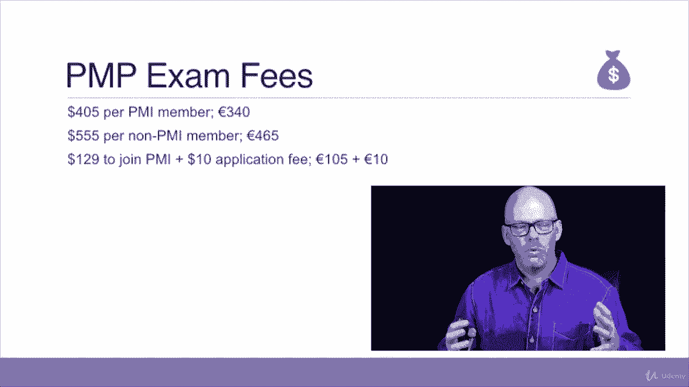

# 【Udemy】项目管理师应试 PMP Exam Prep Seminar-PMBOK Guide 6  286集【英语】 - P4：4. All About the PMP Exam - servemeee - BV1J4411M7R6

你不知道，每个人都可以参加PP考试，为了参加考试，你必须有资格，注意这里，我是说参加考试，我们的心态是通过考试，仅仅因为你有资格参加考试，当然不代表你能通过考试，所以让我们来谈谈如何获得考试资格。

为了获得资格，你在这里需要的最低限度是多少，那么PP要求，你将在网上完成你的申请，一旦您完成此申请，你会得到关于你是否被审计的回复，你会得到采购经理的合格证明，会有你的测试授权书，成为一封电子邮件。

你有一年的时间，从你被批准去通过考试的时候开始，个人，不是你，而是个人，他们可以在一年内花三次时间试图通过考试，你需要三次，当然啦，但你一年最多可以拿三次，如果一个人在一年内三次考试不及格。

他们要等整整一年才能重新申请，但那不会是你，你要把这东西打晕，所以我们要保持积极的心态，有两种获得认证的途径--有大学学位或没有大学学位，让我们先谈谈学位，所以在过去的八年里，从第一步开始。

你必须有三个不重叠的六个月的项目经验，所以你必须有项目管理经验或领导项目管理任务，过去八年中的第二步，你积累的经验必须是领导项目管理任务的4500小时，第三步你需要三五个小时的项目管理教育。

就是这个课程，这就是为什么你们很多人都在上这门课，第四步是你可以有一个可能的审计，我们将更多地讨论审计，在第五步中，你必须完成四个小时的考试，采购经理人指数没有告诉我们及格分数是多少。

这是一次及格不及格的考试，但他们会给你一些想法，有些指标好像你高于或低于目标，或者类似的东西，所以这是一个四小时的考试，他们不告诉我们及格分数，所以这是如果你有大学学位或更好的学位。

如果你只有高中文凭或全球同等学历，你仍然有资格参加PP，只是你有一些更严格的要求，你可以看到在过去的八年里，你需要60个月不重叠的项目管理经验，第二步你需要七千五百小时领导项目管理任务。

第三步同样的事情，三五个接触小时，第四步可能的审计，第五步通过PMP考试，让我们来谈谈第一步，我们看到一个学位，你需要三个学位，六个月不重叠，有了学位，你需要60个月不重叠，嗯，不重叠的月份是什么意思。

想想这几个月的独特经历，假设这是你，项目一，二和三都重叠了对吧，因为项目一是从一月和五月开始的，2号项目从2月开始在7月左右3号项目在5月开始，一直到十月，所以一个月的经验并不意味着你管理的项目数量。

但你担任项目经理的时间，其实你在板凳上，你实际上是在管理项目，所以我不能在这里说，而我一月份有一个月的时间，一个是二月份的，一个是三月的，一个是四月的，从五月开始，我不能花五个月的时间来做第一个项目。

然后说现在项目二，从二月到七月，所以还有五个月，然后5月到10月进行项目三，否，这是独一无二的月份，所以在这种情况下，你有一个月的一月，二月的一个月，在我担任项目经理的任何时候。

那段时间算作独特的几个月的经历，仅仅因为项目重叠，并不意味着我有双倍的时间或双倍的经验月，在这种情况下，那是十二个月，即使有多个项目，那是十二个月，不重叠的，十二个月总经验，我没有得到双倍的计数。

因为有多个项目，或者两三次，如果我在一号项目上工作20个小时，和20个小时的项目二，甚至在第三个项目上十个小时，那是累积的，这些算上你需要的4500或7500小时，取决于有学位或没有学位。

这样你就会得到一个计数，你工作的小时数，但月数必须是唯一的，所以基本上有了学位，你必须有三年的项目管理时间，没有学位，你必须有五年的项目管理时间，这就是问题所在，有独特的几个月的经历。

您的PMP考试费用，所有的权利，是呀，会有费用的，四百五十元，如果你是PMI会员，从现在开始，三百四十欧元，五百五十五美元，如果你是首相，如果你不是PMI会员或465欧元，加入PMI花了129美元。

外加十元申请费，或者一百零五加上十欧元，所以让我们想想这个，四百五十元，如果你是PMI会员，这就是考试的费用，加入采购经理人指数基本上是139美元，所以你拿四零五，加一百三十九，一百四十。

你现在是四百四十五，所以你在这里成为PMI会员可以节省大约10美元，你也可以用欧元做同样的事情，你可以算算，你可以看到加入采购经理人指数并获得小幅降价更具成本效益，加入PMI的另一个原因。

你能访问电子格式的桃子指南吗，您还可以获得许多其他资源和好处，但这是主要的事情之一，您将获得这些资源作为您会员资格的一部分，我没有在这张幻灯片上写的一件事，我会继续提到，现在是。

你也想考虑加入你当地的PMI分会，我是当地采购经理人指数分会的大力支持者，这是一个很好的方式来认识你的同事或与你所在地区的人建立联系，你可以听到不同的嘉宾演讲者，他们通常一个月见一次面。

他们有一个小小的晚餐，会有一个特邀演讲者，这是很好的关系网，有好处，你知道，找工作像这样的事情，只是在社区中建立联系的好方法，我总是喜欢去，当我旅行的时候，我经常在PMI的不同章节发言。

如果你是PMI分会的成员，你喜欢把我赶出去，你可以随时向我伸出援手，但如果你正在寻找一个建立联系的地方，我真的鼓励你去这些PMI章节，通常一年大约20到40美元，取决于你在哪里。

但这样做真的是一件好事，你通过p np，现在，你擅长什么？我认为现在很重要，你不仅设定了通过P NP的目标，但你也设定了一个目标，你将如何奖励自己，当你通过PP时。

让它成为有价值的东西或者你通常不会做的事情，你知道的，你可以做任何事情，但你要去看一部很棒的电影，或者你要去旅行，你知道的，和你的心上人一起度周末去看场戏剧或音乐会什么的。

也许有一家你最喜欢的餐馆你不会去，直到你通过考试，然后你要去吃一顿美餐，或者做一些奢侈的事情，去游船或度假，但我想你想为你创造一个奖励，对你所做的工作给予一些奖励和认可，在你通过p np之后。

那你就得担心专业发展单位，我们现在不需要担心那个，如果你不是PNP，你想要联系时间，这门课程是联系时间，所以在你成为一个p np之后，然后你得到p来使用，所以在p np之后。

你每三年需要60便士才能使用，我以后会更多地讨论这个问题，然后分享你的故事，鼓励别人，回到课堂上来，发布评论，加入你的脸书群组，你的LinkedIn群组，告诉其他人什么对你有效，分享你的故事，鼓励别人。

让他们知道自己能做到，就像现在，你可以去看看其他上过这门课的人，或者我的其他一些课，他们告诉你是的，你能做到，如果我能做到，你能做到，好的，干得好。

