# 【Udemy】项目管理师应试 PMP Exam Prep Seminar-PMBOK Guide 6  286集【英语】 - P50：11. Section Wrap Define Project Management Foundations - servemeee - BV1J4411M7R6

完成项目管理基础这一节做得很好。

我知道我们在这一节讨论了很多材料，但这是一些非常重要的材料。

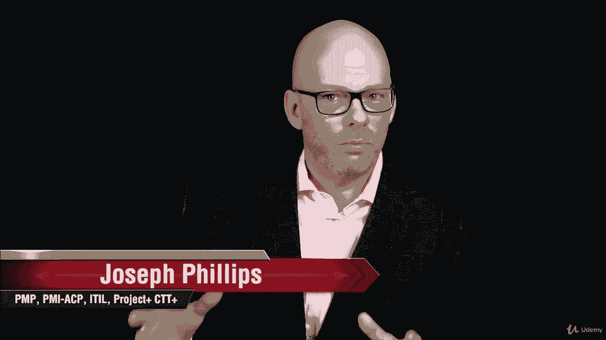

确实为课程的其余部分奠定了良好的基础或基石。

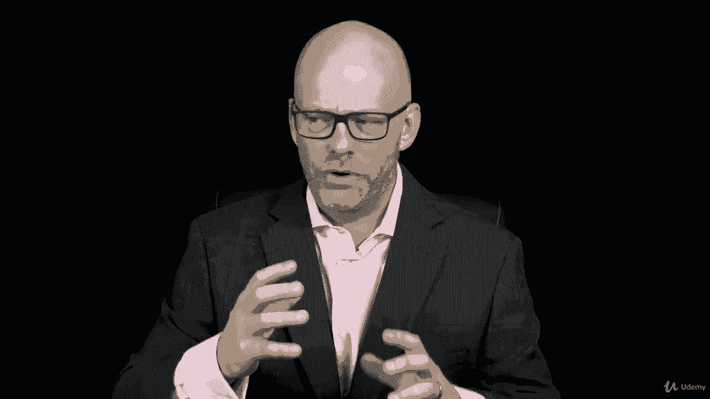

当我们朝着你通过PP的方向努力时。

所以在这一节中，我们讨论了什么是项目，什么不是项目。

那么这对组织有什么影响，当他们选择项目时，这是行动，还是一个项目，我们谈到了项目的临时性质。

项目是临时的，团队是临时的，有时是什么项目创造了独特的产品服务或结果，这也可能是暂时的。

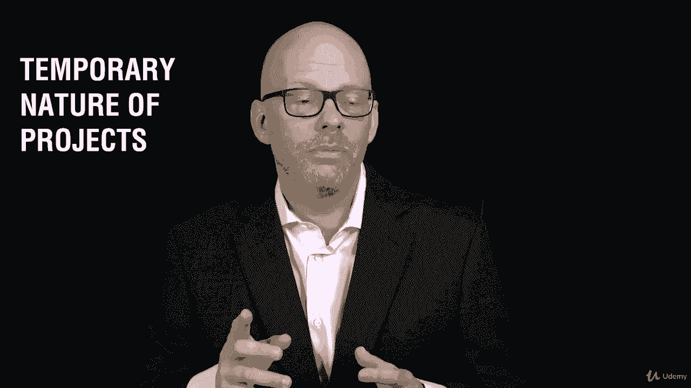

所以我们只看项目的临时性质。

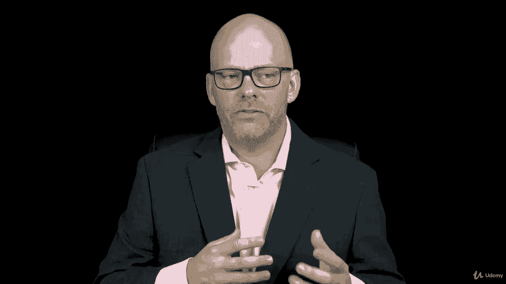

我们谈到了一个非常重要的术语，在整个课程中，我们还会看到几次。

是项目创造商业价值的商业价值。

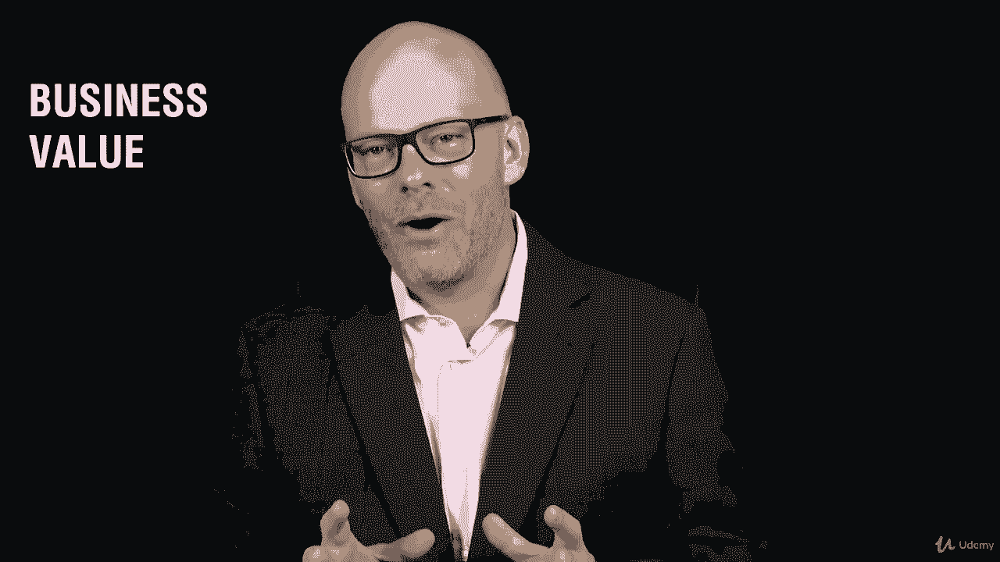

对你的考试很重要，业务价值，你对此有很清楚的了解。

我们讨论了为什么要创建项目，因此项目启动上下文。

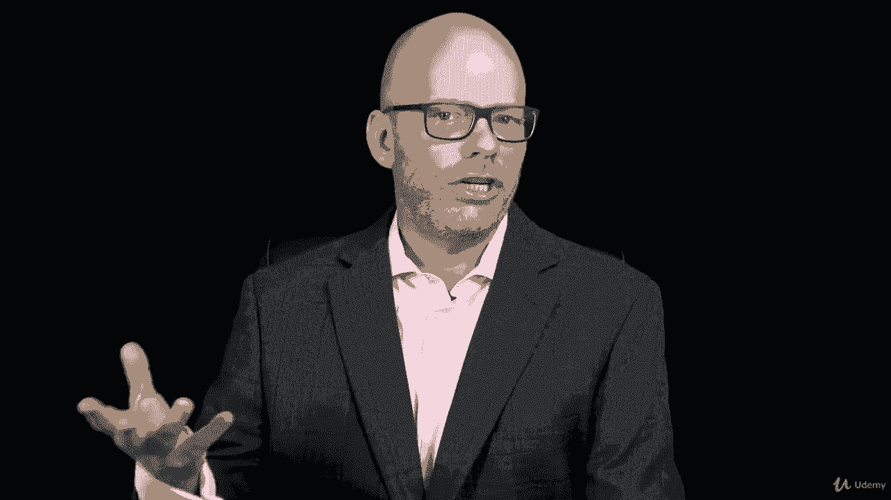

为什么在一个组织中选择、发起和资助项目。

我们研究了项目管理应用领域。

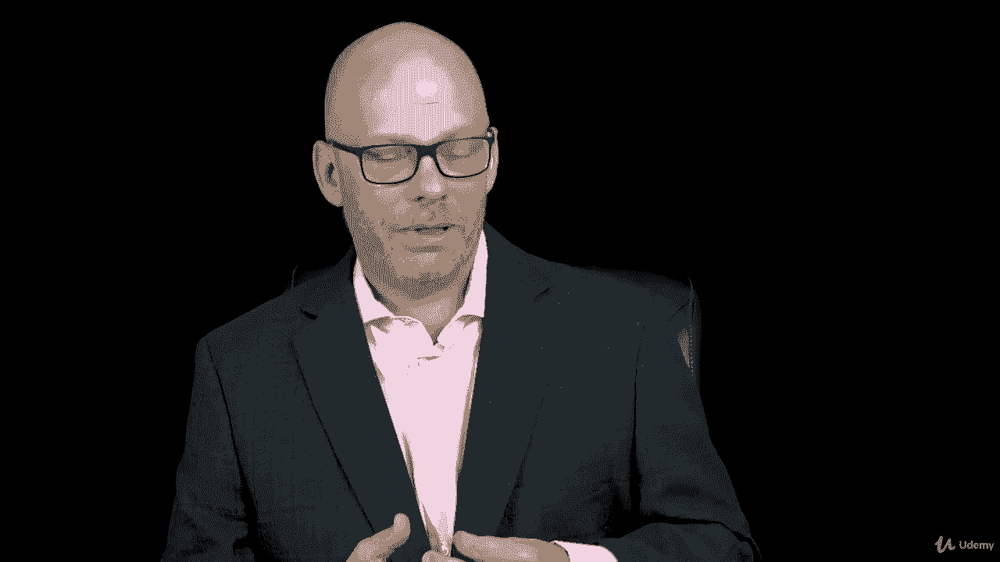

我们甚至定义得很好，什么是项目管理，对什么是项目管理有清楚的了解。

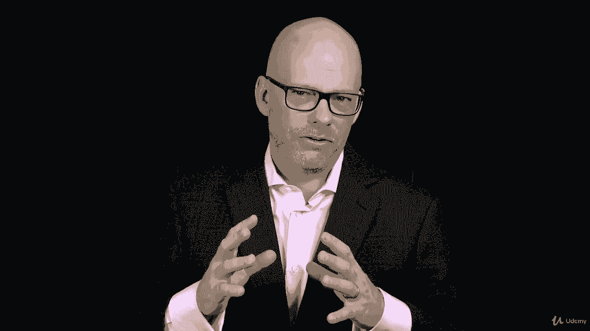

它如何在所有这些不同的应用领域工作。

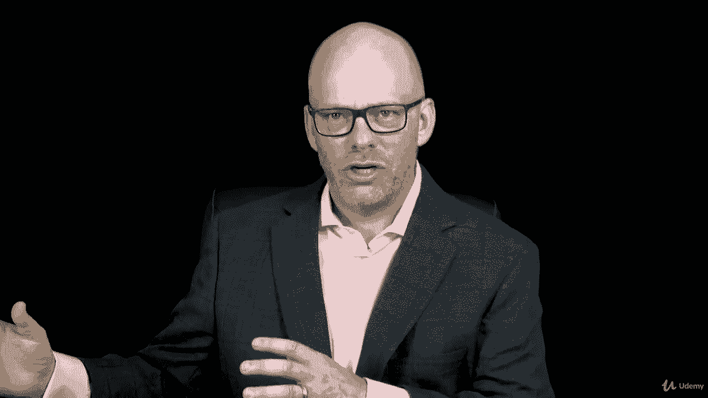

它如何在建筑和医疗保健中发挥作用，这是一套原则，它是一个框架。

这是普遍接受的做法，然后我们可以定制这些实践。

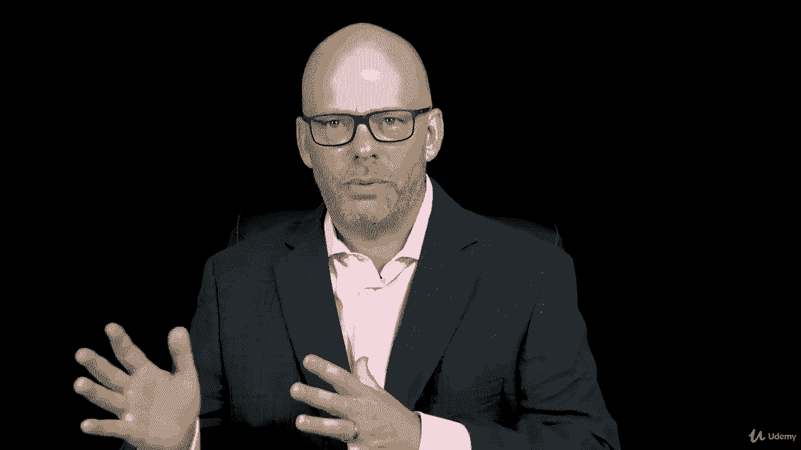

在我们的组织或纪律中什么是合适的。

我们回顾了项目生命周期，然后将其与项目管理生命周期进行比较。

所有的权利，很多信息，我知道我们还有很多事情要做。

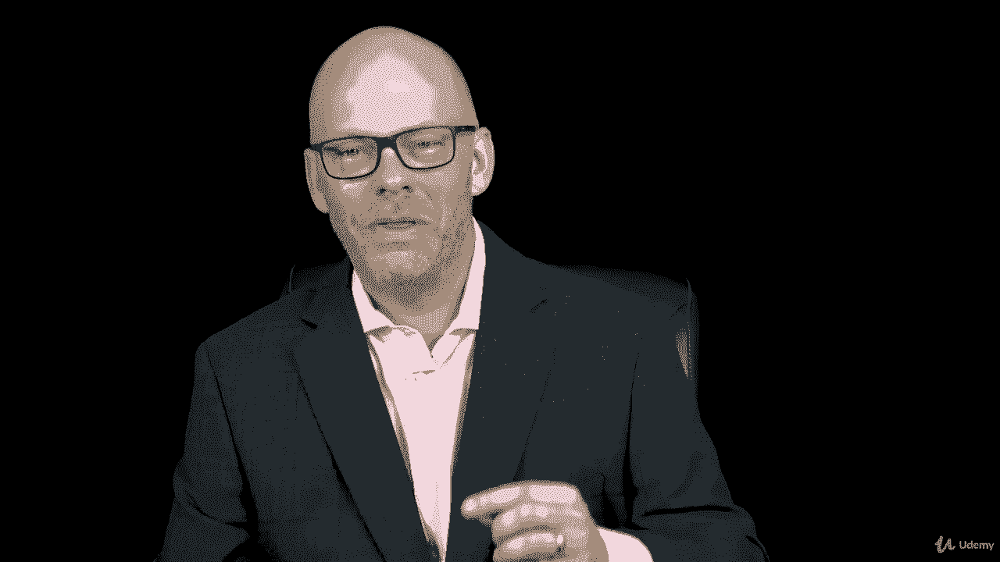

我们正要出发，在我们的课程中，你的气势不错。

保持下去，我希望你继续前进。

