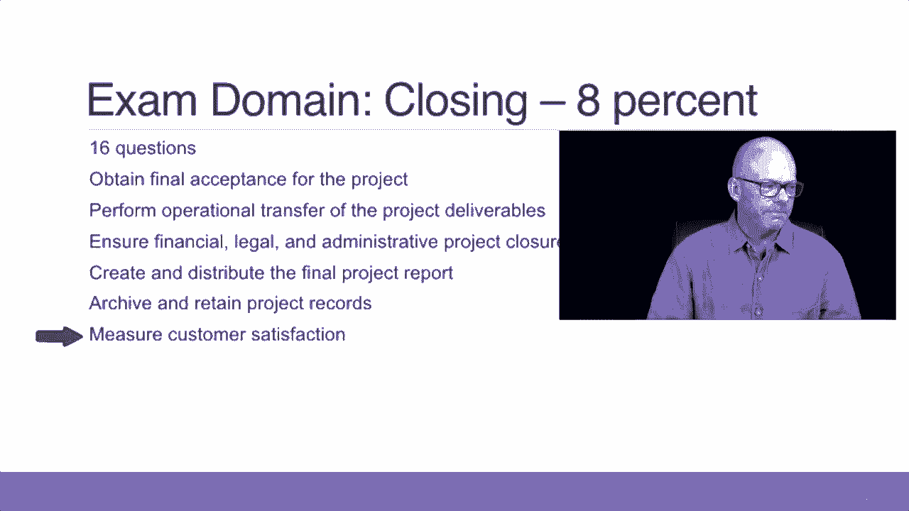

# 【Udemy】项目管理师应试 PMP Exam Prep Seminar-PMBOK Guide 6  286集【英语】 - P5：5. All About the PMP Exam - servemeee - BV1J4411M7R6

让我们更多地谈谈PMP考试的细节，当你走进测试中心时，你能期待什么，当你参加考试时，你能期待什么，所以没有什么会让你不安，让我们先谈谈PPP考试的细节，这次考试总共有两百道题。

有一百七十五个问题会计入你的分数，那另外两个五个问题呢，其他两个五个问题被认为是种子问题，它们实际上并不计入你的分数，但你不知道你是否在回答一个种子问题，还是现场拷问评分问题，坐着的问题意味着它坐着。

它洒在你的整个课程中，因为你在回答一个问题，以帮助确定这是否是一个好问题，投入到未来的考试题库中，所以一个坐着的问题，你不知道是不是现场直播，当你回答它的时候，所以你必须回答所有的200个。

所以不要把问题留空，你有四个小时的时间来完成考试，所以从你第一次开始到结束总共四个小时，所以每小时大约50个问题是关于你如何调整自己的节奏，这些是考试的细节，当你去测试中心的时候，2。

你不能随身携带任何东西进入考场，测试中心的监考老师会给你六张纸，或者白板，你没有选择的权利，你想要哪一个，他们会给你六张纸或一块白板，你知道干擦板，你还会得到两支铅笔或一个干擦除记号笔，很明显。

如果你拿到白板，你不会得到铅笔的，所以他们会在那里同步，你没有选择的权利，虽然，问题基于项目管理标题，就像针布指南，他们的项目管理标准，PMI主要发布的不同指南引脚降压指南，然而，不仅限于针盒。

所以在这门课和其他课程中，人们会说嘿，我在针盒里找不到这个词，你为什么问我这个，因为这不是你唯一测试的东西，这是正确的从PMMI的网站，PMI制作或发布的项目管理标题，但它不仅限于PMI全球标准。

所以如果是在这门课上，很有可能，它在那里是有原因的，根据我多年的经验和教学经验，所以请相信我的话，如果是在这门课上，你需要知道，现在你不能做大脑倾倒，你一进去，曾经有一个非常巧妙的把戏。

你可以去测试中心，坐下来，开始倾倒你所有的笔记，而教程不再运行，考试开始前你什么都不能写，直到四小时计时器开始，事情就是这样，你不能再写下任何东西，即使你在测试中心，你没有走私任何东西。

你不能写下任何东西，考试软件真的很好用，有一个教程，正如我提到的，它解释了如何使用软件，如果你对此感到焦虑，您可以使用教程，但真的，如果你曾经在电脑上，这将是非常明显的，你可以向前和向后移动。

你可以上去标记一个问题进行复习，好像你真的被这个问题难倒了，所以我要检查一下，我会在课程结束时标记它以供复习，现在我喜欢的是他们测试软件中的一个新功能是，你可以把答案划掉，所以如果你知道答案A不好。

所以你可以点击这个三振出局按钮，然后下来三振出局，回答，所以那个不算好，我是说如果你选择了，它算数，但它是视觉上的，你知道你不想选择一个，你也可以有一个荧光笔，所以你可以在软件中点击这个工具。

下来突出关键字，所以当你考试的时候，你可以用它来帮助你找出答案，正如我刚才提到的，你不想留下任何空白，所以空白答案被评为不正确，就因为你标记了一个问题，只要你选择不影响分数的东西。

标记与否并不影响你的分数，只会影响你的分数，就是如果它是错的，那么显然这是不对的，或者你把它留空，所以永远不要把答案留空，很多人做的，我认为这是一个很好的主意，如果你不了解市场，然后在你的草稿纸上。

这六张纸中的一张草草记下一张十五号的纸条，这里是，我想我想的是，但我现在要继续选一个，如果你有时间，你回来复习一下，如果你没时间了，至少你有东西，即使是猜测你选择了什么，因为猜测有二。

百分之五的机会是正确的，如果是空白的，它有百分之百的机会是错误的，所以现在去想吧，让我们来谈谈考试的细节，所有的权利，所以考试被分成这五个领域，启动规划，正在执行，监测，控制和关闭，第一个，在这里开始。

你有，它值你考试的百分之十三，有两个六个问题，这些是我们接下来要更详细地研究的任务，但这些是你在启动时必须知道的任务，如何选择项目，如何定义范围，记录风险怎么样，假设和制约因素。

你必须知道如何识别利益相关者并进行利益相关者分析，你必须知道如何创建一个宪章或发展宪章，然后你如何让宪章获得批准，所以你现在有两个关于这些任务的六个问题，这些来自PP手册，所以你要把这个放进去一点。

但我在这里给你一些关于考试的见解，现在计划是一个相当大的领域，关于规划有四个八个问题，它值两个，你考试的4%，所以计划活动，你将接受录音要求的测试，制约因素和假设，创建WBS。

我们会在第五章的针盒里看到，制定预算计划作为规划的一部分，制定你的时间表和时间表，那是针盒里的第六章，制定人力资源管理计划，或者只是资源管理计划，现在在六号针盒里，制定沟通计划，这是第十章。

我们有采购计划，在第十二章，质量计划，改变计划，风险，所有这些都是针对每个知识领域的，所以基本上每个知识领域你至少有一个计划，您还将向主要利益相关者提交项目管理计划，典型的管理。

也许在某些情况下你的客户，但他们必须批准这个计划，你将主持一个启动会议，所以开球会，我们离开计划，我们要执行，所以你得主持开球会，是我们计划测试你的东西之一，我们开始执行，我们已经执行执行域。

这是你考试的百分之三十，六十个问题，所以你考试的一个非常重要的部分是关于完成工作，有道理，对呀，项目管理是把事情做完，您将管理项目资源以执行，你们要执行质量管理计划，按照指示执行批准更改。

您有更改管理计划，你要做风险管理和应对风险事件，然后你还做团队发展，记住团队发展是关于指导的，教练，动机，真的，这里的一些领导，一些人际交往技能监控和控制是值得的25所以50个问题。

这是我们衡量项目绩效的地方，你有发生的变化，您必须验证这些更改，你想确保你的交付是高质量的，所以我们会有一个质量管理计划，以及衡量这些交付品质量的方法，在客户接受之前，你要在整个项目中监控风险。

然后根据需要更新风险登记册，我们将采取纠正措施，然后评估任何问题，去管理通信，您希望让利益相关者参与进来，所以关于利益相关者参与的第13章，然后我们开始关闭这里的最后一个域，在结束十六个问题时。

它值你考试成绩的8%，关闭的一部分是获得最终的验收，你要做行动转移，你想确保财务，法律和行政结案，我们将在稍后的课程中讨论这个问题，创建和分发最终项目报告，你得把记录存档，然后你想确保顾客满意。

所以你需要一些反馈或衡量客户满意度的方法。

所有的权利，干得好，讲完这堂课，关于PMP考试的一切，所以你能期待的，当你走进测试中心，然后你要测试什么，完全正确，勇往直前。

