# 【Udemy】项目管理师应试 PMP Exam Prep Seminar-PMBOK Guide 6  286集【英语】 - P60：1. Section Overview Project Management Processes Groups and Knowledge Areas - servemeee - BV1J4411M7R6

欢迎回到这一节，我们将研究项目管理组件。

项目的不同部分。

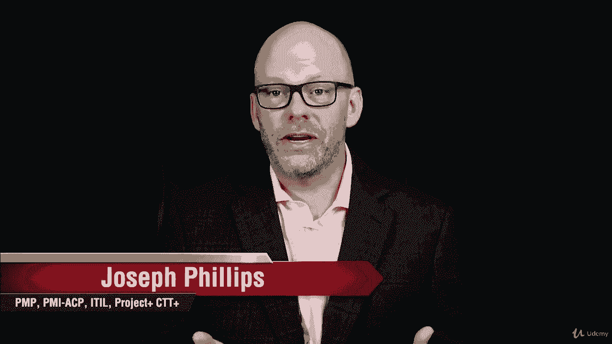

在本节中，我们将研究项目管理的不同组成部分。

以及它们如何一起工作非常重要，我们不需要只有这些项目管理的筒仓。

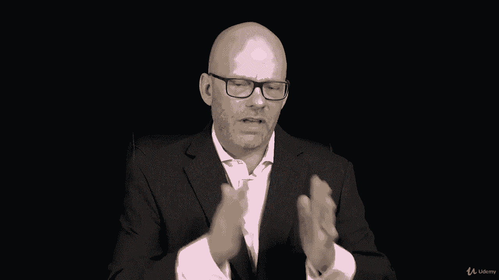

但他们一起工作是一体化的。

我们要讨论的事情之一就是项目管理流程组。

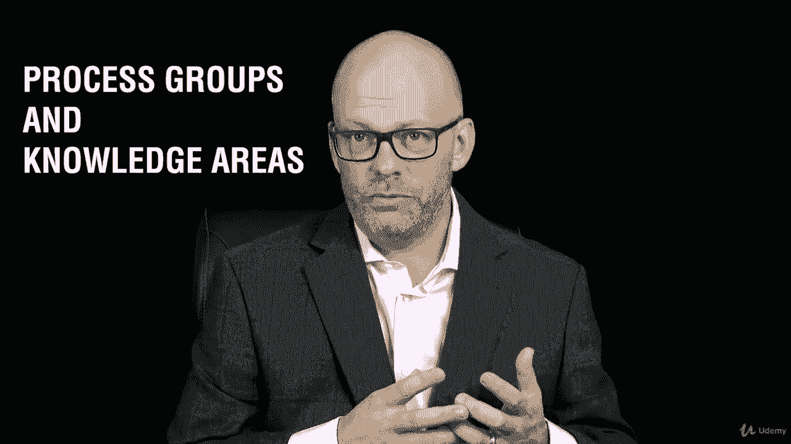

和项目管理知识领域，回想一下你的PP考试有这五个考试域。

这些是基于过程组的。

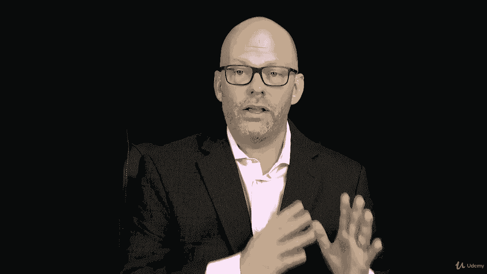

跨越过程组，我们有知识区域这些是针盒中的不同章节。

所以我们的过程组发起。

规划，正在执行，监视器，控制和关闭与不同的知识领域集成或交叉。

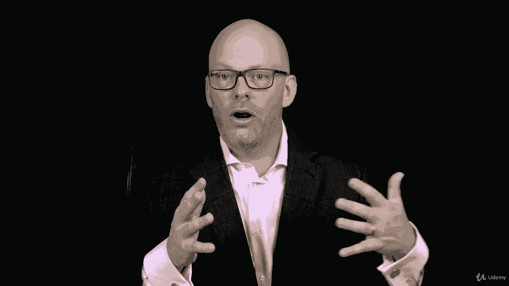

第四章在平背到十三。

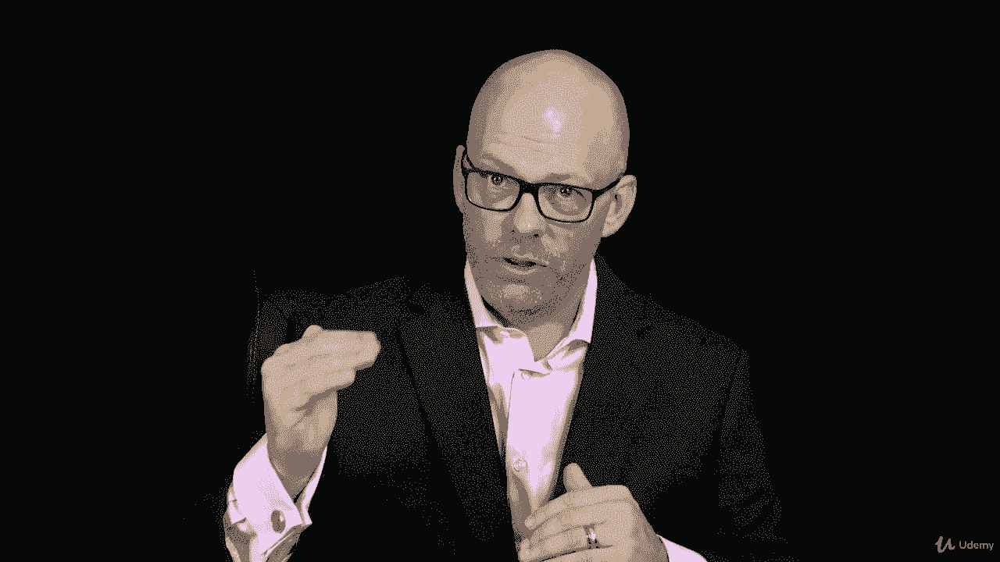

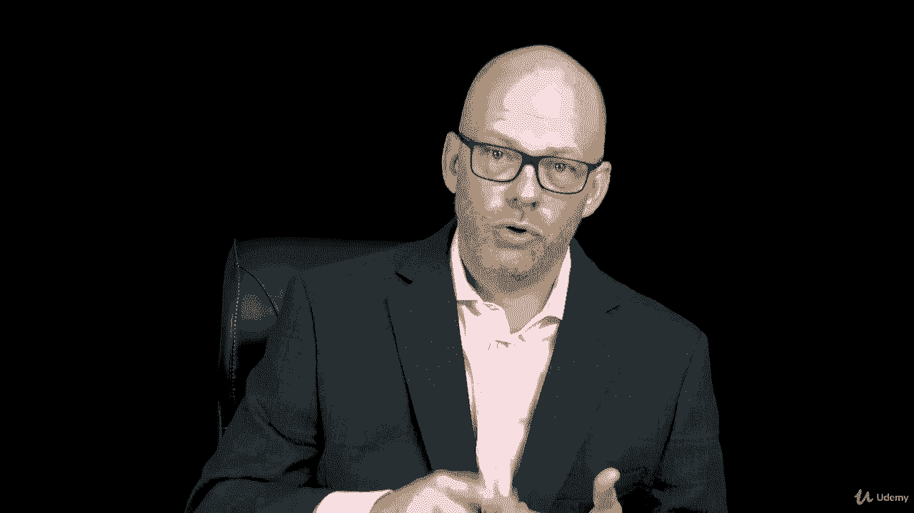

优质资源，通信，风险采购与利益攸关方。

我想我把它们弄起来了，但这些都是知识领域，所以过程组和知识区域结合在一起，所以我们有一个非常重要的任务，在那里你要绘制这些过程。

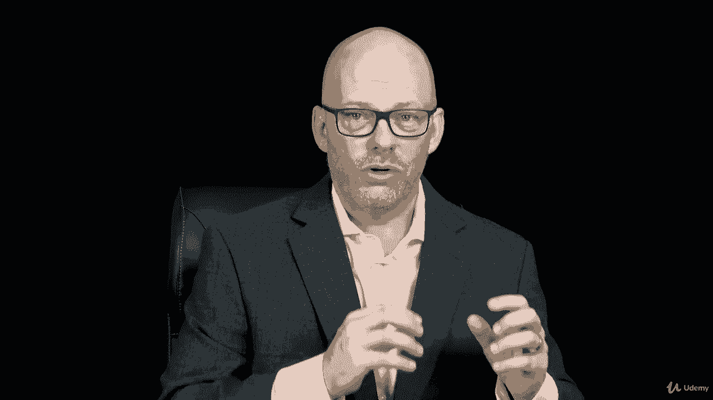

因此，您将在本节中详细了解整个针背。

所以如果你渴望进入一些更深层次的材料。

或者一些更具体的考试材料，现在是你的机会。

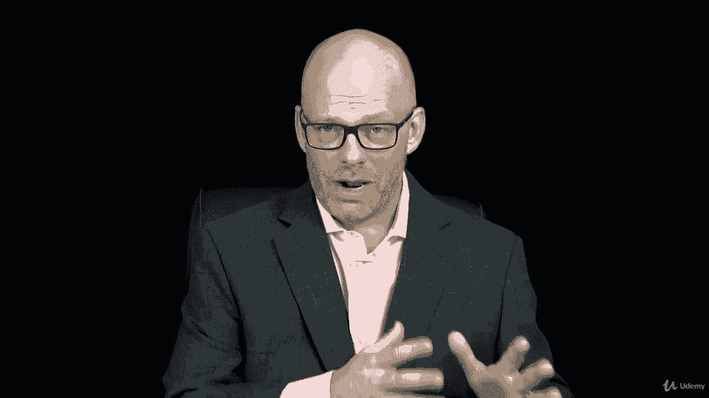

有很多事情要谈论和报道，我们还将研究弹球的概念，即剪裁过程。

你在任何组织自适应环境中所做的事情。

所以这是新的针盒六。

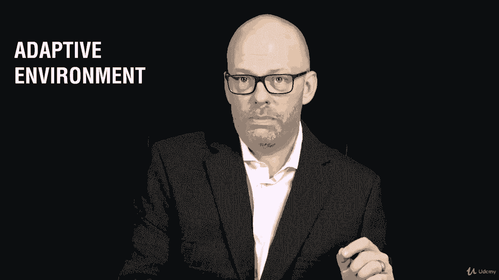

如果你在scrum或敏捷中工作，或XP或精益编程。

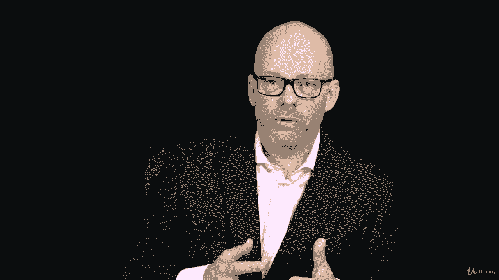

那些是适应性的，所以我们将讨论自适应环境，然后我们要看项目商业案例和收益管理计划。

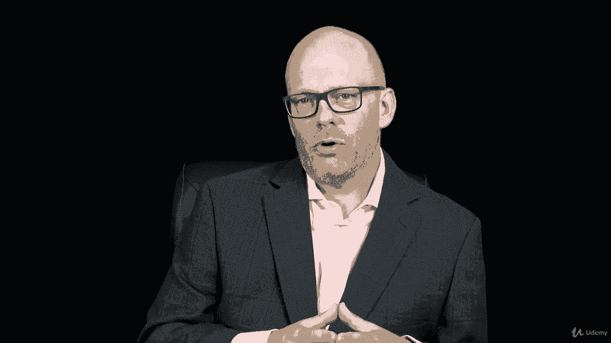

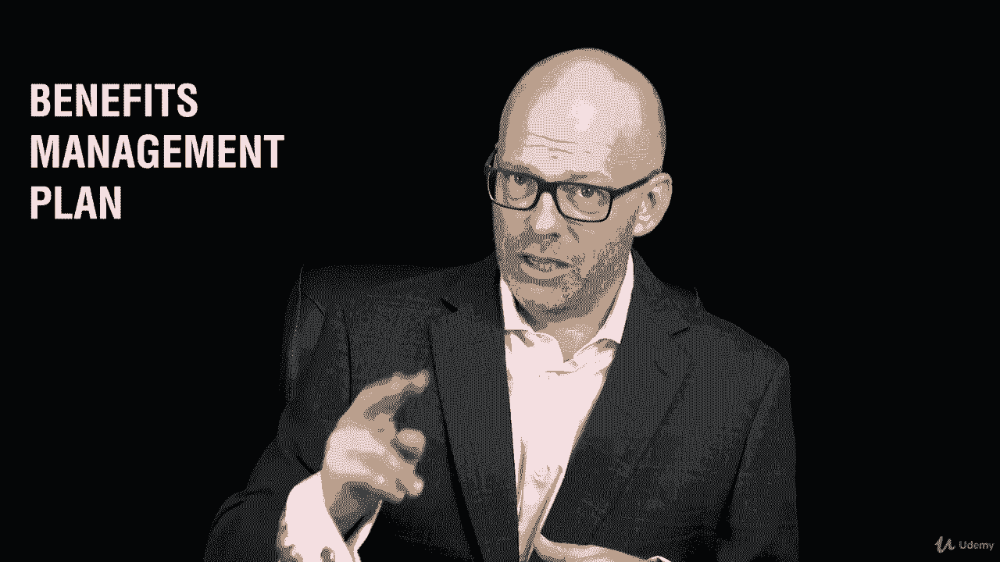

考试中两个非常重要的概念，这样你就可以看到，这是一个非常大的部分，有一个非常大的任务，我希望你完成。

所以当我们到达课程的那个点的时候，我们会讨论这个问题。

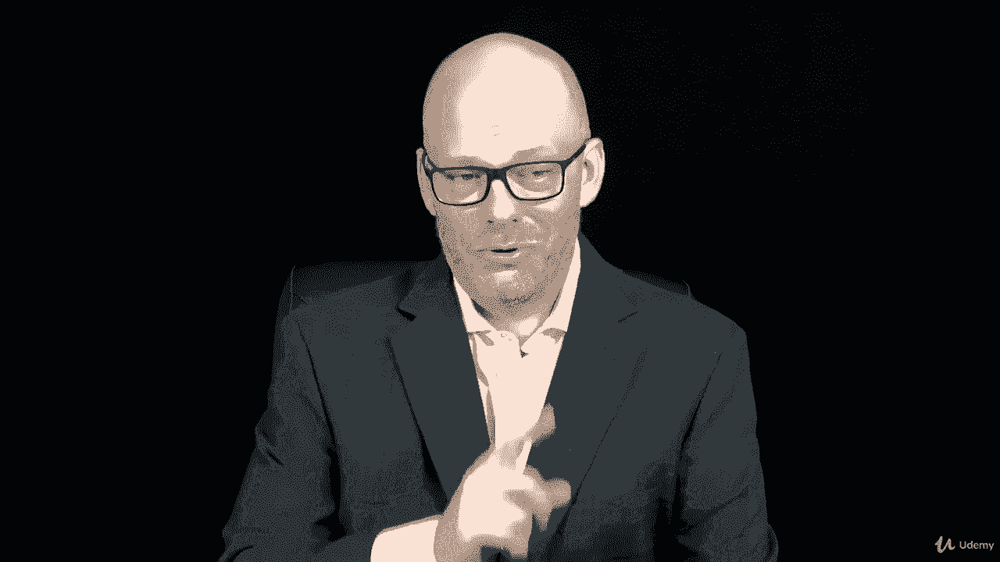

所有权利，我们出发吧。

