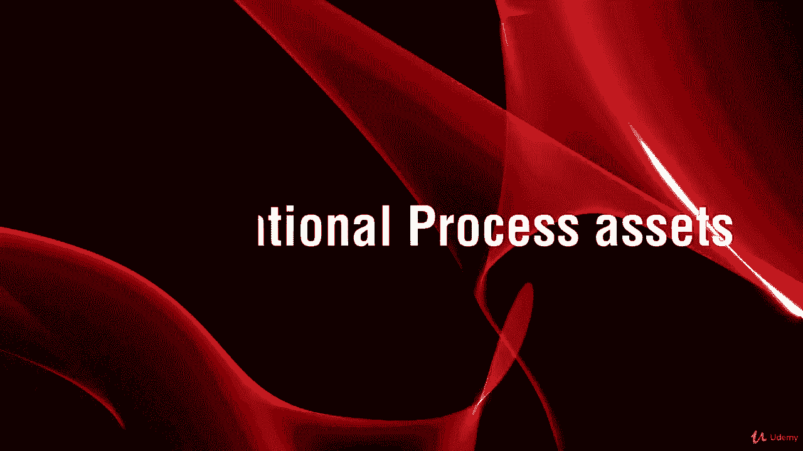

# 【Udemy】项目管理师应试 PMP Exam Prep Seminar-PMBOK Guide 6  286集【英语】 - P73：3. Organizational Process assets - servemeee - BV1J4411M7R6

我们只是看了一下企业环境因素，组织流程资产跟踪EEF，很多时候，我们会看到一个过程的输入，企业环境因素和组织过程资产或OPA，组织流程资产是组织内的资源，有些事情你可以利用，为你研究和创造的东西。

或者可以像人一样采访的东西，历史信息是你最好的OPA之一，因为历史信息是被证明的信息，你可以利用过去的经验来管理你当前的项目，一个很好的例子是我们把历史信息当成模板，很多时候。

我们认为模板是为我们创建的表单，我们填写，当然，这是一个模板，像作用域模板或宪章模板，但模板也可以是我们采取先前的项目，比如说，我们可以从以前的项目中提取质量管理计划，并使其适应我们目前的项目。

那很相似，或者我们可以从类似的项目中提取范围，我们不必从头开始写，每次都会很聪明，我们将拿一些类似的东西作为模板，这样我们就可以节省时间，获得已经被证明的历史信息，因此。

历史信息是我们最好的组织流程资产之一，我们也有一些常见的opas，你应该很熟悉，很多时候，大家都说，等等，政策也是企业环境因素，他们怎么能都好呢，政策可以是两个标准可以是两个标准，并不总是这样。

企业环境因素总是约束你的东西，它们也可以是为你创造的东西，为统一而设立的，因此，策略可以是允许更改进入项目的方式，或者你必须如何进行成本估计或时间估计，估计持续时间。

如何允许人们进入您的项目或直接与项目团队沟通，所以这些也可以是政策和标准，所以是的，有企业环境因素，你必须遵循的事情，但在OPA中，它们也可以是帮助你的东西，所以我认为企业环境因素是限制你选择的因素。

这几乎就像是一种约束，因为你必须这么做，OPA是为你创造的帮助你的东西，使你的项目更成功，或者试着调整条件让你的项目更成功，您的组织可能有一些标准化的指导方针或性能度量，你必须坚持。

所以你不能超过成本太多，也不能低于成本太多，或者偏离计划太多，或者你不能离开一个阶段，直到你有这样的性能水平，或者这个精度，您可能有我刚才提到的项目文档模板，像作用域模板或宪章模板。

我们可以利用历史信息，您可能有一些调整项目管理过程的指导方针，所以这意味着你可以在你的组织中看到这四个九个项目管理过程，你可以说，好的，这是怎么回事啊，我们作为一个组织将定义范围。

这就是我们如何创建工作分解结构，每个人都是怎么做的，或者我们如何做质量控制，或者我们如何让利益相关者参与，所以只是一些指导方针，您如何在组织中执行这些流程，没有一个通用的方法来做每一个过程。

因为每个组织和每个项目都是不同的，所以我有问题，有时你知道通过电子邮件从人们，他们会问，你有项目章程的模板吗，我可以用，你有风险管理计划的模板吗，嗯是的，但没有，这真的不适合你。

因为我创建这些的地方是一个完全不同的组织，该组织的风险、范围和关切是该公司独有的，但它可能和你的公司完全不同，现在有表单和模板，事实上，pmi有一本关于表单和模板的书，但你不能就这样。

你就这样把它塞进你的项目里，他们必须适应，这就是这些OPA的想法，它正在调整项目管理流程，但对于你的项目，为您的组织，在OPAS方面没有放之四海而皆准的方法，这些过程，一些常见的OPA。

我们应该熟悉采购的财务控制，因此，对于您的组织来说，表单、流程和工作流会计代码是唯一的，你如何进行采购，你在哪里，通信要求，像标准表格这样的东西，程序，报告，这些是通信要求，然后我们有项目活动的过程。

所以改变控制，如何更改组织中的控制，你如何结束这个项目，通信呢，财务控制和风险控制程序，所以这些都是歌剧，这些已经建立或调整，以适应您的组织中最好的东西，然后项目结束，那么你如何接受并签字。

你有结业证书吗，还是有迹象表明望远镜已经完成了，那么你如何结束这个项目呢？客户如何验证产品，有没有业务转移，你写了一些东西，项目现在已经结束了，这现在是生产或运营的一部分，还是一种非事件。

那么您的组织的规范是什么，然后进行评价，所以我们考虑对项目团队产品的项目评估，那里的一些评估认为这些可能是OPA，我们将看到很多组织流程资产，它是我们四个九个过程中许多过程的输入，它通常与EEF一起。

这两个一起，我们还将在整个过程输出的检查中看到，就是，OPA和企业环境因素经常更新以反映项目中发生的事情，所有权利，干得好。

