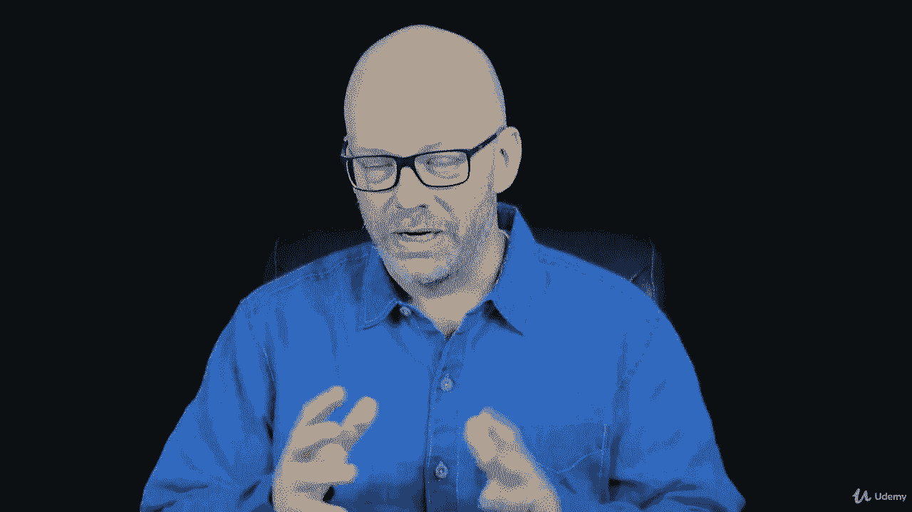

# 【Udemy】项目管理师应试 PMP Exam Prep Seminar-PMBOK Guide 6  286集【英语】 - P77：7. Frameworks - servemeee - BV1J4411M7R6

让我们谈谈组织治理框架，有三件大事我们不知道，当涉及到治理和框架时，好吧，首先，什么是治理和框架，良好的治理是我们管理项目的规则的执行，或者我们管理程序或整个组织，规则就是你。

并且在您的组织或项目中不允许这样做，框架只是结构，它是如何被创造出来的，它为项目提供了一些结构，举个例子，你有一个项目经理，对于不同的学科或技术，你有几个不同的团队领导。

所以你有一个硬件团队领导，他们有一个数据组长，软件团队负责人，所以你有你的团队成员他们向适当的团队领导报告，然后这些团队领导你也会互相交流和交谈，这只是一个框架的例子，一定要那样吗。

让我们来看看关于组织我们需要知道的三件事，治理框架，正如我所提到的，治理定义了您在组织中可以做什么和不能做什么，你作为项目经理不能与供应商签订合同，你知道这很公平，你在那里有一些治理。

这也是你如何在一个系统中运作，那么怎样才能把合同签好呢，你得去填一张采购表，并谈论获取这些资源，然后这里的第三点是框架，组织结构就像我在你的项目中谈到的那样吗，这也是整个组织中的层次结构和框架。

所以这是你能做和不能做的，你就是这样把事情做完的，然后是结构，边界是什么，与本组织不同部门的关系，关于治理框架的更多事情，规则和策略始终是治理框架的一部分，活动的程序，那么您如何安装该夹具。

你如何获得资源，你如何进行采购，所以只是程序，那么我们就有了文化规范，我在一个地方工作，几年前作为顾问说，周五12点30分左右很正常，就会有一些人，所以这只是文化规范，他们就是这样，每个人都喜欢星期五。

没有人把会议安排在星期五下午。你们在那里，你知道我在说什么，所有正确的系统和过程，那么你怎么把事情做完呢，那么采购系统是什么，什么是质量管理体系，你主持一个启动会议的过程是什么，所以是在组织内部。

你是怎么工作的，但显然这会影响你管理项目的方式，然后一个框架影响，如何制定和实现目标，所以你有了框架，那么目标是什么，有时我们称它们为KPI，您的主要性能指标，你现在几点？你的成本，你的瞄准镜。

你的质量和风险目标，那么告诉你你表现良好的门槛是什么，或者你需要改进风险，如何对风险进行监测和评估，那么你如何进行风险识别，你将如何做定性和定量，然后你将如何监控这些风险，甚至风险反应，当您通过项目时。

一般项目优先级越高，框架对风险管理方法的影响越大，所以一个很低级的项目，我不太在乎风险，我是说可能会有一些问题，但通常是一个高度优先的项目，那我们就更不利了，我们的风险阈值更低。

我们对风险的接受或容忍度降低，在某些风险中，我们总是关心，所以你想想在建筑、医疗保健或制造业，或者任何有纯粹风险的学科，有人可能受伤的危险，即使是在一个低优先级的项目上，我们不希望这种事发生。

所以我们非常厌恶风险，我们的容忍度很低，当涉及到纯粹的风险时，那么您的项目性能是如何优化的，你如何才能在你正在做的事情上做得更好，你有什么教练吗，你的项目发起人有一些趋势分析吗。

为项目的每个阶段或季度提供一些想法或目标，好的，所以这是治理和框架的大局，所有的权利，勇往直前。

