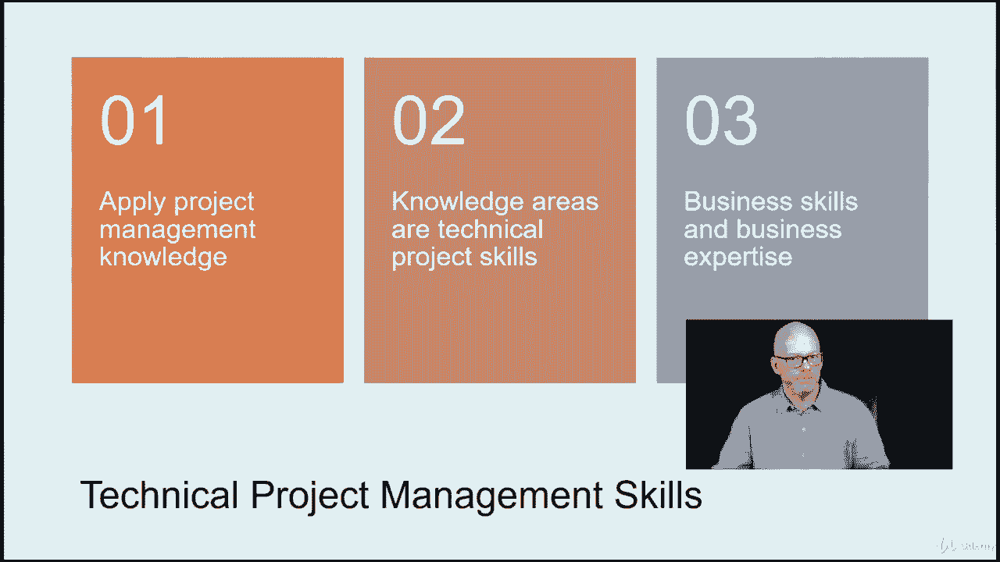

# 【Udemy】项目管理师应试 PMP Exam Prep Seminar-PMBOK Guide 6  286集【英语】 - P87：5. Technical Project Management Skills - servemeee - BV1J4411M7R6

技术项目管理技能这里有三种类型的技能或应用，项目管理技能，当涉及到我们项目的技术性质时，我们指的是，首先是我们有能力应用项目管理，我们了解项目管理，以及如何进行项目管理，我们如何启动的机制。

我们如何计划，我们如何把事情做完，等等，第二件事是知识领域是技术项目技能，所以你考虑在定义范围时所做的活动，或在制定时间表或成本管理方面，或者你如何对这些知识领域进行质量控制第四章到第十三章。

这些都是真正的技术项目管理技能，实际上是项目管理之外的事情，但它们覆盖了项目管理，所以商业技能和商业专业知识是技术项目管理技能的一部分，所以它超出了考试的范围，但它们很有用，因为我可以谈判，我交流。

我了解商业价值，我明白投资的回报，我了解政治资本，我了解销售流程，这样有助于项目管理，为什么这不是PM过程，这当然有助于我更好地管理项目，并更好地在组织中运作。

技术项目管理技能，所以我们作为项目经理需要的一些关键的项目经理技能，在项目经理的这个角色中，我需要明白，成功的因素是什么，那么KPI是什么，主要业绩指标，时间表管理你必须能够创建一个时间表，遵循时间表。

做一些预测，所以进度管理，第六章在针盒里，财务报告是什么，那么如何跟踪新的审计并创建财务报告，如何显示成本差异，如何进行成本分离和调节成本，从计划到经历，所以针背的第七章，我发布日志维护，所以问题。

当我发现问题时，它们记录在问题日志中，然后我们有一个问题所有者，目标日期，有什么特点，所以在整个项目中，我们必须更新问题日志，当发现新问题时，当现有问题发生变化时，当我们有一个决议，当问题需要升级时。

这都是问题日志维护的一部分，我想量身定做技术和方法，所以我们之前谈过这个，关于剪裁我不必做的四九个过程，全都是，我做最合适的过程，然后我做的每一个过程都有不同的深度，这就是剪裁。

我想彻底计划并确定需求的优先级，我希望能够管理时间表，我所在行业的成本资源和风险，项目管理行业我想保持相关性，所以这意味着训练，不仅是项目管理培训，但是在那个学科上的训练，所以我有产品和技术的相关性。

所以我明白这个项目在创造什么，我想了解新的和不断变化的市场利基和标准，技术支持工具，我想了解那些对我的组织和我的纪律来说是独一无二的，影响我的组织或我的公司和当前项目的经济力量呢。

什么影响正在影响项目管理纪律，所以我们近年来看到了这一点，用敏捷，自适应、精益和scrum，过程改进和可持续性战略呢，这些总是作为项目经理，作为项目经理我与正在发生的事情保持相关性，在我的特殊学科中。

所有的权利，干得好。

