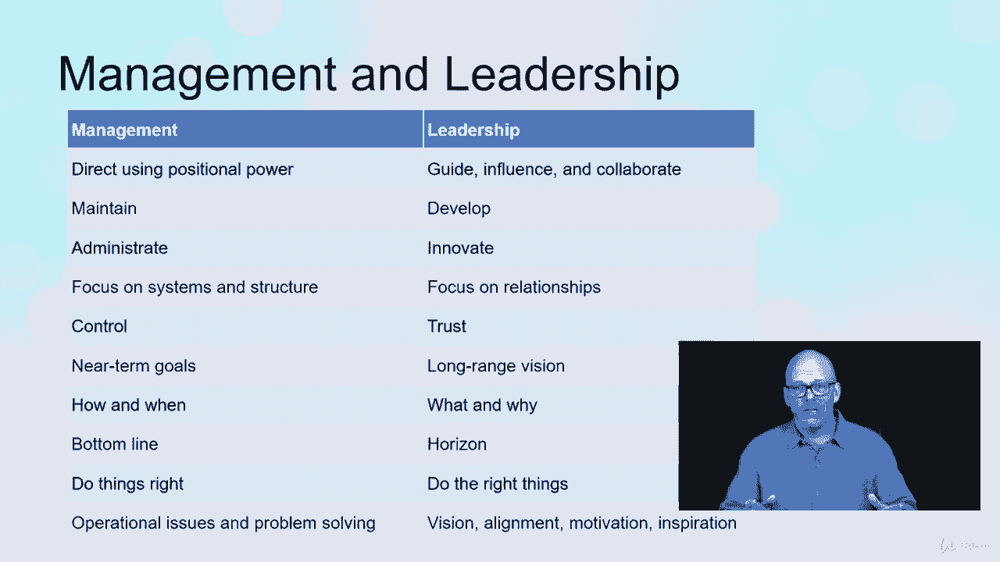

# 【Udemy】项目管理师应试 PMP Exam Prep Seminar-PMBOK Guide 6  286集【英语】 - P91：10. Comparing Leadership and Management - servemeee - BV1J4411M7R6

在这个讲座中继续我们关于管理和领导力的讨论，我们将比较和对比领导和管理，领导和管理绝对不是一回事，领导力是关于团结、激励和指导人们，领导有更多的情商，领导力是让人们一起工作，受到启发，成就大事。

寻找抱负，创建目标和设定目标，管理就是把事情做完，管理更多的是商业技能，而不是我们在领导力中看到的，领导人物，所以当谈到一个好的领导人格时，我们需要认识到一些事情，它们是正宗的，他们感兴趣。

他们关心别人，他们很有礼貌，他们很有礼貌，他们表现出尊重的行为，他们知道如何说话和对待他人，他们很有创意，他们能够批判性地思考，或者一些批判性的思考，很难说，做起来也不容易。

所以他们可以通过创造力来寻求解决方案，他们对文化规范很敏感，他们有时间和耐心，以及对这种文化的理解，以及它如何影响项目，又会如何影响他们与他人的关系，他们很情绪化，他们表现出同理心和理解。

他们理解人们在情感上来自哪里，他们有能力管理自己的个人情绪，他们很聪明，他们表现出智力，他们也尊重别人的智力，在领导人格中，当涉及到项目管理时，我们也有五个特征可能会有一点重叠，他们是管理人员。

他们在项目的各个方面都表现出一定的管理才能，他们了解政治以及政治如何影响项目，他们以服务为导向，他们为别人提供他们需要的东西，以便这些人成功，他们是社交的，他们理解项目的需求，团队和利益相关者。

然后他们理解框架和系统的系统性，他们希望建立能够在该系统内运行并有序完成的项目，时尚，比较和对比管理与领导管理，我使用直接和位置权力领导，我在引导，影响，协作管理，保持领导。

发展管理的更多行政或领导是创新，管理的重点是制度和结构，领导力侧重于建立关系，那么我们有控制和信任管理的近期目标，领导力是长期愿景管理思考如何以及何时，和领导思考什么以及为什么管理层关注底线。

当领导看着地平线，我们有做正确的事情和做正确的事情的想法，然后是操作问题和解决问题，与视觉相反，对齐，动机和灵感，现在我们需要管理，作为项目经理，我们也需要领导力。

所以我们需要这两种特质才能成为一个成功的项目经理好吧。

