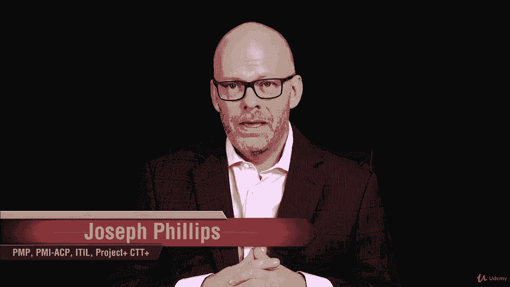
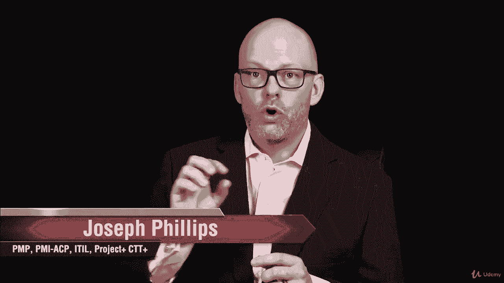
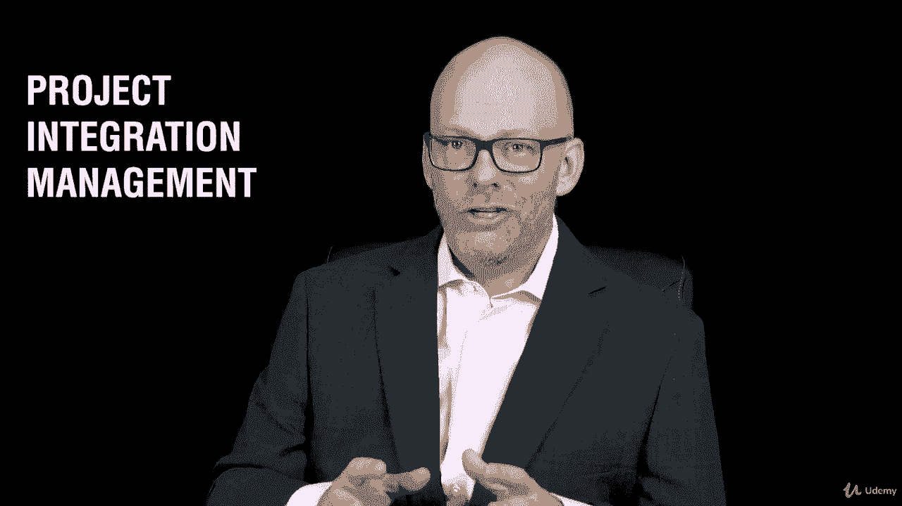
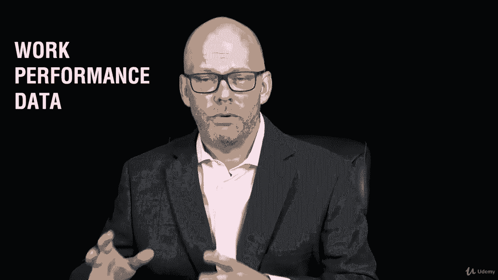
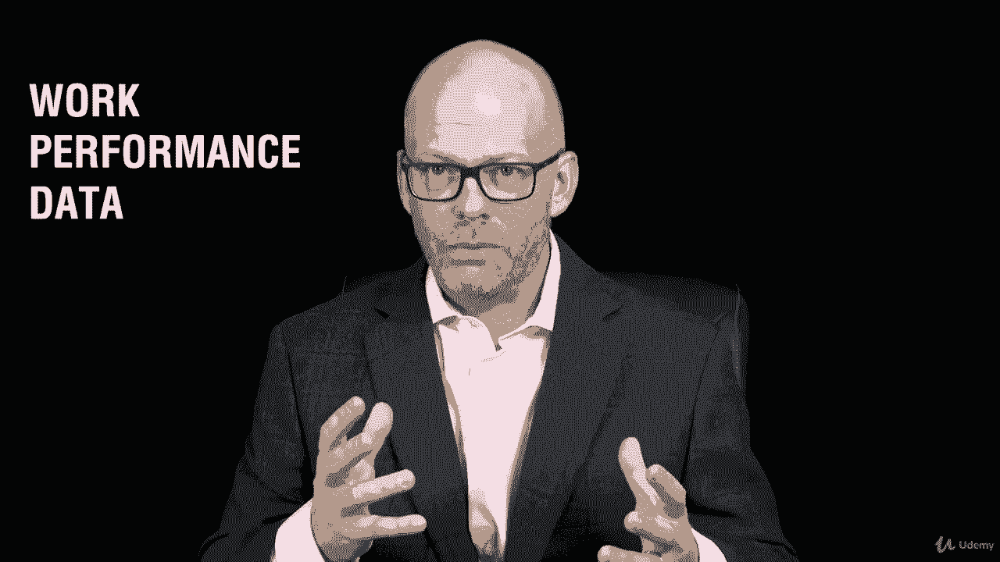
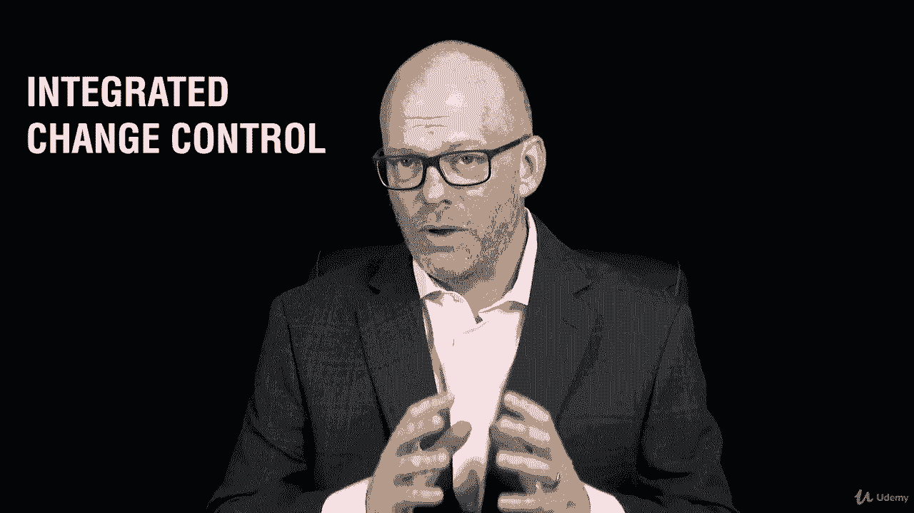

# 【Udemy】项目管理师应试 PMP Exam Prep Seminar-PMBOK Guide 6  286集【英语】 - P95：1. Section Overview Implementing Project Integration Management - servemeee - BV1J4411M7R6

欢迎阅读关于项目集成管理的第十节，如果你在跟随别针背面指南第六版。

本节将与弹球指南中的第四章与项目集成管理相关联。

这就是我们将要讨论实现项目集成管理的地方。

什么是项目集成管理，如果我们谈论项目集成管理的趋势和新兴实践。

关于根据您的环境裁剪集成管理，那么这在自适应环境中是如何工作的，在一个项目中，你要做的第一个过程之一是项目章程。

我想在这里指出一些关于项目集成管理的事情。

我们知道第一个过程是项目章程。

项目集成管理是每个流程组中至少有一个流程的唯一知识领域，所以我们知道入会有章程，在那里我们将看到他们的过程和计划执行。

监测，控制和关闭，这是一个非常重要的章节。

因为它在所有五个进程组中都有一个进程，这是唯一涉及这五个方面的知识领域。

所以这里非常重要的一章。

所以项目章程谈到了效益测量方法，创建假设日志。

制定项目管理计划，这样你就可以看到，现在我们正在计划，指导和管理项目工作。

当我们指导和管理项目工作时，执行创建交付品是我们所做的。

我们将在项目集成管理中生成一些工作绩效数据。

我们刚才谈到的原始数据。

我们会再看到的，创建一个非常重要的问题日志和问题日志，管理项目知识，这是一个我们需要注意的新过程。

然后监控项目工作，明显在监控过程组中。

然后执行集成变更控制。

所以这是本章的核心，这里是关于集成更改控制的非常重要的。

所以我们要在那里呆一段时间，事实上，我有一个任务给你。

在那里您将绘制集成的变更控制，所以真的很重要要注意。

然后我们的最后一个过程将是结束项目或阶段。

也是关闭过程组的一部分。

当然啦，这样你就可以看到，项目集成管理将涉及所有五个过程组。

所以这里有很多信息要涵盖，我们跳进去吧。

我们要把这个分解，很多信息，虽然，你可以做到。

