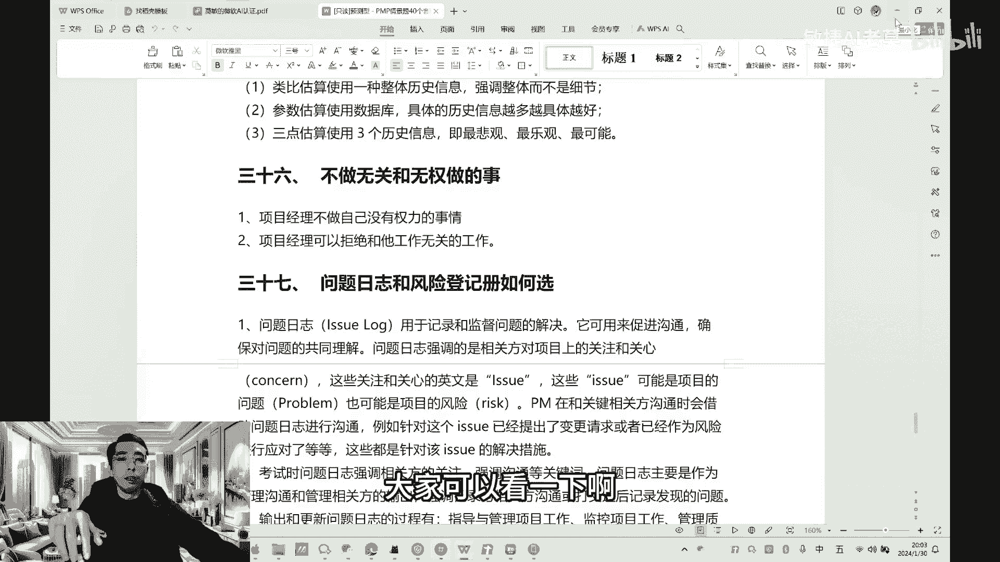
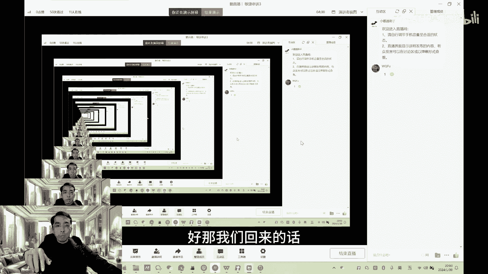
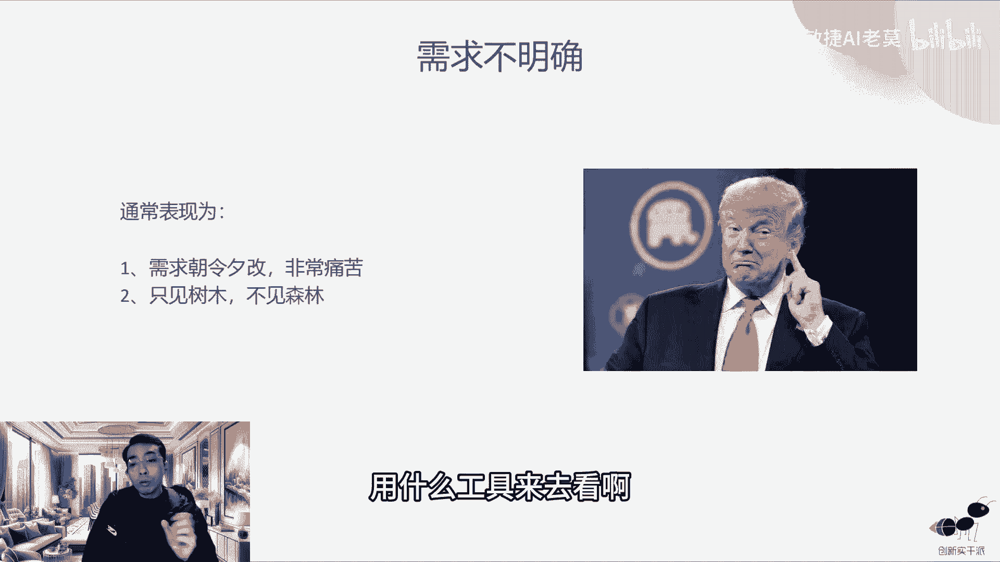
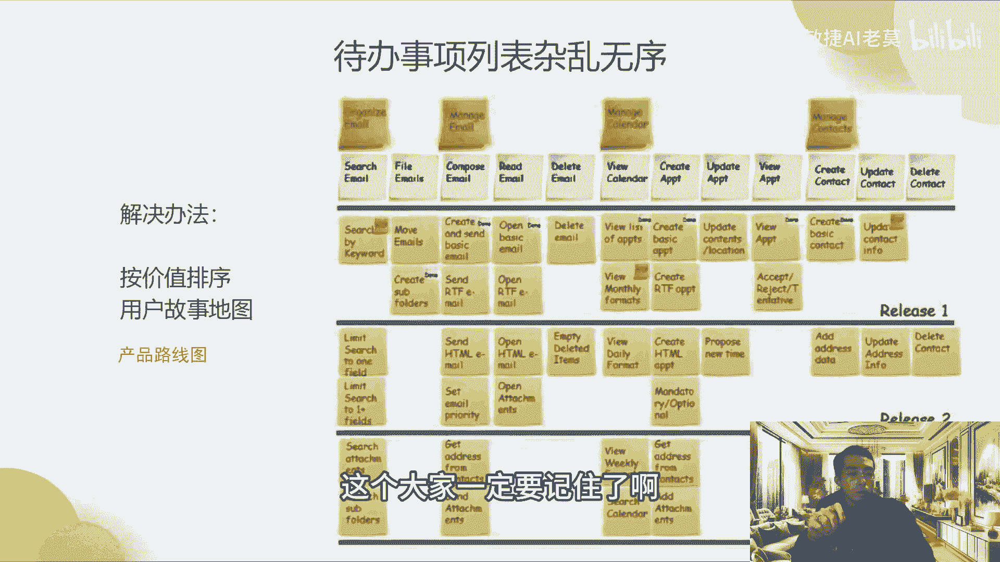
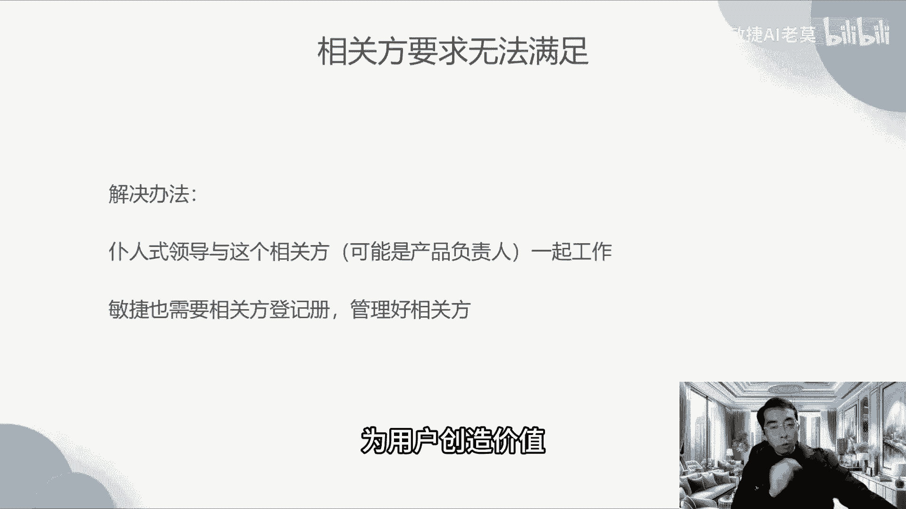
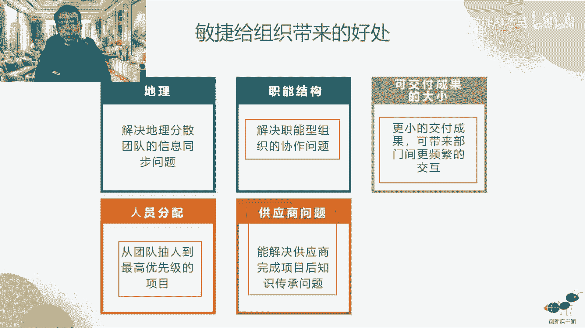
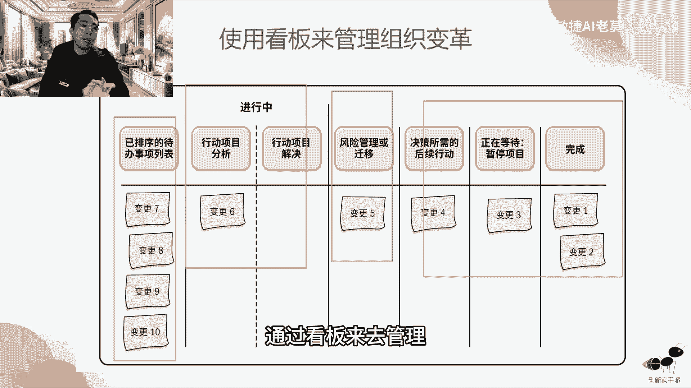
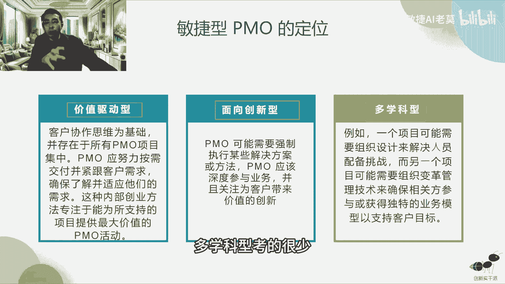
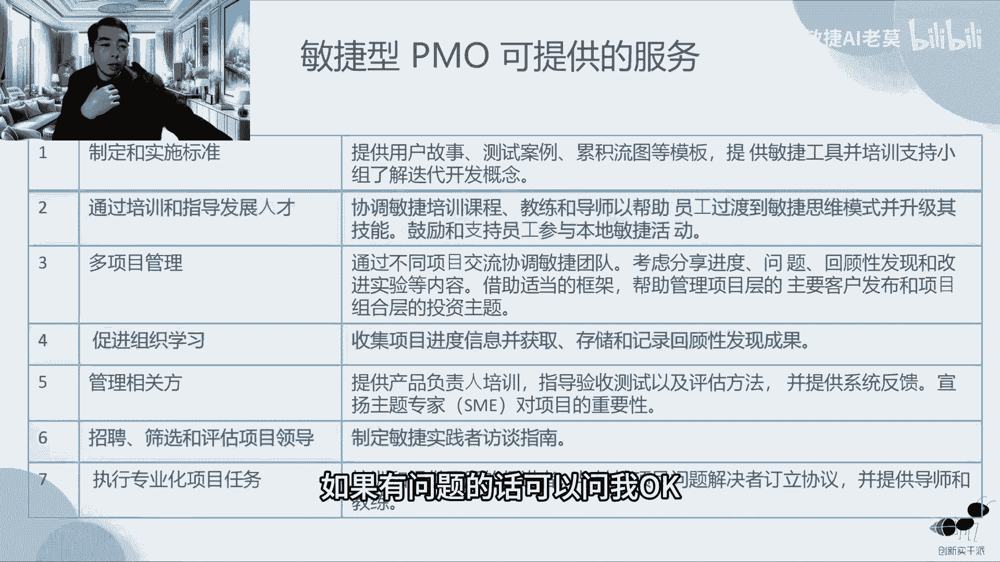

# 【一即是全】史上最好的敏捷课程（下） - P1 - 老莫爱AI - BV19m411X79C

今天先说一下喜讯啊，我们现在成绩基本上出来了，我们的学员有200多个人没过的，就两个人像出过成绩的人跟我这边看的话，我看数据就是两个人没过啊，其他同学已经过了，我们也在积极的跟这两个同学去分析。

它不够的原因是什么，因为同学们在我们这边，它所有的数据，为什么要大家在在小额通上面做题，你们小额通上做的题目，其实我们后台里面都会记录每一个人做题，每一次每一个模拟题，他做的分数是怎么样的。

我们都会在小额通上面去做一些记录，就会自动记录了，我们可以看就是学生在哪个地方比较薄弱，如果他没通过，我们会针对性的给他进行一轮分析啊，然后去针对性的给他一些建议。

帮助他说下一次我们我们怎么样更好的去通过，但大部分同学都过了，所以对于大部分同学来说没有太大必要，我们也会从小儿童去找一些错的比较多的，我们会把它精选出来，或者这种场景，这种情景它是非常的有典型意义的。

我们会把它提取出来，所以我在我们的今天的课堂上知识点串讲三，我们会把考试里面的一些典型的情景题，因为现在PMP的所有题目都是情景题，那么我们会把这些比较典型的情景题拿出来。

然后放到我们的课堂上跟大家去讲，主要是改变一下他的思路，你碰到这样的题目里面，你会应该就要去怎么去做，是这个意思，那么我在这里也也要跟大家通吃的，同学说一下啊，有一个敏捷的这个题目了，这个情景题怎么解。

我今天会讲，但是预测型的里面仅仅题应该怎么去解啊，这个题目里面我们有一套文档，大家很多人看了这个文档都过了啊，这个文档我们已经放在小儿童的课程里面，大家有时间可以看一下，特别是冲刺的时候。

我把文档大概给大家看一下啊。

我先开个屏幕共享，但是长的什么样子啊，OK好不对啊。

这个文档是在这里啊，就这个文档的名字叫做mp考试情景分析，40个解题套路，这个里面就会有碰到什么样的问题，我们应该怎么样去思考，那如果你把这40个问题全部记住了，你改变你的思路了。

那么你就可以很轻松地去解决，习题当中出现的问题啊，收尾应该做什么事情啊，遇到了什么你应该怎么去想啊，如风险什么具体问题啊，什么应该怎么去解，目中如果问下一步应该做什么，应该参考什么样的文件。

那么我们应该怎么样去思考，我觉得这些东西对大家来说，是非常有意义的事情，这个有必要的话，大家一定要去去看一下这个文档，考前我们要看一下，就对大家比较有帮助的，其实就是一种思路的解答啊。

这个是一个冲刺的题目，里面有的我们的PMP资源包，里面也会有这个东西啊，大家可以看一下啊。

OK那我们现在先回来啊，好那我们回来的话。

我们就在这里还是回到好，那课件里面，我们就开始了啊，好那课件其实就是一些问题实战，因为情景题嘛就会有问题，实战啊，我们就先看一下我们的思路啊，所以我们经常会有20招典型的提取出来的。

当遇到这样的典型的题目的时候。

大家不要慌啊，问题确实不大啊，第一个我们要剖析的是什么，在情景题里面，情景题里面它非常容易出现的一个东西，叫做准入和准出，大家知道其实做项目管理，它其实是一进一出的过程，我们为什么要列列计划。

列计划其实就是输入，然后通过我们在做的过程当中跟计划去比对，然后做出一个结果，这个结果叫输出，在项目管理的所有这个过程当中，其实都是输出的过程，你发现没有都是输出，我们就像做菜一样。

我们有什么原材料做了，我怎么怎么样去出，但是准入和准出就是什么过程呢，就这个原材料有没有准备好，准备到什么程度，我们才能够拿这些原材料去切，比如说啊做菜，首先我们如果做一个土豆烧肉，它是不是肉要切好。

对不对，要把肉腌好，这个叫准入对吧，那么土豆要怎么样要切成丝儿对吧，这个也叫准入，切成丝儿，这个丝儿的标准是什么，这个就叫准露滚粗是什么，在我这个出来之后，这个菜的咸淡怎么样，它的色泽怎么样。

这个也是有个标准啊，所以叫准除，在我们项目管理当中，我们尤其要重视DOD就是DOR是准入，DOD是准出，那么准出是更重要，在考题里面是考的更多的啊，准入就是就绪的意义，就是就绪的标准。

你可以理解为这个我这里举了几个例子啊，比如说需求质量，我们讲到敏捷里面叫做用户故事的质量，对不对啊，他的验收标准，验收条件有没有写的很清晰，我我们每一条需求里面有没有优先级是吧，那有没有希望上线的时间。

有没有干系人的确认啊，那么我们在整个需求文档里面，有没有一些交互的文档，有一些图形化的一些交互的东西，有没有一些视觉的东西，我们的切图有没有完整，这个是很重要的，上游如果你需求都写的不清楚啊。

需求都不合格，可想而知，就像你原材料准备的不好，你的肉都是臭的，你的土豆也切大一块小一块，那么做出来的菜肯定不会好吃，对不对，OK这个是准入准出是什么，准出其实就是这个太太出来之后，我们去评价它。

比如说写代码，代码完成，什么叫代码完成代码的有没有加注释，就每一条代码有没有清晰的注释，那么每一个代码它有没有去提交，提交以后代码有没有做检查，就是检查你们代码的语法呀，有没有错误啊。

什么东西其实就像写作文一样，检查你的作文有没有一些语法错误，有没有一些逻辑错误，这些东西都有一系列的工具来去检查的，那测试测试完成是什么，有没有完成集成测试，就没有放到一起去测，回归测试有没有测啊。

平台测试有没有测，那如果这些都做得到，这个就叫做完成准出啊，我们叫做完工定义，很多时候我们在考试的时候会考什么东西，这个事情啊，验收标准不通过，是哪地方出了问题，很多时候我们在项目刚刚立项的时候。

我们就需要对完成有一个统一的认知，什么叫完成啊，完成究竟是代码写完了算完成，还是说这个代码要经过测试才叫完成，一般在敏捷里面，我们定义为这个代码一定要经过测试，达到可验收的状态啊，才能够叫完成。

已经ready了，随时都可以发往外网，就达到能够发外网的标准啊，比如说一个领导打电话给你说，这一次我们今天就要发一个版本，我们现在的代码马上能够发到外网去，这个就叫完成，所以他一定要经过测试的啊。

这个听懂了吧，六六啊，我确认一下，我就往下走，因为这个地方可以拿分，至少可以拿到两分啊，OK好，还有一个就是关于我们的团队的目标，或者任务不明确，其实很多考题都是考这个东西啊，任务不明确表现。

为什么东西我们每天都很忙，团队很忙，但是很忙的时候忙不出成绩，这个是因为什么原因啊，大家士气降低，凝聚力下降到底是一个什么原因，其实原因第一个不是想要做团建，其实上节课我们就说了啊。

就不是做做团建的事情，而是说我们要先搞清楚，那么先搞清楚，如果他有一个选项，说我们先要搞清楚这个事情的根本，那么你就搞清楚这个事情的根本，但如果没有先要搞清楚这个事情的根本，那么你排行第一的。

你要选择什么，团队的目标和任务不明确，因为通常在项目管理，特别是敏捷项目管理里面，士气降低的，主要的问题是在于我们的目标不明确，所以大家各做各的就没有办法拧成一股绳，所以这个你要注意一下。

OK那么如果这个不明确我们的解决方法是什么，解决方法，其实怎么样才能够让它有一个很好的目标呢，我们就要去参考叫做项目章程，传统的项目管理里面它有项目章程，那么敏捷的项目管，项目管理里面。

敏捷的项目管里面也会有项目章程，它叫敏捷项目章程，那么项目章程长什么样子，就是长这个样子啊，它由哪几分几个部分组成啊，我先说一下，第一个是有项目的基本情况啊，包括项目的名称，制作人，签发人。

第二个是项目的目的啊，第三个是项目的目标，企业目标是什么，项目目标是什么，第四个是有项目的范围，你做这些东西包括哪些东西，第五个是项目的利益相关者，相关的干系人啊，还有这个项目的权限管理检查点。

相关方签字，大家脑子里面有一个这样的印象，就说哦，原来这个东西就可以把大家的目标进行统一，为什么，因为他明确的写了一个项目目标，在这里，每次每当你彷徨的时候，你就看一下项目目标啊，大家都知道哦。

我做事情的意义其实是往这上面去靠的，不能让大家做事情，任务太分散了，这样就不明确了，对不对，好OK好，这个就是我们的关于第一个，第二个我们的团队的工作协议不明确，工作协议不明确是什么。

就是啊各种救火救火是什么意思，其实就是什么，如果敏捷，我们做敏捷开发，我们如果只遵循那12个原则，而不知道我们做12大原则，这些事情到底为什么，这个很容易失败，很容易失败。

好那么我们要搞清楚这背后的意义，就是要我们在考题里面，我们要去注意选项里面，是不是能够出现一些比较明确的，这个背后的意义的选项啊，比如说敏捷12的原则，可工作的软件，可中工作的软件是进展的首要度量。

除了它满足可工作之外，还有前面的我们说的DOD啊，那么DOD其实是在可工作的软件之前的，我们的一个定义就是怎么叫可工作，那就是说我们在立项的时候，要把这个完整的定义说出来，就比如说我们上节课我们说了。

就那个王者荣耀来龙吟是吧，皮肤要满足一系列的测试条件，他才能够满足啊，所以在刚刚开始立项的时候，我们就要把这个东西提出来，以便于大家去验收啊，这样吧，每个人把这个工作完成，他这个事情要明确了啊。

这个团队才能够比较明确啊，OK好，第三个是团队环境不明确，团队环境不明确表，表现为其实这个是在敏捷里面，属于资源管理的问题，资源管理的问题在我们团队当中，我们会有分工，这谁来做哪些事情。

谁谁来跟进哪些事情，其实很多人是不清楚的，那比如说修case是谁来发起的对吧，那修case是谁来发起示啊，SM来发起的修case这个事情特斯bug谁来跟进。

那测试bug是纯进测试同学来跟进bug的解决啊，那么在这个情况下，我们就是要什么，就要去明确大家的一个职责，比如说团队里面开发是什么职责，测试是什么职责，SM是什么职责，凭什么职责啊，这个我就不赘述了。

因为我们在三个角色里面，这三个职责我们就已经分的很清楚了对吧，这三个职责是经常考的，这三个三个人三个角色在整个项目里面，我们去做什么事情啊，修case是什么意思，其实上节课我们有讲啊。

三修case就是验收啊，它是用户故事的验收啊，它跟评审有什么区别，评审是整个迭代的验收，比如说我每周一个迭代，这个迭代可能我们要做十个用户故事，那每一个用户故事的验收就叫修case。

那么这十个用户公司一起验收就叫叫做评审啊，他是这样的意思啊，所以一个是就类似于我们传统的项目里面，等的单元测试和集成测试的关系啊，在敏捷里面show case其实就是单元测试啊。

你可以这样理解就OK了啊，听懂同学打个一好，所以敏捷他虽然没有责任举证，但是这些人的基基本的职责，在启动的时候还是要定义清楚的啊，我们虽然说跨职能团队，跨职能团队是吧，至少说你还是有职责的。

所以在有时候有一些考题里面说，我们测试的同学，有个测试的同学在团队里去闹矛盾啊，这是一个真题啊，测试的同学在团队闹矛盾，他跟项目经理提出，他要转开发，你项目经理应该怎么办。

那么正确答案选项是应该让他的领导去告诉他，测试它的意义在哪里，你要承担你自己的工作的意义，而不是说我们是跨团队的，所以测试想做开发，你就让他去做开发啊，不是这样区分的啊。

所以跨团队的项目不是想做什么就手，那这样就乱套了，那每个人都想做产品经理怎么办，对不对，这个项目还要不要做了，对OK好，再往下需求不明确，其实改的非常非常多啊，在考题里面其实现的非常多啊，区长不明确。

比如说我们需求不明确，比如说像川普一样把朝令夕改是吧，今天这天那天只爬，明天那个爬，那整个团队就很不适应，那么这种不适应的需求，我们应该怎么去应对啊，我们前面也说了，需求不明确，怎么样去就会出现不明确。

第一个是需求太杂太乱，第二个是我们没有这个需求，他很多时候提出来，他有没有符合我们的战略目标，也就是我们的价值是吧，我们一直在一般我们在敏捷里面，我们都是讲什么价值交付，我们要创造价值。

那么这个价值是什么，上节课我们也说了，价值是战略，那它有没有符合战略，用什么工具来去看啊。

我们一看只见树木不见森林这个关键字，我们就会想到什么用户故事地图，我们就需要什么，在需求不明确的时候，我们就要构建用户故事地图，但是在啊记住了，考题里面不会有用户故事地图这个字眼。

但是考考题里面一定有产品路线图，就如果你看到需求不明确的这样一个字眼，那么你就可以去思考，我们用一个什么工具叫做产品路线图，这个图来去把需求呈现在这个上面啊，那大家很清楚。

呈现这个过程是通过什么会议来去开展的，这个也会考那什么会议，就是我们的待办事项梳理会议，在这个会议里面去开，所以这五种会议一定会考，反复会考这五种会议啊，用代办思想思想梳理会议。

去应对需求不明确的这样一个事情，因为我们要去梳理啊，这个会议就是为了把需求从不明确，变得明确起来，OK听懂同学打六六啊，好下一个问题是用户体验不佳，也就是说在我们在这个评审的时候，就是最后的验收的时候。

用户在测看这个产品的时候，觉得这个产品的体验很差啊，那怎么办，其实我们就要怎么样把用户参与进来啊，我们的选项里面，我们最好选的是，当用户他觉得这个产品体验不佳，或者是产品质量有问题的时候。

我们最好的方式是，让用户频繁地去参与我们整个生产过程啊，生产过程他肯定每天的晨会他没有必要参加，对不对，因为这个太繁琐了，但是每一次结果展示会他要参加，所以我们在这里面就会有我们的迭代评审会议。

所以在迭代评审会议上，你看又是考会议，这个迭代评审会议上让用户参与进来去提意见，让这个用户体验不佳的问题，慢慢的变得很很加变得很好啊，这个是我们实拍的一个图啊，腾讯我们在里面去。

我们每次一个小迭代发布的时候，这个发布的版本它并没有发到外网，但是我们会邀请什么腾讯内部的一些员工，他们体验我们的产品，我们的老客户去体验我们的产品，让他们去调研，让他们提出一些意见，让他们参与进来。

他们可能是另一个部门的这个开发者，但是他同时也是我们的产品的用户，那他其实就有资格作为用户向我们提一些意见，让我们继续整改，只要是用户提的好的意见，我们就很欣然的要去接受，OK这样才是极致的。

我们其实现在在在短视频时代啊，这个叫做宠粉，我们要及时的去宠粉，粉丝需要什么，我就给他提供什么啊，好估算不准确，估算不准确，其实是在项目管理当中经常会遇到的问题，而且经常表现到需求估算的比较乐观啊。

考试里面也经常会考到这个问题，当一个需求被人估计的时候，他每次估计的很乐观，但是他最后又拖延了，那这个项目拖延了之后，项目经理怎么办啊，你如何去避免这个问题，这个是经常考的一个问题啊，那么如何去避免呢。

其实我们在整个阶段我们需要把大事化小哈，一句话就大事化小，因为估算不准确，我们以前也说了，上次举了一个例子，就估算不准确，你让我们去估算小蛮腰的高度，那我们可能估算的是几百米是吧。

三四百米就是以百米为单位，那我们把小蛮腰啊，我们把小蛮腰切成很多层楼，每一层楼是一个固定的高度，比如说每一层楼是3米小蛮腰，我们要坐几层电梯到楼顶，比如说我们要坐100乘电梯到楼顶。

那么3×100就是300米，所以通过这个东西，我们就能够很精确的估算小蛮腰到底有多高，对不对，他可能是300米，那如果是他是101乘电梯，那么它就是303米，他到电梯的那个平台，它就是303米。

所以这样的我们一下子就会怎么样，把一个大的估算切成很多小的估算，那是不是我们就估算的更加清楚了，回到我们的工作上来，你把一件大的任务，比如说我我说我要写一个微信啊，写一个微信程序要花多少人天的时间。

你可能一下子答不出来，但是我会说啊，我把这个微信我切成很多功能，登录功能又多少啊，我们的朋友圈功能又是多少工作量，那么一加起来就得到我们整个微信啊，打个比方就加起来只得到整个微信的工作量。

这个是不是比以前准确的多对吧，所以在解题的方式里面，我们就会拆分啊，拆分就让估算变得更准确，那么每一个人的这个估算也是一样的，一旦这个任务过大的时候，他估算不准确，我们就要想想办法把这个任务拆得更小。

再让他去估算啊，这个估算就会变得更准确，所以在哪个会议上去做这个事情啊，答案就是代办事项梳理会啊，这个里面啊，如果考的是哪个会议啊，去拆分这个事情，就是代办事项处理会好。

下一个工作分配或者工作进展不明确，OK那么项目经理最清楚每个人进展，其实在传统的项目管理里面啊，团队彼此是不太清楚的，只有项目经理他最清楚每一个人的进展，所以这个时候项目经理就变成了什么，团队的瓶颈。

为什么，因为项目经理一旦请假，因为人嘛他总要有一些三病两痛，对不对，你总要去医院对吧，有时候要去医院也感冒了呀，什么东西可能来不了公司啊，有时候你要去要去，有事情要请个试驾，那么只要你请假。

团队就抓瞎啊，项目经理就会变成这样，所以我们为什么我说为什么大家要去转敏捷，敏捷项目是什么，敏捷其实就是负能，所以SM他做的事情，就是我们把项目经理的能力去下放出去，让每一个人人每一个人他都要有领导力。

所以在第七版的时候，我们反复在讲领导力，领导领导力这个东西就每个人都有领导力，所以他就有自驱力，自驱力，不会每件事情都找项目经理，只有项目专业的事情才会找项目经理，那么项目经理要做的事情就像教练一样。

就是你要把规则定义清楚，所以你请假的时候，只要这个团队按照规则在走，他就一定不会出大问题，对不对，你请个假，请个几天假也是没有问题的，对不对，OK所以在项目经理在这整个过程当中，我们反复在考。

就说如果这个项目经理成为单点，你最好的情况是我们要转型敏捷，我们要让团队自组织起来，比如说你有一个搞了一个面板，你说清楚这个看板它怎么样，它的规则是什么，大家怎么样去使用这个看板，好让大家熟悉这个流程。

大家跑起来去引导大家怎么样去开每日晨会，怎么样去汇报工作，彼此汇报工作，不是向项目经理去汇报，彼此，汇报完工作，那么是不是整个团队就自组织起来了，自组织起来一旦出现之后，那工作其实就不是分配了。

在敏捷里面它有一个词啊，叫认领啊，我写一下啊，敏捷的他一定不是分配工作啊，如果不分配工作，这个选项就不要选认领工作对，OK那这样的话，他工作进展是不是就明确起来了啊，OK还有一个就是团队面临的障碍。

那么在很多考题里面，他说团队如果我们面临障碍，应该去怎么样去解决，怎么样去解决，那么团队的障碍请问在哪个时候解决，团队的障碍通常是在什么，我们前面说了，有评审会有什么会又回顾会。

那么团队的障碍通常是在回顾会上去解决对吧，我们要把障碍抛出来，为什么不是每日晨会，每日晨会暴露的问题，它不是障碍的问题，因为障碍的问题，很多时候他不是一两句话能解决的，你15分钟之内。

不可能去解决这么多的障碍问题，所以这个集中的事情，我们就只能放到我们的回顾会议啊，所以正确答案其实就要放到回顾会议里面好，OK在回顾会里面，在在这个解决的方法里面嗯，第一个我们要是什么，在回顾会之前。

我们其实团队遇到障碍的时候，首先分清楚团队这个是障碍，如果是不是团队搞得定的，比如说一个技术型的问题，技术性的问题我上节课也说了，技术型的问题是让团队自己去研究去解决啊，如果团队搞不定啊。

这个事情比如说它影响了三大基准，我们技术型的问题拖拖拖拖拖，它已经影响影响到什么我们的生产计划了，比如说影响到我们的时间了，或者影响到我们的这个成本了，或者影响到我们的范围了，我们就要MSM去求助了。

所以这个时候SM要去出手了啊，那么如果SM都无法解决的问题，这个时候我们就需要去向上汇报了，所以在我们选择题里面就是选择向上汇报，这个是下下策啊，所以你要看你的选项里面能不能ABCD，四个选项里面。

有有没有选项可以去解决他们的问题，就是解决团队面临障碍的问题，如果三个选项都没有，你才能够选择向上汇报啊，你不能一上来就选向上汇报啊，或者是说你不能一上来就选什么，开会去讨论，开会去讨论是啊。

最无效的方式，至少在项目管理里面是属于这样的，在回答这些问题的时候，考试的时候是这样的，有些人说，那我在公司里面，实际上我工作的时候是这样的，大家拉会一并去讨论这个事情，这个事情你在公司你可以做。

但是在选项里面，在考试里面不能做，为什么考试里面如果你轻易的去选择，说我拉会让大家讨论去解决问题，那请问你学了项目管理，PMP到底是为了什么，那所有所有问题我都可以说，我是通过我们阿会解决的呀，对不对。

那你学和不学PMP有什么区别呢，就没有任何区别了，所以你一定要用自己的方式试图把去解决问题，这才是PMPMI想要你给出的答案，OK好，下一个问题就是什么产品代办事项不够完善，导致工作延误啊，是什么意思。

我们在这个需求评审的过程当中，我们出现了问题，比如说需求写的不好啊，开发的同学不理解，然后在项目的过程当中，他又反复的去找产品确认，当我们遇到这样的情景题的时候，我们应该怎么样去处理。

所以正确答案我们就应该怎么样呢，我们应该讨论一个故事啊，去共同去讨论用户故事，在我们的待办事项梳理的时候怎么样，我们要去澄清啊，而且我们要在立项的时候，我们要顾为故事去创建一个DOR，准备就绪的定义啊。

进一步拆分啊，才能够去解决代办事项不完善的意思，就是代办事项不完善，所以我们要不断的去梳理待办事项啊，就像需求不好，做的不好，需求质量不高，所以我们要想办法去提高需求质量。

提取师呢提高需求质量就是准备就绪，我们要要求要求严格，也就是说我们要严格要求需求文档，我可以打一个啊，说人话就是严严格要求需求文档的质量啊，或者是说我们是在需求的质量啊，或者是说需求质量为什么。

因为敏捷里面他不是不强调文档吗，你其实他强调的是什么，我们有一个沟通的机制，我写我不能写一句话的需求，我得按照用户故事的方式去写清楚这个需求，定义清楚这个条件，但是我不是写文档定定义清楚这个验收条件。

我们这个需求是经过讨论的，这个用户故事，我们要去怎么样保证用户故事的质量啊，应该是这样说，保证用户故事的质量，我们保证了每一个用户故事的质量，也就是保证了我们产品代办事项的质量好。

那么接下来到一个问题就是我们的缺陷啊，如果我们的产品质量太差怎么办啊，如果开发写的产品质量太差，这个时候我们怎么去解决啊，用户抱怨啊，当我们碰上这样的情景题的时候，有这个词汇的时候。

我们应该去怎么样去处理啊，经常测试被打回，这个时候我们应该怎么样啊，这个结对工作是我们的选项的首选啊，测试驱动开发这个选项有最好去选，因为测试驱动开发它是一个怎么样，它是一个提高代码质量的啊。

最好的方法好自动化测试是提高效率的啊，以及文件的DOD，你看文件的DOD一直在说DOD完成的定义，其实就是什么，就是对结果质量的验收，什么叫完成，一定要测试完成算成完成啊，一定要测试完成。

达到可发布的标准才算完成，OK那还有一个就是工作未完成，怎么办啊，其实这个在传统的项目开发里面经常会遇到，所以我们才会说我们要转型敏捷，就是开发同学他把自己当做一个搬砖的，我们是是怎么叫我。

我们就是一个搬砖的啊，开发同学经常说我是搬砖的，那么你产品经理提的需求，我就当需求完成呢，我没有问题呀，对不对，那么这个时候我们应该是没去解决，还是那个东西啊，还是回到完整的定义里面啊，工作未完成。

所以你要去完成你的工作，你首先你要让你的代码通过怎么样用户故事，我们前面说的show case的验收，修case的验收就满足单元测试的验收啊，整体的用户故事，我们要满足我们的整个迭代的验收标准。

这个才叫完成啊，好那技术债务，技术债务其实在考题里面也经常出现的东西，就是这一块代码跑不动了，我们怎么办啊，上线如果经常出问题，我们又能怎么办，那这个时候我们就应该用什么方法，你发现没有。

又是DOD会出现这个关键字，所以DOD至少有两道题目啊，我们可以看一下DOD完成的定义啊，一定要强调我们完成的定义啊，不仅仅是开发完成，而且我们要经过测试，达到验收标准啊，而且一开始我们就要去定义清楚。

那么技术债务里面还有一个方法方式，就是用重构，我们在重构里面，我们前面也说了，我们不是有技术需求吗，我们这个代办事项列表里面，不仅仅是有产品经理提的需求，有老板提的需求，他也有技术需求。

技术需求一般是技术人员发现这个代码有问题，就像建楼一样，他发现这个楼有一些裂痕，他要去修复这个楼，或者是说这个楼有点歪了，他要从地基开始要重新灌注，要去打捞这个楼，这个叫做重构啊，这个东西OK技术债务。

还有一个就是刺探，刺探自试探是每一年考试的时候，至少会有一道题目啊，试探是什么意思，就是技术预言啊，这个大家一定要记啊，预言叫做技术预言或者产品预言，那么这个技术预言和产品预言，到底是一个什么玩意儿。

好我就拿你炒菜做一个案例啊，假如你现在要春节啊，你要做年夜饭，年夜饭里面有一道菜，烤羊排，你没有考过，你没有考过，羊排从来没有，但是你你发现如果一道烤羊排，放在我们的整个年夜饭上面，可能它是一个大菜。

会让大家更满意，所以你准备去做考研牌，但是你以前没有做过，所以这个时候我们应该怎么看，首先我们去网上去找一些，烤羊排的这样一个视频，你去抖音里面去查，或者去小红书上去找一些烤羊排的一些方法。

我们再去自己去实践啊，自己去放烤箱烤一次，按照这个方法，你考完以后再去尝这个方式是不是对的啊，这个咸淡怎么样，它烤出来这个香味是不是跟你预测的是一样的，这个就叫技术预言啊，放在我们的写代码里面。

什么叫技术语言，比如说我们啊我们的这个代码里面，我们现在新出的代码里面，可能要加入一些AI的东西，大家也知道IRAI它是一个技术方向，我们首先我们想把AI这个技术，放到我们的产品里面。

让它也具有AI的一些属性，那么怎么办呢，我们会让我们的一些员工是吧，比如说技术比较强的人去研究AI，研究AI的技术，这个就叫做技术语言啊，也叫刺探，去刺探一下，有点像怎么打仗的时候。

我们首首先派先遣部队去刺探一下这个事情，去看一下这个东西，可不可行，那么产品预言是什么，产品预言其实跟技术语言相似啊，技术语言是研究AI的技术，那么产品预言它更多的是研究在这产品层面。

甚至研究说我引入这个AI的这个东西，对于我们的这个整个产品它有什么益处，能够去解决用户的哪些问题，产品经理可能也会去研究AI这个东西，所以叫产品预言啊，所以试探这个单这个词一旦出来。

大家很多不理解的时候，你就等同于技术预言和产品预言就行了，OK其他的我就不解释了，好好下面一个问题就是产品复杂性度过高啊，在镀金的这个过程当中呢，我们都是要避免啊，你不管是你的。

在传统的项目管理还是敏捷的项目管理，我们都不需要去镀金啊，因为镀金是什么用户，他要你做出，比如说在传统项目管理里面，本来是说我要你做十件事情，但是你发现我做完11件事情，这个事情以后。

这个整个界面会变得更好看或者什么东西，但是他如果一旦没有写在这个范围里面，其实你就是造成了镀金，是造成了成本浪费的啊，那么在敏捷里面，我们只讲说我们做最最有利于用户的东西。

就是我们把价值这种事情看得非常重，镀金就是什么不产生价值的事情，就是你做了一些额外做的事情，它不产生价值，所以这个价这个事情是不要去做的，那有些同学会问，会说我镀金这个事情，我自己做这个事情啊。

我我觉得这个事情是作为一个工程师来说，我是一个工程师，我做了这个事情，我觉得很有意义，它也提升了用户的价值，那这个算算不算镀金，答案是这个也算镀金，因为你没有跟团队去讨论。

你没有考虑到团队这个价值的目标在哪里，那你可能是你歪打正着，你做了这个事情，你觉得这个事情做了，真的提升了用户的一些这个用户的收入，或者是说用户的体验变得更好了，但是这个事情没有经过团队达成一致啊。

所以这个事情也叫做镀金，有些人说阿莫老师，你为什么这样，这个事情我做了这么多，为什么还还算镀金呢，你要想我们是一个整体，如果每一个人都像你这么样，我想这个东西对团队好，我可以不经过哦，这个事情对用户好。

我可以不经过我的团队的商量，每个人都去做一些这个事情，那谁来做更有价值的事情，所以有没有价值，应该抛出来团队一起去讨论啊，得出一致啊，团队说这个事情确实你提的很好，这个事情有价值啊。

所以就把它也加入到需求里面去做啊，这个就不叫镀金了，对不对，所以要避免镀金啊，OK我我其实这个事情说的很清楚了啊，如果你们觉得清楚，可以打1K就总体而言，我们的原则就是不做镀金。

好团队在合作过程当中进展缓慢，这个事情其实是属于什么，属于我们的这个资源协调的问题，团队其实很多问题，有时候抱怨后面连抱怨都没有了，那么遇到这个问题，我们应该怎么样去解决。

那么这个问题我们应该是在回顾会议当中解决，因为合作过程当中进展缓慢，请注意它，这个关键是这过程只要是题目当中出现的过程，我们一定要放在回顾会议里面，那么回顾会是不是要解决所有的问题。

我的回答是不要选项里面，一定不要选团队在回顾会议上做所有的问题，那么我的建议是不超过三个，那么在考试的选项里面，他会怎么样说，他说解决当前最重要的问题，他不会TMI，他不会给出一个两个或者三个。

因为他要适合普罗大众的，他也不知道你公司到底是一个好，两个好，三个好，我只是给你的建议是不超过三个，然后他因为他是普适性的，所以他一定不能给你一个确定的数字，所以他的选项里面一定会有解决。

当前最重要的几个问题啊，好我们可以加了几个问题，这个选项里面啊，大家要扭转自己的思路啊，好还有一个就是返工的问题，返工的问题其实也是比较多的啊，团队如果出现混日子的人太多，前面是计划不断的去调整。

后面干脆就没有计划了啊，那么在敏捷里面没有计划，对不对，正确答案是不对啊，敏捷里面也需要有计划啊，那么这个计划就会，我们要放在我们的迭代会议里面去啊，而且如果你前期工作过多，我们在刚开始做的事情里面。

我们在很多事情里面，我们需要怎么样，我们把提前量我们要准备得更足一点，提前量我们是通过刺探来学习的啊，OK如果工作很多的话，我们还是要拒绝聚焦于一个价值，聚焦于一个价值。

OK我们还要创建一个完整的定义啊，完成的定义就是解决返工的问题，因为返工很多时候，也是因为质量不合格引起的啊，你做的东西不合格，拿回去重做又去做，所以就会体现这个反攻的东西好，还有一个就是半半途而废啊。

这个项目半途而废，其中也好，考过一些题目，没有做完的产品啊，半路终止了怎么办啊，团队士气非常低落，那这个事情应该怎么办，那么我们尽可能的让团队的产品负责人，参与进来啊，参与了。

有些人说这个敏捷里面不是产品经理负责人，本来就要参与更多嘛，但是确实有一些考题是产品经理，其实他对于这个团队参与，他可能带了几个团队，他对于这个团队的参与其实并不太积极啊，所以在出现这个事情的时候。

我们其实应该把团把产品经理让他更多的去，他参与到这个项目当中啊，你不要去管其他的项目，你可能会考虑到说我在做考试题的时候，会想这个产品经理他也挺可怜的，他在那边也有项目，我不能独占着他，对不对。

但是在考试题里面，他关注的是你这个项目怎么样，所以你更多的你要考虑到，你要把产品经理拉拉到这边来，至于他那个项目是怎么样的，这不会去不会去让你去想他那个项目，你要去维护他的项目啊，账户不需要PO嘛。

对这个项目管理，最新的顶级项目管理里面，站会是不需要PO的，这个问题其实大家一直是在讨论的啊，00351啊，我就跟你说，一直太软了，刚开始的时候在敏捷，刚开始的敏捷宣言，在在敏捷联盟里面。

我们一般讲的刚开始的版本里面，P是不需要参与的，后来大家在整个敏捷的过程当中发展的时候，出了第二版的时候，大家说敏捷我们需要需要站会去PO去参与啊，因为他参与他能够发现问题啊。

发现我们的工具中间的一些问题，但是现在它又变成了什么，我不需要产品经理啊，不需要去产品负责人去参与啊，探讨没有去强制什么时候需要PO参与呢，出现这些问题的时候，他有必要去参与啊。

OK他不是强制要参与的啊，大家要记得OK好，开板事项列表杂乱无序啊，这个时候我们应该怎么办，OK那么在这个时候，我们还是需要怎么样有个啊用户故事地图，在整个产品在这个过程当中啊，在这个选项当中。

在敏捷的这个选项里面，它通常以不以用户故事地图的这种方式出现，它一般是以什么叫做产品路线图，路线图这种方式出现，当你看到产品路线图的时候，你就知道哦，原来我们是要解决待办事项列表，杂乱无序的事情啊。

敏捷教练也不强制在最新的版本里面，敏捷教练也不强制去参加展会啊，这个大家一定要记住了啊。

好不均匀的工作流程啊，一句话来说就是要涝涝死旱的旱死，就有些他比较能干的人，他在团队里主要的人他会承担很多工作，但是你发现在团队里面，他那些不是能力不是很强的人，反而他做的工作会比较少。

所以我们就怎么样，很多问题会会会去找那个很强的人，比如说一些外网问题，因为他很强嘛，外网出现问题，你肯定找他去排除一些问题吧，比如说还做一些客户支持啊，也去找他那特性开发，也去找他，那这样合不合理。

其实不合理啊，你会把一些人累死在我们的理论上的，我们要做的这个事情，在考试上，我们要做的事情，我们就要削峰填谷，把工作平均化平均去分配啊，我们利用什么样的东西呢，利用什么样的工具呢。

比如说我们利用啊结对的工具啊，那让一些老员工和一些新员工结对编程，结对编程就是让新员工先去写代码，老员工怎么样去指导他在旁边看啊，他写的代码这个问题多不多，质量行不行啊，OK去平衡整个团队的能力。

有必要的时候，我们还要怎么样去给员工进行能力的培训啊，要把那些能力不太行的员工，你要培训出来啊，并让出一个团队，专注于一个员工在敏捷里面啊，他最好是专职的，他要专职的专注的去做他的事情啊，如果他不专注。

有时候会有一些这样的选项，说如果这个事情，这个员工他不专注于自己的工作，他可能有几个事情要做，在你的项目当中的事情，他往往做的不太好，有时候甚至延期，这个时候你应该怎么办。

那么这个时候我们应该怎么样找到他的领导，也就是职能经理去解决这个问题，好那问题又来了，如果职能经理他说我手底下就只有这么几个人，你跟职能经理说了，最后也没用怎么办，那这个时候就轮到向上汇报了。

就你要跟你的发起人啊，地下的那个人去汇报，这个我实在搞不定了，职能经理我也搞不定，只有找发起人，发起人要用他的影响力去支持你，比如说他要跟他的老大去说，因为职能经理跟发起人往往他可能是同级的。

他不能命令发起人去做什么事情，所以他只能够就是发起人，对职能经理跟发起人是平级的啊，我再说一遍，职能经理跟发起人是平级的，那么发起人他就不能够要求职能经理去做什么，所以他只能也往他的上级去报。

让上级去平衡这个问题，那这个事情就不归你管了，你只要上报上去，按部就班的做好自己的工作就好了，对OK相关方的要求无法满足，比如说一些相关方，一些用户啊提出的需求，你很久都没做，都没有来得及排得上。

那这个时候他投诉你的老板，老板很生气，这个时候你应该怎么样怎么办啊，所以说我们就要应用到什么，我们相关方管理了，我们要把这个相关方和这个需求的人，我们一起去啊，拉过来去工作，还是以前那个画面对面的沟通。

我们会把这个不是面对面的沟通，应该是这个客户合作啊，高于合同谈判，我们应该把这个客户拉进来一起去工作啊，客户的需求我们要去满足敏捷，还需要相关方管理啊，一定要做好相关方管理啊。

不是说敏捷他没有相关方登记册，它也是有的，他也必须要管理好相关方啊，因为相关方法，你现在已经变成了一个特别重要的事情，特别是敏捷，因为敏捷它是以用户为中心的开发，你想将官方就是最重要的用户。

就是最重要的相关方，所以我们要管理好用户的期望啊，为用户创造价值。

好下一个问题意想不到，或者是这个不可预见的延迟，这个表现在哪里啊，开发人员就是上游啊，开发人员他明明已经完成任务了，但是在下游还是出现了延迟，这个时候我们应该怎么样去往下游去讲。

比如说测试究竟做错了什么事情。

那我们看测试其实也没错，很多时候不是在于测试的错，而是在我们整个团队的错误哦，所以你如果说是这个问题是测试的问题，那就错了啊，它不符合敏捷的价值观，我们应该怎么样，我们应该在看板上去检查。

整个团队的瓶颈在哪里啊，既然开发没有瓶颈，那么瓶颈到底在哪里啊，你不能说很武断的说瓶颈在测试，而是说我们一起去了解一下，一起去消除瓶颈，如果当资源不够的时候，测试确实资源不够。

那么我们会让开发去参与测试，所以这个时候的正解，它并不是，因为它并没有让你怎么样去解决实际的问题，所以在这个时候我们编第一步红棋，我们要去分析，所以正确答案应该是在这里啊，我们要去分析有没有一些障碍。

我们需要去解决的好，下一个问题是孤立的团队啊，跨职能团队仿佛在考啊，起码敏捷里面有考，考了十几道都是考这种跨职能团队啊，自主执行团队的这些自主性团队，他不应该分派别。

不能说不应该分产品经理和这个开发人员不，你不能把这两个人看成两个团队，大家要是一个团队的，对不对，所以我们要团队要自组织啊，帮助团队去了解，如果我们是普通市领导，我们要帮助团队了解。

我们为什么要创建跨职能团队，有哪些好处，大家其实是一个目一个目标共同体啊，OK好30提到一个问题啊，这个我们讲完之后啊，最后我再跟大家去讲啊，敏捷预测什么时候项目预测啊，什么时候完成。

敏捷到底能不能够预测我们的完成时间，其实是可以的啊，它虽然不像互不开发，我们可以把它拆分拆分加起来等于一个整时间，但是它可以用迭代数乘以迭代周期得出来，比如说我们做这个项目，他可能要经过十轮迭代。

那么每一个迭代的周期它可能是一周，那么做这个项目它需要十周时间啊，十周时间是几个月，两个半月能够做完这个项目啊，我们就是这样去算啊，好第二个是燃起图和拦截图的用法，一个是燃起图，燃起图关注关注于什么。

我把整个图去连连接起来啊，澜企图它关注于已完成的时间点，这个是蓝蓝进图，它关注于剩余的时间点啊，是这样的啊，你不要看反了啊，OK这个是他们最大的区别啊，OK还有一个关于组织的敏捷性考虑啊。

就这个里面其实考的比较少啊，我其实上节课我们已经讲了一些东西了啊，第一个敏捷里面啊，管理因素，一个是我要效率啊，项目为什么要转转型敏捷啊，第一个是我我觉得效率要提高啊，在项目的提高的过程当中。

我们引入了敏捷，这个是出发点不一样，第二个是为了敏捷而敏捷，我们看相同的行业的人，或者说我们看整同一个公司，其他团队用了敏捷用的挺好的对吧，我们也想把它试一下，看敏捷能不能提高我们的效率。

就出发点是不一样的啊，那么它的一些积极因素，敏捷变革的积极因素和消极因素啊，这个题目里面其实不会考啊，所以我们这个就一笔带过啊，比如说管理层的变革意愿啊，团队的一些认知啊，团队越集中。

它越利于怎么样后敏捷越分散越不利于啊，如果你短期目标就是你追求价值，短期目标的价值，你更容易做敏捷，如果你追求的是长期的价值，那么你更不容易做敏捷啊，OK最后是人才管理成熟度和能力。

也就是我上上节课一直在讲，人才素质越高越容易做敏捷，流水线上的工人，他越不容易做民警，因为流水线上的工人他拿的钱不多是吧，他没必要想的那么多，他只要说你把要做的事情，你跟我说这个螺丝我要拧。

我拧上去就好了啊，我不要管说我给我一个拧螺丝的，难道我还要关注手机应该怎么做吗，手机应该怎么去做设计吗，他手机应该怎么样用体验吗，对你要知道这是这个世界上每个人都有分工的，对不对，你既然做这个事情。

你就要把这个事情做好，如果你是做手机设计的，那你当然要考虑到这个手机应该怎么设计，它的用户体验是怎么样的，它跟竞品比起来有什么区别，我们要怎么样差异化，我们要怎么样做好，所以在这个时候他就敏捷。

它就有一个立足点啊，在这个时间他就围绕用户怎么样去越做越好，但是打螺丝的话，不需要我一天，你就给我寄件，我打几百个螺丝，你给我多少钱，就这样的啊，OK那么敏捷变革的消极因素，比如说部门墙很厚。

比如说我们的采购的策略啊，基于短期定价啊，比如说我们是乙方的项目，这个就是短期定价吧，甲方给乙方外包一个项目，我给你100万，你做完以后这个项目就做完了，他是短期策略，做完以后，这个项目可能就解散了。

就没有了，OK奖励领导的依据是本地效率，而不是端到端的效率，这是什么意思，我如果要提高开发的效率，我不管端到端的效率，我我我只是开发的负责人，我只管我开发的效率，那这个时候其实是不利于做敏捷的啊。

所以做敏捷一定要整体提升，就是我的出发点，我们为什么要做敏捷，效率提升是在整体去效率，所以一般的敏捷成功的，他不是开发领导或者测试领导，他能够做敏捷单方面成功，而是说我们站在一个部门的过程当中。

比如说我我微信，我就作为一个部门啊，张小龙觉得我们的整体团队要提升，我们要做敏捷，他来去推动这个事情就容易得多啊，比你说那小龙下面一个测试的总监，据说我们的测试能不能转敏捷啊，能不能提升呢。

但是你想你上游都不敏捷，你怎么敏捷的起来，是不是消极因素，还有就是特定领域的人才啊，他不上节课说了，他不是T型人才，他是I型人才的话，它也是一个消极的因素啊，分散化的项目也不利于做敏捷。

如果我们开始要做敏捷，我们怎么样去加速我们的文化的兼容性啊，这个就会有几个啊，积极明确的管理层知识变革的实践啊，这一个项目的去做啊，千万不要一起做，一起做，很容易玩的，做好一个项目，你好一个标杆。

那就让大家去学习啊，这个就有点像什么啊，我们叫做改革开放的试点区或者叫试验田啊，比如说深圳，深圳是整个中国改革开放的试点区，他先把深圳的政策做好了啊，深圳发展起来了，怎么样再让全国的去学习深圳的模式。

全国各地的地方政府去学习深圳的模式，也搞开放，这样我们就能够做的更好，而不是大笔一挥，说大家一起开放就会乱了，那到底学谁的，什么样的开放，改革开放才是一个正确的方式啊，摸索啊。

大家每个人都去摸索就不对了，所以我们一定要去先立一个标杆，这个标杆做的好，再让公司去慢慢的去学这个标杆，一定不能操之过急，OK还有一些示范的引导好，那最后九个敏捷适应性评估表啊，大家可以找一下啊。

这个PPT也会发给大家，大家看一下PPT就好了。

你可以扫一下这个表就知道了，好敏捷给组织带来的好处啊，一个是解决地理的分散的问题啊，我们怎么样去同步啊，还能解决职能性组织的协同协作问题，在职能性组织里面，它是最不利于敏捷的发挥的啊。

那么在项目型的团队，我们讲了五种职能团队是吧，最左边是职能型，最右边是项目型，中间的是什么矩阵型，项目型是最利于敏捷的，这个落地的O敏捷讲的是更小的交付成果，深渊的草除掉到最优先级的项目，专人专用。

这个比较容易做敏捷，敏捷能够带给带给大家的好处，也是这个也能解决我拉进供应商了，万一供应商跑路的问题，因为我们在做敏捷的时候，供应商是跟我们一起参与进来的，它讲究的是参与，所以对于敏捷团队来说。

供应商它并不是一个黑盒子，它是一个白盒子，大家一起去做事，我就知道你做事的时候，你是怎么做的，即使你跑路了，我还我的人还能接的，接的杀手，它跟传统的项目不一样，传统的项目把供应商当做一个黑盒子。

黑盒子是什么，我只关注输入和输出，我给你需求文档，你给我结果，我验收的是结果，至于中间你是怎么做的，我不清楚，那么这样带来的坏处是什么，如果供应商跑路或者供应商宣布破产。

那么我们可能这个代码就没人维护了，那最糟糕的是什么，我们要重新写代码，假如这个供应商跟你合作了十几年，你要重新写代码，那这个代码如何减的回来，这个是你要去思考的一个大的问题啊。

谁来改这个代码能不能改得动啊。

OK好好，接下来我们来看啊，接下来我们看使用看板来管理组织变革，其实看板，它不仅仅可以来帮助于我们的开发过程啊，或者是说我们的项目实施过程，那么我们的组织变革，我们也可以通过算法来执行啊。

比如说我们组织的变革里面，它就相当于需求池嘛，我们要做哪些事情，我们先把它全部放在这个池子里面好，哪些事情已经开展了，你就把这个事情放在这里面好，哪些事情已经慢慢去有风险了，哪些事情已经慢慢解决完成了。

你可以放到后面啊，通过看板来去管理啊。

这个不考采购和合同，合同会考合同会考啊，敏捷合同我们会考，很多时候敏捷的合同它更多的是双赢，我们做合同的题目的时候其实非常好，做合同的题目，我们就没有我们的学员就没有丢过分的合同。

一定是在敏捷合同里面一定是要灵活，就算是我们在预测型的合同，就是瀑布开发第六版的那个合同里面，我们也尽量的要保持双方的利益啊，你不能说我签合同就是为了我作为甲方，我签合同是为了我的利益。

我不管乙方的利益对吧，那如果出现风险的话，我只管我的总价合同，就我给你10万块钱，如果这个项目很大风险，那多出来的风险算你的，一定不是这样的，我们不仅仅关注自己，还要关注他们，如果风险很大。

那么我们使用更灵活的，对乙方更有保障的合同，记住了啊，这个是PMI的价值观啊，你不能说我只管我赢，这不是PMI的价值观啊，所以我们要做这个事情的时候，我们一定要遵循PMI的价值观啊。

不管你私底下你们公司到底是怎么做的，你们公司可能站在公司的角度上，我说哎我这边我只管我给个10万块钱，你如果出出了风险的话，你这边承担啊，那这样的话我们在合同上我们是赢了，但是你赢了合同输了人心啊。

是这样的好，那这个合同其实就比较好做了啊，共同价值啊，还有灵活退出，风险最大的时候我们有个风险退出机制，这个风险最大的时候，是不是两方面都可以灵活去退出，所以总价合同即使签了总价合同。

我们还有增量合同去应对风险，比如说我跟他签了10万10万块钱，但是如果这个风险一旦超出10%，比如说他可能多赚了1万块钱的事情，或者好多拿两块就是快乐的事情，所以我们增量合同里面。

应该把这个多出来的20%的钱，我们也要给到给到他对吧，这个是我们要积极正面阳光一点啊，去答这个题目的时候，这个要点，所以你只要掌握这个思路，这个分基本上是稳拿的啊，那么为什么要成立PO成立PO的。

这个目的是引导组织实现商业价值啊，价值还是价值驱动，所以我们只要把这个利益立住了啊，我们就对PMO的理解，我们就更加能够把这个题目做做正确，所以PO敏捷型PMO它有三种定位，一个是价值驱动型。

一个是面向创新型和多学科型，那么价值驱动形式啊最多的，所以我们PO也要加，站在客户协作的这样一个基础上，我们应该紧跟客户啊，所以你说PO其实也要走到前面去啊，我们去最大的支持这种活动。

在项目当中去不断的去支持这种强调团队的，以价值，以客户的价值为驱动的这样一个活动啊，第二种是面向创新型，面穿星星，其实在我我去咨询了一个团队里面，叫做这个万众科技，他们就是面向创新型，他们PO。

其实他每一年他都会准备一次创新大会，那么他们创新大会其实就是怎么样啊，面向的创新型啊，他是给公司不断的带来创新的啊，通过他们PMO的一些项目管理的，或者产品管理的一些创新的方法。

所以创新的方法它是一个过程的东西，它其实更多的只能是在PMO上面啊，去做这个事情，还有一个是多学科性啊，多学科考的很少。

我就不说了，大家可以自己看一下，OK那个是敏捷型项目，可以提啊，PO可以提供的服务，这个里面其实大家看一下这个东西，基本上也能够理解，看一眼这样的PPT都可以理解了，由项目管理促进组织学习啊。

管理相关方啊，招聘筛选和评估项目领导啊，执行专业化的项目任务啊，其实都都已经差不多可以懂了啊，这个我就不解释了，大家可以拿这个东西慢慢去看啊，如果有问题的话，可以问我，OK今天我们的第三点啊。

敏捷串讲三就跟大家讲完了，下一节课我会讲什么东西，就是假天不可欺的东西，pm不可期的重难点，请记住了，pm book pm不可欺，其实是对敏捷的补充，在考试上来看，它是对敏捷的补充。

它主要补充了哪些东西，就是补充了混合型敏捷，他怎么去做，它怎么样以价值交互，怎么样去传递它的价值啊，它有它有pm不可期，有12大原则和八大教育啊，这个事情我会再跟大家说清楚，但是你说考不考。

其实也没啥东西可以考啊，所以敏捷的混合型项目它主要是放在第七版，所以第七版更多的是，我会把混合型项目跟大家去讲啊，好最后回答一下大家的问题啊，30说老师好，有两个问题，第一个技术语言产品预言。

感觉吃它的成本很高，OK是的，但是这个事情你提前不做，你后面再去做这个事情，这整个项目它会出现的返工成本更高，你在就像我们做项目一样，其实很多开发的项目，他的技术框架，为什么我们招一个叫做架构师。

我们在在项目管理的时候，不是项目管理，我们在招聘的时候，有时候我们会招一个技术架构师，那么技术架构师他的薪水是很高的，有时候能够达到年薪百万，为什么一个资深的技术架构师。

他能够去解决我们整个公司的技术架构问题，就像阿里云的什么CTO一样，它其实是站在全全部的角度去解决，公司的底层的架构问题，一旦好的架构打好之后，公司的业务在上面跑得就比较顺啊，那么这个事情他需要什么。

很多架构师做的这个事情，其实就是在做技术预言的事情，他要去了解很新的一些技术，他有很多知道哦，这些新的技术，这些底层的架构，能够支持我们的公司的什么业务成长啊什么，所以公司要做重构。

基本上是由这种技术架构师去引领的啊，所以他要去做这个事情的话，提前去做，他确实是成本很高，但是公司又不能去缺缺少这样一个人，或者这样一个角色，产品预言也是一样的。

你以为产品预言是随随便便一个人可以做的吗，也不是，比如说你要去研究AI的这个商业模式，我们要有一个AI的团队，那么是不是需要有一个对I很了解的，这样一个人，他可能是从一些AI的。

本来是从事AI的工作的一些公司调过来的，这样的一个人，还有很资深的这样一个背景，他才能够做好这个事情，所以他早，但是成本很高，做完以后他获得收益也是很大的啊，第二个是敏捷。

项目里有一个很重要的团队成员要走了，会不会项目产生影响，考题中这样的团队是让团队自己去解决，有点不太理解啊，这个其实很好理解，为什么他对项目将产生影响，你要看那个考题里面，如果它确切的已经出现影响了。

出现影响，比如说项目明确的说项目已经延期了，这个时候不是让团队自己去解决啊，如果考题里面说这个可能会造成一些影响，只是可能，那么我们就会让团队自己去先去解决，所以我们就看是不是确确实实造成了影响啊。

最后一个问题哦，这后面有一个问题叫再次品限制，可以理解为一个迭代内走完成的故事点吗，不是在制品的限制，是对于某一个这个阶段的限制，比如说我开发的我开发的开发人员，我可能开发团队，我打比方。

我这个开发团队有两个开发团队，两个开发团队，他同时能完成两个任务，假如说每个人完成一个任务，他同时只能完成两个任务，那么它的再次品就是两个，就是两二，但是测试我有，比如说测试我有三个人。

这三个测试同时可以完成三件事情，那么这个测试的WIP就是再制品，现实是三啊，跟一个迭代内能够完成的整体故事没有关系，那你要看这个故事是分成开发人员做几个啊，比如说这个故事它他的这个故事点的大小。

它把它分成任务之后，这个故事点它分成了五个故事点，其中这五个故事点是两个开发的工作任务，和三个测试的工作任务，所以他这一个故事他就需要五个五个人去做，他其实这个对他五个人去做，也就是说。

他这一个故事已经被五个人怎么样包圆了，这个故事在大家去做的过程当中，已经没有多余的资源，就是下面再来一个用户故事，是没有多余的人去解决这个事情，一定要他们五个人把这个事情做完之后。

才能够有下一件事情过来交给他们去做啊，所以故事点数跟在制品的这样一个东西，是没有太大的关系的，WIP这个单次品数，大大部分我们指的其实是啊任务数，所以它啊不是一个完整的故事。

所以你要理解这个任务的人天和啊，故事点的关系，任务的人天，不一定等于故事点的这样一个点数啊，故事点的点数，比如说他只关注于说我的做这个东西，我需要几个页面啊，这个是故事点数需要多少人。

天开发去做这个事情，测试区就要做这个事情，这个是任务的工作量啊，这个是两个概念啊，控制图矩阵图啊，分不清楚啊，控制图它其实是在当中质量过程当中，质量过程是什么，它会有一些点。

它一个上面一个下面它如果一个点连续几个点，七个点超过上面，他就说明什么，它这个质量没达标，或者连续七个点出现在下面，他也说明它的质量不达标，这个是控制图矩阵图，那就是多的多的去了啊。

矩阵图是一个横竖两条杠，一个是X轴，一个Y轴矩阵图，它是去用用来解决很多问题的，比如说散点散点图，比如说出现在第一第一象限啊，我们不是矩阵图，会有四个象限吗，第一个象限你你认为是什么东西。

我们以前用矩阵图来分分辨我们的叫做什么啊，我们的重要级别是吧是吧，优先要说我们的价值，这个东西的重要程度和紧急程度，这个东西一个四象限，一个XY轴，我们称之为一个矩阵图，所以矩阵图跟那个控制图就不一样。

不太一样，矩阵图不是用来分析质量的啊，是我们在做一些排序的时候，通常我们做排序的时候，要去分类的时候要去做的，或者是说我们做干系人分析的时候也是干系人，它的重要程度是什么，它对于团队的影响是什么。

这个用矩阵图，矩阵图主要是做分类的啊，不是跟质量相关的，所以控制图你在质量那一章能够找得到啊，矩阵图在很多的章节都能找到，比如说干系人的单节，你可以找到矩阵图啊，快速跟进是用利用浮动时间吗，老快速跟进。

它不是用时浮动时间啊，浮动时间是指什么，浮动时间是指说我这个事情，我今天干和明天干到底行不行，如果他活动时间有一天，那么这个时候事情就是我今天不干完，我明天也干也可以啊，它不叫快速跟进，快速跟进是什么。

我一个活我本来A要做两天时间，但是我把这个活，我通过把这个活进行拆解，拆解完以后，我让A做，我同时也让B做两天的活，我一天分给A1天分给B两人贴吗，他两个人同时做一天，就把这个事情改完就搞完了。

这个要快速跟进，这个是快速跟进的区别啊，浮动时间甚至两个概念啊，浮动时间是这个事情，他两轮天的事情，我我我能，我本来要两天时间干，但是我活动时间我我我还多了一天，我活动时间是一天，那我可以三天时间。

我可以今天和明天干完，也可以明天后天干完这个事情啊，这个叫浮动时间啊，DIOS在PMP里面怎么看，就是一个人从业务对需求设计开发，做测试到上线运维，DEVS在GMP里面不会考啊，他不会不会考什么东西。

因为divers本质上它是敏捷，其实占了70%，他其实讲的也是说我在divers里面，我们要讲的嘛叫做价值驱动，那么价值驱动通过什么东西来驱动，我们有一系列的这样一个自动化的方法。

一些工程实践使得我们的这个工作的任务，它像流水线一样，能够快速的去输出价值的东西啊，这个是DIVS老师好，错题本怎么进去，既然敏捷的习题找不到啊，找不到错题啊，这个同学你可以在那个群里面给我留言。

我会把那个错题本怎么进去的截图发给你，因为现在他没有图没有图，我在这里也说不清楚啊，团队自己解决要怎么解决，通过加班赶工吗，不是啊，当时这个问题提的很好，团队自己解决要怎么解决，通过加班赶工。

这个是解决的其中一个方式，但是不是唯一的方式，所以我们在看到这个题目的时候，我们的答案就在于团队自组织，自己讨论就已经OK了，我们达到这里这个选项里面有自由自己讨论，我们就选到自己讨论就行了。

至于他讨论的结果要不要加班赶工去完成，这个是团队要达成一致，大家认为啊只有加班赶工，我们才能够解决这个问题了，大家都认为这么做了啊，就可以这么做，不是说我遇到一个问题，团队自己解决。

就大家一起加班赶工啊，也许有更好的方式啊，比如说前面有个同学提到，快速跟进也是一种方式，你遇到这个问题，这个问题可能会使项目延期一天啊，因为这个问题我们还有一天，我们就要项目就要结下了。

但是剩下的一个工作量是两天，那这个时候我们是不是能够找到一个人，把这个任务分成两个人去做一天完成快速跟进，也是一种解决问题的方案，所以加班赶工，他赶工它并不是一个唯一的解决方式，而且在PMI价值观里面。

他其实不倡导通过加班赶工完成所有的任务啊，加班赶工这种办法啊，没有办法的办法，请记住了啊，我们在答题的时候，不要动不动就啊加班就解决了呢，那显得项目经理很没有用，DMI它不会让你去回答这种问题啊。

如果所有的问题都让加班去解决，那项目经理其实也没有太多的价值了，对不对啊，OK好不好，那我们下一节课，我们再来去再去做一下我们的那个重难点啊，今天的课就到这里，大家有问题，我们可以在线上继续进行沟通啊。

这一次其实11月份的考生出来，其实11月份大家考得也很好，也希望我们3月份的同学这一次考试也能如愿，一次性通过啊，大家都过好不好。

