# 【一即是全】史上最好的敏捷课程（中） - P1 - 老莫爱AI - BV1eD4y1f7Lr

哈喽同学们晚上好啊，今天是我们的周几周四啊，我们如约周四这个时候跟大家见面啊，OK第一听到同学打个1OK好，那我们就开始了啊，好上一节课，其实我们在讲敏捷的时候，那我们就现在开始上一节课。

其实我们讲敏捷的时候其实就讲到了啊，我们在这一节课，我们需要把敏捷这整个流程给大家展开来，跟大家讲清楚啊，那就废话不多说就开始了啊，OK本节课其实有八个时间，它都是一些我们从上到下。

我们在整个敏捷的流程的过程当中，需要去做的一些事情啊，好从从上到下，我依次跟大家说一下啊，第一个就是我们在做计划之前啊，我们需要创建一个需求池啊，这个需求池叫做创创建待办事项啊，OK好。

这个创建代办事项就相当于项目的启动阶段啊，就相当于项目的启动好，那迭代计划会议就相当于项目的计划，对不对，相对就相当于项目的什么实施阶段，那么展示和评审呢相当于项目的结尾回顾，也是啊，结尾好。

那结尾完了之后再跟大家说一下，什么是三个概念的东西呃，这节课的内容就是这么多好，第一个就是我们的项目之前，我们要启动敏捷项目的启动，那么敏捷项目的启动，我们就需要知道敏捷项目的启动。

有一个需求池这个东西，那么需求池它到底包含哪些东西，包括用户故事啊，待会我们会说用户故事是什么啊，用户故事，第二个是外网的一些bug啊，我们的产品已经发布到外网，比如说微信产品它已经发布到外网。

那各种各样的bug就会有是吧，用户去去使用的时候，这个过程当中就会出现很多bug，那么这些外网bug就会通过我们的系统，收集到我们整个需求池当中啊，所以还有开发任务，开发任务是什么。

比如说一些数据结构优化呀，数据库的优化呀，这些东西它不是用户提的，也不是产品经理提的，而是开发同学在整个过程当中，他发现哪些东西做的不太好的，就像我们平时有些同学可能搭过乐高的积木。

有一些搭乐高积木的时候，有一部分的积木块他没有搭好，那么积木块没有搭好的时候，我们再重新搭一下，把它搭的更好一点，搭得更紧密一点，那么他们其实没有影响什么整个积木的大局，他只是在部分的地方做了优化。

做了微调，这个是谁发现的呢，是工程师自己发现的，他搭的时候他发现搭的好像跟说明书上不一样，他自己发现自己去优化，所以这个叫开发任务啊，OK既然它是需求池，他为什么要叫代办事项啊，这个我再跟大家说一下。

为什么叫单档事项，因为它不仅仅有用户的需求啊，用户的需求我们一般称为用户故事，它不仅仅有用户故事，它还有外网bug，还有开发任务放在一起，我们当然就不能叫需求，不能叫需求池。

只是我在非官方的这样一个说辞里面，为了让大家更好的去记忆和理解这个事情，我把它说成需求池，他的考试当中当然不会这么叫啊，考试当中他只会说待办事项列表啊，这个表里面有很多工作任务啊。

那么这个表它有什么样的特点啊，或者它有什么样的属性啊，我们这里总结一个叫做D模型啊，第一个是适当的详细程度，也就是说这个表里面的每一个任务也好，用户故事也好，它的详细程度呢它不会太大也不会太小啊。

它不是一句话的需求，他至少能够把他的需求描述清楚，第二个是被估算的，被估算什么意思，每一个需求呢它都需要有一个估算的量，比如说哎这个需求如果你要用人天来说呃，这个需求我大概用几个人天。

比如说这个需求我大概有五人天，五人天就是一个人做五天能做完，或者是五个人坐一天就能做完啊，这个是要被估算的，第三个是涌现的，因为敏捷它是用拥抱变化，我们就应该去支持涌现，随时随地有需求插过来。

他都可以放到这个需求池里面啊，放到这个代办事项列表里面，最后一个就是排优先级的，它丢进来以后一定是排序的，每丢进来一个新的需求，重新排一次序啊，所以我们有一个活叫做梳理待办事项列表，在哪里做助理。

不好意思，祝你大把世界灭，梳理待办事项列表是在我们的迭代计划里面去，做迭代计划之前我们要梳理好，而不是在里面啊，是在之前说错了啊，OK好，那我们能看到的啊，代办事项列表，这是一个案例。

你们到时候PPT已经传上去了，你们到时候看PPT的时候，你们去理解这个东西的时候，你就可以按照这个案例来拆开去看，比如说这里有id是吧，有他的id号，有它的类型，有名字，有它的价值，还有这个是优先级啊。

这个就是我们初始的一些估算啊，比较粗的估算这个估算是由谁估算的，这个估算是由产品负责人估算的，也就是我们说的批准来估算这个事情，后面这个字就是啊，这个是详情，基本上这个列表就长这个样子啊。

我们在腾讯内部也就是用这个列表去做啊，所以这个列表是我们的一个啊，欢乐斗地主的一个特性列表啊，欢乐斗地主的好，这个我就大概看看就行了，因为这个地方不会考，大家看一下，脑子里有一个印象。

这个东西长什么样子啊，tap事项列表我们是怎么处理的啊，首先我们需要有些人参加啊，就产品负责人，客户干系人，就整个团队对内对外大家都参加，你可以允许客户参加一起客户参与啊，第二个就是在迭代之前去做啊。

一定是迭代之前去做这个事情，花多少时间去做，一般的我们是在10%的工作量里面，整个迭代可能是四，比如说一周一个迭代，一周一个迭代，它是40个14小时，四个四个小时去做这个事情啊，OK但是最后讨论啊。

讨论完了之后估算排序就是一直到排完序，这个事情才算结束啊，OK好那我们来做一道题目，通过题目我们来巩固这个知识点，作为某敏捷项目的产品负责人，你的工作任务是要跟客户沟通，了解他们的想法和诉求。

为此呢你整理一个产品待办事项列表的文件，请问在项目过程中，产品待办事项列表会有怎样的变化，ABCD你们觉得会有什么样的变化，你们可以大家可以互动起来啊，A是说不会有变化，B是说他会更加粗略和模糊。

C是说会随着客户需求调整而变化，一是说在版本发布更新之前，他都不会有变化，对目前已达的对啊，就是C啊，C不会有变化，其实用排除法做这个题目就可以了啊，肯定他是要支持敏捷的，对不对，敏捷要应对变化。

你这个事情你说不会有变化，那肯定是有问题的，对不对，所以这两个ACLAD它就直接排除了啊，B它给了个错误的结论，它其实因素是越来越精确，而不是越来越粗略啊，所以粗略这个就错了，所以正确答案最后就是C好。

那我们再来说就是啊，用户故事，敏捷的待办事项里面的他不就是有故事嘛对吧，这个故事叫做用户故事，那么它的故事它一定有在敏捷的整个过程当中，敏捷，它是把用户故事定义为标准的格式啊，作为什么呀，我想要什么。

以便于什么东西啊，OK他为什么要去这样去做呢，为什么要用这样的格式，是因为什么大家都喜欢听故事，而不止中国人喜欢听故事，外国人也喜欢听故事，你在故事当中你才会找到什么代入感，这个叫场景代入。

就是我们在想一个用户功能的时候，一定要把用户拉进来，对不对，所以我们其实敏捷整个是什么创造用户价值啊，也就是我们敏捷开发其实就是什么，就是围绕着用户的开发，以用户为中心的开发。

所以我们一直在讲这个用户他是怎么想的，用户的场景是什么啊，比如说作为什么样的用户，那自然的就会带入到哦，把你的身份和用户去对调，作为这个用户啊，我想要这个功能，其实就是用户他想要一个什么东西。

以便于它实现什么样的价值，以便于我能给用户带来什么样的价值，你把这个东西想通了之后，你描述给开发同学，开发同学会想，如果我是用户，我应该做什么功能去满足用户的需求，那我们其实通过这个东，通过这个东西。

我们就能够直接看到结果，我们要的是结果，因为在敏捷里面我们是看结果嘛，对不对，OK所以用户价值就是这么来的啊，为什么叫需求不好，一定要叫用户故事，OK那就是因为每个人对于需求他是不同的理解。

但是对于故事啊，大家应该都是一样，比如说你一个你一个产品经理，你跟开发的提需求，那开发的自然而然就说我把自己带入的角色，是不是开发，那我是开发的话，你只要产品你要说清楚，你要做哪些功能。

我就给你去做哪些功能，而不会站在用户的角度上去思考哦，用户想要哪些功能，我去做哪些功能，因为其实开发的它本身也是用户，他每天也会使用很多样的app，使用很多的互联网的场景，所以你在开发起来。

你把它带入用户场景，他会想的更清楚啊。

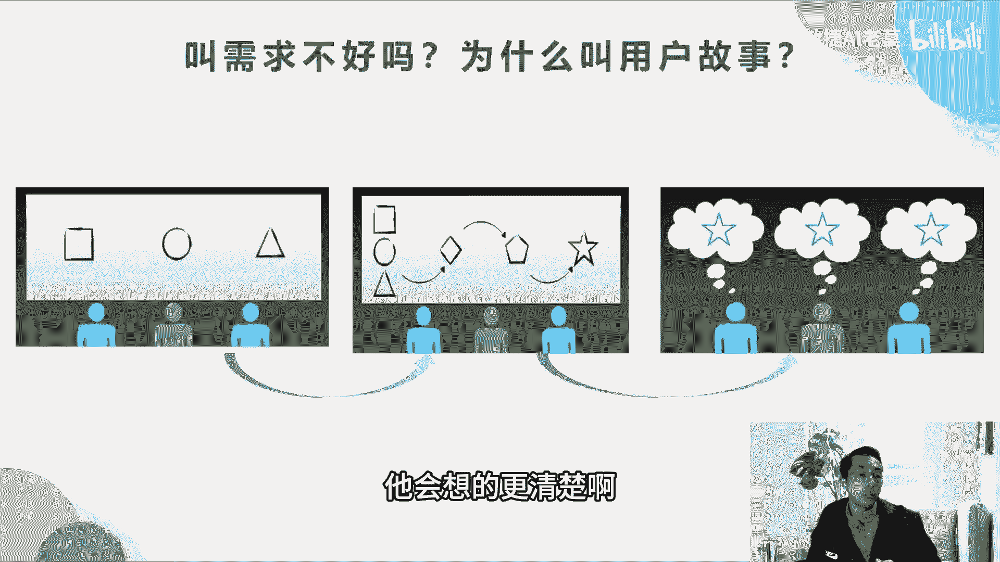

所以叫用户故事啊，OK那么用户故事怎么来，这个用户故事怎么来的啊，不是考点，但是很多老师都没有跟大家说，只说用户故事，用户故事，很多同学他在用户故事的这个过程当中，它其实是YY出来的。

我不知道用户故事怎么来，所以就瞎写，很多产品经理其实学了这个偏僻的课程，他瞎写，开发同学项目经理，他本身他学了偏僻，但是他不了解用户故事怎么来，他也不知道产品经理写的用户故事到底，对不对啊。

所以我这里必须要跟大家去说清楚，让大家学以致用，那么用户故事怎么来，首先第一个就是用户，我们要明确用户在哪里，第二个是确认用户在什么样的场景下，使用我们的工具啊，功能啊，或者使用我们的服务啊。

第三个就是我摸清楚这些用户场景之后，我去用户的地方去调研啊，比如说我们做一个商城，我们模拟一个商超，我们其实是把商超搬到这个线上，我们先明确用户就是张超的这一部分用户，他到底是在哪里。

他是怎么样去选取他的一些，比如说买菜，他怎么样去选取他的菜品的，我们可以去商超调研这些用户啊，你怎么样去找到这个菜品的，他会说超市里面的琳琅满目的东西很多，但是它上面都有一块牌子，标清楚它的品类。

我们再从他的品类去找，我们要怎么样去比比对价格，这些东西你调研清楚了，你自然知道哦，我把这个东西怎么搬到线上去，OK接下来就是绘制用户体验地图，就是用户在整个过程当中的他体验感怎么样，收集到他的体验感。

他哪些地方他觉得体验好的，我们可以做到软件当中，他有哪些地方他觉得做的不好的，就是不方便的，不方便他杂草或者不方便它比价的，我们在软件当中，我们给他提供就是这些我们要找到用户的，通过用户体验地图。

我们要找到用户的痛点和爽点啊，最后找到了用户的谈转点和痛点，这些其实就是用户故事了，其实这些就是用户，不是就是我们将来要做到功能里面去的东西，OK听懂同学打个666啊，就这样来的好。

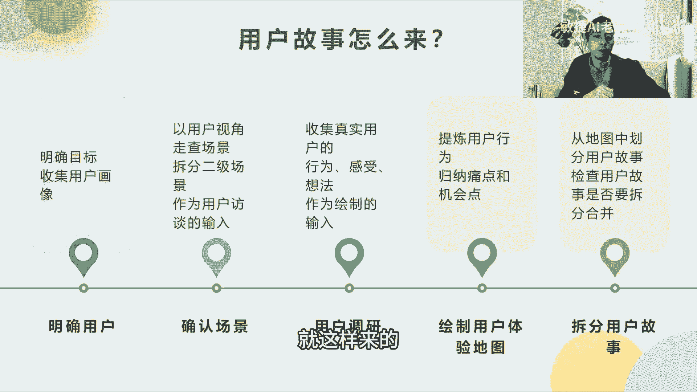

用户故事的属性是什么，第一个就是独立的，独立的其实对应于什么，对应于可测试的独立可测试嘛，每一个用户故事可以单独拿出来测试啊，第二个是可协商的，用户故事可以两个人去讨论，因为他没有面面俱到的文档。

所以需要两个人面对面的去沟通和讨论，第三个是有价值的，就这个是真是前提，第四个是可估算的，那么这个估算其实是什么，就我们前面说了，我们的产品经理对它进行估算，这个估算是自上而下的。

估算是产品经理或者产品负责人来估算的，最后用户故事一定是小的，就是不超过五人天的工作量，为什么呢，我们总希望一个星期他至少要出一个活，我们以一个星期为单位，我们至少要看到一个小阶段性的成果。

你不能说唉我做一个东西，我一个星期也没看到成果，两个星期也没看到成果，等你一个月过去了，你看到成果其实已经晚了，对不对，OK就这个意思啊。

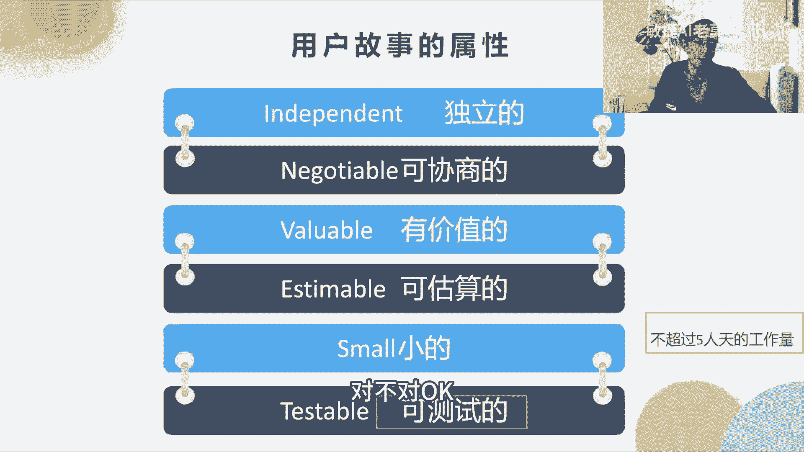

那我们来举一个例子啊，用户故事，那么用户故事作为什么样的东西，就第一个是作为一个玩家啊，这个是啊，王者荣耀，大家玩过王者荣耀可以打个一啊，我看一下有多少人打过第一个，这个是王者荣耀的那个英雄叫韩信。

韩信韩信很早的一款韩信的白龙吟的皮肤，我们这个用户故事，它其实就是展示角色皮肤的一个用户故事，所以说他说作为一位玩家啊，我想要查看这位玩家的皮肤时，能让我看到皮肤的整体效果。

以便于我是否选择这个皮肤特效啊，所以作为一位玩家，他其实是定义了一个用户，我想要看这位玩家的皮肤的时候，其实是他想要的功能啊，你不管你怎么实现，我要要这个结果，以便于我是否选择这个皮肤特效。

选择皮肤皮肤特效，这个是价值啊，是这样的，那么用户故事它除了有这些之外，它还有一个什么叫做验收条件，验收条件是干什么用的，验收条件会对应我们后面，接下来我会跟大家讲的showcase to case。

修case是怎么就是做用户故事的验收啊，我们在评审的阶段的时候，我们讲到评审的时候会讲这个东西，所以这个是一头一尾，我先把头跟大家说了，我们的验收条件先写清楚，那我们验收的时候。

我们就根据这个条件的验收，明白意思吗，这个就像我们拿着合同来验收一样，我先把你条条框框搞清楚，丑话说在前面，我在验收的时候，最后去收尾的时候，我要一条一条看你这个东西符合了。

我就OK我就就一条一条的去验啊，比如说接受条件是当一般的形式是说，当我什么东西的时候，他出来什么样的结果，第一个是当我看到比玩家皮肤的时候，能看到玩家皮肤动态的显示出来，而不是静态的。

当我查看玩家皮肤的时候，我同时能听到皮肤特有的声音特效，第三个是当我手指滑动的时候，我能360度全景的看到这个皮肤的正面，背面和侧面，第四个是当我购买这个皮肤的时候，能够以有已购买的提示。

也就是说我在验收开发同学，开发完的这个功能之后，这些东西他都有啊，我就认为验收通过，如果一下没达标，我就觉得没有通过啊，开发同学要接下来要去改这个代码啊，以实现我的需求功能啊。

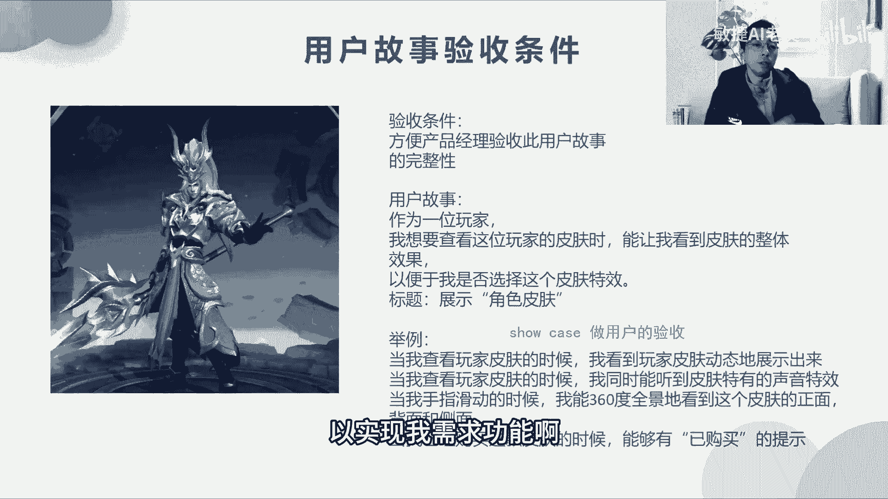

是这样，用户公式，它其实开封的规则其实和那个计划是一样的啊，它是渐渐明晰的，粤语越近的事情就越近的迭代，它拆分得越细越远的它就越粗啊，这样他就不耽误说我们做成面面俱到的计划啊。

因为面面俱到的计划他是经不起变更的，就变更来了以后，你要不断的去变化这个东西，这个过程很繁琐啊，浪费了大量的时间，这个叫浪费啊，OK那么用户故事故事的拆分规则，这个不会考，我就一笔带过了。

合并拆分和抽取共性这三个啊，OK那我们来做一道题目，在一个产品的开发过程当中，团队了解了利益相关方对于产品的需求，并根据需求创建了一张张用户故事卡片，下列哪一项不是故事卡片里面应该包含的信息。

ABCD你们觉得是哪一个，目前来说第一完成的速度对，就这个里面它是没有完成的速度的，但是它的基本的功能都会包括前面特性，已经给大家展示了啊，一颗小星星，答案是D啊，对了啊，用户故事的练习我就不练了啊。

因为这个地方它啊不是考点，说你要作为什么东西，我需要什么，以便于这种三段论，现在已经不考了啊，以前会考，现在已经不考了，优酷故事它有一个局限性，就是他太细了以后，他就其实整个你会发现你对方提的需求。

比如说产品经理他妈提全部提的那个用户故事，那么这个需求它是一个一个好小的需求，那么你就没有一个整盘的东西，当我实现这个用户故事之后，我能够对这个迭代带来一个什么样的大的改进，没有。

所以这个是用户故事的局限性，往往是开发人员整天是忙于去应对它的，整个系的需求里面，而忘记了我整个大盘的逻辑是什么，这个是一件很可怕的事情，就像红红军战争一样，每一场战争里面它又分为很多战役。

你通过这些战役才能知道，整个大的战争的含义是吧，它凑起来变成整个大的战争的一个含义，那如果你这个单点看每一场战役的时候，你其实是不知道他整个战略方向的，但作为最高的军事领导人，他的战略方向是什么。

他到底要做什么事情，如果你是打一场一场战略，你是士兵的话，其实很多事情你是不明白的，所以需要有一个有战略大局观的一个卡片，或者可视化的东西，让大家看得到啊，看得到整个全局，这个全局在敏捷里面。

我们称之为用户故事地图啊。

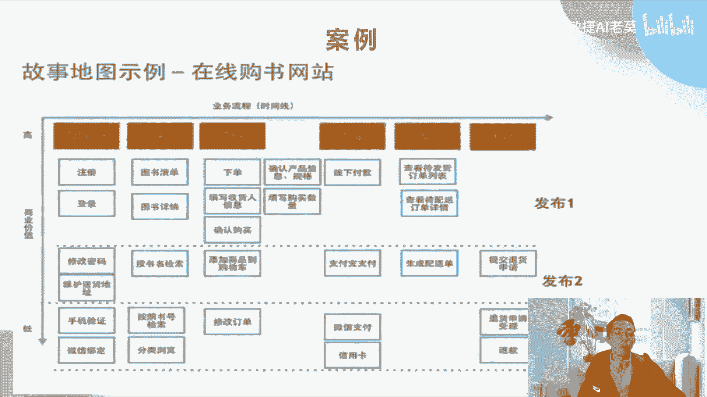

OK那我们先看一下啊，跳过了。

不好意思啊，叫做用户故事地图，那么用户故事地图呢它就是有时间线，有用户活动，有用户任务，有用户故事啊，这个时候这个地方考试不会考，但是他既然说到用户故事，我就大概会给大家一个印象。

说用户故事地图里面有哪些东西，它为什么会有一个全局的东西，大家可以看啊，每一个蓝色的这个框框里面都是一个用户故事，那么我们怎么样去把用户故事串起来呢，就是靠用户故事地图去串起来。

最高的级别在上面的橙色的部分，它其实是流程，就比如说在线购书，它一定有经过管理账户，用户的浏览，用户的购买，用户的支付，用户的配送和用户的退货，他会有这几个步骤是吧，那么在管理账户的时候。

它通常需要什么，第一个先注册，第二个先登录，第二个再登录，第三个修改密码，然后维护送货地址，有手机验证和微信绑定，这些东西它都属于管理账户的，但是哪些事情先做，哪些事情后做哪些事情优先级高。

那么在敏捷的流程里面，优先级高的东西怎么样，它往往会放在最上面，也就是说注册和登录，我们认为优先级它的商业价值是最高的，因为没有它就等于整个功能是没有含义的啊，你连注册登录都没有。

那这个功能就没有含义了，所以注册登录我们认为优先级是最高的，我们就放在第一，就放在发布一里面，修改密码和维护收货地址，它同样属于管理账户里面的，但它优先级没有那么高，那我们是不是可以下次迭代的时候。

我们第二次发布的时候再写完这些功能，对不对，所以你会看到有一个横轴和纵轴横轴，它是什么，用户在整个下单中的时间线业务流程，所以这样才能够确保什么，我们每一次迭代，我们做的功能都是一个闭环，闭环很重要啊。

一个闭环随着一次一次闭环，我们的功能越来越丰富，但是每一次功能每一次迭代它都要一个闭环啊，这里很清楚啊，就是每一次迭代都要一个整的功能的闭环，这个很重要啊，OK听懂同学打个666啊，好创建迪拜事项啊。

迭代办事项我已经说完了啊，我们迭代的启动的阶段已经说了，现在说计划的阶段，那么计划的阶段我们应该做什么事情呢，计划最重要的是什么，计划最重要的就是要产出我们的目标，就所以目标就写在这里啊。

这个就是我们的目标啊，spring目标就是下一个迭代我们要完成哪些事情，顺带输出我们的什么事情的列表，那么这个目标是让这些事情充满了含义啊，那么要做什么事情呢，第一个就是我们需要参与者就是团队科。

master和product owner，一层是我们要去根据优先级排序啊，要去选择要完成的选项，每个人要去认领任务，最后就是为什么要去做这个事情，我们要去了解即将开展哪些内容啊。

大家是不是有足够的信息了，可以去完成它了，也就是说大家是不是已经准备好了，OK好。

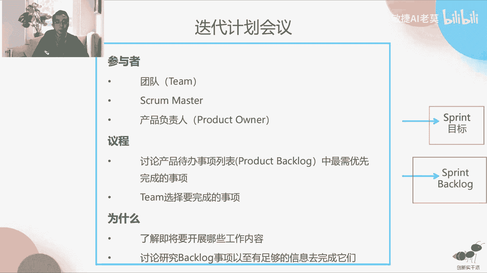

那讲这个的时候，为什么我们要讲到MVP，就其实我们要讲的一个迭代的概念啊，迭代我们每一次做迭代计划的时候，其实就是为了什么，我们每一次小的发布，能让这个功能变得越来越丰满啊，就像我们蒙娜丽莎这个图一样。

第一个迭代它可能只是勾了一个框框架，这东西可以用就好，你能通过第一个迭代你就能看出哦，原来我们其实是一张画，画的是一个人啊，后面还有风景，那第二个迭代，其实我们就可以看到这个人的细节了，对不对。

第三个迭代我们就可以看到后面风景的细节，那第四个其实就是越来越丰满是吧，我们可以看到一些颜色出来了，所以微信就是这么诞生的，我们手机上所有的app基本上都是这样，单身啊都是用的MVP的理念。

最小可行产品。

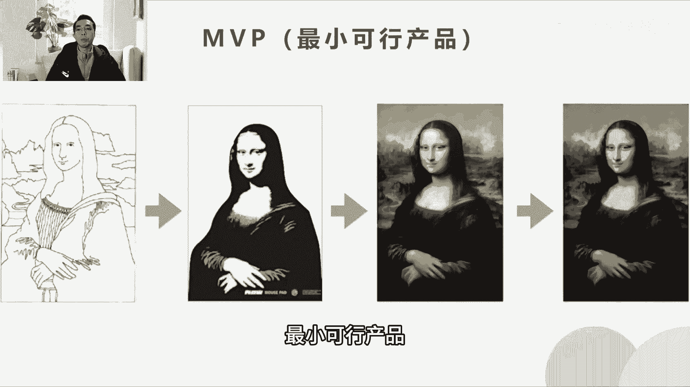

那么最小可行产品这里有道题啊，叫做你的优先排序功能，列表中包含十项产品功能，根据客户的要求，你至少需要提供五个特点来推出产品，那么这些功能被称作什么ABCD啊，大家来回答一下好吧。

你对好单位雅也说B木吉亚也说B对了啊，其实最小可售功能等同于最小可评产品，这两个是一个概念啊，所以正确答案是B可好，第三件事情就是我们在做这个事情的时候，我们需要排优先级啊，在迭代计划里面。

那么优先级到底怎么排，我们其实是根据什么，根据我们的风险和价值来排啊，这个考试里面会考，曾经有考过这样的考题啊，比如说高风险高价值的事情，其实怎么样确定优先级，就先怎么样先把价值高的先做了。

那么第一个要做的就是高风险，高价值，我们要先做了，第二个就是高价值，但是低风险的我们是第二个做，那么后面选项就是两个低价值的东西，我们怎么选，怎么排序，那么高风险和低价值，其实我们不用选。

不选它价值又低，风险又高，所以我们先不管，等它的价值慢慢随着我们的战略不断变化，它的价值提高了，我们再管啊，最后去处理什么低价值的，低风险，低价值的东西啊，所以把这个概念记住就好了啊。

好整个价值我们怎么鉴定啊，我们首先说了价值和风险的关系，我们再来说价值怎么定啊，前面上一节课其实跟大家说了啊，就是我们用莫斯科法则就念P0，P 1p2 p 3p4，这里的优先级是由谁来决定的啊。

考试会考，所以我画了红色的P定的PO拍板，大家可以去讨论，但是在争执不下的时候，是由PO来排版的，话事人啊，一个团队必须要有一个话事人好，我们来做一个练习，亨利运用莫斯科技能。

来了解客户要求的每一项特性，这里的莫斯科是以下哪一项的例子，ABCD好，轮到你们发挥的CD终于有不同的答案了啊，我就知道这个题对于大家来说是有点难的啊，有选C的，有选B的，正确答案是基于价值的分析技能。

它是一个优先级排序的技能，但是它的基座是什么，为什么要排P0P1P2P3P四，它是基于价值的啊，所以这个是一个排序的技能，但是它的基座是价值啊，所以A其实是对的啊，正确答案是C好。

那这个地方就是我们在整个迭代计划，当中的一个举例啊，大家回头可以去看一下我们的PPT，这里就不说了啊，参与者议程我们都给了例子啊，整个迭代的目标也给了，OK迭代整个分成两个部分啊，迭代计划分成两个部分。

第一个是啊，迭代计划，会议，是，我们现在第一个就是要DO来去解释一下，每个故事啊，他要去讲这个用户故事是什么，一个场景是什么，因为只有PO能讲的清楚，他巴拉巴拉说了一堆这个场景，大家根据他这个场景。

我们能定出一个什么叫做我们的目标，里面的每一个故事其实他都已经写好了啊，故事里面的任务是由我们整个团队来拆分的啊，第二个就是我们每一个团队呢，我们要给PO他写出来的用户故事，怎么样估一个时间点啊。

比如说3point它就是三个啊，故事点它可以是人天也可以啊，不是人天，待会我教大家怎么样去用什么单位去代替，不是人天的，叫故事点好，那么这个故事它最终要转化成什么任务啊，为什么故事要转化成任务。

因为很多现在做开发的都是前端后端分开是吧，比如说我们酒店的房型，可能我们前端需要做几天，后天后端前端展示需要做几天，后端我们要做几天，那需要分开这一件事情，就相当于这个事情是给多个人去做啊。

这个能听得明白，就像说我们要做一台晚会，他不可能是一个人做的，那么要做一台晚会，小明要做什么事情，他要做多少天，小华要做多少天，这个晚会的整个工作量，它就是啊注释点这个意思啊，OK第二步。

其实我们就是做做的这个工作，就是做工作量的拆分啊，拆分到每个人啊，这个事情好，这个用户故事呢，这个需求呢我们还要进行怎么样，需求要进行拆分的时候，我们要有几个需求的澄清的过程有四个啊，这个考试不会考。

了解一下就行了啊，第一个是内存，就是讨论这个APP，哪些必须出现在V1。0上，第二个是初审，就是让技术同学来评估这个事情能不能做啊，有一些你可能产品说的天花乱坠，技术说我做不了，这个也白搭。

基础同学说先来看一下，我们再来几个同学说能做，我们要找个时间，提前让技术看一下我们的需求文档啊，做完这些事情以后，最后我们再约定一个时间进行终审，所以经过这四部，为什么要经过这四部，经过这四步。

你的需求文档会慢慢的被打磨得越来越好，获得大家的承认，不然的话，我有很多次我参加产品的需求研讨的时候，很多次都是没说清楚，就直接终审，直接干到第四步，最后出来的结果是什么，就是开不下去。

你这个需求文档有很多问题，你在评审的时候开发说这个无聊，这个我也做不了，这个就没法再开了，那就跟着产品说，你之前你没有有没有调研过，我们的系统到底是怎么样的，我们的系统没有。

这个功能你要去做这个功能的话，这个不是短时间内可以做的，这个我们做不了，就是这么残酷啊，所以我们为了提高终审的效率，所以我们要做前面这几个事情啊，OK做完这些事情以后。

我们估算估算就是前面那个什么3point，这个some point到底是怎么来的，其实估算啊它是一个相对的估算，那么在敏捷里面估算它不是绝对的，比如说几轮天，那是绝对估算啊，这里的相对估算什么。

比如说我们用系数列斐波拉契数列是什么意思，就是从第二第二个数字开始啊，前两个数字我从第三个数字开始，前两个数字加起来等于第二等于第三个数字，也就是说这里一是怎么来的，就是0+1=1对吧，1+1=2。

1+2=3，3+5=8，所以这样想啊，8+13=21是吧，13+21=34啊，这个叫斐波纳契数列，为什么要用斐波纳契数列，就是因为工作量越大的事情，我们估的越不清楚啊，我举个例子啊。

你要你去估计你们家的这个房子楼层有多高，你能估出来是吧，你说大概2米八是吧，大概3米5，你可以估得出来你的孤岛的位数，基本上是那个的是零点几，零点几米，你都能估出来，为什么。

因为它这个东西角的工作量密度比较小，大家好，我现在要你来估一下小蛮腰有多高，你可能说哎这个小蛮腰，我我不让你去网上去查啊，小麦有多高，你可能估的话，你就三四百米，那你这个估算是以什么为单位。

是以百米为单位，三四百米，300或者400，那为什么会造成这样的事情，你为什么在估计你自己的楼层的时候，是以零点几米为单位，而估算小蛮腰的时候是以百米为单位的，因为越大的东西你估的越不准啊。

越小的东西估计的越准啊，所以我为什么我们要把用户故事去拆小，因为大的东西你估准了没有意义，你花很多时间去估没有意义，所以要用这波拉契数列啊，OK那所以它的工时啊，但是它的尺寸啊。

我们有些是用什么叫做依序法，T恤估算法，T恤估算法就是根据T恤的码数来，因为人呢其实每个人身高身高胖瘦都不一样，但是你买T恤的时候，他通常就给你几个尺码，把所有的人怎么样，都能够包含在这些尺码当中啊。

它其实尺码的估算，它其实就是一种什么叫做相对估算，绝对估算是什么，就像你说我要定做一件西服，这个就是绝对估算，因为定做西服是根据每一个人的高矮胖瘦，你的身材，你的肩宽，你的臂长啊，你的腰长。

整个量身定做的啊，这个叫做绝对估算啊，听懂的打个666啊，这两个概念是不一样的啊，OK这一些相对估算，我们的这个投影就是我们的故事点，它怎么估算的出来啊，我们有这几个判断的标准，第一个是我们的页面数。

也就是说如果你是做网站开发的，做网站开发的，那么你这个功能你要用到多少个界面啊，比如说我的登录功能我要用到多少界面，比如说第一个我们可能是一个登录界面，第二个我们之后登录完了之后，当然是跳转的。

他可能密码找回，密码找回有几个页面，可能密码找回有三四个页面吗，还有验证码登录要做一个页面是吧，那这个新页面就三四个页面，比如说四个页面加一个页面，加一个页面等于六个页面。

那么这一个页面我们称为一个故事点，那么六个页面它就是六个故事点，所以说我要做一个登录的功能，我必须要做，还要你估算的时候，我说登录六个故事点，因为大概六个页面啊，是这样的东西，还有一个标准是什么。

操作数据库的次数啊，有一些用要用接口的次数，也可以用来去估算页面啊，比如说我的这个登录还用登录举例啊，这个登录它可能要对数据库进行几次读取，如果你要修改密码，可能你要对数据库进行一次插入，要去更新。

那么这些更新这些读取它需要读取数据库，都要读几次，如果读五次，我就是五个故事点啊，就操作了五次，对数据库操作五次，最后有一个完成操作的步骤啊，其实这三种估算方法啊都可以，就看你团队习惯雨伞选择哪一种。

最后就是用户涉及到几次操作，比如说退款需要四步是吧，客服啊，申请提交资料，客服审核完成退款，这四步它才能够做完，那么这四步一个业务的步骤，我们称为一个故事点啊，所以这个故事点的基准值就这么找的。

OK听明白的同学可以打个一啊，OK前面可能我们为什么估3point，就是我们前面说的那个功能，它是有三个页面，刚才举例的时候是用页面数来估的啊，OK就这个意思，所以三种方法我都教给大家了啊。

但是这个考试不会考，这是平时我们自己有疑问的时候，我们应该怎么去做啊，那么这个估算通常是我们团队共同估算的，那么共同估算的好处就是就达成一致，就不像以前我们估算的时候，可能一个一个领导拍板了。

说哎这个功能你就做三天时间，其实对于领导来说，那个功能可能很简单，三天做完了，但是如果这个功能功能给你来做的话，你可能需要5~7天，可能有些人做十天，对不对，你如果说引导说三天，你就三天。

这个最后就被倒带锅里去了，所以还是要相信你真正要去做的那些人，他们的估算，那为什么不是单个人的估算，因为单个人他对这个东西经验不足，团队有些人做过这个功能，比如说有些人做过登录这个功能。

他就会给你一些建议了，我们达成一致，安装功能原来是这么做的是吧，我们其实公司里面已经登录过功能，已经有一个框架，我们只要调用这个框架就行了，就很简单，就不需要这样的，那么我们理解这个东西呢。

那么登录功能我们调用的话，只需要一天就搞定了，就这个意思啊，所以共同估算有这样的一个好处，所以在考试的时候，他一定会考的一个东西，它会有一个场景，是领导估算这个东西是不是由领导决定啊，如果是由领导决定。

你那个选项你就不要去选啊，你要选估算的人，他来去决定，或者说他跟大家共同决定这个选项才是对的，第一个就是共同决定啊，第二个如果没有共同决定的选项，他自己来决定，这是对的，千万不要选领导决定啊。

海尔和他的团队进行一个用户故事啊，估计属于平均开发难度定为十个价值，现在卡尔和他的团队必须估算待办事项中，其他用户故事的相对大小或者工作量，那么这十个价值最可能至于哪一个单元，ABCD啊，你们来选一下。

接下来的时间交给你们A啊，30选AB，OK好哦，我说一下啊，他又改了这D是吧，价值一定是附庸在故事点上的啊，这两个是对应的啊，价值跟功能这个功能点这个不是匹配的啊，他一定是故事点啊。

OK很多故事点才构成一个功能点啊，是这个意思啊，好迭代计划的讨论时间啊，这个就不说了，就基于流程的敏捷，基于迭代的敏捷，基于迭代的敏捷是怎么样多次细化两周时间，用四个小时的时间讨论时间和讨论，以前考过。

但是现在不怎么考了，你大概记一下啊，就考了，大概记一下就好了，这个里面没有什么太多的要去学的啊，每日账户啊，每日账户也是一个重点啊，每日账户要做的两件事情，第一个是同步进展，第二个是暴露问题啊。

千万不要选解决问题啊，解决问题你在15分钟之内，你是不可能解决问题的，你只要记住这个结论就行了，好大会三言，它是一个标准的赞会三连，但会3年前两个都是同步进展，上一次战会以来我都玩都完成了什么事情。

第二个是从现在到下一次展会，我计划完成什么，都是在同步进展，最后我的障碍后风险是什么啊，这个就是暴露问题啊，所以在战会当中，我们需要的是团队自组织，比如说团队两个人因为技术问题吵起来了，在会上。

那么作为敏捷教练的，你要不要出手，不要出手，题目往往会这样出，你千万不要选择，你要去出手去干预这个事情，如果他们是因为项目管理问题，这个时候你出手，就比如说他们对流程每个人有不同的看法。

因为项目管理是你的领域，你要出手啊，你作为敏捷教练或者项目经理，你要出手，技术问题千万别出手，就算你以前是干技术的，你也不要去出手啊，不要忘了你的角色，很多题目以前就考过这样一个坑。

就是你以前是干技术的，现在他们在晨会上遇到一个问题，作为一个技术的你，他们想寻求你的帮助，问你要不要去干预，如果你选了甘雨就错了啊，OK好字眼我们就不看了，因为站会自研，不考上会的最佳实践，最佳实践。

这是人工具和方法，大家记一下哦，不是记一下就看一下，稍微看一下哈，这个也不考啊，鸡和猪的故事，这是一个寓言故事，他其实也不考啊，上一节课其实已经跟大家说了，鸡和猪烤一去搞一家餐厅去卖鸡蛋和火腿。

猪其实就不干了，因为他是直接利益者啊，鸡蛋鸡他只是一个什么指挥者，或者是说利益不大者啊，进度同步，我们在这个大会的时候啊，通常需要有一个进度同步的，我们叫做看板，就上节课我们讲的看板的东西啊。

那么看板就长这个样子啊，那谁来做进度更新啊，整个进度更新谁来做这个看板，谁来更新，是一项目经理，2PO还是三团队，你们觉得是哪个啊，你们可以打出来啊，一还一还是二还是三啊，123你们选哪个。

三对敏捷是要自组织的，自组织每个人去更新每个人的工作啊，就可以了啊，OK很好，但会纪要这个大家看一下就有个印象就行了，大家账户还是要有一个东西来记一下，记一下的啊，OK谁来做账会计较啊。

这个就直接公布答案了啊，上会纪要是谁来记，SM来记啊，或者项目经理来记，或者是敏捷教练来记啊，做这个事情，南京图我们站会除了看板之外，还有一个图啊，它是一个这个叫做数据分析的一个图啊，叫做蓝进图。

南京图三是什么，就像一张图一样，它是有一个虚线和一个实线的，这个蓝色的虚线它是一直往下走的，你看见没有，这个虚线是你啊，理想情况就是一直往下，这个直线呢它是歪歪扭扭的，一上一下一上一下的。

这个线是实际情况啊，它是根据什么，根据他的完成的情况往下走的啊，这整个整个图的横坐标它是时间就随着时间，纵坐标是什么，是他的完成的任务或者工作量，完成了任务和工作量，它是往下走，他肯定会一直往下。

一直往下对不对，越来越少，但是它在虚线上面就代表什么，代表他的任务延迟了啊，他一直在曲线上面代表延迟了这个地方，它往下走的时候，到了这个地方的时候，它其实是什么进度赶上来了，这个是比较乐观的啊。

进度赶上来了，所以蓝镜图的好处，它上面虽然没有的任务啊，大家记住了，蓝镜图上面没有任何的任务的说明，也没有任何用户故事的描述，它就是简简单单的一个数字的图，但是这个数字的图呢。

通过这个图我们可以看出来我们的项目的进度，我们是乐观还是不乐观，会从上面看出来这个是蓝镜图啊，还有一个图叫燃起图，燃起图跟拦截图刚好相反，它是往上走的，那么往上走有什么好处啊，他其实你发现没有。

他就没有基准，他是没有基准的，他也能够跟踪进度，但是他关注的是什么，他关注的不是进度还剩多少完成啊，他关注的是进度总体完成了多少，他关注的是信度的完成不剩余的啊，说错了啊，蓝进图就前面这个图。

这个绿色的图，它关注的是任务的剩余，就剩下来还有多少，然企图关注的是我总共完成了多少任务啊，所以这两个最大的区别啊，大家完成了，我再总结一下燃尽图，它关注的是未来，我在这个节点，未来什么时候我才能完成。

剩余的是多少，其实它是在于未来看未来蓝企图，它是看什么，过去过去的功绩，过去我完成了多少东西，它不能够预测，我只能看过去我完成了多少东西，比如说我还有几种状态开发完成测试完成范围。

这些东西过去我完成了多少啊，这是对我过去的事情的一种总结，这是他们俩最大的区别啊，谁在做南京图，做南京图的人，如果你有系统系统来做团队更新，团队就已经做好了，这个拦截图，其实就已经更新好了。

如果没有系统，那就是SM来做啊，就是敏捷教练来做这个事情啊，这不管的，因为PO他管的是结结果啊，那么除了软件图，团队还需要有一个既定的节奏啊，团队的节奏它是长这个样子的，团队的节奏有什么好处呢。

你周一周二周三周四要做什么事情，你一目了然啊，比如说周周五，比如说这个图里面，我们可以看出来周五我们要开周会，每一周五我们都要开周会，那么这个代表什么意思，就是团队能够保持步调一致啊，发布是多少号啊。

我们开会要多少号啊，这个也给团队一个警醒，你如果你不是生病，不是一些紧急的事情，比如说你可能请个试驾，要去办一些什么事，要去预约去办，怎么搞澳通行证啊，或者是预约去办一些什么证明呢，去银行去办一些证明。

那么你预约的时候就不要预约到周五啊，因为周五我们想起来哦，我们原来有一个整齐的会议，每周五都有啊，这个写在团队节奏里面，你就可以错开周五去安排其他的时间，保证大家在一起，这个就不耽误整个团队的工作啊。

所以团队节奏，他在这里把团队的节奏去通过发射源啊，通过发射源，有些也就是说项目整整个图他能够说明清楚，其实是对团队的是一个很好的好处啊，那么除了这些，还有一个团队的日历，日历有什么好处。

其实日历大多数都是用在什么跨团队的项目啊，比如说我是做手机的，我是软件团队和硬件软团队，我们需要联调，那么我们就可以商量，我们我们的联调时间在什么时候，我们一起把它更新在团队的日历上。

让两个团队的人都能看得到，原来明天就要联调了，我们今天一定要把这些活干干好，我们软件团队要把软件的事情干好，硬件团队要把硬件事情干好，明天才能够一起参加联调，如果我们可能要延期，我们要提前去通知。

去知会别人，这个也是对对方的一种尊重，你不要说明年年调了，你说要联调了，我我还没搞好，你怎么不早说呢。

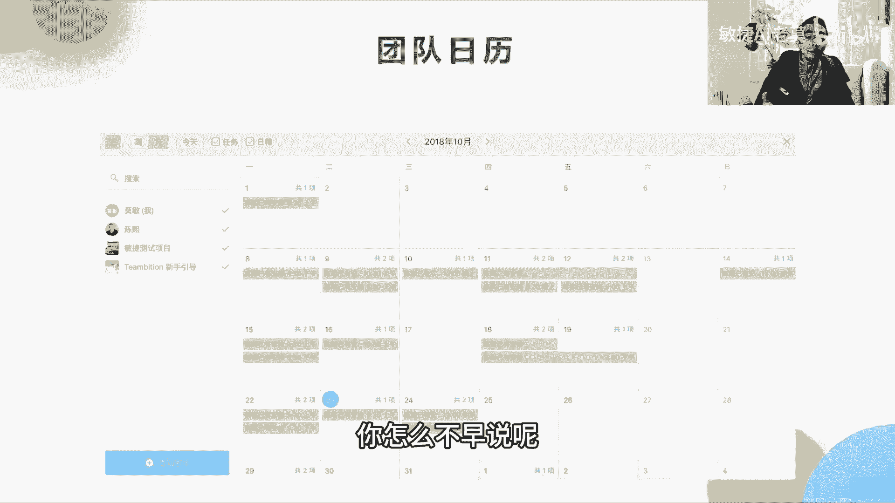

你其实可以早说的，团队日历其实是做这个事情啊，哦还有远程协作。

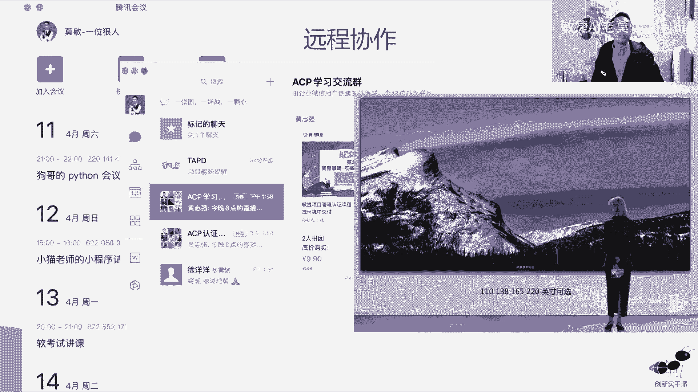

我们团队需要去通过各种手段去远程协作啊，这个就就大家都很清楚了，就不说了，好敏捷测试，测试这一块我就一笔带过了啊，因为敏捷测试它不是考点啊，大家如果有兴趣，你可以去看一下啊，你可以去看一下。

它是用例评审，这个也不是考点，我只说一点测试，用例评审它其实是要放在测试之前，做，测试之后或者测试的过程当中，再做用力评测就已经晚了啊，就没有任何意义了啊，好需求变更是一个大的槽点啊。

不管你是在传统项目管理还是敏捷里面，都会考变更的来源，它通常是来自于市场变化啊，老板的需求或者是线上问题的一些紧急处理，他会做一些事情对吧，那么以前我们的需求变更它其实是什么啊，我们的CCB来处理。

那么现在敏捷的需求变更，他其实就是团队下放到团队来处理，所以你作为项目经理，或者是说作为敏捷教练，你第一个是要调整团队的心态啊，让团队知道啊，我们拥抱变化是一件好事，证明我们够敏捷。

我们能够应对灵活的去应对现在市场上的变化，这个是一定要跟团队去声明的，第二个是分析的变更啊，第三个是应对变更重定计划，这个谁都会啊，但是第四点很少有团队就能做到，就是变更的回馈。

比如说这一次老板说这个功能要改，那么改完了，你发榜了之后有取得什么样的效果吗，对吧，没有一点的效果，那么团队就会失去信心，你哪怕有一点效果，你也能拿出来跟团队去说，老板你看老板提出了这个需求是吧。

他觉得这个这个东西能给他带来一些收入，你看现在这个版本发了以后，确实我们的收入带来一定的提升，正向反馈就一定要给到团队啊，那么团队这一次收到正向反馈以后，他下一次再做需求变更的时候，他就会充满力量啊。

不然的话他就觉得哎，这一天一天天的就是搬砖的，那肯定也不行啊，好那么敏捷实践现在来到了周围篇啊，收尾展示和评审，那么展示和评审有啥区别，我们前面也学到了用户故事，它有个验收条件，验收条件。

验收每一个用来验收每一个用户故事，一个验收故事的验收，一个用户故事的验收，我们称之为showcase，所以修case它其实是用来什么加强开发自测的，因为开发的每完成一个用户故事，它会让我来验收。

而当我来验收的时候之前，他肯定要自己先自测过啊，不然他自己都没有自测，他就要我来验收，我验收出了问题，他是不是就打脸了，对不对，当场打脸，第二个是每完成一个用户故事，其实是我们前面说了。

用户故事的工作量是怎么不超过50天，也就是说，他一个星期总有让我去验收一次需求的可能性，所以我当我在体验这个需求的时候，或者体验这个用户故事的时候，我发现这个出问题了，当场就改掉。

这个能够降低我们的修复成本啊，不要等这个东西集成了之后再来改，那成本就高了去了啊，就像我们造车一样，造汽车一样，对不对，那我们造一个汽车，本来他只有一个轮毂出问题，那我们来修复这个轮毂。

你如果能够通过我的一个单元测试，我就能发现这个轮毂问题，我就就单独去修这一个轮毂，它是非常简单的事情，对不对啊，你就把那个轮毂修好了，但是你当这个轮毂装装到了这个汽车上面之后，你再来开开的时候。

你感觉这个汽车好像有点不对呀，这个汽车走的时候好像有点震动，比较大，比较耗油，到底是怎么回事，再去查找到底是转向出了问题，轮毂出了问题还是底盘出了问题啊，最后通过一系列的东西定位到这个轮毂问题。

是不是你的修复成本就很高了，对不对，修复时间也得不到保证，所以修case r这样的测试就相当于单元测试了，所以它修复的成本就会比较低啊，OK所以他为什么要一个故事就测一个，一个故事测一个。

他就是为了保证怎么样啊，修复的成本，所以参加show case的人员都是内部人，你发现没有，都是内部人员，不管是开发产品经理，一测试还是项目经理，他都是内部的人啊，所以它的步骤是代码完成之后就自测。

让团队的验收啊，验收不通过立马改来验收啊，改完就OK了，所以他就比较灵敏，比较灵活，比较快，它每一次时间只要两两到3分钟就搞定了，其实你一个小的动物故事，其实也没有多少的弹幕，也没有多少工作量，你说了。

武则天的工作量能有多少，一下子就体验完了啊，不讨论细节，那么评审不一样，评审是把本次迭代的功能全部集成起来，再去验收啊，这是一次大验收，所以有一个小验收和大验收的区别，那么评审的目的。

其实主要目的是用来去用客户满意，这一次发布或者这一次其实不发布，也是要这个功能这个阶段完成啊，这算一个阶段完成的事情，它还能够防止团队方向错误，也就是说这次迭代完了之后，你即使不发，你让用户体验一下。

你也能让用户找到问题，你如果发现了方向错误，用户说哎呀这个根本不是我要的，那么你就立马能够知道原来啊我们的方向错了，密码可以改，你如果一周一个迭代，那你一周就可以调转传统，比你说几个月，我瞒下来。

搞完以后，客户说这不是我要的，那你要改，那不叫死人了，对不对，OK这个时候参加评审的人就会有很多啊，开发测试，产品经理，项目经理，那除除此之外，还包括客户啊，所以评审它的范围就更大一点，更大一点。

他要邀请相关人员去参加，还要去正式的开发布会一样的去演示啊，什么东西对吧，让各个评委去提出评审的问题，产品产品经理说这次能不能验收对吧，最后我们要探讨下一轮迭代的内容啊，这个会考第六点的时候考试。

原来考过，我们这一次，本来我自己可能作为一个新能源汽车是吧，我发完这一个，我做完这个车，这个车的发布会，我开完之后，我可能在这个发布会最后我会想，未来这个汽车会有什么样的功能，比如说它可能自动驾驶。

自动驾驶现在是L2级别，未来通过这些硬件啊，我们这个硬件很强大，它能够未来支持L3的自动驾驶，那么这一个饼，其实就是我们下一次要做的这些迭代内容，这个是要为什么要去这样做，这个是加强你跟用户的信心。

第二个是你保证你的方向没有错，比如说你说了这话，你说哎呀，我们造二啊，自动驾驶，我们现在已经实现了，下个版本我们将会升级L3，用户说不要没什么卵用，那么你从用户当场的这一个反馈，你就能知道哦。

可能我们的方向是不是出了问题啊，我们是不是要调整，我是打个比方啊，OK评审的要点时间就是两个小时啊，要点是探讨下个迭代的工作，就最后一步啊，这个事情一定要大家不要不要忘记了啊，好我们来看啊。

敏捷团队正在为客户升级一个软件系统，那在第四个迭代周期的迭代评审会上，团队成员对完成的工作进行了演示，但是一名相关方抱怨该软件更新后非常难用，若要避免未来出现类似的情况。

你的团队应该怎么去做ABCD4个选项，你们来选一个啊，有选B的，有选C的啊，OK这个题是考考试的原题，之前考过这个题，我故意拿出来说，因为我觉得这个题目比较有代表性，错的人比较多，如果一个用户反馈。

因为我们在这个迭代演示的时候，其实客户是会使用的，反馈这个东西非常难用，那么他觉得难用的时候，我们要做什么事情，我们要看原来的题目，原来的用户界面是怎么样的，他是怎么样使用它的系统，为什么觉得难用。

那可能是他习惯了他的系统，习惯了以前的体验，所以你改了以后，他觉得难用，但是我们不能够下结论，所以我们需要当他使用原来的啊，说一下原来的有什么好用，我们再综合判断一下是不是是不是要改。

所以答案是CK回顾也是结束的回顾，其实我们又叫关门会议，我们现在把客户请走之后，我们本来是要邀请客户来体验，体验完以后我把客户请走，请走了之后，我们再来关起门来，去回顾一下。

我们自己在过程当中做了什么不足的东西啊，我们应该怎么样团队定期的反思，我怎么样让团队进一步提升啊，这样的一个方法啊，回顾的目的其实啥，所以他是重过程的啊，结果已经搞过了，那好回顾费的时机有几个啊。

完成一个发布或者加入一个新的功能，很久没有回顾了，我们可以回顾一下，出现外网故障的时候，我们可以回顾一下，以及团队他出现工作不差的时候，我们就回顾一下，有一本书叫复盘，里面会说到这个跟大家推荐一下。

回顾的过程其实就是有三部啊，整个回顾的过程我们都需要记录下来，记录记在记记在哪里啊，记在一张纸上啊，这个纸其实是上面有一个笑脸，一个哭脸，每个人至少要写两张纸啊，你要写满一个笑的，一个哭的一个点。

你发现在这个项目上做得好的一个点，你就写一张笑的里面，如果你发现游戏做得好的两个点，你就分别写在两张笑脸里面，那同样的这个项目，如果有两个你觉得不好的点，这个项目做的不太好啊，有两个点我发现做的不好。

那么你就写两张哭的纸啊，就这样的，我们用这种讨论的方式把这个纸啊，笑的纸和哭的值这些选项去归类啊，类别最多就提到的哭的纸越多的那些类别的，就是我们接下来团队大家都意识到，要改正的问题。

这个就是我们怎么来分辨我们要改的，这改变的改改的一些事情的重要级，重要级和一级啊，优先级这个就是这个啊，好OK这个过程就是啊展示数据做的好的，做的不好的要改进啊，这个啊这个是整个过程啊。

目前还是刷过刷过这题啊，很好啊，回顾数据啊，数据就是质量统计啊，这些东西我们都要去回顾那个版本，引发了多少缺陷是吧，有多少个bug是吧，我们这个要还要计算团队的速率啊，团队的速率是什么意思。

我们这一支团队能够完成多少的，这个叫故事点，你把所有完成的功能加起来就是故事点之和，那这个故事点有什么用呢，我们下一个迭代，我们是不是要做多少事，就是用这个故事点，我打个比方啊，我们打炉啊。

我们这一个需求池在这里，需求池在这里，那么我们在这个点这一次迭代我们完成了，我们当时从这个需求池里面选出了四个任务，但是这个迭代里面我们只完成三个，那么我们完成了三个。

这三个就是我们的团队实际的速率十六十六，而不是18啊，因为18这个没完成，那么剩下来的就比如说85232，就是这一次我们完成了这个东西，就是在这里8532，那么接下来下一个迭代，我们能完成的。

实际的就是我们计划要完成的这个速率是多少，应该是16吧，因为18你都玩不成，所以下一次其实团队的力量，就只能完成16的工作量，那么我们就能不能完成，就要看这个东西加起来，剩下的活是不是都能完成。

就要看这个加起来是不是等于16啊，比如说5+3加3+2对吧，这个3+2=5，五加五等于十十三，13+2加上这一个迭代没有完成的，我们一起完成13+2=15啊，所以剩下的我们就只有15。

那么剩下15它其实是可以玩的成，也就是说如果没有需求插入的这个过程，没有再有新的需求插入的话，照道理来说，我们下一个迭代，我们的团队的速率是16，它就能够完成现在所有的需求了。

OK那啊假设这个数字是18啊，假设他是18，请问他下一个迭代能不能完成所有的工作，团队啊，虽然啊我直接说答案，这个答案是不能完成，因为我们实际的团队的能力只有16，虽然我们当时估算团队的能力是有18的。

但是实际我们看看起来18是完不成，只有16，所以他下一次如果又插入了三个工作量的工作，我们其实是完不成的啊，所以这个18是我们完不成的工程量，就不要写在这个当中了，对不对，OK就这个意思啊。

听懂的同学可以打个六六啊，OK好回顾的最大的要点就是一定要闭环，问题要闭环，也就是说回顾我们不好的地方的时候，我们一定要怎么样，要有解决方案，并且有负责人，负责人定好之后，项目经理要去跟进负责人。

他的完成的情况一直要跟进到问题解决为止啊，不然的话大家一起讨论出来，我们要改善的ABCD我们说了四个改善点，然后大家又完不成，有什么用，改善点不在于多，可能我们这一次可能提了十个改善点啊。

我的意见是说十个改善点，我们最好是完成三个改善点，其实就行了，每一次慢慢的改善，但是这三个改善点一定要落实完成啊，你不完成下一次还是这十个改善点，大家都都没有动力去改善了，久而久之。

整个团队就不会再有改善了，OK啊这个问题闭环是非常重要，考试会考啊，一定要跟进到问题闭环就是每一个问题，你的解决方案必须要有时间，就是最后的完成时间啊，你这个解决方案什么时候能给我完成啊。

你说年底年底什么时候，12月31号好，那12月31号就得完成，就要去跟进，那么负责人也需要啊，张32月31号一定要给我完成这个问题，项目经理就每天给我每天更是这样啊。

那回顾机要它的一个表格就是这个意思啊，大家有个印象，说回归纪要到底写写长什么样子，就长这个样子啊，就你做的好的，有序号事项，说明做的不好的负责人和完成时间，这个一定有啊，做的好的就表扬就可以了。

做的不好的就是负责和完成时间啊，就这样的，OK好，这下面又来做一道题啊，公司决定采用敏捷的项目管理方法，然后敏捷专业人士，在向团队去介绍敏捷工作流程时，部分团队成员对于迭代回顾的会议的目的，表示疑惑。

那么敏捷管理专业人士给的最恰当的问，答的回答是什么，ABCD4个选项，你们选择哪一个，这个其实考的是啊，回不回，其实我现在在锻炼大家的解题能力，目前果然是个学霸啊，你这次考试稳啊稳啊，稳了A啊。

帮助团队检视自身并适应啊，OK好，那这个其实已经讲完了，我们整个敏捷的过程其实已经讲完了，接下来就是讲到一些概念性的东西啊，基于迭代的敏捷，它其实要讲的就是我们团队的第一个，效率高和低，效率高和低。

A团队和B团队哪个团队的效率更高，能不能得出来是A还是B还是得不出来啊，正确答案是得不出来啊，为什么得不出来，我前面说了，每个人团队的情况不一样，你的所估算的故事点的基准也不一样啊，有些人是用页面来估。

有些人是用业务的逻辑来估，有些人是对数据库的访问次数来估估，这个故事点，那标准都不一样，就像我去拿那个尺去量一样，你你用尺去量量那个什么，这个物体的长度有多长，有些人是用啊厘米啊米啊。

有些人是用用厘米的这个尺啊，有些人是用什么英寸啊，这些度量单位都不一样，你怎么去量啊，量不出来，对不对，所以这个是得不出来的啊，OK迭代速度能做做对比的也得不出来。

因为迭代速度其实你说A团队的迭代速度更快，比团队的迭代速度更慢，那么人家A团队他是老手啊，他磨合了很长时间，你B团队他是新手啊，或者是说A团队他是，他是和B团队的能力是一样的，但是A团队他接到这个活。

他以前干过B团队，这个活是新活，没干过也不行，对不对，那么到底怎么行啊，所以他就得有一个结论啊，我们要根据这几个指标一起去得出来啊，第一个是速度，第二个是质量，第三个是价值。

那么我们要根据这三个维度来看，怎么看我们当时的这个PO看重什么东西啊，看重团队的什么绩效比重，然后再根据不同的绩效比重去打分，加一些权重来去比较跨团队，他的一些工作绩效来去判断啊。

所以在过程的过程的当中，你去判断不同的团队绩效是非常难的一件事情，你在这些值上要加权重啊，在这里有一篇幅问题，我们就不跟大家一一展开了，因为这个地方不会考啊，作为我们的敏捷知识里面。

我们当然要去学通这个东西，但是对于应付考试来说，这个是完全不考的啊，我们就先带过了啊，因为我们还是要有侧重点，那下一个迭代的速率是多少，前面其实已经跟大家说了，下一个迭代的速率。

其实取决于我们实际的团队速率，而不取不取决于我们的估算速率啊，所以不取决于我们的估算速率啊，取决于我们的实际数据，常见敏捷的法模式，你看第一个是专注于完成任务，而不是交付价值，完成任务。

它不是敏捷的模式啊，所以它是一个法模式，完成任务是什么预测型的模式，或者叫瀑布开发的模式，那B就是我们已经足够敏捷，我前面也说了，你不要去放弃每一次能够暴露问题的机会，这会是一个最好的暴露问题的机会。

第三个是不做回顾啊，其实已经做的很好了，回顾要不要做，如果你想要团队持续提升，那么回顾是一定要去做的，就像一个人啊，你过一段时间你要写一个总结啊，你不能说我每次我都是低头去做事，做事做了很多事。

回头一看今年我做了什么，我每年其实年终的时候我都会回顾一下，说我们今年我今年做了些事情，这些事情对于我个人来说有什么成长，我做错了哪些事情，我做对了哪些事情啊，下一年我要继续做哪些事情，团队一样的。

也需要去回顾回顾是一件非常好的习惯啊，第四个是会议不尊重时间和，也就是说15分钟的会，你开很很长啊，你在会议上被八讨论很多问题，讨论的时候40分钟，这个很耽误大家时间，这个是反模式，第五个是团队表现。

仅以速度为衡量标准，前面就说了啊，速度它不是衡量大家绩效的唯一标准，OK好交付价值的实践啊，第一个是持续集成，其实上节课已经说了，其续集成，持续集成其实就是整个过程把它自动化。

比如说开发代码完了之后提交，提交以后，它能够有系统去拉取代码构建发布，它是一系列的工程实践啊，大家有个印象就好了，因为考试也不会考这个玩意儿啊，OK这是我以前在腾讯做过代研发部啊。

之前干过持续集成的一个平台，给大家看一下这个平台到底长什么样子啊，你看这个平台还有什么腾讯的构建，腾讯的游戏，在这个地方构建的整个构建成功率啊，上面百百%分之99。81啊。

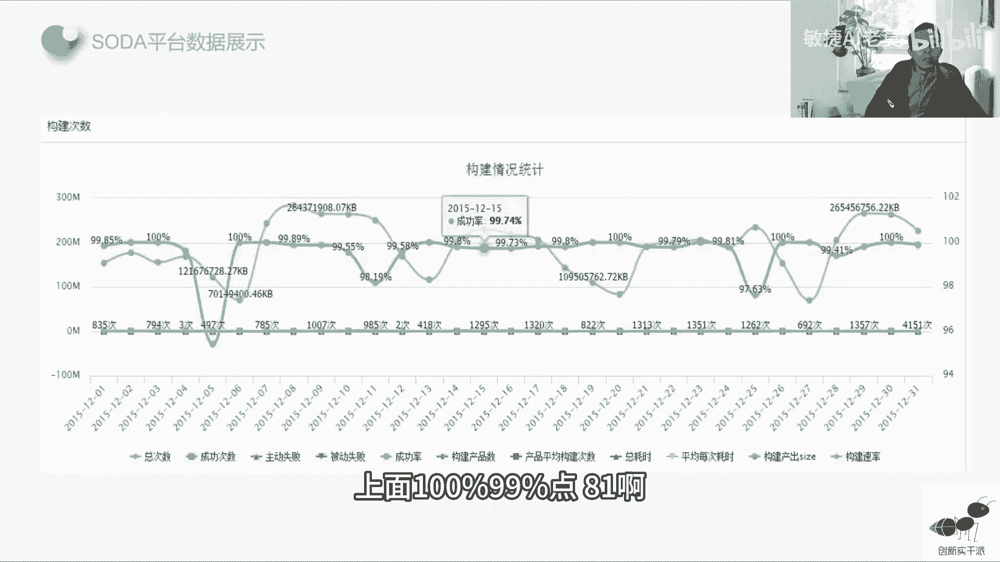

这个都是系统的抓取的数据的成功率啊，分层测试啊，分层测试就是自动化测试，自动化测试其实做的最多的还是单元测试，接口测试就往上走，基本上都是一些人工测试的东西，UI自动化测试基本上很少，因为在互联网时代。

其实很多时候UI会不断的变化，特别是大版本就是5。0L级6。0的时候，其实整个版本这个界面会变得非常大啊，你包括像苹果这种啊手机的操作系统，都会你从17。17。2跳到17。3，从17跳到18。

他每一次都是一种大的更新，那么大的更新，它的UI会有一个大的变化，UI做有大的变化以后，你自动化测试下去测UI其实就性价比不高了，OK还有一个概念啊。

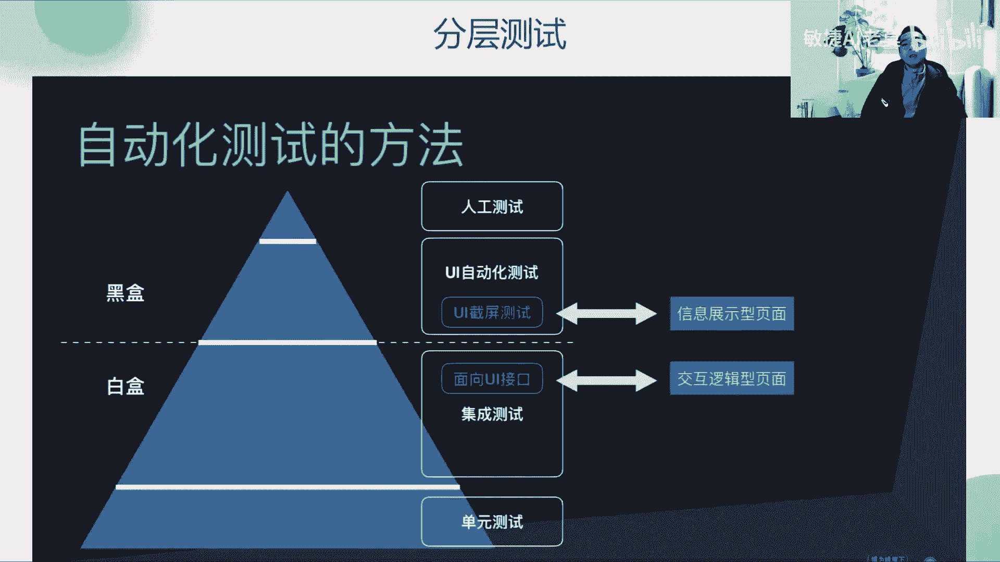

叫TDD跟ATTD以前这个考其实考的多啊，但是最近两年没怎么考啊，当然稍微了解一下就好了，就是TDD它是一种测试驱动开发的技术啊，那么ATTD呢就是我们前面说的验收，验收驱动开发。

也就是说他先定义出一种验收的标准，就是我们前面说的那个每一个用户故事，不是有个验收验收条件吗，他先定义好整个验收迭代的验收的标准，然后再去check我们迭代有没有达到这个标准啊，是这样的啊，是不一样的。

它是面对集体的方法，就这样的走啊，所以迭代的整个验收的标准，我们叫做定义完成啊，我们叫做定义完成啊，DOD啊，定义完成呃，这个概念我在这里就跟大家说一下，我们最后最后在第七版的时候。

第七版的重难点讲解的时候，我们也会跟大家讲这个概念概念，因为这个概念是放在第七版里面去跟大家去讲，但是这个地方考点不多啊，为什么第七版我只用了一个直播跟大家去讲，因为啊现在的目前的大纲。

考敏捷还是考得最多的啊，OK增量和反馈，其实增量和迭代的区别大家已经知道了，迭代是有节奏的，迭代是怎么样吸收用户的一个反馈啊，所以你像IPHONE4啊，以前的IPHONE4到IPHONE4S啊。

我们IPHONE4和4S上我们可以称之为什么啊，一个增量啊，从4~4S它是一个增量，那么4S到五它是一个怎么样一个大的改进，它是吸收到用户的很多这个反馈之后啊，它对外观进行了一些大刀阔斧的一些变化。

你像IPHONE5IPHONE6数字之间，它不带S的，就会出现很多大的变化，IPHONE7IPHONE8啊，但是从6S6S以后就没有再有S了，七以后就是八八以后就是IPHONEX啊。

就是IPHONE10，IPHONE10以后后面就是数字一直是十，一十二十三十四，就是数字版本，基本就是这这一个概念，行者和回顾啊，他就像海尔兄弟一样相辅相成的，这两个东西都是为了提升质量的。

一个是提升过程的质量，一个是提升评审，它提供的是验收的是结果质量啊，回顾才是过程质量啊，回顾是关门会，我们看过程哪些东西做的不好好。

