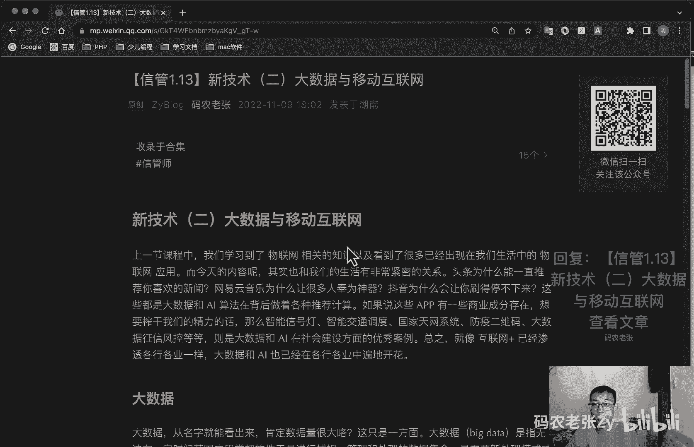

# 【信管1.13】新技术（二）大数据与移动互联网 - P1 - 码农老张Zy - BV1sV4y1A7Ay

哈喽大家好，今天呢我们来学习的是信息系统项目管理师，第一大篇章的第13篇文章，新技术，第二篇文章大数据，移动互联网，上一节课程中呢，我们学校的物联网相关的知识，以及看到了很多。

已经出现在我们生活中的物联网应用，而今天的内容呢，其实也和我们的生活有非常紧密的关系，头条啊，他为什么一直推荐你喜欢的新闻呢，然后网易云音乐为什么能让很多人氛围神器呢，然后抖音啊。

为什么能让你刷的停不下来，这些其实都是大数据和ai算法在后面做的，各种推荐计算，如果说这些app有一些商业成分存在，那么想要榨干我们经历的话，那么智能信号灯，智能交通调度，国家天网系统防疫二维码。

大数据征信风控等等，这些都是大数据和ai，在社会建设方面的优秀案例，总之呢就像互联网加已经渗透到各行各业一样，大数据和ai也已经在各行各业中遍地开花了，我们今天呢主要就来讲这些好。

我们先来看一下大数据啊，大数据从名字就能看出来，肯定数据量很大，对不对，这个呢只是一个方面呃，大数据呢是指无法在一定时间范围内，用常规的软件工具进行捕捉，管理和处理的数据集合。

是需要更更新的一个处理模式，才能够具有更强的决策力，洞察发现力和流程优化能力的，海量的高增长率和多样化的信息资产，大数据呢它有五个特点啊，这个东西叫做大数据的5v，这个很多地方都能看到。

第一个v呢就是大量的，通常就是我们mysql数据库啊，一般是就是我们普通的关系型数据库，达到千万级别的表都是大表了，就算是oracle的话，上亿的大也是大表了，对不对，但是在大数据系统中啊。

千万级的表的数据，这是不值得引入大数据系统的，包括上亿的数据，可能都不一定是值得进入大数据系统的，就还达不到这个量，你使用大数据系统的话，就是怎么说呢，就是杀鸡用牛刀了，然后呢就是数据类型繁多。

不仅限于文本日志，现在的系统呢包括图形识别啊，影像分析呢都已经是大数据和ai的主力应用了，这个怎么说啊，就是我们的数据啊，我们的数据它不是结构化的，是非结构化的数据，就是说来来数据的来源多种多样。

然后数据的格式也是多种多样的，它并不像我们传统的软件应用开发，我们都会提前把各种数据的那种steam，都给它定义好，大数据，它没有一个固定的一个schema的那种格式，所以说它的数数据种类型繁多。

第三个呢就是价值啊，我们可以通过e t l e t l还记得是什么吧，不记得再去想一想，联机处理分析对吧，etl清洗转换，就是讲那个连接处理分析那一块的，有一张图对吧，中间有一个就是e t l那个东西。

它是什么，清洗转换什么那个加载什么那些东西的，对不对，就把数据去清洗的，他呢就可以在大量繁殖，繁杂的数据中提取有价值的内容，是大数据的一个核心内容，然后第四个v呢就是处理速度快。

就我们一般使用mysql千万级的数据，如果没有加好索引的话，那那那效率就非常惨了，而大数据相关的数据库，比如说hbase啊，click house啊，包括mongodb也算一个啊。

mongodb其实做分布式的话，也也能处理很大的数据量，这一类的劣势数据库，这样这就是专业的专业的大数据的是这两个，这这这这这两种就是劣势数据库啊，是游刃有余的，至于呃计算平台呢就更不用多说了。

然后第五个呢就是真实的痕迹，通常我们要分析的数据，都是来源于各种各样的信息系统，终端设备的用户的行为痕迹，这些都是真实的，好我呢其实没有做过大数据方面的开发啊。

但是hardp hbase还是spark的大名，还是听说过的，没事呢，你自己玩过这个呢，就是这三个东西，他们是根据呃是估谷歌的大数据的三驾马车，通过开源的方式呢让全世界就为之一振，一开始呢它是三篇论文。

通过这三篇论文呢形成了三个，那然后谷歌就是通过就把它们实现成了，一个具体的三个软件计算框架对吧，应该不是这三个，应该是hdp hbase，还加一个map reduce对吧，就那三个对吧。

然后这个东西我也不记得了，反正就是呃反正就是三个三篇论文，通过那三篇论文呢形成了三个软件，然后那三个软件呢就是大数据的三个基础啊，然后通过分布式的计算和存储能力呢。

让大数据让大数据的快速分析呢变成了事实，然后呢甚至还有不少可以实现实时计算的框架，什么保持那个什么flume对吧，fm不是flame，是日志的对吧，还是什么是flint还是什么东西对吧。

就那种流式计算的可以预见啊，大数据发展的新浪势头，所有的头部互联网公司呢，没有一个是不做大数据的，没有一个不是不做大数据的，包括国家里的充分利用大数据的各种优势，来实现之前我们所说过的各种惠民工程。

不过呢大数据同时也会带来一些问题，比如说什么呢，大家非常关心的一个就是个人隐私的问题，你说一个听歌的或者说一个拍照的app，他们为啥非要通讯录的权限，这个东西你想不通，对不对，所以说安卓手机啊。

安卓手机在这一块真的是呃，如果你是使用安卓手机，或者说你的家人使用安卓手机的，你一定要提醒他们，就是在安装了新的软件之后呢，一定要注意他们的一些权限对吧，一定要注意他们的一些权限的一个设置。

这个东西要细思极恐的，关注隐私保护，防范大数据诈骗和大数据犯罪行为呢，也是我们所有it从业人员的一，个基本的职业操守啊，这真的是一个基本的职业操守啊，好了，人工智能ai。

人工智能啊这个东西啊是计算科学的一个分支，它企图了解智能的实质，并生产出一种能以人类智能相似的方式，做出反应的智能机器，该领域的研究包括什么，机器人，语言识别，图像识别，自然语言处理npl对吧。

然后专家系统等等，说到人工智能，那就不得不提到大数据，为什么呢，因为我们现在还处在一个，比较初级的人工智能阶段，通过机器学习来训练计算机，对一些数据进行反馈，以获得类似于人脑的结果，相关的内容。

其实都是根据这个来的，其实呢它就是根据你的app使用的各种行为，和各种来源的数据分析，你可能会喜欢的内容，当你浏览或者点赞了相关的内容呢，就会为你在这个类型的内容上多加一分。

这些呢都需要有大数据作为支撑才可以实现，当然具体的实现呢远没有我说的这么轻松啊，但道理却是差不多的，其实啊人工智能的很多算法在很早以前就有了，只是说就我记得好像是说好像60年代。

80年代就已经有很多这种人工智能相关的，一些就是数学方面的模型都已经出来了，但是呢当时没有完善的大数据系统，因此当谷歌的大数据框架诞生之后，ai也迎来了黄金时期，跟随着大数据不断的蓬勃发展。

并且ai也是我们面向未来的一个技术，包括很多电影，我机器人，黑客帝国，终结终结者，这些都是我们对机械智能的一个幻想和憧憬，所以说呢这些这些电影啊他都有一点灾难性质，因为你这个拍电影啊。

你不来点灾难性质的东西，你不能吸引人，对不对，不过呢电影总是用这种方式，才让他们的剧情呢能够有吸引力对吧，真正的对于现实的ai来说呢，未来还是应该抱有更美好的期待的，对不对。

这也是我们it从业人员所努力的一个方向，好下一个呢就是移动互联网啊，其实我觉得移动互联网真正兴起并且蓬勃发展，还是在3g网络普及之后，当然这里有点片面了，是真正的移动互联网是啊。

不只是包括4g5 g这些的，还包括什么y line，就是那个啊wifi网络啊什么这些的啊，并且也不仅限于手机啊，就是你平板手机平板什么的，就是你笔记本电脑，pos机啊什么这些的pd啊。

这些的只要能在移动的状态下，比如说室外啊，高铁啊，公交上使用互联网资源的形式呢，都是移动互联网，就很很广义的移动互联网啊，为什么3g是一个重要的节点呢，因为在3g时代呢，我们有个什么应用啊。

微博大放异彩，同时出现了一个什么碎片化时间这样一个名词，这个呢也就成为了互联网的一个移动，互联网一个显著的一个特点，除了这个特点之外呢，还有什么接入移动性，生活相关性，终端多样性。

这几个特性共同组成的移动互联网，明显区别于传统互联网的一个特性啊，这四个特性啊，注意它有四个，第一个就是碎片化时间，另外就是移动接入性啊，接接入的一个移动性，就是你在哪里都可以接入。

然后第三个呢就是生活的一个相关性，跟你的生活方方面面密切相关，第四个呢终端是比较多样的，就前面说过的啊，这几种终端都是有可能的，就这四个特点组成了一个移动互联网，在移动互联网时代的软件开发技术。

也产生了一些变化，似乎桌面时代从cs到bs的过渡，在移动终端上又走了回去，还记得吧，cs bs很重点的内容，cs bs是什么东西，不记得的话，回去看一下，我们日常使用的更多的还是各种需要安装app啊。

不过小程序也正在发力sap单页面应用，这种开发，包括各种框架，vue框架react angular前端的啊，很熟悉的，也也一直在蓬勃发展，然后b s应用呢也是未来可期的，毕竟在小程序的概念出现之后呢。

每个app实际上它都想变成一个浏览器，来实现自己的小程序应用，除此之外呢，10年之前的io女王和ios开发的火爆场面呢，也是非常夸张的，就像前几年的大数据ai人才一样，工资高的看不懂，当然了。

现在这些都已经推文了啊，都已经退完了，这大数据ai还可以的，现在其实还是还是可以的好，但是呢就是这种安卓和ios这种原生开发，依然还是移动端的主力开发方式，就是很多特别的效果。

或者说你这个app做到一定的量之后，移动开发还是需要有的，但是更多的其实还是还是混合开发比较多的好，我们再来看一下区块链，最后呢就是区块链啊，信管师考试中一定会有1~2道选择题。

是最近最火的一些技术方面的，比如说我当时考试的时候，我有啊，我是18年了，18年那个时候45年了，那个时候区块链是最火的，现在最火的是什么服务对吧，space或者是什么低代码呃，t代码是吧。

还有什么web三点，对不对，web三点它也它跟区块链也是有关系的，web三点啊，这个这个在新的我也不太清楚了，好像这些年也没什么特别的那种，全网人尽皆知的，不像那时候区块链好像全网都在说区块链。

现在web三点，我感觉还是没有到火到那个程度啊，大家纷纷种草的那种新技术的概念了，区块链啊，它起源于比特币对吧，这个比特币啊很出名的，现在有币的人全是土豪了，富翁了对吧，从科技层面来看呢。

区块链设计什么，你看的很简单啊，什么买买个b类型的，它涉及到的数学密码学，互联网，计算机编程等各种科学技术问题，从应用视角来看呢，简单来说，区块链是一个分布式的共享账本和网络数据库，具有去中心化。

可篡改，全程留痕，可以追溯，集体维护，公开透明等特点，这些特点呢保证了区块链的诚实与透明，为区块链呢创造了信任奠定基础，而区块链丰富的应用场景呢，基本上都基于区块链，能够解决信息不对称的问题而实现的。

它就可以实现多个主体之间的协作，信任与一致行动啊，这一段看了半天也看不懂干嘛了对吧，反正记住啊，去中心化这个记住这个就行了，原来我听过一个比较生动的解释，是通过一个村民买牛的故事来说明。

区块链到底是来干嘛的，我也不知道对不对啊，这里就简单的说一下，就是说啊在一个100人的村庄里面啊，就比如说张三向李四买了一头牛，向他支付了1万块钱，在过去的话，那他可能需要一个中间人。

比如说赵六就招六啊，可能是淘宝，对不对，或者是支付宝之类的，这种中间或者银行有中间商，才能将自己的1万块钱转给李四，这样的话嗯这样的话就是这个中间人啊，他可以作证，对不对。

确实啊李四跟那个啊张张三向李四买了一头牛，然后钱也转给他了，但是呢有了区块链系统之后呢，张三就可以直接将自己的1万块钱，寄到李四的账本上，同时呢这个交易信息会传到全村，也就是说整个区块链系统。

其他的98个人都可以看到信息呃，有系统记录整个交易过程，这样的话呢，所有人都具有可以追溯源的一个优势，防止造六账本丢失或者李四不认账等问题，就所有人他都记录了这个东西，原来需要这个中间人赵赵六。

现在不需要这个东西了，就是这个东西也没没办法穿过对吧，所有人都知道这种东西全程留痕，可以追溯的对吧，集体维护的全有了，全都在这个故事里面，好和云计算相似呃，是嗯按范围就是按范围区分的话。

区块链呢也有三种类型，第一个呢就是公有区块链，就世界上任何个体或者团体都可以发送交易，且交易能够获得该区块内的有效确认，任何人都可以参与其共识过程，公用区块链呢是最早的区块链。

也是广泛应用最广泛的区块链，就是各大那种那个发币的那种系统啊，呃它都会都都有那种是虚拟的数字货币，都是基于共有区块链的，世界上有且仅有一条该币种对应的一个区块链，就是他算出来那种哈希值。

最后获得那个结果是唯一的啊，然后这个东西啊，数字人民币，数字人民币对吧，数字人民币这2年出来的，数字人民币是不是跟区块链有什么关系啊，注意数字人民币它不是区块链啊，注意啊，这有可能会问啊，我不知道啊。

这个东西，我不知道他算不算一个新技术方面的东西啊，然后第二个就是联合行业区块链，联合行业区块链是由某个群体内部，指定多个预选的节点为记账人，每个块的生成，由所有的预选节点共同确定的预选节点啊。

什么参与共识的过程，其他接入节点呢可以参与交易啊，但不过像记账过程，本质上还是托管记账，但是只是变成分布式记账预选节点的多少呢，如何决定每个块的记账者，成为该区块链的主要风险点。

其他任何人可以通过该区块链开放的api，进行限定查询，仅仅使用区块链的总账技术进行记账，可以是一个公司，也可以是个人独享该区块链的写入权限，本面与其他的分布式存储方案，没有什么太大区别。

而公链的应用和比比特币呢已经工业化了，私链的应用产品呢还在摸索当中好了，这下前面说的数字人民币，它不是区块链，不也它可能会借鉴一些区块链的概念，它但它不是区块链，它不是一个完整的区块链。

好总结一下今天的内容呢，说实话没什么太重点的，但是呢往往又会有那么一两道题，有可能就跟这些东西有关，要说完全的完全去死记硬背吧，好像也没什么太大的必要，怎么说呢，就是当成扩展知识吧，有兴趣的多了解一下。

没兴趣的呢多看两两遍，大概也知道是什么大数据啊，人工智能区块链啊是个什么东西就行了，然后最近几年的话，你可能还要关注一下web三点啊，还有那个吴服啊，什么这些相关的一些低代码。

这些相关的东西大概了解一下就行了，新一代信息技术相关内容呢就是这些了，总体来说呢，这一部分内容其实难度不高，各种概念呢其实我们现在生活都比较接近，还是很好理解的。

接下来呢我们要学习的又是一个非常枯燥难受，头疼的部分了，那就是信息系统安全技术相关内容，别说在座的各位了，这部分我都有点发怵，但是反过来说呢，这些知识多少会对你的工作生活有些帮助，还是非常值得学习的。

那么我们就一起加油继续吧，好了，今天的内容呢就是这些，大家可以回复文章的标题，信管1。13新技术，二大数据，移动互联网来获得这篇文章的具体内容，以及一些详细的解释啊，好了今天的内容呢就是这些。

