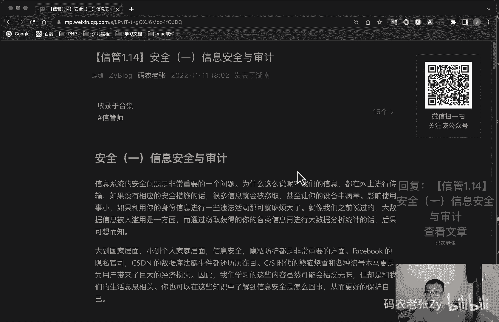

# 【信管1.14】安全（一）信息安全与审计 - P1 - 码农老张Zy - BV1vM411U7J4

哈喽大家好，今天呢我们来学习的是信息系统项目管理师，第一大篇章的第14篇文章，安全方面的第一篇文章，信息安全与审计，信息系统的安全问题呢，是一个非常重要的一个问题，为什么这么说呢。

我们的信息啊他都是在网上进行传输的，如果没有相应的安全措施的话，那么很多信息都会被怎么样窃取，甚至让你的设备中毒，影响使用视效，如果利用你的身份信息来进行一些违法活动，哇塞那麻烦可就大了。

就像我们之前说过的，大数据信息被人滥用是一个方面，而通过窃取获得你的各类信息，在进行大数据分析统计，后果可想而知啊，可想从大到数据，大到国家方面，小到个人家庭层面，信息安全。

隐私防护呢都是非常非常重要的部分，FACEBOOK的隐私官司对吧，然后cs dn的数据库泄露事件还都历历在目，cs时代就是传统的就很早之前了，熊猫烧香还记得吧，熊猫烧香，各位大佬还记得吗。

以及各种盗号木马，更是为用户带来了巨大的经济损失，因此呢我们学习这些内容可能会枯燥无味，但是却和我们的生活息息相关，你也可以在这些知识中了解到，信息安全是怎么回事，从而更好地保护自己，还是那句话啊。

非常非常我们我们的学习呢，还是非常非常粗浅的，非常非常粗浅的，信息安全本身也是一大本书可能都写不完的，好了，信息安全的概念啊，信息安全的强调信息和数据本身的安全属性，主要包括以下三个方面的内容。

第一个呢就是什么，第一个是私密性，信息不被授权者就是未授权者知晓的一个属性，第二呢就是完整性，就是信息是正确的，真实的，未被篡改的，完整无缺的属性，第三个呢就是可用性信息，可以随时正常使用的一个属性。

信息必须依赖其存储，传输处理以及应用的载体和媒介而存在，因此针对信息系统呢，安全可以划分为以下四个层次，哪四个层次呢，第一个就是设备的安全，第二就是数据的安全，第三个是内容的安全。

这个内容安全包括政治法律道德层次上的要求，最后那个就是行为的安全，也就是个动态安全，信息安全的管理体系，主要包括我们要配备信息安全的管理人员对吧，要建立安全职能部门，主要负责人处分领导。

建立信息安全保密管理部门等，虽说大部分小公司不会有这些，但是如果真出事了，我跟你说，有人会来问责的时候，那么他会问你谁是主要负责人，就是负责你这个信息安全的，这个一定会有人去问你的。

当然这个千元机有问题的情况下啊，好对我们平常也要多注意，就不会碰到这种事了，好除了管理体系之外呢，还有一套信息安全的技术体系，主要包括什么呢，就是硬件系统安全和物理安全，然后就是数据网络传输安全。

交换和保护安全，然后呢操作系统啊，数据库啊，管理的系统安全，最后呢就是应用软件的安全运行，那我们先看一下人员管理啊，绝大多数的信息系统安全的威胁呢，其实都是来源于我们人类自己。

因此人员管理也就成为了信息安全管理的关键，对于公司组织来说，没有一个公司不希望自己是一个安全的组织，我们可以间接上文中的安全管，理体系和技术体系来建设一个安全组织，而在其中呢。

岗位安全考核与培训是非常重要的一环，我们要包括什么呢，关键人员，关键岗位的人员的统一管理，然后兼职和轮岗的要求，权限分分分数的一个要求，权限的分分配吧，分配的要求，多人信管的要求，全面控制的要求等等。

在职人员和岗位的管理的安全管理呢，在公司范围内还是比较好掌控的，通过规章制度呢也比较容易监控和实施，另外可能还大家还可能签过一个什么呢，竞业禁止协议啊，或者什么保密协议之类的，对不对。

这些其实都跟安全有关的，另外一个更重要的安全问题呢，是离职人员的安全管理，对离职人员来说呢，我们需要干嘛呢，啊我们一个一个来看一下，第一个呢肯定要收回相关的证件啊，还有设备的一个什么设备的权限。

然后呢就是调离之后的一个保密协议对吧，然后就离岗的一个审计要求，最后呢就是关键部位人员离岗的一个要求，好了，我们再来看一下系统运行安全与保密层次，应用系统运行中涉及的安全和保密层次呢。

包括系统级的安全资源访问的安全功能性，安全和数据域的安全，这四个层次的安全的安全度，从大到小的排序，是系统级的安全资源访问的安全，功能性的安全，数据域的安全呃，程序资源访问控制安全的力度大小呢。

介于系统以及安全和功能性，安全两者之间是最常见的，应用系统的安全问题，几乎所有的应用系统都会涉及这个安全问题，我们一个一个的再来看一下啊，第一个呢就是系统级的安全，通过现行系统安全技术的分析。

制定系统级的安全策略，策略呢包括敏感系统的隔离啊，隔离也是很重要的一个东西，然后访问IP地址段的限制对吧，隔离限制，然后登录时间段的一个限制，绘画时间的限制，连接数的限制。

然后特定时间段内登录次数的限制，以及远程访问控制等等，系统安全是应用程序的第一道大门，看明白了吗，看明白了吗，其实就是我们的登录嘛，登录那一块的好了，第二个呢就是资源啊，第二个呢就是资源访问的安全。

对于程序资源访问进行安全控制，在客户端上呢，为用户提供与权限相关的用户界面，仅出现与权限相符合的菜单和功能按钮，在服务端呢，只对URL程序，资源和业务服务类的方法进行访问控制，这是什么呀。

这样也很熟悉对吧，我们登录之后的菜单功能权限对不对，第三个呢功能性的安全，功能性安全呢会对程序流程产生影响，如用户在操作业务记录时，是否需要审核上传附件，不能超过指定大小等等。

这些安全限制已经不是入口级的限制，而是程序流程内的限制，在一定程程度上影响程序流程，程序的流程的一个运行啊，这个主要就是这边，就是是否需要审核上传附件呢，不能只能大小，对不对。

还有比如说我们操作网银什么那些的，有的时候呢在一些关键操作的时候，比如转账或者干嘛的时候，它会让我们重新再输入一下支付密码呀，或者是接一下短信验证码之类的，这些都是功能性的安全好，最后一个数据域的安全。

数据的安全呢包括两个层次，第一个呢就是行政数据的，就是行集数据的安全，用户可以访问哪些业务记录，一般以用户所在的单位为条件进行过滤，其二呢是字段级的数据安全，尤其用户可以访问业务中的哪些字段啊。

这个是数据域的安全好，我们再看一下安全审计，信息，安全审计呢是记录审查主体，对客体进行访问和使用的一个情况，保证安全规则被正确的执行，并帮助分析安全事故产生的一个原因，一个安全审计系统的主要的作用呢。

就包括对潜在攻击者起到威慑警告作用，发现计算机的滥呃，这个滥用的情况，一个状态，对已经发生的系统破坏行为呢，提供有效的追究证证据，为系统安全管理员提供有价值的日志以及数据，帮助发现系统入侵和漏洞。

为系统安全管理员提供系统运行日志以及信息，帮助发现系统性能上的不足，注意它是审计啊，它是审计，它不是防护，它是审计，审计去干嘛，主要是以记录为主的好，网络安全审计呢，从审计级别上呢可以有三种类型。

主要是什么呢，系统级的审计，应用级审计和用户级的审计系统，集审计系统及审计，主要针对的是系统的登录情况，用户识别号登录尝试的日期和具体的时间，退出的日期时间，所使用的设备。

登录后运行程序等事件信息进行审查，这个字是什么，就是我们的一个用户操作日志，对不对，典型的系统及审计机制呢，还包括部分与安全无关的信息，比如说系统操作费用记账，网络性能啊。

这类审计无法跟踪和记录应用事件，也无法提供足够的细节信息，第二呢就是应用及审计，应用及审计呢，主要针对的就是应用程序的活动信息，如打开和关闭数据文件，读取编辑，删除记录或者字段的氪金操作以及打印报告等。

就是重啊，这个比重重点的一些呃操作的一些审计，这是一个记录，然后呢是用户级的审计，用户级的审计的主要是审计用户的操作，活动信息，如用户直接启动所有mini用户，所有的建别和认证操作。

用户所访问的文件和资源等信息，我们再来看一下重要应用系统运行情况，审计嗯，应用系统的开发或软件销售商，都不会把审核机制，底层应用接口提供给具体的应用程序开发者，就这底层的那些大码肯定不会给别人的。

在技术力量不足的情况下，最便捷的解决方法呢，还是寻找可靠成熟的现有技术解决，以使应用程序开发人员，能够专心于程序可用性的开发商，而减少难度较大的程序开发，安全性的老方面的劳动，达到缩短开发周期呢。

快速投入运用的目的，对已知的现有技术分析的，主要有四种解决方案啊，这个东西这个东西我跟你说，在这跟我们做开发的这帮人来说的，我跟你说的意思就是什么呢，就是说我们尽量用别人造好的轮子。

在很多东西我们自己去造轮子的话，其实很多东西我们考虑不到那么周全，当然如果你是大佬的话，或者你时间比较充足的话，你可以考虑你对某一个方向，就某一个技术，某一个模块特别有特别精神的了解的话。

自己去造轮子也没什么太大的问题啊，这个就是呃就是那个题外话好，我们再来说一下啊，我们接着说这几点啊，第一个呢就是基于主要操作系统代理呃，数据库操作系统，电子邮件系统在启动自身审计功能之后呢。

自动将部分系统审核数据传送到主机系统日志，然后再通过运行与主机操作系统下，一个实时的监控代理程序，来读取并分析系统审计日志中的，相关的一个数据，这个就是基于操作系统的一个代理。

然后基于基于应用系统的代理，首先呢根据不同的应用设计，开发不同的应用代理程序，并在相应应用系统内运行，应用系统产生的审计数据呢，不是直接传送给主机操作系统审核，而是首先用应用程序代理接收。

再由其传送给主机操作系统审核，也可以直接传送给主机操作系统，实时监控代理程序的处理啊，了解一下就可以了，好第三个呢就是基于应用系统的独立程序，在应用系统内部嵌入一个应用服务，同步运行专用的审计服务。

应用进程用于全程跟踪应用服务进程的运行，第四个呢就是基于网络旁路监控的方式，与基于网络监测的安全审计，实现原理及系统配置相同，警示作用的目标不同而已，其系统结构由网络探测和安全控制中心组成。

OK这四个了解一下就行了，我也不知道在说什么好，我们先来看一下啊，这个是比较重点的，计算机信息系统安全保护等级，注意啊，注意名字啊，名字很强，但是要记住啊，计算机信息系统安全保护等级划分准则GB什么。

178591999是建立安全等级保护制度，实施安全等级管理的重要基础性标准，它将计算机系统分为以下五个安全保护等级，这个是今天比较重点的一个内容啊，注意啊，第一集用户用户自主保护及自主。

适用于普通内网用户自主普通内网用户，第二个就是审计保护机，适用于内联网或国际网进行商务活动，需要保密的非重要单位，第三个标记保护机，标记保护级适用于地方各级国家机关，金融机构，邮电能源和水电供给部门。

交通运输，工商与信息技术企业，重点工程建设单位，第四集是结构化保护集，结构化主要适用于中央国家机关，广播电视部门，重要物资储备单位，社会应急服务部门，尖端科技企业集团，国家重点科研机构和国防建设等部门。

第五级访问验证保护级，适用于国防关键部门，和依法需要对计算机信息系统，实施特殊隔离的单位，注意他们的等级和后面的一些适合的单位啊，这个呢我们可以比较方便，来借助什么自主审计标记，结构化和验证，从低到高。

从低到高，然后他们服务的对象从也是从低到高的啊，从低到高的，先是普通的用户，然后是企业级的，然后呢就是地方和国家机关，金融机构以及就是比较重要的一些企业，看看能源运输，一些大型的国企，一些重点单位。

比较重要的单位，接下来就是重重点的中央国家机关，广电部门，重要物资部门，尖端科技企业集团科研机构，就比较重点的这些国防建设相关的最后一级，最高的等级，那肯定是国防相关的部门了，这个就不用多说了。

好这个呢大家是需要去重点去记忆一下的，主要呢就是自主审计标记，结构化和验证，这五个一定要记下来啊，从低到高，自主审计标记结构化验证多重复几遍，然后后面相关的就是他们这个等级，所相关的一些用户。

前面三个记下来了，后面的其实问题不大，这个呢容易出选择题的，容易出选择题，问你这个部门它是什么结，是什么等级的，比如说广电部门，他是什么等级的结构化级的是吧，或者说结构化集里面包含哪几个，除了几个选项。

但是有一个是另外一个等级里面的，注意啊，注意啊，再来看一下下一个信息安全等级保护，这个又是另外一个啊，这个另外一个这个是计算机信息安全保护等级，这个是信息安全等级保护，也是这个级别也是五个级别。

你看一下也是五个级别，他呢是信息安全等级保护管理办法，是国家由多个部门共同制定的，根据这个办法呢，国家信息安全等级保护坚持自主定级，自主保护的原则，它将信息安全的保护分为以下五个等级，也是由D到高。

第一集呢信息系统受到破坏后呢，对公民法人和其他组织的合法权益造成损害，但不损害不足，注意注意注意后面这个蛋后面就行了啊，第一个呢第一集就是不损害国家安全，社会和公共利益，看到没有，不损害国家社会。

第二集看看前面我就不读了，前面我就不读了，主要是什么呢，主要是不损害国家，但是呢对其他的对其他的产生严重损害了，上面是造成损害，下面是产生严重损害了，但是呢他主要是不还是不损害国家。

这个是不损害国家和社会，这个是不损害国家，第三集开始看到没有，对国家有害了，对国家有害了，但是呢对社会，对公民，对社会造成了严重损害了，同时对国家有害了，好第四集第四集不用说了，对国家造成严重损害了。

对不对，对国家造成严重的，第五个呢就是对国家特别严重了，对就对所有的东西都特别严重了，就第五集了，好，这个呢也要345集，这个呢也是也需要记一下，但是没有上面那个那么重要。

不过也是就没有那个没有这五个那么重要，但是也是需要去记一下的，而且要注意跟他们的区分啊，一个是一个是计算机信息安全保护等级，一个是信息安全等级保护，对啊，这两个这两个很容易搞混啊，注意啊。

就是前面这个多一个计算机啊，多一个计算机的就是自主审计标记，验结构化和验证，没有那个计算机那三个字的就是12345级，然后就是损不损害国家的问题了，好这个地方是需要注意的。

这个也是特别今天最重点的地方好了，总结一下，今天我们学习的是信息系统安全相关的概念，其中还包括人员管，安全管理和信息安全管理层次方面的内容，接下来呢就是信息安全审计，关于安全审计的分类呢。

是我们需要重点关注的内容，更重要的是那两个等级，就是安全审计中很多内容呢，就是原因教材的第22章的内容，但是跟我们第一章呢，就是有一些信息安全方面的内容呢，是比较相关的，所以说呢我们就拿过来一起讲了。

就是这这些有些内容呢是在教材里面的，第22章的内容，大家可以自己去翻一下，看一下，很多概念呢很多等级分类呢，说实话看着不难也好理解，但是确实比较散，容易记乱，没办法多读，多背好了，今天的内容呢就是这些。

大家可以回复文章的标题，信管1。14安全第一篇文章，信息安全与审计，来获得这篇文章的具体内容，以及一些具体的解释和说明，好，今天的内容呢就是这些。

