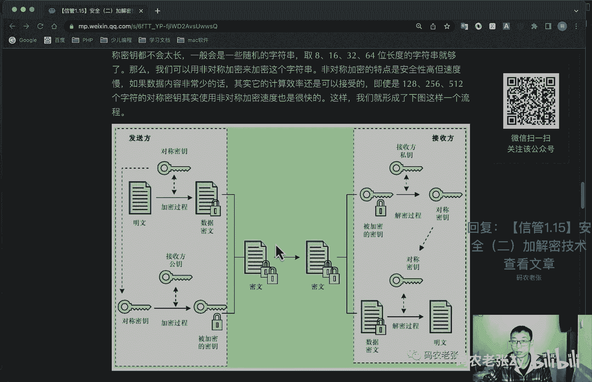
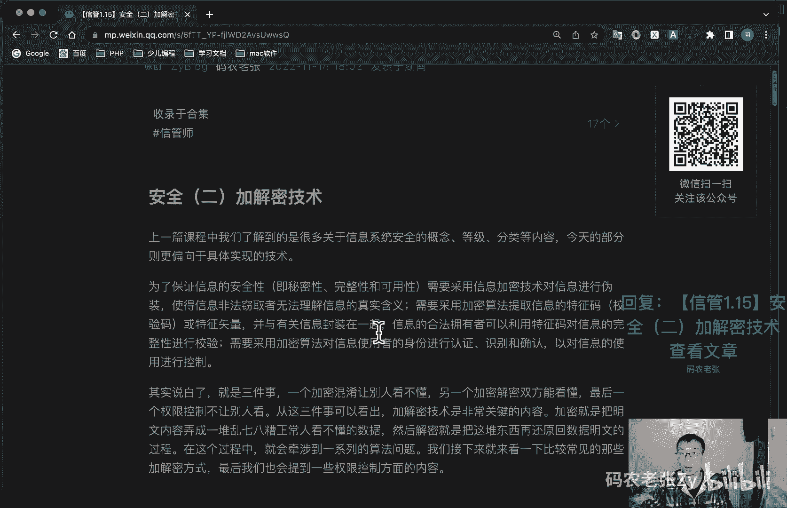

# 【信管1.15】安全（二）加解密技术 - P1 - 码农老张Zy - BV1FW4y1K7tz

哈喽大家好，今天呢我们来学习的是信息系统项目管理师，第一大篇章的第15篇文章，安全的第二篇文章加解密技术，上一篇课程中，我们了解到的是很多关于信息系统安全的概念，等级分类等内容。

今天的部分呢则更偏向于具体实现的一些技术，为了保证信息的安全性啊，包括这个私密性，完整性啊，还有这个可用性啊，需要采用信息加密技术对信息进行封装伪装，使得信息非法窃取者无法理解信息的真实含义。

需要采用加密算法，加密算法这个东西很重要对吧，它可以提取信息的特征码或者是特征矢量，并与有关信息封装在一起，信息的合法拥有者，可以利用特征码对信息进行完整性的校验，需要采用加密算法。

对信息使用者的身份进行认证，识别和确认，以对信息的使用进行控制，其实说白了，这这这上面这一大段就是三件事，一个呢就是加密混淆，让别人看不见，第二个呢就是加密解密，双方都能看懂。

最后的那一个呢就是权限控制，不让别人看，这三件事呢从这三件事就可以看出来，加减密技术呢是非常关键的，内容加密呢是把铭文内容弄成一堆乱七八糟的，正常人看不懂的一个数据。

然后解密呢其实就是把这堆东西再还原回数据，铭文的一个过程，在这个过程中呢就会牵涉到一系列的算法问题，我们接下来呢就来看一些比较常见的那些，加减面方式，最后呢我也会提到一些权限控制方面的内容。

好我们先看第一个对称加密，对称加密采用了对称密码的一个编码的技术，它的特点就是这个对称啊，它的特点呢就是文件加密和解密，使用相同的密钥，所以它才叫对称的对吧，因为他们的密钥是对称的，都是一样的。

也就是说，加密密钥是可以当做解密密钥来使用的，这个和我们下面要说的非对称加密，它都会有一个什么都会有一个密钥的一个概念，密钥呢是一个加密算法中的一个控制部分，能够控制加密算法最后生成的密文结果。

而且往往在解密中也扮演非常重要的角色，比如说这个对称加密，不管是加还是减，都是使用同一套密钥的，如果密钥不对，那么解密的结果呢也就不会是正确的，由于密钥固定算法简单，对称加密的效率比较高，速度也比较快。

为什么呢，因为把解密密钥给客户终端，实际上呢也就等于是将加密密钥给了客户，在这种情况下呢，很容易通过反编译等手段，获得客户端代码当中的密钥信息，非常的不安全，而且呢在下发。

也就是客户第一次获取密钥的过程中呢，也有可能在中途被窃取，这个可能性也是有的，对称加密比较出名的包括什么呢，ae s d e s3 d e s，还有r c5 ，什么i d e a等算法。

相信这个是a e s和d s还是非常普及的，非常常见的就是p a p java里面都有现成的库存，直接可以去进行这些加密，使用过的同学呢应该也是比较多的，各个编程语言呢，也都有非常简单的一些实现的函数。

好我们再来看第二个就是非对称性加密呃，上面对称加密呢，我们知道，加密方和解密方都持有的是相同的一个密钥，用于加解密，那么其实非对称加密呢，也就是你也能够猜到了，就是双方持有的是不同的密钥。

的密钥是不相同的，基本思想是将传统密码的密钥一分为二，也就是我们经常会见到的什么呢，一个叫公钥，一个私钥是不是非常常见对吧，通常我们会用公钥来加密数据，公钥加密，然后用私钥来解密数据。

公钥呢我们会发送给客户，然后他们传送给我们的信息呢，就是用我们的公钥去加密的，只有我们自己能够解开，并且获得铭文原文，同样的我们要发给客户的数据，也是使用客户给我们的公钥来进行加密的。

数据发送给他们之后呢，他们也会使用他们自己的私钥来解密，如果我们使用的不是他们的公钥，那么数据也是无法被他们自己的私钥解密的，这个什么意思啊，就是说我们公钥是统一统一，公钥是用来加密的。

然后私钥呢是用来解密的，然后呢我们的我们的公钥，注意我们的公钥是发给别人的，发给别人的，然后别人的公钥是发给我们的，对不对，别人的公钥是发给我们的，这样的话我们互相通信的时候，我要给他发数据的时候。

我先用他的公钥去进行加密，然后把数据发给他，他在用他自己的私钥进行解密，然后呢获得真实的明文数据，同样的反过来他如果要给我们发送数据的话，他们需要拿我们的公钥，拿我们发给他的这个公钥去加密数据。

然后把加加密之后的数据传送给我们，然后呢我们用自己的私钥来进行解密啊，注意啊，正常情况下是公钥加密，私钥解密，但是呢其实我们在很多编程语言里面都是公钥，私钥都是既可以加密，也可以解密的。

好这个就说一点题外话啊，非对称加密呢是不是感觉非常好，但是呢这个算法优秀的安全性也是有代价，换回来的，它的计算量大，破解很难，相对的效率也会比较差，完全无法和对称加密的速度相媲美，非对称加密。

最常见的也是现在基本已经成为事实标准的，就是sa算法，它是一个基于大和数因子分解，困难性的原理而生成的公开密钥密码的方式，我们日常使用的什么open s s l生产的公司。

要还有linux github的安全公钥登录啊是吧，还有那个部署相关的啊，还有现在已经完全普及了，t t p s等等的应用呢，都是gi s的好这个呢非常普及了，这个也就不多说了，非对称加密好。

我们再来看下一个就是哈希哈，希，算法呢是将任意长度的豹纹m映射为定长的，哈希码h也叫做散列算法，它的目的是生成指定的数据文件，或者数据块的一个系统，也就是我们常说的h哈希码。

最常见的就是什么md 5和s h a一对吧，这个非常常见了，这个也就不多说了好了，这个算法是一种单向算法，也就是说我们可以加密，但是无法解密，当然现在有彩虹表这种半人工的哈希数据库，可以用作哈希解密。

但只要我们在加密的数据的时候呢，略做一点点变化，这个解密呢其实就非常难了，哈希算法呢最常见的场景就是用户密码的加密，这个加密呢最好还是不止一次的简单的md 5，最好能多套几次md 5。

或者说加上这个什么sd值，也就颜值啊，这个说的可能就比较专业了，开发的同学应该都明白什么意思，如果你不是开发的同学呢，那么这一段不用管它了解一下就好了好了，我们再来看一下啊，呃数字签名。

签名呢就是证明当事人的身份和数据，真实性的一种信息，这个东西呢我们在很多下载网站都会看到，当你下载某个软件的时候，就说下载页面都会有一个什么md 5，消炎码这个东西啊，你是不是原来不知道他在干嘛呢。

对不对，然后其实现在你就应该知道了，就是你下载软件之后呢，就可以用一些md 5校验软件，然后把把你下载的这个东西丢到那个软件里面，它就会生成一串那个md 5的那个校验码，然后你就去看一下，这个校验码。

跟你下载那个网站的那个消灭校验码，是不是一样的，如果是一样的话，那就证明你下载的软件是没有问题的，而且也是完整的，和网站上，就是你去下载那个网站上的是同一款软件，在这个过程中呢，这个md 5校验码。

其实就是一个双方需要对应的一个签名，当然这个就是单向哈希的一个数字签名，同理呢在数据传输的过程中，如果确保，如何确保对方和你所接收的数据是没有问题的，对吧，这样的话那加就加需要加一个数字签名。

这个数字签名呢可以是一个md 5的哈希串，就跟前面那个一样，也可以是i s a的加密数据，就是那个非对称加密的那种形式的，这些都没有问题，但目的只有一个，就是你和你通信的对方。

你们两个的对这个签名呢可以达成共识，因此呢这个数字签名有保证信息传输的完整性，提供发送者身份验证，以及防止交易中的抵赖情况发生的重作用，就是说你们两个都都确定这个东西都是有效的。

这样的话呢你就可以保证你传出来的东西，就是你你传过来的数据，包括包含了这个签名呢，就是表明你的数据是完整的，然后你你们两个互相身份都是认可的，然后中间什么交易抵赖这种情况呢，都可以去避免的好。

这个呢大概就是一个这个完整的一个数字，签名的一个过程啊，他大概就是分别是什么，一个第一个就是一个什么签名的过程啊，签名的过程，然后通过一些哈希运算，然后把这个文件啊什么进行私钥加密，生成一个签名文件。

然后呢就是通过这个网络传输网网络传输，然后文件同签名一起发送，然后因为你是签过名的对吧，经经过一些加密的，这些还还有一些什么私钥的加密的，还有一些什么哈希算法的，然后在这个过程中呢。

就是在中间传输的过程中的，任何其他的人也就不能去伪造你这个签名了，因为其实这个算法的只有你自己知道的，也是非常复杂的，然后最后呢就是呃就是你接收方，接收方去验证这个签名呢，同样也是用相同的哈希算法。

然后把这个进行公钥解密啊，什么这些的，最后获得完整的一个数据好了，这个就是一个数字签名相关的内容，我们再来看一下今天比较重点的一个内容啊，就是这个数字信封啊，在讲数字签名时，往往还有一个更重要的内容。

就是我们不能错过的，那就是数字信封技术，它是将对称密钥通过非对称加密，就是将对称的密钥通过非对称加密，即有公钥和私钥两个，就是这这这个东西啊，把他们的结果分发对称密钥的一个方法，就是说的有点绕对吧。

说的有点绕，什么意思呢，其实它就是结合我们上面学习过的，对称和非对称加密两种加密方式的特点，而形成的一种独特的安全传输的方式，一会儿看一下图你就知道了，好前面我们提到过就是对称加密速度快。

但是不安全对吧，因为密钥在传输过程中以及在对端不可控，都会带来安全隐患，但是呢这里需要注意的一点，就是这个对称密钥啊，我们是可以控制的，对不对，而且往往这个对称密钥都不会太太长。

就是这个这个我们去加密的密钥，一般不会设置的太长对吧，一般是一些随机的字符串，比如说八位16位，32位，64位长度的字符串就够了，那么我们可以用非对称加密来加密这个字符串，就是用非对称加密的公钥私钥。

用他们的算法，rsa算法来加密这个加密，这个对称对称加密的这个密钥，加密这个密钥，然后呢非对称加密的特点，它就是安全性高，而且但是速度慢对吧，如果数据内容非常少的话，那么其他的计算效率还是可以接受的。

就是你这个密钥它一般都不会太长，对不对，比较常见的其实是32位，64位的，即便你是128位，256位，512个字符的对称密钥，其实使用非对称加密的速度也是很快的，这样呢我们就形成了下图这样一个流程啊。

这个这个东西啊，数字信封这个东西，其实一看这个图就明白了什么意思呢，好我们去看一下，比如说我们是发送方，对不对，我们发送方，然后我们数据铭文是在这里，对不对，我们数据铭文，然后我们数据铭文通过对称密钥。

注意这个是对称密钥，我们通过这个对称密钥进行加密，进行加密，现在这个东西是一个密门，对不对，这个是一个密门，是一个秘密的东西了，然后我们把这个密文发送给发送过去，看到没有，这个地方。

我们把密文发送过去了，好这个密封发射过去了之后呢，这边怎么解密呢，这边需要解密的时候，我们需要知道这个对称密钥是什么，对不对，但是这个对称密钥，我们不能把这个页铭文传输过去，为什么呢。

把这个传输过去的话，在中间如果被别人截取了，那么他就可以直接对这个密文解密了，对不对，我们就把这个对称密钥通过公司要那种形式，非对称加密的那种形式去进行加密，这样的话呢我们可以怎么样呢，对吧。

我们使用这个我们使用这个对方的，这个就是对方的那个公钥公钥加密，私钥解密嘛，使用对方的那个公钥来对这个对称密钥，注意它是一个东西，他们这两个是一个东西，对这个对称密钥进行加密。

被加密之后的密钥呢就放在这里了，然后把这个被加密之后的密钥也发送过去，等于说我们现在同时发送了两份内容，一个是对称密钥加密过的密文，另外一个呢是非对称密钥，加密过的那个对称密钥。

把这两个东西一块传输过去，转生过去之后呢，这边这边通过非对称密钥中的私钥，就是他自己的那个私钥先去解密这个东西，解密这个东西就是被加密的这个密钥，获得的就是什么呢，获得的是这个获得的就是这个东西。

对称对称密钥，获得的就是这个东西对称的一个密钥，然后我们再拿这个对称的密钥再去解密，在在在这个地方再去解密，那个传输过来的数据密文，最后获得原始的一个铭文，就是这个过程仔细想一想，仔细想一想。

其实仔细看这个图，仔细看这个图其实还是比较好理解的，就就一定要记住，用对方的公钥来加密这个对称密钥，然后把这个对称密钥也发过去，然后用对称密钥去加密数据，把这个数据也发送过去，等于发送了两份。

一定要记住啊，他发送了，把这个也发送了，把这个也发送了，发送了两份，全是加密过的东西，然后在这边呢，接收方这边用自己的私钥先去解密，这个被加密的这个对称密钥，先这个这个对称的密钥一定要记住啊。

用自己的非对称的密钥去解密这个对称的密钥，然后把这个对称密钥拿出来之后对吧，把这个把这个对称的密钥拿出来之后呢，用这个对称的密钥再去解密这个数据，最后获得了数据铭文，这样的这样的形式呢。

其实相对来说就是非常非常安全了，非常非常安全，但是你也能看出来就是这东西很复杂对吧，这个东西还是比较复杂的好，但这里还有一个地方，就是我们在做真实的业务开发的时候，这个对称面我们可以随时换的对吧。

为什么呢，因为我每次把这个对称密钥其实也发送过去了，所以说这个东西我们可以随时换的啊，这个这个东西就就就是说这个安全性，其实真的非常非常高的好。

这个地方呢有详细的解释，大家可以具体来看一下，如果我刚刚说的还不是特别清楚的话，大家也可以回复文章的标题，然后过来看一下这个具体的解释好了，包括下面的这些内容，好我们再接着往下看啊。

这个呢就是pk i的一个公钥体系，公钥基础设施p k i啊，这个东西叫做公钥基础设施，它呢是以不对称密钥加密技术为基础，以数据机密性完整性，身份认证和行为，不可抵赖性，为安全目的来实施和提供安全服务的。

具有普适性的安全基础设施，它包括什么，包括一个数字证书，包括不对称密钥，密码技术认证中心证书和密码的管理，安全代理软件，邮戳服务，相关信息标准，操作规范等等，这个pk i它可以实现ca和证书的管理。

密钥的备份与恢复，证书加加密密钥和签名密钥的分割，支持对数字签名的不可抵赖性，密钥历史的管理等功能，其中这个ca啊，你做个开发，你肯定知道，特别是配过h t t p s的这个ca是什么东西啊。

它是一个叫认证中心的一个简写，通过配置网站呢，就是我就是我前面说过对吧，配置过网站http s的同学，对这个东西一定不会陌生，就前面说过，t t t p s的基础。

就是open s s l生成的加密公司要对吧，那么我们自己生成的证书，为什么不能直接使用配置到我们的网站上呢，大家有没有试过啊，你自己去你自己生成的那个证书，你是没有办法配置在你的网站上的。

其实呢是可以配置的，但是呢呃但是浏览器不信你这个东西对吧，因为你自己生成的证书，我怎么知道你是好的是坏的，对不对，所以说呢浏览器不认你生成的证书，是没有问题的，但是我们没有办法相信你，对不对。

各个浏览器厂商呢它需要一些中间机构，并且是有信誉资质的，这些中间机构来提供担保，这些机构呢其实就是实现了pki的一个公司，然后呢这样的话呢，我们在各个域名注册商购买的证书呢，也是由他们生成的。

就我们从域名注册商购买的那些，就是h t p s那些证书呢也是由他们来生成的，或者是说他们会把这个证书发到pk i的，这些公司去注册一下，也不是pi就是c c这些注册中心去注册一下。

然后这个证书呢就是通过他们认证的，通过他们许可的这些证书了，并且呢他们还有公钥管理系统，负责分配给客户端的公钥，这样的话呢，其实就是我们浏览器，它会去这些c这些核心的地方呢，去获取这个公钥证书。

然后他们获取的公钥证书呢，就是就相当于说每个客户端的公钥，证书也是不同的，都是这些公钥证书呢，都是由这些ceo机构来颁发的，在这些私钥呢，其实在我们服务器上呢还是统一的一个。

这样的话呢就实现了一个包括第三方认证，并且可以做仲裁方的公证人的机构，就是说前面说的这个pk i，我们可以看一下这个用户，他通过证书申请，然后由这个注册机构来颁发这个证书。

然后认证机构呢就可以通过这个pk i策略，然后去发放一些证书，他因为他他自己会有这个证书库，让我们客户端就可以拿到这个公钥，然后这个我们去房间h t p s网站的时候呢。

我们就通过这些公钥去把这些我们要发送的，我们进行post提交的这些数据去进行加密，加密了之后呢，发给发给服务器对吧，然后服务器那边呢，然后通过他们自己的私钥来进行解密，或者这些数据。

然后同时呢他们再把他们的数据进行加密，然后再发送过来，同样也是通过中间这个c机构来进行一些，认证啊，什么相关的一些内容的，反正浏览器注意啊，浏览器如果你要使用自己的证书的话，一般都是不信任的。

所以说我们肯定要去买这个证证书的，或者说你用宝塔面板啊什么之类的，他会有一些免费的证书，对不对，这个呢可能还是偏技术一些了，如果你就是你不是做技术的哈，你不是做技术出身的，那么这一段也是了解一下就行了。

但是你一定要知道的就是这个pk i是什么东西，这个ca是什么东西，就是这些名词，你肯定要知道的好，pk呢一般是通过数字证书的方式，向客户端或对端发送，公司要呃，数字证书呢。

其实可以看成是又一种又一层的加密数据，根据证书规则以及相关的设置呢，可以从证书中取出主体信息，证书序号，有效期，密码算法标识，公司要信息等等的内容，常见的证书格式还有哪些呢，x4。509系列。

pk c s系列，然后d e r p e m等等的这一块，做过开发的同学都不会太陌生的，好了，我们再接着往下看啊，下一个呢就是数字认证认证啊，又成为鉴别确认，它是证实某事是否名副其实。

或者是否有效的一个过程，认证这个东西也也就也是我们非常常见的，比如说你登录对吧，登录某个网站或者app的账号，你的网游账号等等，在这些账号体系中都会有认证授权功能的存在，看到的是你自己的购物订单呢。

而看不到别人的购物订单，这个其实就是因为你的账号，通过了属于你自己的一个身份验证对吧，所以说呢你肯定看不到别人的东西，对不对，因为你没有别人的身份证啊，你就是你嘛，对不对。

所以说这个东西啊就是数字认证的一个东西，身份认证其实最简单的就是说就是登录，就是登录认证系统常用的就是什么呢，比如说口令口令是什么口令，不是密码吗，然后标识符密钥对吧，密密钥也是有可能的。

就是那个证书一些的，然后新物智能卡指纹啊对吧，现在指纹的指纹锁进门的那个对吧，然后是网文，就是视网膜视网膜的那种呃，那种智能锁系现在也有了对吧，然后它与数字签名的主要区别有哪些呢。

就是数字认证与数字签名的主要区别，认证呢主要是基于某种收发双方共享的，保密数据来认证被鉴别对象的真实性，而数字签名中用于验证签名的数据是公开的，第二个呢认证允许收发双方相互验证，其真实性。

不允许有第三者验证，而数字签名呢允许收发双方和第三者都能验证，第三个呢就是数字签名具有发送方不能抵赖，接收方，不能伪造和具有在公正人面前解决纠纷的能力，而认证则不一定具备啊，认证就是两方的两方的。

就是我登录这个网站，就是我跟这个网站之间的一个认证，好认证了之后呢，其实就是你登录之后了嘛，多少多少都会有一些访问控制，相反就权限这个东西了，对于访问控制来说一定是跟登陆有关的，如果没有登录过程的。

那么就无法知道你这个用户应该是有哪些权限，对不对，我还是拿前面那个例子，就你登录淘宝以后，你是你是买家，你就只能看见你自己买东西的订单对吧，但是如果你是卖家，对不对，你权限不一样了。

你的访问控制情况就不一样了，那么你就能看到你卖出去的所有订单，你也能看到你自己店铺信息，对不对，你后台的那些操作那个菜单啊，什么的那些的都不一样了，好那么在登录之后呢，我们常见的网网络授权的方案。

主要包括以下四种啊，这个这个嗯怎么说呢，这两个cl a b a c这两个东西啊，肯定做开发的肯定都知道的好，呃做产品经理的应该也大部分都比较了解的，这个东西呢我们就简单的来了解一下好。

第一种呢就是d a c d a c呢，你就做自主访问控制方式，该模型呢针对每个用户指明能够访问的资源，对于不在指定资源列表中的对象呢不允许访问，也就是说就是就是呃比如说一大串列表。

或者说你这个列表里面保存的是，你那个可以访问的页面的链接啊，什么的都可以，然后呢这个列表只针对单独的一个用户的，然后这个用户登录以后呢，他就会获取这个列表的信息，能不能访问哪些东西，他就能在这里看到了。

然后第二个呢就是a c l，a hr呢是访问控制列表，这个呢其实也是一个列表，该模型是目前应用最多的方式，目标资源拥有访问权限列表，指明允许哪些用户访问，如果某个用户不再访问控制列表当中呢。

则不允许该用户访问这个资源，同样也是一个列表，同样也是根据这个用户这个最常这，这个为什么说更常见的塔比，它就是呃这个可能就是比较还比较基础一点，然后这个呢就是更先进一点的，其实就是我们现在最简单的那种。

你登录一个后台，然后呃左侧或者是上面啊，看能看到那些菜单，它主要是控制这些菜单权限的，基本上全是这个a4 l好，下一个就是mcl，mc是自主访问控制方式啊，该模型在军事和安全部门中应用的比较多。

目标具有一个包含等级的安全标签，如果不保密啊，限制秘密啊，机密啊，绝密访问者拥有包含等级列表的许可，其中定义了可以访问哪个级别的目标，例如允许访问秘密集的信息，都是允许访问的。

但机密和绝密信息呢就是不允许访问了，他其实就是一个上下级的关系对吧，你达到了这个等级之后，你达到了某一个等级，你比如说你达到了这个等级之后，那么这个等级以下的你全都可以访问到。

然后这个等级以上的你都看不到啊，这个大部大部分，其实大部分权限也都有这个功能对吧，然后最后一个就a b a c，a b a c还是比较流行的对吧，它呢是基于角色的访问控制方式。

该模型呢首先定义一种组织内的一个角色，然后通过对角色进行权限控制，最主要的是他通过角色进行权限控制，然后我们把所有的用户都加到什么角色里面，或者说叫用户组，也也也也也可以。

再根据管理规定的这些角色分配相应的权限，最后对组织内的每个人，根据具体业务和职位分配一个或者多个角色，就你一个人可以有多个角色，然后权限主要是跟那个角色绑定的，但是其实现在大部分的这种权限设计的时候呢。

就是r b a c也会有，就是你角色去设置权限也会有，然后同时给给给你这个人，单独去设置权限的也有对吧，单独去设置权限的也有，现在还还有一些别的什么a b a c啊，什么那些的，就还有很多的形式啊。

好这些人也不用多说了，现在大部分比较复杂一点的后台管理系统的，可能就是r b v c为主的，但是他也不一定是完全这种形式的，前面也说了，而且比较小的一些小网站，或者是官方网站的那种后台啊之类的。

直接a c l就可以了，最简单的那种形式就可以了，就是用户和目录的对应对吧，这个我前面已经说过了，好我们就来总结一下，总算到结尾了，你以为噩梦结束了吗，不不不，今天的内容呢基本都是重点啊，全都是重点。

特别是对称和非对称加密，数字信封，pk i和访问控制这四个部分，如果你没有接触过开发，那么这一篇估计是很崩溃的，我前面说的我也不知道你听懂没有啊，对如果你没做过开发的话，我也不知道你听懂没有。

它一点也不亚于我们之前学习过的计算机，网络相关的内容，即使很多做过开发的同学，如果没有接触过类似的加解密，以及相关网络安全传输的业务呢，估计也会有一点蒙圈，就和其他的知识一样啊。

光加解密技术就是我们今天这篇文章的内容，就可以写一本很厚很厚的，跟字典一样的书，更不用说整个信息安全体系了，所以说呢我们这才只是入了个门，沾了点细心安全的皮毛而已，还是那句话，不管你是考试还是当谈资。

接下来呢多少还会是会有一点好处的，就是如果你有开发经验，也可以看一下，我之前p a p加解密相关系列的文章，然后链接就在这里，大家可以去看一下好了，今天的内容呢就是这些，大家可以回复文章的标题，信管1。

15安全二加解密技术，来获得这篇文章的具体内容，以及详细的一些说明好了。

今天的内容呢就是这些。

