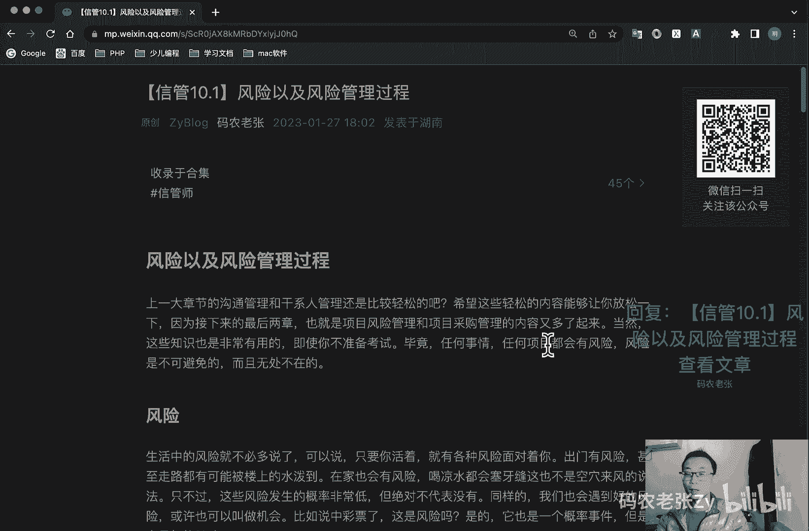

# 【信管10.1】风险以及风险管理过程 - P1 - 码农老张Zy - BV1Wj411u7bW

哈喽大家好，今天呢我们来学习的是信息系统项目管理师，第十大篇章的第一篇文章，风险以及风险的管理过程好，第十大篇章呢就全是讲风险了，上一大章节的沟通管理和干系人管理，还是比较轻松的对吧。

希望这些轻松的内容呢能够让你轻松一下，接下来，因为接下来的最后两章啊，也就是项目风险管理和项目采购管理，的内容呢又多了起来，当然了，这些知识也是非常有用的，即使你不准备考试啊，毕竟任何事情啊。

任何项目都会有风险，风险呢是不可避免的，而且是无处不在的，好我们再来详细的说一下生活当中啊，风险就不必多说了，可以说就是只要你活着，就会有各种各样的风险，面对着的你什么出门有风险对吧。

甚至走路都有可能被楼上的水泼到，在家也会有风险，喝凉水都会塞牙缝，这也不是空穴来风的一个说法，对不对，只不过呢这些风险发生的概率非常低，但绝不代表没有，同样的我们也会遇到好的风险，或者说可以叫做机会。

比如说你中彩票了，这是风险吗，对他也是一个风险，但是呢它是一个好的风险，它是个概率事件对吧，只要是概率事件，它就叫他可以叫风险，也可以叫机会，两面性，对不对，两面性是不是相对的好。

项目风险呢是一个比较规范的定义，指的是一种不确定的事件或者是条件，一旦发生，会对项目目标产生某种正面或负面的影响，项目风险呢既包括对项目目标的威胁，也包括促进项目目标的一些机会。

好我们看一下风险的属性啊，其实也可以看作是风险的一个特性，这些内容呢是从风险的定义当中，就可以看出来啊，它一般包括哪些呢，第一个就是风险事件，它是随机的对吧，所以它有个随机性风险事件的发生呢。

大概大都具有偶然性，如果不是偶然出现的风险，那我们是可以提前规划解决的，那么这样的事件呢其实就称不上是风险了对吧，就是我们正常的一个项目，一个业务的一个推进了对吧好，第二个呢就是风险存在是否存在。

有客观性和普遍性，就像我们上面说过的，生活当中的风险是无处不在的，项目当中的风险呢，就那那更是普遍客观存在的对吧，而且呢风险的出现也是必然的，特别是对于越复杂，参与人员越多的项目来说呢。

风险出现的概率也就越高，人多就意味着复杂性的增加，复杂性的增加了，就意味着熵的增加，商带来的就是各种混乱，这个呢我们在一开始就讲过对吧，商是什么东西对吧，热力学第二定律是吧，熵增好。

然后就是风险的一个相对性，风险呢总是相对项目活动主体而言的，同样的风险呢对于不同的主体有不同的影响，在这里呢我们要关注几个模型，他们分别根据几个因素来区分，对风险的承受能力，具体内容如下。

这个这个东西呢稍微稍微是需要去记一下的，好的，我们先来看一下，第一个就是收益的大小，就是损失的可能性和数额越大，人们希望为弥补损失而得到的收益也越大，反过来收益越大，人们愿意承担的风险也越大。

就是怎么说呢，简单的很简单的一句话就是收益越大，风险承受力越大，反之越小对吧，你赚的越多，你的风险承受力也就越大，反之越小好第二个就是投入的大小，项目活动投入的越多，人们对成功所抱的希望也越大。

愿意冒的风险也就越小，也就是说投入越大，风险承受力越小，反之越大，就投入越小，你的风险率存风险，承受利率也就越风，险承受力就越大，ok这个也很好解释啊，就是买彩票买彩票每天两块钱一注。

你的风险承受力是非常非常高的，但是你每天买1000块钱呢是吧，每天买1万块钱呢，对不对，你的风险承受力就会越来越小，注意啊，这个地方它是反过来的，上面那个是收益越大，风险承受力也就越大，他还是买彩票吗。

两块钱你中500万，对不对，你的收益越大，你的风险承受力越大，同时呢你的投入越小，你的风险承受力也就越大，这个这个是反过来，你投入越大，风险承受力越小，但是你投入越小，你的风险承受力也就越大。

这两个都可以拿彩票来说，对不对，彩票你的收益非常高，两块钱去赌500万，对不对，你的收益比较大，风险承受力大，同样的你的投入还是比较小，就两块钱，你的风险承受力量也比较大。

是不是这两个都可以拿彩票来说好，第三个就是项目活动主体的地位和拥有的资源，这个怎么说呢，就是管理人员中级别高的，同级别低的却相比能够承担更大的风险，就是说地位资源越高的风险承受力越大，反之就越小。

就想想起就有没有想起蜘蛛侠的经典，它是什么，能力越大责任越大，对不对，好最后呢就是风险的可变性啊，当然我前面这个再说啊，能力越大责任越大，对不对，其实我觉得地位和资源越高，风力风险承受力越大。

这两个稍微有一点过，我就是想到这一块了对吧，我就想到这一块了，它它不是特别相关的啊，好了我们再来看一下，就风险的可变性，多样性和多层次性风险性质啊，后果啊，都会因为当前环境的情况的不同。

而产生不同的效果，有的风险呢可能在项目初期，它是非常严重的一个风险，但是呢当项目后期可能就完全不是事儿了，同时呢风险又有着好坏，或者是没什么影响的各种形式，最后呢风险还是有不同等级层次的。

后面我们都会看到，总结一下就是风险的属性特点包括什么呢，客观性，普遍性和偶然性，必然性和可变性啊，多样性啊，多层次性好了，谢谢注意啊，这些包括这个地方还需要理解一下好，我们来看一下风险的分类啊。

它有好几种分类方式，我们先来看第一种啊，对风险我们可以从许多的角度来进行分类，另外呢从项目经理的业务角度呢，也可以对风险进行了一个简单的分类，我们放在后面两个小队再说，在这个小节呢。

我们先看一下通用的一个风险的分类，好我们根据风险的一个后果可以分为什么呢，分为纯粹风险和投机风险，纯粹风险呢就是不能带来机会，无获得利益的可能只有两种可能的后果，造成损失和不造成损失。

这种损失呢是全社会的损失，没有人能够从中得到好处的，这个就叫做纯粹风险，第二个呢投机风险既可能带来机会，获得利益，又隐含着威胁，造成损失，有三种可能的后果是什么，造成损失，不造成损失和获得利益好。

这个根据风险后果来分的呢，就是纯粹风险和投机风险的，在一定条件下是可以相互转化的，项目经理必须避免什么呢，就是投机风险转化为纯粹风险，第二个就是根据风险的来源来划分，风险来源主要包括自然风险和人为风险。

这个也不用多说了，由于自然力的作用，造成财产损失或者人员伤亡的风险，就是自然风险，然后由于人的活动而带来的风险呢，就可以分为它可以分为那行为啊，什么几经济啊，技术啊，政治和组织风险对吧。

这个这个也比较好记对吧，还有呢就是可管理啊，呃根据可不可管理呢，就可以分为可管理风险和不可管理风险，可管理风险呢就是可以预测，并且可以采取相应措施加以控制的风险。

然后不可管理的风险呢就是不可预测的风险好，根据影响的范围呢可以分为局部风险，总体风险，局部风险就是影响的范围小，总体风险呢就影响的范围大，局部风险和总体风险呢是相对而言的。

项目经理呢要特别注意总体的风险，最后呢就是可预测性，根据可预测性呢，可以预测出就是已知风险和可预测的风险，和不可预测风险，已知风险呢就是能够明确的后果，也可以预见的风险发生的概率高，但后果轻微，然后呢。

可预测风险呢就是根据经验可以预见其发生，但其后果不可预见，后果呢有可能相当严重，最后呢就是不可预测风险，不能预见的风险也称为未知风险，未识别风险一般是外部因素所作用的结果，好在上面这些风险中呢。

我们需要关注的是投机和纯粹风险的定义，以及它们是可以互相转化的，所有人呢肯定都是希望纯粹风险呢，变成投机风险，而不要让让投机风险呢变成了纯粹风险，另外呢就是已知可预测和不可预测风险的。

一个相关的一个概念，好这一块呢是需要去记一下的，好我们再看风险分类的第二种形式，除了上面那些基础的风险分类之外呢，我们在做信息系统相关的项目时，还可以将风险分为项目风险，技术风险和商业风险三类。

项目风险啊，它主要包括潜在的预算啊，进度啊，人员和组织资源，用户和需求问题啊，然后项目复杂性啊，规模和结构不确定性等问题出现的一些风险，然后技术风险呢主要包括潜在的设计实现接口，测试和维护方面的问题。

规格说明的多异性啊，技术上的不确定性啊，技术成就啊，最新技术不成熟啊等问题，可以看到，不管你的技术啊是太新还是太旧，都可能带来技术风险，最好的选择，当然是现阶段比较流行的一些成熟技术啊。

就是你你做大数据啊，或者是做人工智能啊，什么那些很多成熟的技术了对吧，现在已经很多成熟了，不要想太多了好吧，然后呢就是商业风险，商业风险呢主要包括什么呢，主要包括这几点，一个呢是市场风险。

系统虽然很优秀，但不是市场真正所需要的，这就是市场风险，第二个呢就是策略风险，系统不符合企业的信息系统战略，第三个呢就是销售风险，开发了销售部门不清楚如何推销的系统，第四个呢就是管理风险。

而失去上级支持的一个项目对吧，这个项目肯定也就是管理上的风险，最后呢就预算风险，开发过程没有得到预算或者是人员的一个保证，好，这是第二种情况，第二种分类对吧，然后呢第三种分类，第三种分类。

最后呢就是在项目内部，一般是根据是否识别出风险，以及是否可以应对风险来划分出几种风险类型，他们就是我和我们之前在进度和成本中，学习过的管理储备和应急储备是有重要联系的，还记得这两个吗，还记得这两个。

如果不记得的话，赶紧回去复习一下，就是在进度和成本当中都学过的，如果有同学忘了，就是赶紧去回去复习一下好，我们先来看啊，就是我们根据风险的一个情况，可以分为已知已知的风险，就是已经识别出来的。

并且进行过分析的风险，人们知道它是什么，风险以及发生的可能性和后果，通常按计算出的风险金额记录，具体的项目工作的成本中，也就是说对于已知已知的风险，其成本就按预期货币价值计算。

直接进入项目的各项活动中对吧，我们前面已经说过了，已知已知的这种就是你知道它发生的概率，也知道它可能产生的后果，这种风险就不太算是一个风险了对吧，你可以把它直接就当成一个工作任务来解决掉，就行了。

对不对，所以说呢他就是直接把它的成本，直接进入到项目的各项活动当中就可以了，好第二个呢就是已知的未知风险，就是你知道它应该会发生，你知道它大概的概率，但是你不知道它可能会造成这后果，对于这种风险啊。

对于这种风险呢就可以使用应急储备对吧，应急储备包括时间和成本的应急储备来应付，来应付，然后呢，应急储备呢，是项目成本基准的一个组成部分之一，好了这个之前在讲这个呃成本基准的时候讲过，对不对。

那条s曲线对吧，还记得吧，好了，最后一个就是未知和未知的风险啊，未知和未知风险，过去从没有遇到过的，完全未知的风险，万一发生了，就用管理储备对吧，管理储备来应付，对于未知未知的风险呢。

管理不是项目经理的责任，好这个呢就是如果我们题目中出现了未知风险，这四个字，基本上指的就是未知未知的风险，这种类型也就是一定会和管理储备挂钩，见到已知未知则是和应急储备挂钩的，已知已知的风险。

就像我们在文章开头说的，基本上不算什么风险了，就是项目的任务之一，所以我们直接将它和普通任务一样看待，包括成本及进度的制定呢，都按照普通任务进行预算，规划好了，再提一个问啊。

就是项目经理可以动用应急储备吗，好第二个问题是项目经理可以动用管理储备吗，都是我们之前学过的内容啊，好了再想一下啊，好就是这个已知已知风险，已知未知风险和未知未知风险地，前面的这个已知。

前面的这个已知未知，代表的是这个风险是不是可能发生，它大概的概率是怎么样的，就已知已知已知，然后呢，后面这个已知未知呢就表示这个风险的后果，知道吧，前面是概率，后面是后果好吧，这个地方我再重申了一遍啊。

ok风险成本及其负担啊，风险事件造成的损失呢或减少的收益，以及为防止发生风险事件，采取预防措施而支付的费用，都构成了风险成本，风险成本呢包括有形成本，无形成本以及预防和控制风险的成本。

有形成本呢又包括直接损失和间接损失，直接损失就是指财产损毁和人原伤亡的价值，然后呢，间接损失呢是指直接损失以外的其他物价值，责任损失，以及因此而造成的收益的一个减少，无形成本啊。

就是指由于风险所具有的不确定性，而使项目主体在风险事件发生之前或者之后，付出的代价主要包括风险损失，减少了机会，风险阻碍了生产利率提高，以及风险造成的资源的分配不当，风险预防与控制的成本呢是为了预知。

预防和控制风险损失，必须要采取各种措施，如向保险公司投保啊，什么配备必要人员等等哈，这个了解一下就可以了，好我们再来看一下项目风险的管理过程啊，项目风险管理过程呢，就是在风险成为影响项目成功威胁之前呢。

识别着手处理并消除风险的源头，项目风险管理呢，就是项目管理班子通过风险识别，风险估计和风险审计，并以此为基础，合理地使用多种管理方法，技术和手段，对项目活动涉及的风险进行有效的控制，采取主动行动。

尽量扩大风险事件的有利结果，妥善的处理风险事故造成的不利后果，以最小的成本保证安全可靠地实现项目总目标，好，它包括几个过程组啊，我们看一下它它在两个过程组里面，一个是规划过程组，一个是监控过程组。

主要的过程呢包括12346个好，第一个规划风险管理定义，如何实施项目风险管理活动的一个过程，第二个呢就是识别风险，判断哪些风险会影响项目并记录其特征的过程，并综合分析风险发生的概率和影响。

对风险进行优先级排序，从而为后续分析和行动提供基础的过程，然后下一个呢就是实施风险定量分析，一个是定性，一个是定量，就以识别风险，对项目整体目标的形象进行定量分析的过程，然后呢就是规划风险应对。

针对项目目标制定提高机会，降低威胁的方案和措施的一个过程啊，应对了啊，对吧，分析出来了就要应对了，最后呢就是控制风险，在整个项目中呢实施风险应对计划跟踪，以识别风险，检测财运风险。

识别新风险和评估风险过程有效性的一个过程，好总结一下，今天的内容呢，主要就是入门了解一下风险相关的定义，以及风险的分类啊，三个大的分类啊都很重要，然后呢其中风险的属性啊。

常见分类以及项目风险分类呢是重点内容，总体来说呢内容并不多，大家应该还是比较好消化的，好了，今天的内容呢就是这些，大家可以回复文章的标题，信管10。1，风险以及风险管理过程，来获得这篇文章的具体内容。

还是要详细的来看一下的好了，今天内容就是这些。

