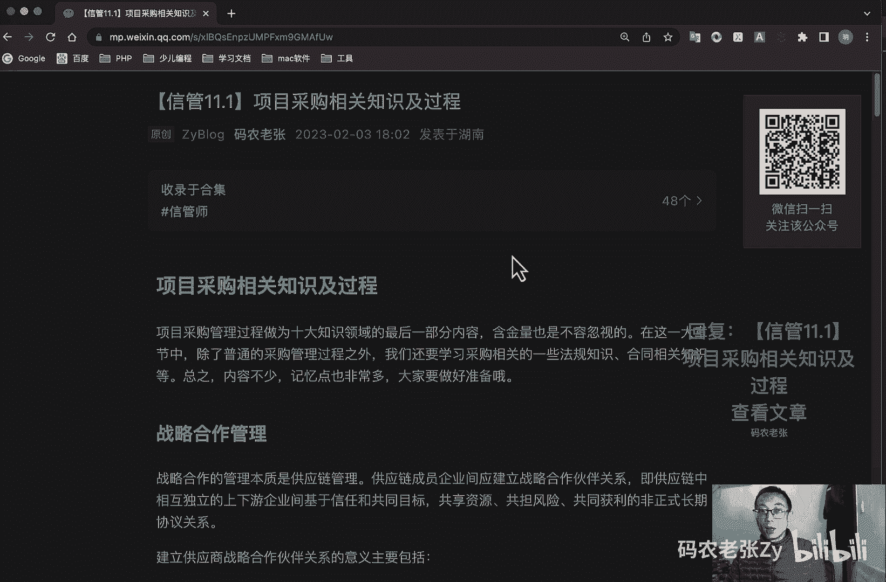
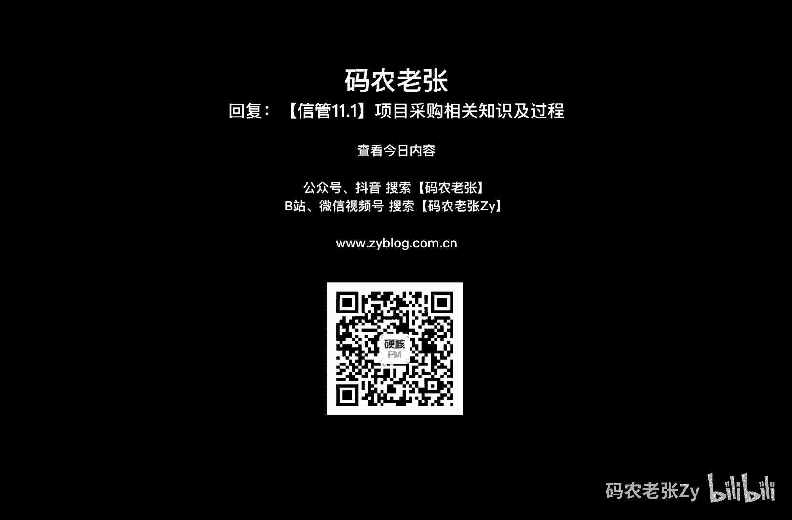

# 【信管11.1】项目采购相关知识及过程 - P1 - 码农老张Zy - BV16M4y167sm

哈喽大家好，今天呢我们来学习的是信息系统项目管理师，第11大篇章的第一篇文章，项目采购相关的知识及过程啊，项目采购管理过程呢，作为十大知识领域的最后一部分，内容呢，含金量也是不容忽视的。

在这一大章节中呢，除了普通的采购管理过程之外呢，我们还要学习采购相关的一些法规知识，合同相关知识等等，总之呢内容不少，记忆点也非常多，大家做好准备好，我们先来了解一下战略合作管理。

战略合作管理呢本质是供应链管理，供应链成员企业应建立战略合作伙伴关系，即供应链中相互独立的上下游企业，基于信任和共同目标，共享资源，共担风险，供货共同获利的非正式长期的协议关系。

建立供应商战略合作伙伴的关系，意义主要包括，第一可以缩短供应商的供应周期，提高供应灵活性，第二呢可以降低企业采购设备的库存水平，降低管理费用，加快资金周转，第三呢就是提高采购设备的一个质量。

第四呢就是将应该可以加强与供应商沟通，改善订单的处理过程，提高设备需求的准确度，接下来呢可以共享供应商的技术与革新成果，加快产品开发速度，缩短产品开发周期，最后呢就是可以与供应商共享管理经验。

推动企业整体管理水平的一个提高，供应商战略合作伙伴关系构建的流程呢，主要包括分析市场环境，竞争环境，合作伙伴的主因素，分析建立合作伙伴关系的标准，评价和选择合作伙伴，以及建立和实施合作伙伴关系等等。

好了这个东西了解一下就可以了，接下来呢我们就看一下招投标，招投标法，招投标法关于招投标法，政府采购法以及合同法的内容呢，我们这里先简单的介绍一下，在后面的法律法规相关的汇总课程中。

会有详细的列出相关的法律条文中的重点内容，招投标很明显就是和招标投标相关的法律内容，它不仅限于信息软件行业，而是整个社会全行业相关的，如果你是做工程相关的，不管是建筑还是市政。

相信招投标和坐标书都是你天天能听到的词汇，因此呢学习这一块的内容，保证你是只赚不赔，毕竟它是全行业通用的好，招投标法规定了招投标的五个步骤，它分别是招投开屏中什么，招标投标，开标评标。

中标这五个步骤呢可以继承招投开屏重招标，招标就是在招标过程中呢，我们要秉持公开公正，公平诚实信用的原则呢，召开招标大会或者是发布招标信息，可以由招标代理机构作为招标啊，就是代为招标。

招标可以分为公开招标和邀请招标两种，最后呢招标需要准备招标文件，第二个就是投标，投标一般会有投标会议，讲述项目情况，发发放投标文件，正常来说呢，参与投标的投标人呢应该在三个以上啊，注意啊，他都是单数啊。

三个以上如果有需要，可以允许进行联合标的，第三个呢就是开标，由工作人员在开标现场，对在截止日期之前收到的所有标书，进行现场拆封宣读，投标信息，投标价格等主要内容，第四个呢就是评标。

由招标人根据相关法律规定组成，五人以上啊，注意五人以上的的评标委员会，这些委员呢应该有，2/3以上为技术或经济专家组成的，这里是一个小重点啊，这几个五人2/3的经济或技术的专家好。

然后由委员会呢根据客观事实为依据，严格控制自由裁量权，以易于评审的标准进行打分，得分呢应能明显分出高低，能够体现国家规定和政策，并且要对细则进行横向的一个比较好，最后一个就是中标。

根据得分确定中标人之后呢，向中标人发出发出中标通知书，然后进行例行的一个商务谈判，商讨标的事宜，商量分包事宜，并在30日之内要30日之内签订合同，好，再来看一下政府采购法，在政府采购法的部分呢。

我们先简单了解一下，政府采购的形式和一个注意的事项啊，第一个我们先看一下采购的形式，政府采购的形式呢一般包括公开招标，就前面说的那些的啊，然后邀请招标，竞争性谈判，单一来源采购，认定了其他采购方式。

公开招标就不多说了，就是我们上面说过的招投开屏中的那些步骤，然后呢，认定的其他采购方式呢也不用多解释，是部门规定的采购方式，只在一次采购中有效，下次采购呢有可能会出别的形式了，不具备共通性。

剩下的几个呢我们再一个一个来看一下好，第一个就是邀请招标，邀请招标呢，主要就是通过邀请的方式来进行一个招标，没有发布公开的一个招标信息，不公开的招标信息的，所有参与的投标人都是经过邀请而来的。

一般来说呢，如果要使用邀请招标，有两种情况，第一要么是因为项目具有特殊性，只能从有限范围的供应商处采购，第二个呢就是要么是采用公开招标的方式，费用占政府采购项目的价值比较大。

当然你还是个人企业采购也有可能占的价，那个价值比较大的话，也可能是进行一个邀请招标好，第二个叫做竞争性谈判，它呢是指采购人或代理机构通过与多家供应商，不少于三家要进行谈判。

最后从中确定供应商的一种采购方式，使用竞争性谈判，大多是因为第一招标后没有供应商投标，或者是没有合格标的，或者重新招标未能成立的，就是招标失败了，对吧好，第二种呢就是技术复杂或者性质特殊。

不能确定详细规格或者具体的要求的好，第三种呢就是采用招标所需时间，不满足用户紧急需要的，最后呢就是不能实现计算出总价格的好，这个就要采用竞争性谈判了，第三个就是单一来源采购，单一来源采购呢。

就是只能从指定的那一家供应商处进行采购，如果要使用单一来源采购，大部分是因为也有几个原因啊，第一个就是只能从唯一的供应商处采购，它这个东西，它只有它这里有卖的好吧，第二个呢就是发生了不可预见的紧急情况。

不能从其他供应商处采购的，就是时间来不及了，不能跟别人谈判了，来不及跟别人谈判了吗，你只能还还能从原来这个人这里去买，对吧好，第三个呢就是必须保证原有采购项目一致性，或者服务配套的要求。

需要继续从原供应商处采购，且添购资金总额，不超过原合同采购金额10%的好，这批配件跟上批配件你都必须从他这里买，对不对，要么不配套啊，对不对，这个东西呢也是单一来源采购好，下一个就是询价。

只采购人向有关供应商发出询价单，让其报价在报价基础上进行比较，并确定最优供应商的一种采购方式，这种采购方式呢大都是货物规格标准统一啊，然后现货货源充足，且变化幅度较小的一个政府采购项目好。

再看一下注意事项，政府采购中需要注意的内容呢，包括废标的条件，竞争性谈判的步骤，询价的步骤，以及对于采购问题的质疑，我们简单了解一下啊，第一个就是废标，废标呢就是当前标题无法继续。

需要废除本次投标的一个情况，达成废标的条件呢主要包括，第一个就是符合专业条件的供应商，或者对招标文件的做实质响应的供应商，不足三家，第二个呢就是出现响应，影响采购公正的违法违规行为了，违法违规了。

那这个肯定不行了啊，第三个就是投标人的报价均价超过了采购运算，采购人不能支付的，下一个呢就是因重大变故，采购任务取消的费标之后呢，采购人应当等，将废标理由通知给所有的投标人好，第二个就是竞争性谈判啊。

他呢是需要成立谈判小组的，需要制定谈判文件的之后呢，确定邀请参加谈判的供应商名单，接下来就是近视进入谈判，最后根据谈判结果来确定成交的一个供应商好，接下来就询价询价，同样也是要先成立一个询价小组。

然后确定被询价的供应商名单，接下来就是具体询价过程，这个过程可能是会议，也可能是其他形式，最后根据询价结果呢确定成交供应商，最后呢就是质疑啊，供应商认为采购文件，采购过程和中标成交结果。

使自己的权益受到损害的，可以在知道或者应知，其权益受到损害之日的七个工作日之内，以书面形式向采购人提出一个质疑，好这个是注意事项相关的内容，接下来我们看一下外包好，不知道呢。

这里有没有就是在外包公司工作的同学啊，对于外包的概念呢，其实我们互联网行业的同学都应该比较清楚的，即使你不是在外包公司工作，那你也有可能会有和外包公司合作的一个经历。

甚至现在我们可以把阿里云这样的云服务，提供商，也可以看作是我们的外包和合作公司，因为我们的云服务，不就相当于是把那些基础服务，你就是那个服务器啊，这些算力啊，去外包给他们了对吧，其实呢外包真正的含义呢。

就是指的是利用外部的资源为自己服务，从而达成降低成本，高效的提高效率一个效果，这样的话呢能够更加集中精力的，发挥自己的一个核心竞争优势，增强自身的应变竞争能力，为什么很多企业会将他们的软件服务。

或者信息系统交给外包来做呢，这就是因为它本身的核心优势呢，可能更多的是在于他们自己的业务场景上，而it服务呢只是周边的一个，锦上添花的一个服务，在这种情况之下呢，外包其实是比较好的一个选择。

记住外包应该是外包非核心业务，达到节约时间和成本的目的，如果你本身就是互联网公司，那么你自己核心互联网服务肯定是不会外包的，对吧，腾讯腾讯他会把他的微信给外包给别人来做吗，可能吗对吧。

但是招聘之类的需求呢，则可以完全委托给boss，智联啊之类的专业招聘公司对吧，我腾讯公司我要招人，我那那我可以跟他们合作，对不对，他们更专业一些好，这这样的话其实也是一种外包服务，it服务的外包形式呢。

包括委外服务，就是全外包，然后这种情况下呢连设备都是外包方的，另外一种呢就是运维外包，这种情况下的设备一般是自己的，但开发运维呢会交给外包公司来进行，除此之外呢，外包还有一种分类形式。

根据外包的内容和服务分为活动，外包服务外包内包，荷包，利益关系外包等等，好进行外包的流程呢可以改，简单概括为以下一些步骤啊，就是开发方式的选择，承包商选择竞标邀请，评估候选承包商的综合能力。

确定承包商签订外包合同，然后监控外包开发过程啊，成果验收验收准备啊，成果审查验收测试问题处理，成果交付，对于外包业务来说呢，它的优势包括提高企业竞争力，节约成本，提高效率，能够获得专业高品质的服务。

可以降低企业资产，而劣势其实也比较明显，就是对未来技术的了解会越来越少，控制性和安全性得不到保障，然后具有依赖性，采用外包的目的的来源呢，主要是因为可以通过外包公司的技术能力，获得一些特殊的能力啊。

这个是有意思啊，对对对吧，就我前面说的那个你的核心业务不是做IT的，那么你可以把这个T业务外包给其他一些公司，这样其实你也就获得了一些外包公司的，那些的it技术能力，对不对，然后呢。

就是能够将风险转嫁到一部分到外包公司，这个我之前在风险里面其实也讲过了对吧，找一个合作公司对吧，哪些部分外外包给他的话，其实也是相当于把风险转移给他们的一部分了，然后就是固定成本转变为了可变成本。

对外外包业务的一个输出，其实是一个可变的可变的内容，对不对，你需要外包多少东西对吧，你可以去自己去制定的，这样的话它就变成了一个可变的成本，然后就是可以改善服务，可以实施流程控制，能够集中管理时间进度。

可以保持项目开发过程的一个客观性，关于外包这些内容呢，大家还是需要了解一下的，不过出题的可能性不高，好卖方与买方，因为应用领域的不同的卖方可以是承包商，供货商，然后服务提供商或者是供应商。

买方呢可能为最终产品的所有人啊，分包商啊，收购机构啊，服务与需求者或者是购买方，在合同生命周期中的卖方，首先是投标人，然后是中标人，之后是签约供应商或者是供货商号，了解一下就可以了，跟外包那样了解一下。

OK我们来看一下项目采购管理过程，关于采购管理的一些额外的相关知识呢，就是上面的一些内容了，下面我们就来看一下项目采购管理的，主要四个主要过程了，第一个就是规划过程组里面的规划，采购管理记录。

项目采购决策，明确采购方法，识别潜在卖方的过程，主要包括制定采购计划，合同，编制询价计划编制等等，然后呢就是执行过程组里面的实施采购，获取卖方应答，选择卖方并授予合同的过程，包括询价购房选择等等。

然后呢就是监控过程组主要是控制采购的啊，他是管理采购关系，都合同绩效，以及采取必要的变更和纠正措施的过程，主要是在于一个合同的管理，最后呢就是收尾过程组里面有一个结束采购。

它主要就是完成单次项目采购的过程，包括一个合同的一个收尾，注意项目采购管理过程中的结束，采购是除了项目整体管理之外，唯一一个有收尾过程组的，其实意义也很明确，就是在项目结束的时候。

我们的采购相关的工作也一定要全部都结束，否则项目都结束了，这些合同还没结束，或者说还有采购的款项没有去结算的话，那么也会引起很多不必要的麻烦，这个东西就很麻烦了，对吧好，总结一下关于项目采购的内容呢。

其实也就是有不少的是一些扩展知识，是需要我们了解的，今天呢我们就先简单的看了一下招投标的步骤，以及政府采购相关的内容，这些内容呢如果你是面向国企或外和外包，或者说是大型企业中负责外包业务的员工的话。

想必不用我多说，你对这些内容也十分的了解，如果你之前没接触过的话，那么这一块还是比较重要的，需要去记下来，并且还要结合我们之后的这个法律法规，相关的课程一起进行一个学习记忆，当然现在内容只有这些。

先消化消化，我们接下来先进入到的就是项目，采购管理的那几个过程的学习，就是下一篇课程内容的内容了好了，今天的内容呢就是这些，大概可以回复文章的标题，信管一十十一。1，项目采购相关知识及过程。

来获得这篇文章的具体内容，详细的内容大家还是要仔细的来看一下的好了。

今天的内容呢就这些。

