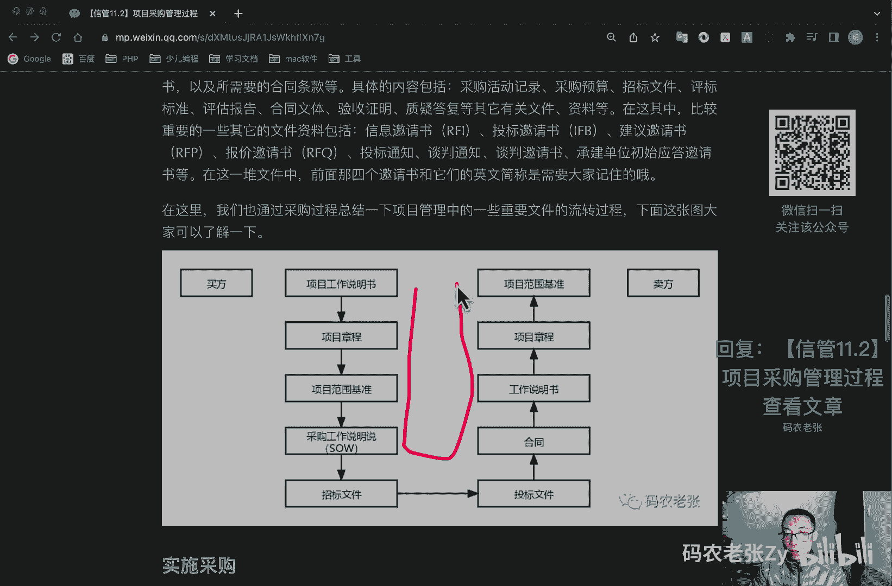
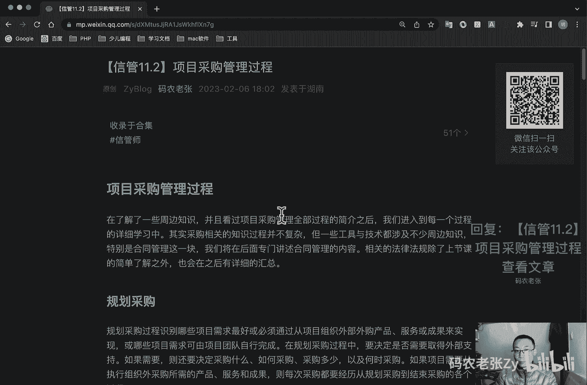

# 【信管11.2】项目采购管理过程 - P1 - 码农老张Zy - BV1fY4y1D7Zx

hello，大家好，今天呢我们来学习的是实验系统，项目管理师第11大篇章的第二篇文章，项目采购管理过程，在了解了一些周边知识，并且看过项目采购管理全部过程的简介之后呢。

我们就进入到每一个过程的详细学习中，其实呢采购相关的知识过程并不复杂，但一些工具与技术都涉及不少的周边知识，特别是合同管理这一块，我们将在后面呢专门去讲述合同管理的内容，相关的法律法规呢。

除了上节课的简单了点之外呢，我们在后面呢也会有一个详细的汇总，好，我们今天呢就是主要还是先来看一下，项目采购的一个管理过程，ok我们先看一下规划采购，规划采购过程呢，它是识别哪些项目需求最好。

或必须通过从项目组织外部外购产品，服务或成果来实现，或者说哪些项目需求呢，可以由项目团队自行完成，在现在规划采购过程中呢，要决定是否需要取得外部支持，如果需要的话，则还需要决定采购什么，如何采购。

采购多少以及核实采购，如果项目需要从执行组织外采购所需的产品，服务和成果，则每是采购呢都要经历从规划采购，到结束采购的各个过程，项目进度计划呢会对规划，采购过程中的采购策略制定产生重要的影响。

在编制采购管理计划过程中所做出的决定，也会影响项目进度计划，应该把采购管理计划编制工作与制定进度计划，估算活动资源和自制或外购决策等整合起来，这个东西还是比较重要的，在采购里面是非常重要的一个东西。

质字或者是外购的决策，在规划采购过程中呢，要考虑每个自制或者是外购决策，所涉及的一个风险，也要审查，为减轻风险，有时向卖方转移风险，而你使用的一个合同类型上面来回说了几遍，自制外购决策是什么，对吧。

我前面说过了，这个东西也是比较重要的啊，其实呢它就是规划采购的一个工具与技术，除了工具与技术之外呢，规划采购的输出也是非常值得我们关注的，好了，那我们就先来看一下工具与技术，再看一下输出方面的内容。

好我们先来看一下自制与外购分析，这个呢就是确定我们需要的产品服务或成果，或者是某些工具到底是我们自己开发实现呢，还是通过采购的方式从外部获得的，在做自制与外购分析时，要综合考虑所有的成本。

包括直接与间接的各种成本，除了成本之外呢，还可以看需要的内容是否符合企业或项目战略，符合战略的，应该自制，不符合战略的呢，这应该外包，ok这一点是比较重要的，符合战略的，符合我们企业战略的。

应该我们自己来做对吧，核心的内容应该我们自己来做，然后不太符合我们战略的，或者是周边那些东西呢，其实选择外包是一个非常好的一个选择，ok我们再来看第二个就是市场调研，主要包括考察行业情况和潜在供应商。

项目的采购团队呢，可以综合考虑从网络上的在线评论，展销会等各种渠道得到的信息来了解市场情况，同时可能也需要考虑，有能力提供所需材料或服务的，潜在供应商的范围，权衡与之有关的风险，并优化具体的采购目标。

尽可能利用成熟的技术，下一个呢就是合同类型的选择，其实合同类型的应该是规划采购的输入，属于组织过程资产的一部分，但是在规划的时候呢，我们就应该确定好合同类型的选择，所以在这里呢。

也可以将它视为规划采购的一个工具与技术，根据合同的内容呢，包括总承包合同，单项承包合同，分包合同这几种，而根据价格分呢，可以分为总价合同，固定总价，总价加激励费用，总价加经济价格调整。

另外呢就是成本补偿，合同成本加固定费用成本加激励费用，成本加奖励费用，还有工料合同，关于合同的内容呢，我们在下一刻就会去详细的说明了，主要就是这些东西啊，那这些东西呢其实也是非常重点的一个内容。

好我们接着再来看一下输出，也就是采购管理计划，采购管理计划呢描述的是从行程，采购文件到合同收尾的全部的采购过程，计划主要解释采购什么，采购的时机，采购的方式，采购的数量，采购的成本的制约因素等等。

具体来说呢，它主要包括采购的合同类型，是否采用独立估算作为评估标准，由谁来准备，独立估算，何时进行独立估算啊，这个也是比较重要的关键词，独立估算，如果项目的执行组织设，就是设有采购合同或者是发包部门。

项目管理团队本身能采取哪些行动，接着呢就是标准的采购文件，如果需要的话，有哪些管理，多个供应商协调采购与项目的其他方面，例如确定进度与绩效报告，能对计划的采购造成影响的任何约束和假定，处理。

从卖方购买产品所需要的提前订货金，并与他们一起协调项目进度进制定的一个过程，进行自制或者是外购的一个决策啊，这个也是要记录到采购管理计划里面的，并与活动资源估算过程，制定进度计划过程联系起来。

确定合同中规定了每个可交付成果的日期安排，并与制进度制定过程和进度控制过程相协调，确定履约保证金或者保险合同，以减轻项目的风险，为卖方提供指导，以帮助其制定与维护，w b s，确定采用于采购或合同。

工作说明书的形式和格式，确定通过资格预审的一个卖方啊，就确定卖方是谁啊，你要合作的是谁，也是你的乙方是谁，然后呢，就是管理合同和评估卖方的一个衡量指标，ok这里呢还输出了一个就是采购工作说明书。

采购工具说明书s o w s o w呢，它是一份对于所购买的产品，成果或服务的一个详细说明，一般采购工作说明书都来自项目范围基准是吧，看到这个单词就很熟悉，对不对，项目范围基准里面有一个什么东西啊。

跟这个单词很像的好，它一般包括任何所需的间接服务，例如对于所采购项目所提供的绩效报告，或者是项目后期的运作支持，它的所有说明呢必须是清晰完整，简单明了的，以便潜在的卖方呢确定是否有能力。

提供此产品服务或成果，当然具体的强烈程度与采购品的性质，买方的需求，合同形式等有关，并没有统一的标准，具体呢它包括前沿项目，工作范围，项目工作方法，假设条件，工作期限和工作量，估计双方角色和职责。

可交付成果完成以及验收标准，服务人员聘用标准，收费和付款方式变更，管理承诺，保密等等的内容好，还有一个输出就是什么呢，采购文件，采购文件呢是用来得到潜在卖方的，报价建议书啊，报价建议书关键字啊。

报价建议书是采购文件里面的，一般包括规定的应答格式，相关的采购工作说明书，以及所需要的合同条款等等，具体的内容呢包括采购活动记录，采购预算，招标文件，评标标准，评估报告，合同文体要考合同文件。

应该合同文件，然后是验证验收证明，质疑答复等其他有关文件资料等，在这其中比较重要的一些其他文件资料，包括信息邀请书，它的简称是i fi，投标邀请书简称是rf b，建议邀请书简称是rf p。

然后报价邀请书简称是rf q，这几个还是要了解一下的啊，就是出现这个简写的，你要知道他大概是哪一个邀请书对吧，哪一个邀请书都是几个邀请书，然后呢还有投标通知，谈判通知，谈判邀请书。

承建单位初始应答邀请书等等，在这一堆文件中呢，就是前面这四个，就是刚刚说的这四个邀请书和他们的英文，简称呢是需要大家记住的，好在这里呢我们也通过采购过程来总结一下。

在项目管理中一些重要文件的一个流转过程啊，其实就是对应于买方和卖方来说，这些文件的一个形式啊，好我们在买方这边呢主要是项目工作说明书，然后呢它会生成一个项目章程，然后呢进一步变成项目。

进一步是输出这个项目范围基准，然后变成一个采购工作说明书，s o w对吧，然后变成一个招标文件，但是在卖方这边呢，其实这个招标文件对他们来说就是他们要形成，就是在卖方这边呢，它要形成一个投标文件。

对不对，然后投标文件，他这个投标文件里面要符合合同里面规定，所有工作的一些工作，这些工作呢其实就来自于财务工作说明书对吧，这里就是工作说明书，它其实就是一个范围的基准对吧。

然后呢项目章程对应的是项目章程，这个就没什么多说的了，最后就是在卖方这边的项目范围基准呢，其实就是相当于买方那边，我们要招标的那个项目工作说明书对吧，这两边就是有有一点点这种关联的意思，在这里啊。

一个具体的一个文件的一个流转过程。

好我们再来看第二个过程，那就是实施采购，实施采购呢是获取卖方应答，选择卖方授予合同，达成协议，使内外干系人的期望一致的过程，其实说白了他就是如果决定，如果决定我们要采购的话，招投标的一个过程。

为什么这么说呢，因为它的输出呢就是选中的卖方和合同这两项，他的输出就是这两个东西啊，选中的卖方就不用多说了，就是按照供方标准，对各个卖方的建议书或者投标书，进行评价之后呢。

选出最合适的一个或者是多个卖方，选好了，就是按我们之前规划过程中的合同类型，来签订合同或者协议了，这个合同或者协议只要签订了，那么它的内容呢只要不是违法的，双方必须履行合同中约定的权利和义务。

一般合同或协议中会包括采购工作说明书，或主要的可交付成果，定价和支付条款，检查质量和验收标准，终止条款和替代争议解决方法等等，对于实时采购来说呢，重点也是在工具基础之上好。

第一个呢就是投标人会议也成为发包会，承包方，承包商会议，供应商会议，投标前会议或者是竞标会议，它是用来确保所有潜在供应商对采购目的，如技术要求和合同要求等，有一个清晰共同的理解。

对供应商问题的答复可能作为修订条款，包含到采购文件当中，在投标人会议上，所有潜在供应商都应得到同等对待，以保证一个好的招标结果，就是这个就是投标人的会议啊，然后呢就是分析审查，通过审查供应商以往的表现。

项目团队可以发现风险较多，需要密切监督的领域，以确保项目的成功，现在呢就是建议书评价技术，对于复杂的采购呢，如果要基于卖方对既定加权标准的响应情况，来选择卖方，则应该根据卖方的采购政策。

按照正式的建议书评价评审流程，对各个潜在卖方的建议书进行评价，建议书评价委员会呢将会做出他们的选择，在授予合同之前呢，还要报管理层批准，最后呢就是独立估算，采购组织呢能够进行独立估算。

以检查卖方建议书当中的报价，如果报价呢与估算成本有很大的差异，则可能表明合同工作说明书不适当，或者说潜在的卖方误解，或者说完全没有，就是完全没有能完全理解和答复工作说明书，或者说市场已经发生了变化。

剩下的还有呢就是广告啊，发布招标信息的用的对吧，然后搜索啊就是查找潜在的供应商，然后就是采购谈判，签订合同前的最后确认谈判等等工具，大家可以参考教材当中的内容，说明这个不是重点了，重点就是这几个。

就这四个啊，好我们再接着往下看，就是控制采购，控制采购呢是管理采购关系，监督合同执行情况，并根据需要实施变更和采取措施的过程，它确保卖方可以，买方可以按合同条款去执行，并保证产品或服务质量的控制。

买方和卖方都处于相似的目的，而管理采购合同，有多个供应商的较大项目的合同，管理的一个重要方面呢，就是管理各个供应商之间的界限，由于组织结构的不同啊，许多组织把合同管理，与项目组织相分离的一种管理职能。

虽然采购管理员呢就是可以是项目团队成员，但它通常向另外一个部门的一个经理去报告的，就是采购管理员，一般是向另外一个部门的经理去报告的，在控制采购过程中呢，应该根据合同来审查和记录卖方当前的绩效。

或者是截止目前的绩效水平，并在必要时采取纠正措施，可以通过绩效审查，考察卖方在未来项目中实施类似工作的能力，在需要确认卖方未履行合同义务，并且卖方买方认为应该采取纠正措施时。

也应该进行类似的一个审查控制，采购呢还包括根据合同终止条款呢，来管理合同工作的一个提前终止，因成本或者是违约而提前终止了对吧，在合同收尾前呢，经双方共同协商，可以随时根据合同的变更控制条款。

对合同进行一个修改，这种修改呢并不总是有同样有利于买卖双方的，综上所述，在控制采购当中的合同管理，违约处理呢是非常重要的内容，这些其实也就构成了控制采购的工具与技术，他们主要就是包括合同变更控制流程。

采购绩效审查检查与审计，绩效报告，支付系统，索赔管理记录管理系统等等，其中的合同相关的内容呢，是索赔管理相关的内容中，我们将在下次课进行详细讲解的一部分啊，好最后在控制采购过程输出的。

其实呢就是工作绩效的信息，以及可能出现的一个变更请求了，好最后一个就是结束采购，结束采购呢是完结本次采购的过程，把合同和相关文件归档，以备将来参考，这个是什么意思啊，其实很明显他就是在更新组织过程。

资产其实呢它主要就是进行一些行政工作的，需要一些处理工作啊，比如说索赔资料的一个整理，然后更新记录信息的存档，以及一些未决的争议，这些味觉争议要怎么处理呢，诉讼合同结束程度等等啊。

这些这些在结束采购过程中的工具与技术呢，主要就是下面这三个，第一个呢就是采购审计，采购审计呢是指对从规划采购过程，到管理采购过程，所有的采购过程进行结构化审查，其目的是找出可在本项目其他采购合同。

或者是执行组织内其他项目，间接的成功经验与失败教训，就更新组织过程资产对吧，采购审计好了，第二个就是采购谈判，也就协商解决，在每个采购关系中呢，通过采购，通过谈判公正的解决全部未决的事项，索赔和争议。

如果通过直接谈判无法解决，那就可以尝试替代争议的解决方案，也就是d a d r这种方法好，这个大家记住这个缩写就可以了，它们代表的就是强势替代争议解决的一个方法，好最后一个就是记录管理系统。

项目经理呢采用记录管理系统来管理合同，采购文件和相关记录，它包含一套特定的流程相关的控制功能，以及作为项目管理信息系统，一部分的自动化工具，该系统中包含可检查的合同文件的往来函件，的一个档案。

ok最后总结一下啊，在今天的学习内容中呢，其实我们最主要关心的就是这个采购过程的工，具与技术，能够了解清楚他们的概念和定义就可以了，然后呢就是规划采购管理过程中，输出的采购管理计划。

采购工作工作工作说明书以及采购文件，这三个文件相关的内容，不过呢，今天的内容呢都不是特别的重要的内容啊，因为在采购过程中呢，最最重要的内容其实是合同相关的内容，我们就是我已经提过很多遍了。

今天就是在下次课中会详细的去讲，这个合同管理相关的内容啊，好下下一节课主要是一个合同的一个分类，相关的内容，ok非常非常重要，好了，今天的内容呢就是这些，大家可以回复文章的标题，像信管11。

2项目采购管理过程，来获得这篇文章的具体内容，以及一些详细的解释和说明，还是需要来看一下的，好了，今天的内容呢就这些。

