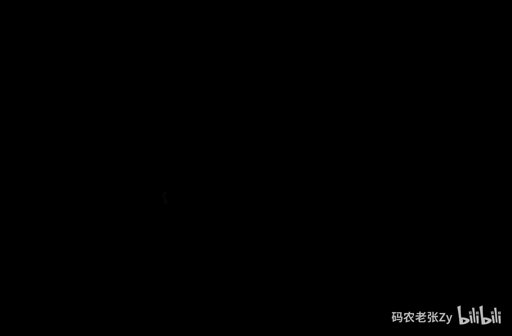
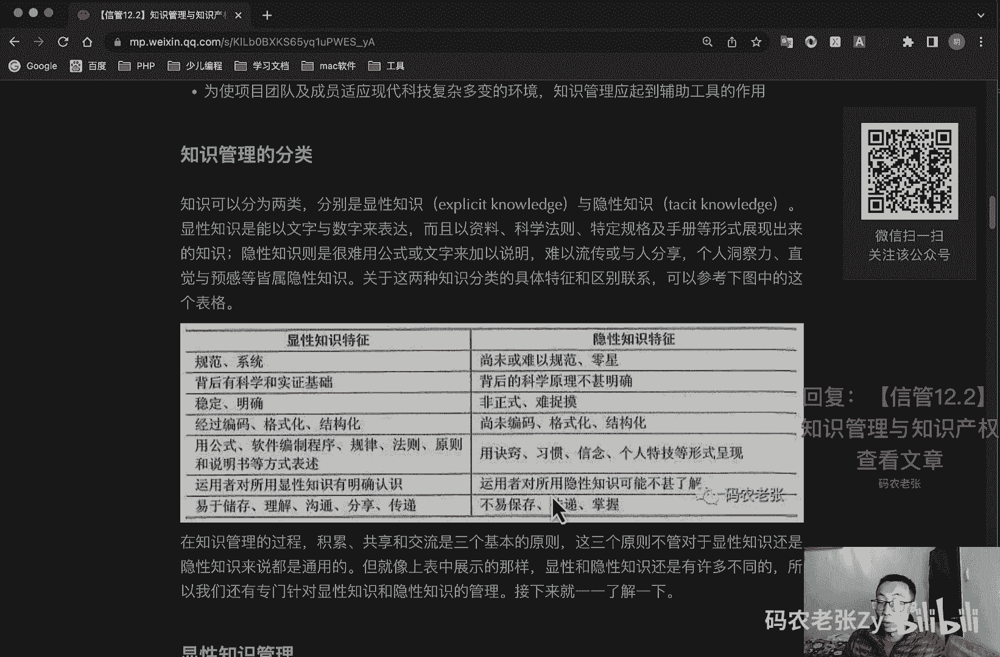
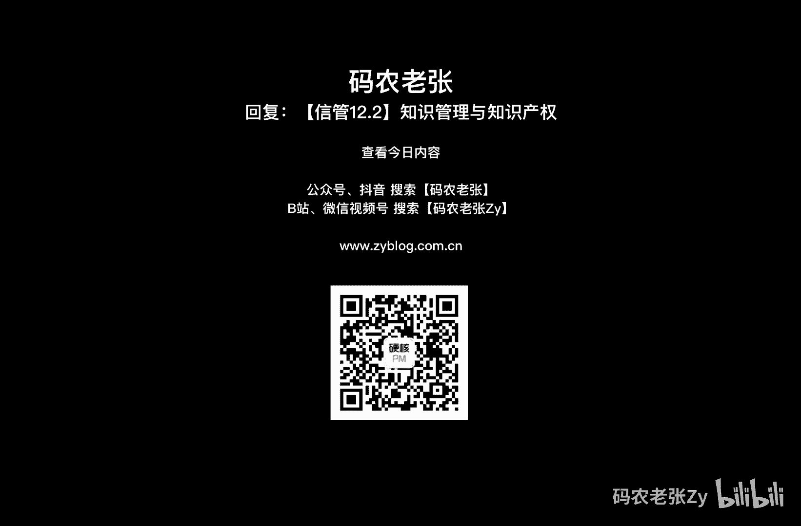

# 【信管12.2】知识管理与知识产权 - P1 - 码农老张Zy - BV1zh411g7Eg

哈喽大家好，今天呢我们来学习的是信息系统项目管理师，第12大篇章的第二篇文章，知识管理与知识产权，想必你对知识的概念要多少，都会有一些自己的理解，毕竟我们经过了这么多年的教育。

学来学去的可不都是学习的知识嘛对吧，在今天的学习中的内容还是会比较多，因为除了知识管理相关内容之外呢，还有知识产权相关的法律法规的学习，这些呢都是必须原谅摘抄的对吧，所以后面内容比较多。

不过也不用太担心，大家只要把握关键点进行记忆就可以了，然后这些内容呢我可能也会跳的去说啊，就跟我们看那个采购啊，相关的一些法律法规一样的，也不会完全的去读它，因为实在太多了，对吧好了。

我们先来看一下知识与知识管理，知识呢它是符合文明发展方向呢，对人类对未知物质世界以及精神世界，探索的一个结果的总和，知识呢也没有一个统一而明确的界定，但知识的价值判断标准在于实用性。

以及能否能让人类创造新物质，得到力量和权力等等为考量，以上呢就是这一段啊，这一段他是就是从百度百科里面去粘过来的，一个定义看着呢还是比较抽象的对吧，其实呢知识呢它是一种数据，根据一定的范式组合成的。

包含一些特定领域相关的信息认知，它是来源于实践，又反作用于实践的指导实践的，他那是解决问题的一个结构化的一个信息，好知识管理，知识管理呢是对有价值的信息进行管理，包括知识的识别获取分解存储传递共享。

价值判断和保护，知识管理呢主要涉及的工作包括，自下而上的监测，推动与知识有关的活动，然后呢创造和维护知识基础设施，更新组织和转化知识资产，然后呢使用知识以提高其价值，知识管理呢在知识资产管理啊。

学习新组织啊，人力资源和信息化四个方面的进行深化和突破，同时呢知识管理有一他应该有外部化，内部化，中介化和认知化系统功能，知识管理的目标呢主要包括哪些啊，好在上面这个这四个这四个可以记一下。

有好像是选择题呢，有时候会出，还有这种这种的可以记一下，好知识管理的目标呢主要包括知识发布，它是以是一个组织内，所有的成员都能够应用知识，然后呢就是确保知识在需要的时候是可得的。

然后呢就可以推进新知识的有效开发，知识从外部获得获取知识，确保知识新知识在组织内的扩散，确保组织内的人知道所需的知识在何处，对于信息系统项目来说呢，知识管理的必要性也是非常显而易见的。

比较官方的归纳一下的话，大概包括项目的设计，开发过程呢可以看作是知识转化的一个过程，即将用户需求，技术知识转化进信息系统与技术方案设计，都说我们是这个呃白领，对不对，白领对吧，用自己的知识来赚钱的对吧。

叫做白领好，这个呢就是一个项目开发的过程呢，都是一个知识转化的过程，第二呢就是信息系统项目的本质要求呢，以有效的方法分享知识和有效管理相关的知识，第三个呢就是项目过程需要交流。

而交流建立在知识技能和经验的基础之上，信息系统项目知识呢还有一个特点呢，就需要我们了解一下，当然这部分算不算重点，大家了解一下就行了，就是通过知识呢能够更加有效地利用，来提高组织项目。

组织创造价值的能力，第二呢，就是将知识视为项目团队最重要的战略资源，把把最大限度的掌握和利用知识，作为提高团队设计和开发能力的关键，第三个呢，将存在于项目中的人力资源的不同方面。

知识和技术乃至项目战略等协调统一起来，创造出整体大于局部之和的效果，然后呢就是内涵与组织的发展进程，并寻求将信息技术所提供的，对数据和信息的处理能力，与人的发明和创新能力进行有机结合，然后呢。

就是为使项目团队及成员适应现代科技，复杂多变的环境，知识管理呢一起到一个辅助工具的作用哈，这个了解一下知识管理的分类啊，这个是比较重要一个地方，就知识可以分为两类，分别是显性知识和隐性知识。

显性知识呢是能以文字和数字来表达的，而且以资料科学法则，特定规格以及手册的形式展现出来的知识，就是其实我们从小到大学的那些知识，有课本的，能够以书的形式来给你传授的这些东西呢，它都是显性知识。

然后隐性知识呢，则是很难用公式或者是文字来加以说明的，难以流传或者与人分享个人洞察力，直觉与预感等接触，隐性知识就是这种，一般就是比如说那种很多行业，就是必须有师傅来带你的这种对吧，有师傅来带你的。

有很多东西也是需要你自己去揣摩的，然后可能师傅呢也会以一些特殊的形式呢，来带你去学习到这一部分知识，那么这种这种知识呢通常都称为隐性知识，就是隐性知识，他不是说他隐藏起来了，让你学不到。

或者说你看不到这种知识，而是说这些隐性知识，它有一些别的方法来获取到，不能以上面说过的这种啊书本啊，资料啊，或者手册这种形式直接获得的这种知识，这些知识呢就称为隐性知识，这个大家应该是都是那仔细想一想。

应该肯定是都见过的对吧啊，关于这两种知识分类的具体特征和区别联系的，这个图呢，大家可以来看一下，这个图还是比较重要的，可以来看一下，我也就不一行一行的去读了，反正这个图呢就是他们两个是有一些区别的。

也有一些联系的好，在知识的管理过程中呢，在知识的管理过程中呃，就是知识的管理过程中的积累，共享和交流是三个最基本的一个原则啊，这三个原则呢，不管对于显性知识呢还是隐性知识来说，都是非常通用的对吧。

积累共享交流，但就像上面表中展示的那样，就是显性知识和隐性知识还是有许多不同的，所以我们专门针对这个，显性和隐性知识的管理呢，还有还有更详细的一些说明，我们来看一下显性知识管理。

显性知识管理呢有五个步骤是必须的，那就是采集过滤组织传播和应用，他们能够保证显性知识有效管理，同时呢在信息系统集成项目中呢，项目组织在制度平台上的建设里，也有四点是必须做到的，才是。

分别是创建更多的团队之间自带的交流机会，建立显性知识索引，组织高层的参与与支持，然后与绩效评估体系的结合好，下面就是隐性知识的管理，隐性知识管理，隐性知识呢就我前面说过的难以表达的。

隐含于过程和行动当中的非结构化的知识，是支窍啊，支窍和知人知窍就是技能知识之人，就是人力知识两方面的一个知识，具体表现为个人的技能经验诀窍，心智模型，解决问题的方式和组织的一个惯例。

隐性知识呢分布在整体组织中，在不同层次的知识主体之中都存在，主要包括团队成员，个体群体啊，组织组织外部这四种不同的层次，主要包括编码化，就是将隐形知识转化为显性知识，这个这个编码化。

然后就是面对面的交流和人员轮换，还有网络等等，隐性知识共享的途径，主要包括创建学习型的组织对吧，这前景前些年非常流行的叫做学习型的组织，然后充分发挥知识团队的作用，当然现在呢全是什么狼性文化了，对不对。

这个男人这个就不多说了，然后呢就是构建项目组织内部的信任机制，然后项目组织隐性知识的编码化，然后建立知识主管，项目组织内部建立限制知识垄断的机制，然后呢通过利益驱动促进女性知识的共享。

创建以人为本的组织文化，以人为本啊，以人为本啊，狼性文化啊，好吧不多说啊，大家都懂，然后呢就是隐性知识共享的步骤呢，包括忘却偏偏假假设和观念，然后评价项目中，隐性知识共享的必要性与可行性。

然后制定项目中隐性知识共享计划，小范围的实验，隐性知识共享方法的推广，学习效果评估与反馈，项目中隐性知识经验的积累与推广，好知识管理的工具呢，就是呃主要包括呢就是这是一个生成工具，对吧啊，编码工具。

还有转移传送的工具，一般包括三类，就是第一个就是生产工具啊，知识获取，知识合成和知识创新的三大功能，具体工具包括搜索引擎啊，数据挖掘，然后呢知识编码工具呢，就是呃通过标准的形式来表现知识。

是知识能够方便的共享和交流，一般是很多公司对吧，他会有内部的交流会啊，或者是很多做技术的，他会有一些那个，比如说技术部门的一个公用的一个博客，对不对，今天呢都是一个知识编码交流的一个工具。

然后他就知识转移工具啊，啊是知识能够在企业内部传播和分享，在知识流动的过程中存在着许多障碍，是知识不能毫无主力的任意流动，这些障碍呢可以分三类，就是阻碍障碍，就是阻碍和障碍。

去让知识不太好转移的这些工具啊，这类型主要包括时间差异，空间差异，还有什么就是那个社会的差异对吧，我们再来看一下学习型组织，学生组织呢是一个能够熟练创造，获取和传递知识的组织啊。

这个东西这个概念起码都要知道，以适应新的知识和见解，当今社会中的组织呢主要就两种类型，一类就是等级权利控制型的，另一类就是非等级权力控制型的，非等级权力控制型的，一般都是学习型的组织。

学习型组织的要素呢就包括建立共同愿景团队，学习啊，改变心智模式啊，自我超越啊，系统思考学生组织的特征呢主要包括八点啊，就是组织成员拥有一个共同的愿景，组织由多个创造性的个体组成，善意不断学习。

表明式的结构，自主管理，组织边界将被重新界定，是家庭与事业的平衡，还有领导者的一个新角色，学习组织的意义主要包括，解决了传统组织的缺陷，为组织创新提供了一种操作性，比较强的技术手段。

解决了组织生命活力的问题，提升了组织的一个核心竞争力，全新组织呢也可以看一下啊，但是这上面其实比较重要的就是这一块，这一块有可能会出一些那个简答题之类的，显性知识和隐性知识相关的内容对吧。

这个是比较重要的，好学习型组织呢也是怎么说呢，呃也可以给个小心了，也可以给个小心，也可以给小新重点来看一下，好我们再看一下知识产权，知识产权相关内容呢主要就包括这个著作权法，著作权法。

计算机软件保护条例，然后商标法，专利法，不正当竞争法这五部分的内容，关于法规的方面呢，抓住核心知识点进行记忆，没有别的办法了，然后就是你你只能一个一个仔细来看对吧，好，我们先来看诸多选法。

最大想法呢主要是指受保护的作品，包括文学艺术，自然科学，社会科学和工程技术领域内的具有独创性，并且以某种形式，可以以某种形式进行复制的一些治理成果，在这其中呢，未完成单位工作任务所创造的作品。

被称为植物作品对吧，这个软件这个东西，软件这东西因为它太容易被复制了对吧，太容易被复制了，所以诸多权法对于软件这一块呢，其实还是很重要的，好著作权法呢主体呢就是指著作权关系人包。

通常包括著作权人和受让者两种，著作权人，就是你这个东西是你弄的弄出来的对吧，然后呢，受让者呢就是呃后期著作权人，是指没有参与之类的创作，然后通过诸多权转移活动，而享有著作权人的一些人。

然后注册权人呢一般有五个权利啊，就是发表权，署名权，修改权，保护作品完整权，还有一个使用权啊，这个也不用太太多说了，大家仔细可以再过来看一下，其实大概的意思呢大家应该都懂。

然后呢就是最主要的是这个地方啊，就是关于这个著作权，著作权这个这个一个时间期限的问题，租的钱呢属于公民，然后署名权修改权，保护作品完整权的保护期限是没有任何限制的，永远受法律保护的。

但是啊发表权和使用权以及获得报酬的权利呢，他的保护期限为作者终生及其死亡之后的，50年，这个很重要，50年第50年的12月31日，ok这个容易出选择题，然后作者死亡之后呢，著作权依照继承法进行转移。

多人合作，那么按最后一位去世的计算好，注册权如果属于单位的一样的一样的发表权，使用权和获得报酬权的权利为50年，首次发表后，第50年的12 1月31号，注意啊，一定是第50年的12月31号。

如果说50年之内你没有发表，没有发表，注意你这个东西没有发表，他是不予保护的啊，然后单位变更终止之后呢，其著作权由承受其权利义务的单位所享有，好这个东西很重要，50年50年的12月31号嗯。

然后就是最后一最后一位去世的，或者是承受其权利义务的单位所享用，不算是侵犯著作权的行为，包括哪些呢，为个人学习研究或者欣赏对吧，这个是不是很多盗版电影啊。

很多盗版电影或者是盗版的软件是不是windows对吧，很多盗版的软件他都会说是打个水印，为个人研究学习的，对不对，这种情况下他就不不算是侵犯著作权了啊，但是你用的话，你用注意你用你可以把这部电影看完。

对不对，你可以去把这个软件一直去使用，在这种情况下呢，呃作者就是提供给你的这个人，他其实是确实是不算是侵犯著作权的，但是你是不是侵犯著作权了呢，这个因人而异啊，你是不是为了个人学习对吧。

好好这个不能不能多说好了，第二个呢就是为介绍评论某一作品，或说明某一个问题而去使用别人的作品的对吧，就比如说我们的抖音，或者是b站那些影视自媒体，对不对啊，就就经常开玩笑说的，我在b站。

我在抖音看完一部电视剧了，看完一部电影了，对不对，这个这个这个东西呢，就是呃他们就是用这个为介绍评论某一个作品，而说明某一个问题，这种情况下呢他也不算是侵犯著作权的行为，好第三种，报纸期刊等评论。

这个这个不用多说了，然后呢就是国家机关执行公务，这个也不用多说，然后呢就是免费表演一已经发表的一些作品，免费表演已经发表的啊，而且可能注注册权已经就是已经超时了对吧，比如说什么西游记啊这些的好。

对公共作品的一个临摹录像，然后呢就是将作品翻译成少数民族文字，或者说盲文等等好，其实对于侵权这一块判断啊，有一个很简单的一个标准，那就是你拿这个作品，你是不是拿这个作品去赚钱了。

如果你拿这个作品去赚钱了，那么你就是其实就是还是比较接近这个侵权的，这个范围之内的啊，上述内容呢就是这些内容啊，要么就是学习，对不对，你不管怎么样，你你我我我反正我肯定都是为了个人学习的。

那你要么是为了学习，要么是为了公益，要么是为了公务方向，它是方向这几个方向上的使用，所以说他们都是不侵权的，注意啊，这个是非常重要的，这个地方容易也容易出选择题，问你呃，问你这个东西怎么样。

他算不算是侵犯著作权的对吧，他他就这么去问，你好，第二个就是计算机软件保护条例啊，计算机软件保护条例呢，是专属于这个计算机软件这一块的，当然它也属于著作权法保护的一个范围，因此呢就是在具体实施的时候呢。

首先我们就是在做软件的时候，它首先是适用于计算机软件保护条例的，如果在在这个计算机软件保护条件里面，没有相关规定了，那么它就属于注册权法，就是再根据著作权法的原则和条文去执行，规定好保护条例的课题呢。

就是计算机软件，计算机软件呢是指计算机程序及其相关的文档，对软件著作权的保护呢只是针对程序和文档，并不包括开发软件所用的思想处理过程，操作方法，或者说是数学概念算法这些的，不受计算机保护条例的保护。

ok明白了吧，好啊，同时呢就是大家可能应该也经常见过啊，就是那个就是我们去开发一些小程序，小游戏那些之类的，经常会去要那个诸多权那个证书，对不对，那个东西呢其实也是起到一个保护的，就有了这个证书之后呢。

就可以收到这个计算机软件保护条例的保护好，关于著作权人的规定呢，我们也分三种情况来看啊，第一种就是合作开发的，有两个或者两个以上的开发者，或者是组织合作开发的软件，著作权的归属呢，根据合同的规定啊。

根据合同约定来确定，如果没有合同呢，则共享著作权，如果说开发和合作开发的软件公司呢，可以分割使用，这个开发者，对自己开发的部分享有独独享著作权，可以在不破坏整体著作权的基础上来行使，第二呢就是职务开发。

如果开发者啊对啊，如果开发者在单位或者组织中任职期间，所开发的软件符合以下条件，则软件注册权利应该归单位或者是组织所有，第一个针对本职工作中明确规定的开发目标，所开发的软件，这个不用多说了。

就是你工作中开发呃，就是就是你工作时干的那些活对吧，第二个呢就开发出的软件，属于从事本职工作活活动的结果好，第三个使用了，注意啊，这一点很重要，这一点很重要，使用了单位或者组织的资金专用设备。

未公开的信息等物质技术条件，并由单位或组织承担责任的软件，注意如果你干私活的时候，你如果在单位干私活，你用了单位的电，对不对，用了单位的电，你用了单位的wifi，那么在这种情况下。

如果他如果单位想要告你的话，那么其实这个软件的这个软件啊，并并且啊并且你这个私活你是有收益的话，那么你其实你是要承担责任的，注意啊，你是要承担责任的，因为这个他他的他他是受计算机。

就是这个计算机软件保护条例去所保护的，知道吗，就是因为这一条这一条，所以说大家一定要注意啊，一定要注意，就是你上班的时候，就是尽量还是不要去干自己的死活了，好吧好，所以说大部分公司不会管你啊。

虽说大部分公司不会管你，但是如果真的出了事的话，如果真的出了事的话，就是你你你在单位，你干的这些私活，他的著作权是属于你的单位的，好吧明白了吧，然后但是你收了钱了，对不对，这个是一个什么问题呢，对吧好。

下一个呢就是委托开发，如果是接受他人委托而进行开发的软件，其著作权的归属，应由委托人与受委托人签订书面合同约定，注意如果没有签订合同或合同中未规定呢，则著作权由受托人享有。

受托人采用由国家机关下达任务开发的软件，著作权的归属呢，有项目任务书或合同规定，如果没有明确规定，则著作权你有接受方所归有就是乙方来说，有软件著作权的享有几种权利，分别是发表权，署名权，修改权，复制权。

发行权，出租权，信息网络传播权，翻译权，许可权啊，许使用许可权，获得报酬权，转让权，软件著作权自软件开发完成之日起生效，有效的规定呢还是一样的，注意啊，这边还规定跟那个注册权法是一样的。

50年第50年的12月31日好，这个呢呃属于单位的也是50年，然后第50年的12月31日，这个不用多说了，当软件著作权人的许可，获得了合法的计算机软件复制产品之后呢，复制品的所有人享有以下权利。

就是你获得那个拷贝版本了，对不对，你是正式的一个供应商，或者就比如说你是卖软件的对吧，你是一个正式的供应商，那么你可以根据使用的需求呢，将该计算机软件安装到设备当中，包括电脑手持设备等。

然后呢可以制作复制品的备份，以防止复制品损坏，但这些复制品不得通过任何方式，转给其他人使用，然后呢根据实际的应用环境，对其进行功能性能方面的修改，待问题未经著作权人许可。

不得向任何第三方提供修改之后的软件啊，如果使用者呢只是为了学习研究，软件中包含的设计思想原理而已，安装显示和存储软件等方式使用软件，可以不经软件著作权人的许可，不向其支付报酬，注意啊，又是为了学习。

对不对，我们都是热爱学习的好孩子，对吧好，再来看一下商标法，商标法呢是指生产者和经营者，未使自己的产品或服务，与其他人的产品或者服务相区别，而使用在产品机器包装上的和服务上的，一个有语言文字，有文字字。

图形字母，数字，三维标志和颜色组织，以及上述要素的组合所构成的一种可视性标志，商标logo对吧，有些东西是不能当做商标的，比如说这个这个比较重要啊，就是国家政府国际组织的一个标识，对不对。

然后呢就是包含民族歧视，社会道德相关的一个内容的一个标识对吧，然后呢就是县级以上行政区划或者是外国地名，这些都不能当做商标的，所以说之前有个手机对吧，老罗做的那个手机叫什么手机呢，锤子手机对不对。

锤子手机呢其实是有那么一点，就是呃有人讨论过这个问题的，因为他是四川当地的一个方言，对吧啊，有也不是也不算是太太负面的一个方言吧，但是也不算太好对吧，也就是不褒不贬的那种的，反正就那种意思吧，好了。

第二个呢就是两个或两个以上的申请人，在同一种商品或者类似商品上，分别以相同或者近似的商标，在同一天去申请注册的话，那么这个就是这个两个或两个以上的申请人，应当自收到商标局通知之日起，30日之内提交申请。

注册前谁先使用了这个商标的一个证据对吧，如果这两个人都没有提供这个证据的话，那么你们就要自行协商，然后将书面协议的结果报送商标局，如果你们协商也不成，协商也不成的话，那么商标局就通知各方申请人。

以抽签的方式确定一个申请人，拨回其他人的注册申请，ok如果你通知的申请人未参加抽签的，就视为放弃，申报局应当书面通知未参加抽签的申请人，如果大家都不服的话，那就没办法了，只好去把原神上诉了。

好注册商标的有效期限为10年啊，注册商标的有效期限为10年，注意前面的都是50年啊，这个就是10年了，然后自核准注册之日起计算，然后注册商标有效期满需要继续使用的，就是在期满前六个月申请续展注册。

然后如果没有提出申请的，可以给予六个月的宽展期啊，宽展期仍未提出申请的注销商标，然后每次续展注册的有效期都是10年，好最后一个专利法啊，专利法呢是客体发明创造，发明创造呢是指发明。

使用实用新型和外观设计这三种啊，这个呢大家应该也听说过，应该也听说过，第一种就是发明这个比较少的发明，是指对产品方法或者其改进，所提出的新的一个技术方案，第二呢实用新型专利啊，这个是比较经常见的对吧。

它是指对产品的形状构造及其组合，提出的使用的新的技术方案，现在大部分手机的你看的那些专利，基本上全都是实用新型专利啊，啊也包括外观设计啊，外外观设计换壳对吧，外观设计对产品的开关啊。

图案及其组合以及色彩与形状图案的结合呢，做出的富有美感，并适用于工业应用的新设计，也就是说发明是非常厉害的，发明真的是从无到有的一种形式，然后实用新型呢可能就是各种组合，把各种东西呢去组合一下。

变成一个新的东西，然后外观设计呢可能就是比较差的，就是最低的那种，可能就是就是改一改外观啊，改一改那个按钮的样式啊，什么那些的好，一份专利申请文件呢，只能就一项发明创造提出专利申请。

一项发明只能授予一项专利，赋闲的发明申请专利，则按照申请时间先后决定授予给谁，两个以上的申请人呢，太同意分别就同样的发明创造申请专利的，自行协商确定申请人还是如果你协商不成的话。

那么就去法院去互相打官司吧，好第二个就是发明专利保护期限是20年，又来一个啊，20年了啊，这里又有一个20年了，上面是商标是10年对吧，然后呢注册权法全是50年，然后发明专利全是20年哦。

注意这里实用新型和外观设计这两个，这两个比较比较简单，可是感觉比较easy的一点呢，这种发明专利呢他那期限是10年好，比较厉害的，这个是20年，比较一般的，这个是10年，比较一般的，这两个是10年。

他们都是从申请日开始计算的，在百户期内呢，专利权人呢应该按时缴纳年费啊，这你还要去缴纳那个专利年费的，在专利保护期限内呢，如果专利权人没有按规定缴纳年费，或者以书面形式声明放弃专利权的。

专利权可以在期满前终止了，好这个是真的最后一个了，不正当竞争法，不正当竞争是指经营者违反规定，而损害其他经营者的合法权益，扰乱社会经济秩序的行为，不正当竞争行为呢包括十个方面。

我们就简单了解其中几个就这四个啊，第一个就是假假冒他人注册商标，擅自使用与知名商标相同或者相近的名称包装，混淆消费者对吧，这个我们在在在在在我们长沙茶颜悦色对吧，外地有个叫什么察言观色，对不对。

还有什么雪碧，还有呃叫叫什么雷碧对吧，雷碧雪碧包装全一样的，就那个字少了一个数对吧，在商品上伪造认证标识，民用标志，产地等信息，从而达到损害其他经营者目的的，这个违违反不正当竞争法的。

第二呢就是以低于成本价进行销售的，以排挤竞争对手的，第三个呢就是捏造散步虚拟事实啊，然后损害对手信誉的，然后呢就是串通投标排挤对手的，这个同样的串通投标，他也违反那个招投标法了，对吧好。

我们来总结一下今天学习内容啊，显性知识和隐性知识相关的内容呢，还有学习型组织，那是比较重要的内容，而在知识产权相关知识中呢，就是这个时间年限，就我前面一直在强调的概念都是很重要的。

比如说著作权相关的都和50年有关对吧，商标的是10年对吧，还有什么还有两个对吧，一个比较厉害的是20年，还有还有两个比较一般的，可能就是10年了，好，其他概念性的内容呢大家也可以多了解一下。

虽说都很难记对吧，但是学法懂法，包括今天讲的内容，是不是是不是都感觉其实还是挺有用的啊，还还是有有点意思的好了，今天内容呢就是这些大家可以回复文章的标题，信管12。2知识产权，知识管理与知识产权。

来获得这篇文章的具体内容，更详细的内容呢大家还是要仔细的再来看一下，有些内容我是没有讲的那么详细的好了。

今天的内容呢就是这些。

