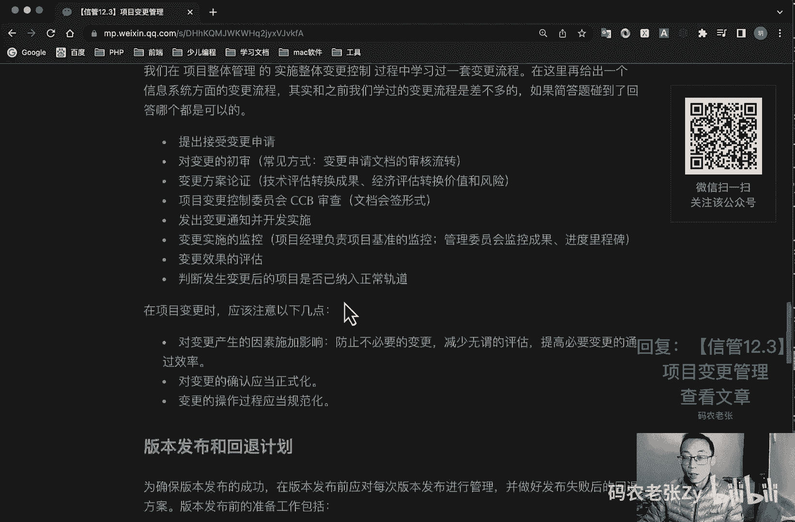

# 【信管12.3】项目变更管理 - P1 - 码农老张Zy - BV1zm4y1m7Uq

hello，大家好，今天呢我们来学习的是新系统项目管理师，第12大篇章的第三篇文章，项目变更管理对于传统的项目管理来说呢，变更控制管理真的是非常重要的，我个人一直觉得就是，传统和敏捷之争的最大不同呢。

其实就在于面对变更的时候的不同，敏捷其实是非常欢迎变更的啊，他是拥抱变化，就是他的一个宣言之一，甚至是无变更不敏捷，而传统项目观点呢，其实它是比较淘变更的，为什么呢。

因为我们会认为项目中的各种不确定因素，都是由变更带来的，它会带来功能的变化风险，各种计划的变动，所以说呢对于传统的项目管理来说，我们要有非常严肃的去对待变更的这个问题，之前呢在项目整体管理的实施。

整体变更控制这个流程中呢，我们其实就已经学习过很多变更相关的知识了，包括变更产生的原因，实时变更的流程，还有ccd是干什么的这一系列的内容，今天呢我们再根据教材中的项目变更管理章节。

再一次深入的学习一次变更相关的内容，如果你跟着我之前在课程中已经学习过了，而且你还有印象的话，那就当今天就是一次复习，如果你没有印象了，那么就要重视起来，变更是非常非常重要的。

而且也是选择和简答题中非常常见的一个内容，好我们来看一下项目变更管理，项目变更管理是指在信息系统，工程建设项目的实施过程中，由于项目环境或者是其他的原因，而对项目的功能性能架构，技术指标，集成方法。

项目进度等方面所做出的一个改变，变更管理的实质呢是根据项目推进过程中，越来越丰富的项目认知，不断调整项目努力方向和资源配置，最大程度地满足项目需求，提升项目的一个价值，项目变更产生的原因包括产品范围。

成果定义的过失或者疏忽，项目范围工作定义的果实或者是疏忽，增值变更应对风险的紧急计划或回避计划，项目执行过程与项目基准要求不一致，带来的被动调整，以及一些外部事件，项目变更的类型呢。

我们也可以从不同的维度来进行划分，按照变更的性质呢，可以分为重大变更，重要变更和一般变更，通过不同的审批权限可以进行一个控制，然后呢按照变更的迫切性，可以分为紧急变更和非紧急变更。

通过不同变更处理流程来进行，然后呢就可以按照变更所发生的领域和阶段呢，可以分为进度变更，成本变更，质量变更及设计变更，实施变更和工作产品范围的一个变更，然后呢按照变更所发生的空间。

可以分为内部环境变更和外部环境变更，按照变更的内容呢，it行业的变更呢更进一步，可以细分为多个子行业，比如说弱电工作应用，开发集成和i p咨询等等的，并跟这我们之前好像都讲过对吧好了。

这两部分内容呢我们对吧，这个之前在项目整体管理的实施，整体变更控制当中都是学习过的，就是大家还没印象啊，就是我们当时还总结了五个字，对不对，叫什么呢，大家有印象吗对吧，这叫什么人财物法，还对吧好吧。

我们就接着往下看，项目变更管理流程呢，它主要就是他的原则呢是项目基准化，然后变更管理过程的规范化，它主要的流程呢主要包括以下内容啊，就是第一个就是基准变干，然后呢就是变更控制流程化。

然后呢就是明确组织的分工，然后评估变更的可能影响妥善保存，变更产生的相关文档，变更管理的组织机构呢，在项目团队中负责变更管理的，其实最主要的就是一个机构和一个角色，这个机构呢指的就是我们的c c b。

而角色呢其实就是项目经理了，我们就来看一下啊，项目控制委员会叫做ccd对吧，之前我们已经讲过了，或者还有一个叫什么配置控制委员会啊，我们在那个第12大篇章的第一篇文章里面，讲配置的时候就讲过，对不对。

配置控制委员会它也叫c c b，其实他们俩都可以代表一个意思了，要么你可以叫他这个项目控制委员会，要么也可以叫他配置控制委员会，都可以都是ccd，通常呢这个c4 b呢是由项目经理。

用户代表质量控制人员qc或者q a也有啊，之前我们讲的那边的cfb的时候，它是有q a的啊，q a q c都有，然后呢配置管理人员，cmo等组成的，它是一个决策机构，而不是作业机构啊。

这个这个我在之前的那个项目整体管理，那你也讲过了啊，cc b它是一个决策机构，通常cc b的工作呢是通过评审手段，来决定项目基准是否能变更，但不提出变更的具体方案，然后呢项目经理。

项目经理他是响应片跟提出者的要求，然后呢评估变更对项目的影响及应对方案，将需求由技术需求转化为资源需求，供授权人决策，并根据评审结果实施计调整基准，确保项目基准反映项目实施的一个情况。

好我们再来看一下变更控制，变更控制呢主要由配置委员会c c b负责，对配置变更作出评估审批以及监督与批准，变更的实施，其成员呢可以包括项目经理，用户代表，产品经理，开发工程师，测试工程师，质量控制人员。

配置管理员等等，变更管理的任务呢主要有三个，第一个呢就是分析变更，它主要是根据成本效益以及涉及的技术判断，变更的必要性，确定确定是否进行变更，第二个呢就是记录和跟踪变更。

第三个呢就是采取措施保证变更受控，这些措施呢其实就包括配置库啊，变更控制和骗更记录对吧，配置库我们也是之前刚刚学过的，我们在项目整体管理的实施，整体变更控制的过程中学习过的一套变更流程，在这里呢。

我们再给出一个信息系统方面的变更流程，其实呢和我们之前学习过的变更流程，是差不太多的啊，如果简答题你碰到了，就是碰到问你变更的一个流程，不管是你回答哪一个，回到我们之前讲过的那个。

还是今天讲的这个都是可以的啊，好我们看一下今天的这个，就是第一步提出接受变更申请对吧，第二个就是对变更的一个初审，常常见的方式就是变更申请文档的审核流转，第三个呢就是变更方案的论证。

主要包括技术评估转换成果，经济评估转换价值和风险，然后呢就是项目变更控制委员会cc b的审核，主要是以文档会签的形式，接着呢就是发出变更通知并开发实施，然后呢变更实施的监控，项目经理负责项目基准的监控。

管理委员会呢监控成果进度里程碑，接着呢就是变更效果的评估，最后呢就是判断发生变更后的项目，是否已纳入正常轨道，好我们之前那个其实记忆点来说的话，比这个要简单一点啊，大家可以回去再看一下啊。

就是在最开始的项目整体管理当中，实施整体变更控制里面讲过的那一套变更流程，就是这里说的，就是你回答哪一个都可以，只要他的简答题，他问的是变更流程是什么，你回答哪一个都可以的啊，好再接着往下看。

在项目变更时应该注意以下几点，第一个呢就是对变更产生的因素施加影响，防止不必要的变更，减少无谓的评估，然后提高必要的变更通过效率，第二个呢就是对变更的确认了，应当正式化，第三个呢。

变更的操作过程呢应当规范化好，版本发布和回退计划，为确保版本发布的成功呢，在版本发布前应对每次版本发布进行一个管理，并做好发布失败后的一个回馈方案，版本发布前的准备工作呢，主要包括啊进行相关的回馈分析。

备份版本发布所涉及的存储过程，函数等其他数据的存储及回推管理，然后就是备份配置数据，包括数据备份的一个方式，接着备份在线生产平台接口，应用工作流等版本启动回退机制的触发条件。

对变更回退的机制职责的一个说明，可以准备以下的一些回退方案，主要包括通知相关用户系统开始回退，通知各关联系统进行版本回退，回退存储过程等数据对象，然后配置数据回退啊，应用程序接口程序工作流等版本的回退。

回退完成，通知各周边关联的系统，然后回退后进行相关测试，保证回退系统能够正常运行，通知用户回退完成，好总结一下今天的内容呢其实非常简单对吧，一下就说完了，主要呢就是如果你之前好好学习过了。

那么其实关于变更的内容呢，其实你都会有一个印象啊，但是如果你是第一次接触项目管理的话，之前没记住也是很正常的，所以说可以将今天的内容当做是一次变更，相关的一个汇总资料，好吧。

就是整个病根相关的内容呢都是重点，最后版本相关的内容呢就是了解一下就行了，就是最后这一块就是这一块的版本，相关的内容呢大家了解一下就行了，然后上面的内容呢，都是应该要去详细的去看一下的，好了。

今天的内容就是这些大家可以回复文章的标题，信管12。3项目变更管理，来获得这篇文章的具体内容，更详细内容，大家还是要去需要去好好的记忆，一下子很容易出一些简答题的啊，好了，今天的内容呢就是这些。

