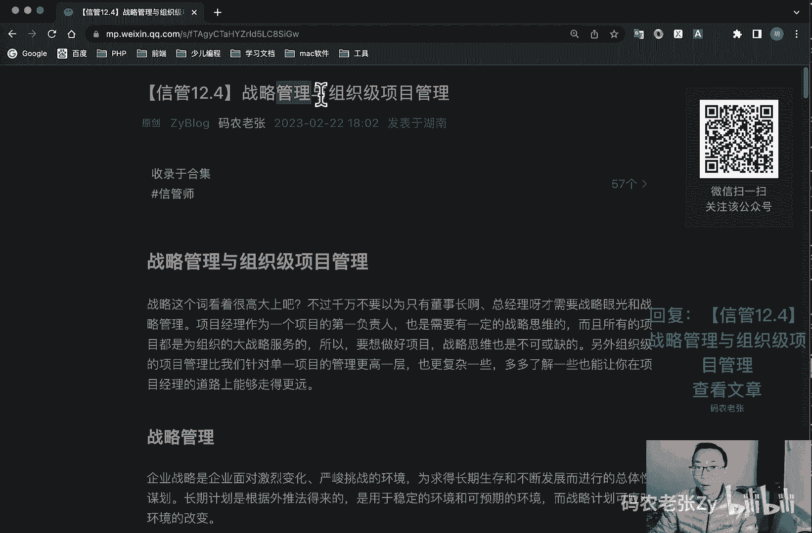
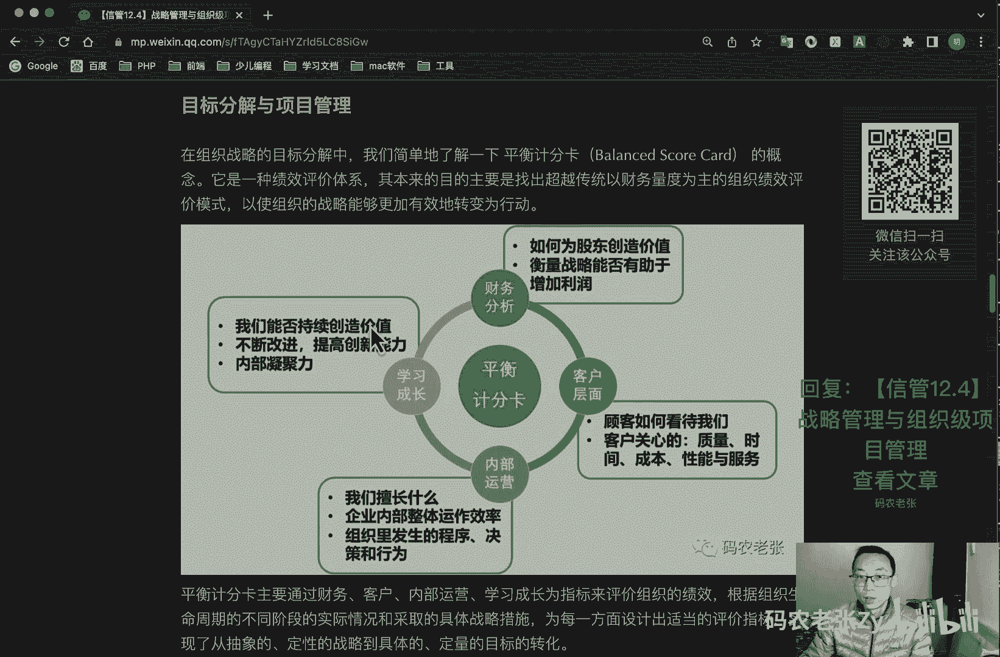
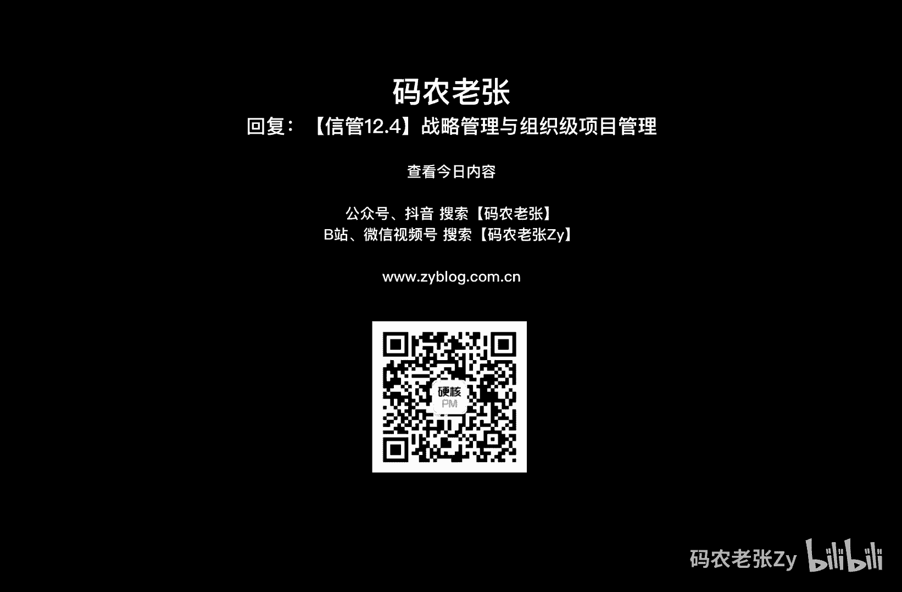

# 【信管12.4】战略管理与组织级项目管理 - P1 - 码农老张Zy - BV1xm4y1m7JK

哈喽大家好，今天呢我们来学习的是信管的第十大篇，第12大篇章的第四篇文章，战略管理与组织级项目管理，好战略这个词啊，就是看的很高大上，对不对，不过千万不要以为只有董事长，总经理才需要战略远光和战略管理。

项目经理呢作为一个项目的第一负责人，也是需要一定的战略思维的，而且所有的项目的，都是为组织的大战略所服务的，所以说要做好项目战略思维，那是不可或缺的，另外组织级的项目管理。

比我们针对单一项目的管理更高一层，也更复杂一些，多多了解一些，那也能让你在项目经理的道路上能够走得更远，好我们先来看一下啊，企业战略是企业面对激烈变化，严峻挑战的环境，为求得长期生存和不断发展而进行的。

总体性的一个谋划，长期计划是根据外推法所得来的，适用于稳定的环境和可预期的环境，而战略计划呢可以去应对环境的一个改变，好一个是长期计划，一个是战略计划啊，好我们再接着往下看，就是组织战略，规划呢。

是是依据组织外部环境和自身条件及其变化，来制定和实施战略，并根据实施过程与结果的评价和反馈来调整，重新制定新战略的一个循环过程，战略管理啊，它是一个组织在一定时间内，对其全局性长远的发展方向。

目标任务和政策，以及对组织资源调配等方面做出的相应决策，以及对这些决策进行跟踪监督，变更等方面的管理工作，战略管理的规划方式呢包括自下而上的方法，自上而下的方法，上下结合的方法，设立特别小组方法等等。

目前的组织战略规划呢已经逐渐演变为，需要组织高层随时拥有的，一种常态性的一个战略意识，好我们看一下内容和实施，组织战略呢通常由以下几个因素组成，第一个呢就是战略目标呃。

组织战略行动所要达到的一个预期结果，就是战略目标，然后呢就战略方针在特定阶段进行的特定阶段，指导组织全局的方针，是指导组织行动的一个纲领，或者说一个原则啊，战略方针，然后呢就战略实施能力。

它是组织战略实施的物质基础，是包括人才和资金等等，然后呢就是战略实施措施，为准备和进行战略管理而实行的，具有全局意义的实施战略的一个重要保障，说完组织战略的内容，我们再来看一下战略实施。

战略实施呢是一个自上而下的一个，动态管理过程，所谓自上而下，主要指的就是那战略目标在组织的最高一层，达到达成一致之后呢，然后就会再向中下层去传达，就是从上到下的一个传达。

所谓动态呢主要就是指战略实施的过程中呢，需要常常在分析决策，执行反馈，再分析再决策，在执行的不断循环中达成我们的战略目标，战略实施呢包括四个阶段，我们再来看一下，第一个呢就是战略的一个启动阶段。

转变为组织职工的一个实际行动，调动起组织员工实现战略目标的一个积极性，这个就是一个启动的一个阶段，然后呢就是战略计划的实施阶段，将组织战略分解为几个战略实施阶段，每个阶段都有相应的目标。

政策策略以及落实方针，接着呢就是组织战略的一个动作阶段啊，他呢就是组织战略在组织内部，内外部全面落实的阶段，与六个因素有关，即各级领导人员的素质和价值观念，企业的组织结构，企业生产资文化。

组织资源储备与分配信息，沟通控制及激励等，企业的各种组织制度，组织战略的控制与评估，主要包括主要内容呢，就是组织建立的战略控制系统啊，绩效监控系统啊，对监控偏差的评估啊，控制以及纠正等等方面的一个工作。

好我们再来看一下组织战略的类型与层次啊，一般说来啊，就是这个组织面临的战略问题呢，主要包括事业问题，工程问题和行政问题这三类问题，其中事业问题呢主要是关注组织如何管理，市场占有率方面的问题。

然后工程问题呢主要是解决组织如何执行，事业问题，解决方案的一个问题啊，他是为事业问题解决提供工程方面的一个支持，然后呢，行政问题呢是解决组织应该如何架构以及适应，解决前两方面的问题。

需要解决的是组织的授权，沟通和具体实施架构等方面的问题啊，其实这三个三个方面呢其实都是互相关联的，当然最根本的其实是一个事业问题，好首先呢我们就来看一下组织视野战略，事业战略类型。

它可以进一步细分为以下四种战略类型啊，一个星好，这个地方比较重要啊，好我们先来看一下，第一个呢就是防御者战略，防御者战略呢，是作为相对成熟行业中的成熟组织啊，组织组织内部呢产品线较窄。

同时呢组织高层也不愿意积极探索，熟知领域以外的一个机会，除非顾客有紧迫的需要，否则高层不愿意就运作方案，方法和组织的结构呢，做出较大程度和范围的一个调整，组织呢他努力的方向。

主要是提高组织内的一个运行的一个效率，国内呢我们可以参考哪些公司呢，比如说联想，联想就是一个防御者战略，然后国外最典型的就是当年的诺基亚对吧，当年诺基亚就是一个防御者的一个战略。

好我们再来看第二个就是探索者战略啊，他呢主要是致力于组织发现和发掘新产品，新技术和新市场，可能为组织提供的一个发展机会，组织的核心技能呢是市场能力和研发能力，它可以拥有较多的技术类型的和较长的产品线。

这种公司呢其实是现在的主流，做得好的很容易成为巨头，比如说我们现在国内的小米，对不对，他现在在造车了对吧是吧，他也在探索新的一个路线，然后国外的超级巨头谁啊，苹果，但前面也说过了，要做得好。

就需要有天时地利人和的，所以说探索者类型的公司公司啊，他失败的也很多，其实就我前面说的这个联想和诺基亚当年的，他们也不是没有探索过，对不对，联想到当年也出过很多网站对吧，fm 365对吧。

我还记得这个网站名称呢，还有什么别的东西，然后诺基亚呢也尝试过很多别的东西，对不对，但是呢他们就是之后都可能这些东西，就是扩展这些产品线失败了，对不对，因为他失败的类型的也非常非常多。

然后呢联想还比较好，他还守住了，所以他他现在还是采用一个防御者战略呢，还是一直守住了，但是诺基亚就很惨了对吧，这个呢也不用我多说了，好我们来看一下分析九战略，它呢主要是保证组织在规避风险的同时呢。

又能够提供创新产品和服务，主要应用于两种市场有效运作的组织类型，第一个就是在较稳定的环境，另外一个呢就是在变化较快的环境，前者呢我们强调规范化化和高效率的运作，或者强调的是关注竞争对手的动态。

并迅速做出有力的调整，这类公司啊比较典型的就是华为，还有什么近千年的微软，之前的微软啊，其实就是中间有一段时间，这个微软他也已经到这个防御者战略的形式了，对吧，就是被那个移动互联网给打的，甚至有点退化。

到最后，最后我们要说的这个反应者这种形式的公司了，但是呢最近这2年呢，它的战略其实出现了很大的调整了，包括收购的github，对不对，我们做写代码的大家都知道啊，github现在是他的。

然后还收购了很多别的东西啊，然后也做了很多的调整，包括那个云服务那一块的，其实它的云服务实力是非常非常强大的，所以说他现在又是重回世界顶级的一，个公司了啊，在这其中呢他的战略是成功的，作用是非常明显的。

他就是典型的这个分析者战略的一个形式，好最后一个呢就是一个反应者，战略反应者呢，它主要指的就是对外部环境缺乏控制，它既缺乏适应外部竞争的能力，又缺乏有效的内部控制机能。

没有一个系统化的战略设计与组织规划，除非迫不得已，组织不会就外部环境的变化做出调整，这个呢就不多说了，传统的夕阳行业，大多数小公司呢其实都是以一种这样的形式的，好，这个呢它就是我们上面讲的这四个。

它主要是从事业问题的角度来进行一个，战略类型分类，我们还可以从行政问题的角度呢，以战略组织的结构来进行分类，从这个角度呢也是可以分成四个类型的啊，这个也是要打一个小型的啊，跟上面那个一样。

都是今天比较比较重点的一个内容啊，好我们先来看第一种就是指挥型战略组织模式，就是指挥型的啊，战略简单，高度集权的组织，通过利用新组织机构或参谋人员，来向全体成员传递战略重点，需要一个中间代理人。

第三个呢就是合作型的战略组织模式，要求组织高层呢与其他高层管理人员，分担相关的战略责任，然后发挥集体智慧，接下来呢就是文化型战略组织模式，运用组织文化的手段，不断向全体成员传播战略思想。

在组织内部建立起共同的价值观和行为准则，这个听起来不错，对不对，好他多一个多一个，他有五个，最后一个呢就是增长型的战略组织模式，就是通过自下而上的推动，认真对待所有一般管理人员提出的一切。

有利于组织发展的方案，鼓励成员的一个首创精神啊，这个也是非常棒的一种形式，对不对，当然这些都是啊感觉非常好对吧，但这种公司呢其实也非常少，通过面向事业问题的组织，事业战略类型划分和面向行政问题的战略。

组织类型的划分，我们就可以清晰地了解到目前公司的组织，所处的事业类型或者是组织类型，也可以向上级提出一些意见建议，去追求当前阶段更好的类型方案，这个呢大家可以自己去看一下自己的公司。

到底现在是一个什么一样的类型的，除了战略类型之外呢，我们再了解一下组织的战略层次，它一般包括三个层次啊，加粗的地方啊，都是有一点小用，都是比较重要的一个小点啊，好第一个就是目标层。

他呢是介绍和说明组织的战略目标，包括组织成组织成战略目标，事业层战略目标和职能层的战略目标，然后呢，就是方程程说明了在组织目标达成过程中，组织应该要坚持的主要原则，最后呢就行文层在具体的执行层面。

为了落实组织的战略目标和方针，所采取的一个行动，好我们再来看一下目标分解与项目管理啊，在组织战略的目标分解中呢，我们简单了解一下平衡计分卡这个东西啊，它呢是一种绩效评价体系。

其本来目的呢主要是找出超越传统财务度，度量啊，亮度为主的一个组织绩效评价模式，以使组织的战略呢能够更加有效的转变为行动，就是他的度量就是度量的角度更多啊，你看到它它这个平衡计算法有财务分析的对吧。

如何为股东创造价值，衡量战略能否用于增加利润，然后还有客户层面的，就是客户如何看待我们，客户关心的是哪些东西对吧，然后还有内部运营方面的，我们擅长的是什么，企业内部整体的运作效率。

组织里面发生的程序的决策的行为对吧，最后呢还有学习成长方面的，我们能否持续上涨，价值不断改进，提高创新能力，内部凝聚力就是它这个平衡积分法卡啊，他的评价的维度是更多一些的，这个呢它主要是在这里这样讲了。

主要是通过财务客户内部运营，学习成长指标来评价组织的一个绩效啊，它的评价维度是比较多的，根据组织生命周期的不同阶段的实际情况，和采取的具体战略措施呢，为每一方面设计出更适当的一个评价指标。

实现了从抽象的定性的战略，到具体的定量的一个目标的一个转化，关于评分积分卡的一个更多的内容啊，大家就可以自行查阅更多的资料了，接下来呢我们就看看组织战略，与项目管理相关的内容，组织啊希望拥有的管理结构。

以及实现组织的持续健康发展，而组织战略呢在某种程度上就是一个目标计划，政策能力和行动等构成的一个综合体，为组织的各个层面的发展呢，提供整体的方向性指导，因此呢从项目管理的角度来看。

项目组合项目集和单项目，就是在组织的各个层面地进行对项目的战略，对组织的战略进行细化和落实，保证组织战略目标的一个什么实现好，这个呢就是这这个就是组织，组织级的一个项目的一个战略的一个实现的。

那个步骤了，主要就是体内的一个金字塔上面对吧，你看我们现有组织的愿景，对不对，然后呢就是组织的使命，然后呢就是组织战略与目标，然后通过项目组合管理啊，还有项目运营管理啊来实现，最后呢。

我们是通过一些组织的资源来进行一个支撑的，对吧，这个图来展示的就是组织结构与项目管理呃，项目组合管理之间的关系，还有项目集管理，项目战略，目标管理之间的关系，可以看到就是组织资源呢它是最底层的基础啊。

我前面也说了，向上的运营管理与单项目和项目集，构成了组织中主要的产品产出，是整个组织的一个运行的后勤保障，再向上的项目组合管理呢，就是一个承上启下的一个桥梁啊，承上启下的桥梁。

也是组织连接战略与实施的核心，自上而下呢是一个组织从愿景就是自上而下，就是反过来看啊，就我前面说的那个顺序，然后刚刚我们说的自下而上啊，就是从下面往上的呃，是至至上而下呢就是一个组织。

从愿景到资源的一个落地，愿景转化为使命，使命分解为战略和目标，项目组合管理呢生成项目，项目集和运营活动，然后运营与单项目产出产品，依靠产品发展继续扩展组织资源，而自下而上就反过来看啊，反过来看的话。

那就是组织中利用基础资源，实现组织愿景的方向，利用资源基础建设项目对吧，然后形成项目组合，实现组织战略，根据战略达成组织使命和组织的一个愿景，好从上往下看也可以，从下往上看也可以对吧好。

那么项目组合管理呢在上就是在这张图中啊，就在这张图中是有非常重要的一个作用的，就是将项目组合管理与组织战略联系在一起的，目标呢是组织内部建立平衡可执行计划，帮助组织实现战略目标。

并对组织战略形成一定的影响，这个这个就非常重要了对吧，项目组合管理，项目组织计划对项目组织计划对战略的影响，主要体现在五个方面啊，项目组织的一个计划，第一个呢就是维持项目组合的一个一一致性啊。

第二个就是分配财务资源，分配人力资源，分配材料或者是设备资源，然后呢测量项目组合组建的一个绩效，然后管理风险，这个应该叫项目组合计划啊，他项目组合计划，项目组织组合计划好。

我们再来看一下组织级项目管理啊，这这一块有点绕啊，又是组织对吧，又是项目组合，对不对，这个地方有点绕，在组织级项目管理，其实应该是比项目组合管理还要高一层的，比项目组合管理还要高一层的。

其实他应该是在这张图上呢，倒是没有特别明显的体现啊，好我们来看到组织自己，项目管理呢是指在组织战略的指导下，然后具体落实组织的战略运行，从业务管理，组织架构，人员配置等多方面对组织进行项目化的管理。

具体来说呢就是要立足组织管理，从实现组织运营价值最大化的目标出发，考虑如何筹建组织级的项目管理体系，嗯实现组织资源优化整合，提高项目成功率，并的建立项目和执行过程中呢。

及时把控市场和和客户的一个需求的一个变化，帮助组织快速调整经营目标和经营战略，有效地实现组织的战略目标的一个组织体系啊，非常长的一个概念，组织级项目管理呢，是组织在其内部搭建起项目组合管理。

项目集管理和单项目管理的各个领域，看到没有，这组织级项目管理呢，其实是比项目组合他们还要高一点啊，他是来搭建项目组合管理，项目集管理和单项目管理的各个领域的，以及在这些领域之间的支持，实现最佳实践。

而提供了一个组织全局，项目管理的一个框架体系，组织级项目管理，识别出在组织中发挥重大影响的关键支撑点，包括组织治理，组织战略执行与单项目项目集和项目组合交付，之间的一个因果关系链条。

其中的项目治理呢就是通过各项目组合，项目集和单项目系统的追踪组织的战略目标，并获得组织期望的成果啊，这好来回提到好几个词对吧，项目组合，项目集和项单项目系统，我们会不会讲的哈，好在组织生命周期中呢。

组织不仅制定战略，实施战略，它还而且还需要根据战略执行的需要，将相关资源呢分配到项目，投资组合，项目集管理呢主要包括以下三个方面的目的，第一个呢就是指导组织的投资决策，和恰当的一个投资组合。

实现组织资源的一个最优化配置，第二个呢就是提供透明的组织决策机制，是组织项目管理的流程合理化和规范化，第三个呢就是提高项目期望，提高实现期望投资回报率的可能性，加强对组织项目管控的系统性和科学性。

组织级项目管理的内容啊，它主要包括就是这三个部分，第一个呢就是最佳实践主要分为两类，一类是组织及项目管理，sm i c i标准化度量控制和持续改进，另一类那就是组织运行潜能方面的最佳实践。

实际上呢就是组织所提供的条件支撑，第二个呢就是主持能力，也就是组织的资格素质，第三个呢就是成果，一般通过关键绩效指标kpi来进行度量好，组织级项目管理成熟度模型，项目管理成熟度呢是指一个组织。

通常是一个企业具有的按照预定目标和条件，成功的可靠的实施项目的能力，具体的讲呢，项目管理成熟度呢应该指的就是项目管理过程，一个成熟度，常见的项目管理成熟度模型主要有哪些呢。

就是sei提出的c m m模型，就是我们之前讲过什么c m m i，就我们之前就讲过对吧，然后呢还有p m i提出的o p m3 模型，然后呢就是有这个提出的一个k p m m i，m模型。

还有这个这个提出的一个fm s l，p m m m模型等等啊，这个就是成熟度模型的一个图示啊，它就是主要是围绕这个组织，项目管理能力与相应的一个结果，然后这个评估能力的方法，然后提升能力的一个顺序。

他们之间的交集就是一个成熟度的一个模型，在这些模型当中呢，c m i在，就是在我们之前那个就是这篇课程里面啊，新版1。9软件工程三，软件设计与过程管理里面呢就已经学过了，在这里呢也就不再重复赘述了。

小伙伴们如果忘了就是c m i讲的是啥，可以回去再看一看，我们先来简单了解一下k p m m m，它主要包括以下三个方面的内容，第一个呢就是通用术语，在组织的各个层次呢，各部门使用共同的一个管理术语。

然后呢就是同样的过程在一个项目上成功应用，管理的过程，可重复用于其他项目，然后呢就是单一方法组织认识到了，把公司所有的方法结合成一个单一方法，所产生的一个协同效应，其核心的就是项目管理。

用项目管理呢来综合t q m是什么，全面质量管理啊，这个我们之前也讲过的啊，然后还有风险管理，然后协调设计等各种管理方法，接下来呢就是基准比较组织认识到啊，就是为了保持竞争优势，过程改进是必要的。

将自己与其他企业及其管理因素进行比较，提取比较信息，用项目管理过办公室呢来支持这些工作，最后呢就是持续改进了，从基准中比较中获得的信息，建立经验学习文档，组织经验交流，在项目办公室的指导下。

改进项目管理，战略计划好，接下来呢我们主要重点看一下op m3 模型，组织级项目管理，o p m3 呢是一个战略执行框架，利用项目组合，项目集管理，项目管理以及组织运行潜能实践。

自始至终的可预测的交付组织战略，以产生更好的绩效，更好的结果和持续的竞争优势，o m3 呢是人员知识和过程的一个集成，这个图很清晰啊，第一个呢就是通过标准的学习，然后进行组织的评估对吧，对结果是否满意。

对不对，然后确定改进的一个重点，然后在这里面就是一个循环，就是确定改进线路，然后评估当前的能力，然后制定改进计划，然后实时啊就是那个实现改实质进行改进，然后重复这一过程，然后不断的去实现这个循环对吧。

这种呢其实跟p p d c a这种循环呢，其实非常像的，但是op m3 呢是针对于组织的项目，管理能力方面的一个执行模型，在这个途中呢你可以发现知识评估，改进这方面具有知识知识对吧，知识评估。

然后改进这三个重点的内容，同时呢它也是一个三维的模型啊，这个三维模型是从哪看出来的，你看它有意为是这个样子的，它主要包括这一围，就是持续提高，然后可控的可测量的，然后标准化的啊，就是成熟度的四个梯级。

然后呢就是我们的一个项目管理的一个，就是组织一个项目管理的一个过程，这个项目管理过程，其实就是我们之前学习过的什么呢，就是十个领域和五个基本过程呃，呃五个基本过程就是什么启动计划，执行监控收尾对吧。

然后十个领域是什么呢，就是整体范围，进度成本质量，人力资源沟通干系人管理风险和采购管理，没错，就是我们之前学过的东西好，最后一个维度就是第三个维度，就是就是撑出来的，这个维度是什么呢。

就是项目投资组合管理，然后项目组合管理以及项目管理这三个部分，这个呢就是项项项目及项目管理的三个板版图，层次好，就这三个东西这个大家也了解一下就可以了，它是一个三维立体的就行了，好总结一下。

今天的内容呢是比较偏高层的一些管理知识，需要重点关注的就是组织战略类型的层以及层，次，以及o p m3 相关的内容啊，其他的内容呢大家就是了解一下就可以了，对于项目经理来说呢，这些知识呢。

其实在日常的工作中也是非常有用的，特别是对于组织战略的分解呢，其实就是分解成一个一个的项目，所以pm就是有时间的，还是多学习学习高层战略相关的管理知识，能够搞明白老板的想法。

就是站站在老板的角度去思考问题，理清当前组织的一个战略类型，这样对你来，或者说对你带项目来说都会有非常大的帮助啊，好了，今天的内容呢就是这些，大家可以回复文章的标题，信管12。

4战略管理与组织级项目管理。

来获得这篇文章的具体内容，以及更详细的内容啊，今天内容还是比较多的。

比较丰富的好，今天的内容呢就是这些。

