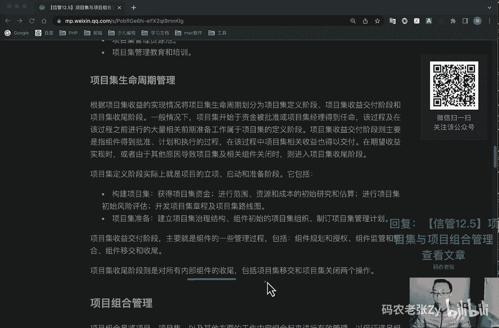
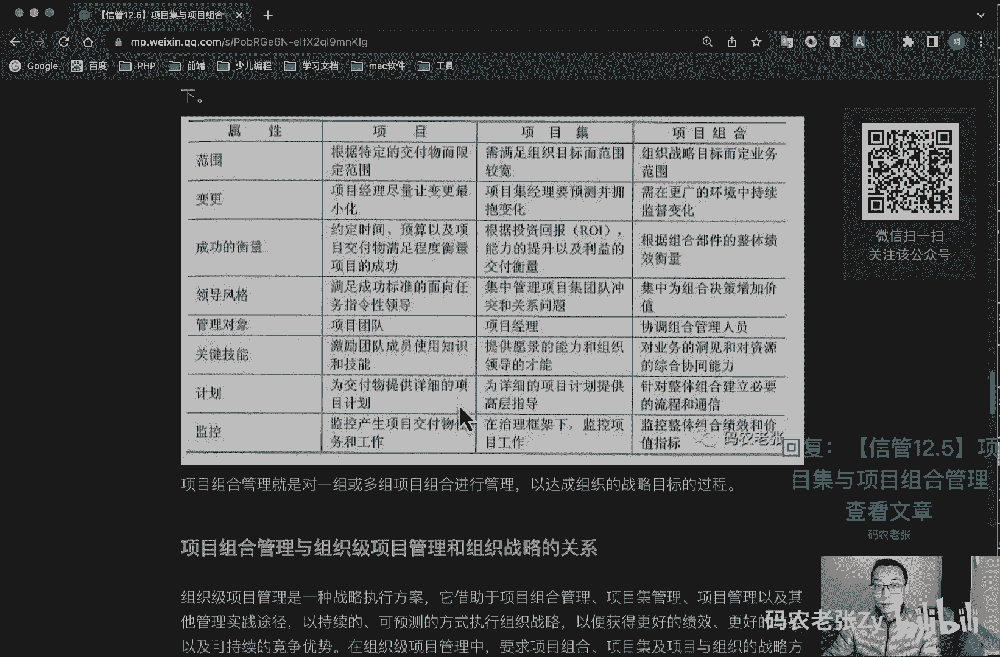
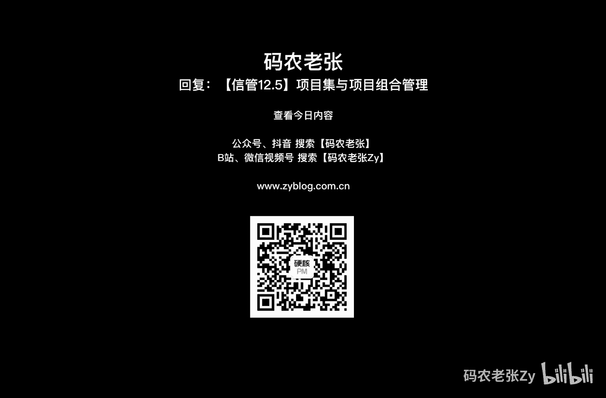

# 【信管12.5】项目集与项目组合管理 - P1 - 码农老张Zy - BV1Lc411H7UP

哈喽大家好，今天呢我们来学习的是信息系统项目管理师，第12大篇章的第五篇文章，项目集与项目组合管理呃，就之前学的pmp相关的项目管理知识呢，其实我们都是针对一个单一的，一个项目的一个管理过程。

但是呢在一个组织企业中往往不止一个项目，就是我们上面文章中提到的很多对吧，什么项目组合管理，什么项目集管理，对不对，就是如果是多个相关联的项目，这种情况呢就叫做项目集。

另外多个项目一起完成一个战略目标的，这种情况呢就是叫做项目组合，今天呢我们就来看一下他们具体的一个定义啊，好我们先看一下项目集管理，项目管理协会pmi呢，将项目集定义为经过协商管理。

以获取单独管理所无法取得的利益收益，的一组相关联的项目，这个关键词相关联的项目，项目机一定是相关联的，项目，子项目集和项目及活动项目集内的所有项目呢，通过共同的目标相关联，也就是说项目集中的项目呢。

就是彼此都是互相依赖的对吧，从我们程序员的角度来说呢，就是互相有依赖，如果项目及各干系人有不同的目标，并且这些目标不具有协调收益的交付特征，只是在资金技能干系人等方面存在的关联。

则这些项目呢其实是通最好通过项目组合，而不是使用项目及的方法，来对这些组件来进行一个管理，好项目集管理的标准呢，主要包括以下几个概念啊，第一个就是其他工作，是指若干面向项目及活动，由项目及经理履行。

弹幕，直接属于任何项目及内单个子项目集，或者是项目的活动，第二个呢就是组件啊，是指项目集中一个或多个工作内容，如单个项目，项目及其他工作都可以叫做组件，然后呢就是项目及活动，在项目执行期间执行的清晰的。

已安排好的工作组成部分，最后呢就是子项目集，作为一个项目级的组成部分，而被管理的一个项目集，项目集管理中涉及到的角色主要包括项目经理，项目集经理，项目集管理团队成员，项目组合经理，干系人。

发起人和受益人，项目集管理的过程域呢主要包括项目集管理，绩效率与项目及管理，支持与项目及管理，绩效域中又包含项目及战略的一致性管理，项目及收益管理，项目及干系人管理，项目及治理，项目及生命周期管理等等。

项目集管理支持域呢，包含的就是p m p当中的十大知识领域，也就是我们再一次再一次回忆一下啊，整体范围，进度成本质量，人力资源干系人沟通风险，采购等相关的内容，好项目我们集中再看一看项目集管理。

关东的管理过程啊，启动项目及治理和项目及生命周期管理呢，我们会单独说，其他的我们就包含在第一个小节里面，就说掉了好，我们先来看一下，在项目集管理过程中呢，我们主要关注三个方面的内容。

分别就是项目集与组织战略的一致性，项目集愿景和计划以及项目及路线图，项目集，组织战略一致性的指的就是项目级的商业论证，及对项目级的可行性进行研究，它的输入包括市场机遇，客户合作伙伴需求，股东建议。

政府规章，然后竞争对手的行动，组织内部的战略发展的需求，事业环境因素，它的工具与技术包括的市场的比较优势，组织内外部的可行性分析，s o w c s w o t分析，假设分析历史信息。

最后是他的输出有什么呢，项目及初始方案，对初始方案进行调整后的组建项目集，然后拒绝项目集的初始方案，以及要求相关人员和组织提供更详细的方案，好了解一下就行了，然后呢就是项目及愿景和计划呢。

指的是在项目级的生命期不断演进的过程中，计划会滚动式的演进发展，通过这个过程的输入，有项目及商业认证以及评审意见，然后是组织的战略，然后重要干系人需求相关合作合作协议，前期项目及文件，事业环境因素。

项目及资源储备，相关标准与规范相关历史信息，然后他的工具与技术呢主要包括，项目及管理信息系统，专家判断焦点小组引导技术，一点领袖，然后情景分析头脑风暴，进度式和成本的参考模型等等，最后它的输出呢。

就是项目及整体计划和各子计划，项目及路线图呢，是按照时间顺序与图形化的方式，展现项目及预期发展方向，并在每个时间顺序事件建立系列的文档化标准，同时建立了项目及活动与预期收益之间的关系。

以及项目及里程碑之间的关系，依赖传递业务战略与规划的优先级之间的连接，它与项目级进度计划类似，勾勒出项目集事件，也可以看作是项目级关键的一个里程碑，好我们再看一下项目及治理，相比于治理呢。

涵盖了由发起组织对项目及战略进行第一授权，监督和支持的体系和方法，是项目及发起组织，确保项目及被有效和持续管理，而执行的一个实践和流程，对于项目级的治理呢，它主要包括几点啊。

第一个就是项目级指导委员会的建立，第二呢就是项目级指导委员会的职责就确定，然后呢，就是项目集治理和项目集管理之间的关系，然后呢项目及治理相关的个人角色，项目集作为治理主体，项目及组建的一个治理。

其他支持项目集管理的一个治理活动，项目级指导委员会呢也成为项目及治理委员会，项目及董事会和监督委员会，其职责呢主要就是负责定义并执行，恰当的项目及治理体系和方法，保证项目及执行与组织的战略目标。

它是保持一致的，并为指导项目及正常管理提供支持，项目级指导委员会的成员呢，通常由决策层干系人组成，能够为项目，能够为实现项目目标，项目及目标收益提供足够的资源，特定项目呢可以建立多个指导委员会。

项目及指导委员会的角色呢包括项目及发起人，项目及治理委员会成员，项目级经理，项目组建经理，项目及团队成员对吧，然后呢项目管理委员会的职责主要就有呢呃，保证项目集与组织愿景和目标的一致性。

然后项目及批准和启动，然后确保项目及获得必要的资金支持，这该是项目及管理委员会啊，项目集管理委员会除了项目及指导委员会呢，项目及治理呢还包括其他一些活动，第一个呢就是项目管理办公室pmo。

项目集呢一般规模比较大，然后管理工作繁杂，所以会成立项目集管理办公室，来承担相关的管理职能，可以有正式或者非正式的p m o，也可以建立多个p o呃，可能会有像某一项目组合内不同的项目。

及提供集中的一致的项目及管理，专业知识的任务，然后po呢，可能仅仅负责实施一个或多个关键项目级任务，如关于技术方面的任务，关于沟通协调方面的任务，然后呢就是项目集管理信息系统，项目及知识管理啊。

包括跨项目级的知识收集与分享，掌握项目及具体知识内容的个人主题，专家和知识的挖掘和整理，然后存储收集项目及知识和项目，构及构建的项目管理信息系统的一个建设，项目集管理审计啊。

主要就是内外部人员审计都可以啊，然后项目集管理资源池，项目集管理的一个教育和培训，好，我们再接着往下看，就是呃项目及生命周期管理呃，根据项目及收益的实现情况呢，将项目及生命周期划分为项目及定义阶段。

项目及收益交付阶段和项目及收尾阶段，一般情况下就是项目级开始与资金被批准，或项目及经理得到任命，该过程及在该过程之前，进行了大量相关的前期准备工作呢，属于项目级的定义阶段，项目及收益交付阶段呢。

则主要就是指的组件得到批准，计划和执行的过程，在该过程中，项目及相关收益呢也得得以交付，在期望收益实现时呢，或者由于其他原因导致项目及相关组件关闭时，则应进入项目及收尾阶段，项目集定义阶段呢。

实际上就是项目的立项启动和准备阶段，它包括构建项目集啊，获得项目及资金去进行范围，资源成本的初始研究和估算，进行项目及初始风险评估，开发项目及章程及项目及路线图，然后呢就是项目及准备建立项目及治理结构。

组件初始和的项目集组织制定项目集管理计划，然后项目及收益交付阶段呢，主要就是组建的一些管理过程，包括组建规划和授权，组建监控和整合，以组件移交和收尾啊，项目及收尾阶段呢。

主要就是对所有的内部组件的一个收尾。

包括项目及移交和项目及关闭这两个操作好，再来看第二个比他大的部分就是项目组合管理，项目组合管理呢它是将项目，项目及以及其他方面的工作内容，组合起来进行有效管理，这些组件呢是可以量化的。

也就是说可以被度量排序以及分优先级的好，从这里就可以看出来，在项目组合它底下可以包括什么子组合，也可以直接包括项目，也可以包括项目集对吧，然后这个子组合里面也可以包括项目集，也可以包括项目，对不对。

然后项目集底下就会有项目对吧，他都是这样一个嵌套的过程的，然后项目集底下那个也可以有子项目集，然后子项目及底下的也可以有普通项目，当然这个项目及底下的也可以跟着，就是普通的项目。

当然这个运营呢也可以跟着这个项目集里面的，这个都是没有问题的啊，这个图呢还是需要去了解一下的，就是一般来说项目组合就是在最顶上的，项目组合在最顶上的，然后底下可以有子组合，可以有普通项目。

也可以有项目集，然后项目集呢也底下呢也可以有项目集，ok就是这个情况啊，好下面这个表的内容呢，就是一个就是一个项目组合管理，项项目组合管理，然后项目集，然后一个项目管理三fps。

就是这三个东西之间的一个区别对吧，我们从范围角度来看呃，根据特定的交付而限定范围对吧，就是项目，普通项目的项目集呢，然后组织战略目标啊，定业务的一个范围，就项目组合就是更宽了。

然后呢变更就是项目及就普通项目里面啊，项目经理尽量让变更最小化，然后项目集里面呢就是要预测并拥抱变化，然后项目组合里面呢就是在更广的环境中，持续的去监督变化，然后从成功的衡量来看呢。

就是项目啊他是要约定时间的预算的，以及项目交付物满足程度，衡量的一个项目的一个成功，然后呢就是项目集主要是根据投资回报oy，这个这个还记得吧，r y然后呢能力的提升以及利益的交付来衡量，然后项目组合呢。

主要就是根据组合部件的整体绩效来衡量，然后在领导风格方面呢，项目普通项目啊就是满足成功标准的面向任务，指令型的一个领导就行了，然后项目集呢主要就是集中管理，项目及团队冲突和关系问题。

然后呢项目组合呢就是集中为组合决策，增加价值，然后在管理对象方面呢，普通项目就是管理项目团队对吧，然后项目集呢它主要就是管理项目经理的啊，然后项目组合呢就是协调组合去管理人员的好。

我们再来看一下关键技能啊，这个呢就是激励团队成员使用的知识和技能，然后呢项目集呢就是提供愿景的能力，和组织领导的一个才能，然后项目组合呢就是对业务的洞见，和对资源的组合的一个协同能力，在计划方面啊。

就是普通项目，就是为交付物提供详细的一个项目计划，要项目集呢，就是为详细的项目计划呢提供高层指导，然后项目组合呢就是针对整体组合，建立必要的一个流程和通信，然后最后在监控这一块啊。

就是普通项目就是监控产生项目，交付在的任务和工作，然后呢项目集呢就是在治理框架底下，然后监控项目工作，然后项目组合呢就是监控项目整体组合，绩效和一个价值指标，ok这个这个表格还是要详细的来看一下。

你起码要搞清楚他们三个之间的关系啊，包括上面这个树形结构啊，他们虽然是有层次关系的啊，管理的范围呢那些的也都是不同的。

好我们再看一下呃，项目组合管理与组织级项目管理，和组织战略的一个关系啊，在我们是呃上上节课学的东西对吧，项目组合与他们之间的关系，组织级项目管理呢是一种战略执行方案，它借助于项目组合管理，项目集管理。

项目管理以及其他管理实践途径，以持续的可预测的方式进行组织战略，以获得更更好的绩效，更好的结果以及可持续性的一个竞争优势，在组织级项目管理中呢，要求项目组合，项目及以及项目与组织的战略方向保持一致。

另一方面呢，三者为实现战略目标做出的贡献呢又各有不同，项目组合呢通过选择正确的正确的项目集，合项目设定工作的优先级，并提供必要的必需的资源的方式，来促成组织的战略失效啊，这是项目组合的，然后呢。

项目集管理呢是对所包含包括的项目集，和项目的依赖关系进行有效管理，从而实现项目集的一个特定利益啊，最后一个就是项目管理，项目管理呢是通过制定和实施集合，来完成特定的工作范围。

支持项目集和项目组合目标的实现，最终确保组织战略得以实现，项目组合计划与战略组织战略环境的关系呢，我们可以参考下面这张图啊，就是我们上节课讲过那张图啊，但你看我们这个图又稍微有一点点不一样。

不一样在什么地方呢，它这个地方又分出来一个日常运营管理对吧，重复活动，然后那个授权的项目集和项目管理的，也在这个地方，其实他们都是跟这个组项目组合管理，以及这个项目集管理都是有关系的对吧。

所以就把这个运营也放到这一层次上来了，好我们看一下啊，组织的战略目标呢，就是向下就是项目组合的管理，反过来说呢，项目组合管理呢，实际上就是实现组织战略目标，的一种工具与技术呃。

项目组和计划呢在以下六个方面呢，与组织战略的是高度相关的，第一个呢就是维护项目组合与战略的一致性，第二呢就是分配财务资源，第三个分配人力资源，然后分配物料和设备资源，度量项目组合当中的模块绩效。

最后就是管理风险好，项目项目组合组件，项目组合组件呢包括项目集管理，项目管理，日常运作管理也就运营了，然后项目组合治理，其中项目组合治理的管理过程，也包括制定项目组合治理计划，定义项目组合。

然后优化项目组合，批准项目组合，执行项目组合，监督好项目组合管理过程的实施啊，项目组合管理过程实施主要包括，评估项目组合管理过程的当前状态，定义项目组合管理的愿景和计划，实施项目组合管理的过程。

改进项目组合管理过程这四个方面，项目组合管理呢是一个持续的过程，它不像一个项目或者是项目集管理，有计划好的一个开始和结束的时间，某些活动可能会是循环发生的，真正有效的项目组合管理呢。

必须是一个动态反复和一个交互的系统啊，跟项目还是非常大的不同的，好项目管理组，项目组和管理的一个过程组啊，它也是分过程组的，对不对，我们普通的项目是五大过程组，加上十个那个知识领域，对不对。

然后在项目组合管理这里啊，大家了解一下就行了，三个过程组，分别是定义调整和授权与控制过程组，然后呢是123451，然后是五个知识领域，五个知识领域，第一个知识领域就是项目组和战略管理，它主要包括这些。

这边就是一个过程对吧，它主要包括制定项目管理战略计划，然后制定项目组合章程，制定项目组合路线图，然后再然后还包括管理战略变更，然后呢就是项目组合治理管理，这个这个呢主要是包括制定项目组合管理计划。

然后定义项目组合，然后他在调整过程中呢有优化项目组，然后在授权与控制过程中呢，有授权项目组合，然后规定项目组和监督，接下来呢就是项目组合的一个绩效管理，它主要是制定项目组合管理，绩效管理计划。

然后有管理供应与需求，管理项目组合价值，接下来的就是组合项目组合沟通管理，主要是制定项目组和沟通管理计划，然后有管理项目组合的一个信息，然后呢最后就是项目组合的风险管理。

它主要是制定项目组合风险管理计划，管理项目的一个组合，风险好，主要就是这些啊，这个大家了解一下就行了，ok我们再来看一下，然后就是项目组合过程组有三个对吧，然后包含的过程有战略制定，绩效沟通。

风险管理五个方面，ok这就是上面那个详细的说明好，最后这还有一张图啊，这个图呢展示的就是项目组合管理，过程组和组织战略与目标的一个关系啊，就是从上到下的一个关系，以及能够影响项目组合管理环境的组织过程。

但是这个图啊，就是大家也稍微了解一下就可以了，就有个定义过程组对吧，有调整过程组，还有授权与控制，工程组，就是前面说的那三个过程组，然后去上面有什么是组织战略目标啊，然后有什么项目项目级的和其他工作。

最后有结果和一个绩效的一个展现好，这张图大家也是了解一下就行了，在项目组合管理的五个过程中，使用到的很多的工具与技术呢，就是我们之前已经学习过的一些工具与技术，比如说在风险管理中，我们会使用到风险评估。

也就概率与响矩阵等等，在这里呢我们还需要注意的就是，单个项目是自下而上的，一个就是单个项目，单个项目是一个自下而上的管理方式，而项目组合呢，通常是自上而下的一个管理方式啊。

最后我们再来看一下项目组合管理的作用，主要体现在以下几个方面，第一个呢就是在组织内引进统一的项目，评估与选择机制，第二呢就是实现项目的财务和非财务收益，保持竞争优势，然后呢就是对组织内所有的项目平衡。

最后呢在组织范围内为组织分配资源，然后保证高优先级的项目的资源分配，ok总结一下，今天我们主要学习的就是项目集，和项目组合管理相关的知识，可以看出来他们都是与单个项目管理的。

他们都是单个项目管理的上级应用，重点内容呢在于要搞清楚项目集管理，项目组合管理和相关的一个概念区别，另外就是这些相关管理中的一些过程工具，相关的概念，这一块其实非常容易搞混啊，也非常非常乱。

大家主要就是能能能把他们三个给区分开，就好了好吧，就非常简单的把它们能够区分开就好了好了，今天的内容呢大家可以回复文章的标题，信管12。5，项目集与项目组合管理呢来获得，来获得更具体的内容啊。

还是要仔细的看一下好了。

今天的内容呢就是这些。

