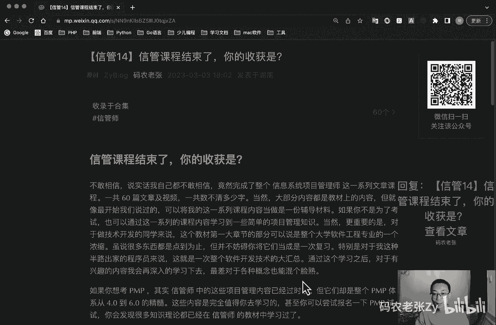

# 【信管14】信管课程结束了，你的收获是？ - P1 - 码农老张Zy - BV1TM411G7wj

hello，大家好，今天呢我们来学习的是信息系统项目管理师，的最后一篇文章了，就是信管课程结束了，你的收获是什么呢，ok完结撒花，对不对，大家也可以准备开始一键三连了，或者怎么样都可以了。

多点几个赞对吧，都可以的好吧，谢谢大家好，不敢相信啊，说实话我自己都不敢相信，竟然自己完成了整个信息系统，项目管理师这一系列的文章，课程一共60篇文章，不包括这篇文章，一共60篇。

包括这篇的话就61篇文章，还有视频啊，一共数不清了多少字，也不知道讲了多少的，就是把这个字读了多少出来啊，当然大部分的内容呢是教材上的内容，但就像最开始我们说过的，可以将我这一系列的课程内容呢。

当做是一份辅导材料，如果你不是为了考试，也可以通过这一系列课程内容，学习到一些简单的项目管理知识，当然更重要的是对于技术开发的同学来说，这个教材的第一大章节就是我们的，第一大部分呢。

可以说是整个大学软件工程专业的一个浓缩，虽说很多东西呢它都是点到为止的，整个一个点啊，这这大概可能就提了个名词这样的，但是它并不妨碍你将它当当，将他们当做是一次复习。

特别是对于我这种半路出家的程序员来说，这就是一次整个软件开发技术的一个大汇总，通过这个学期之后呢，对于有兴趣的内容呢，我可以再深入的学习下去，最差对于这种各种概念呢，我也能混个脸熟，对不对，好。

如果你想考p mp呢，其实信管中的这些项目管理的内容已经过时了，但是他们却是整个pmp体系，从四点到六点的一个精髓，这些内容呢是完全值得你去学习的，甚至你可以尝试自己去报名一下p v p是考试。

你就会发现很多知识里面呢，都已经在我们这个课程里面去学习到了，而如果你刚考完pmp，不好意思啊，就是pmp的难度水平，和信管是真的不在一个级别，相信通过之前的学习呢，你已经看出来了。

难度是n个数量级以上的一个跨越啊，就这一个论文啊，干死一帮人啊，还有那个简答对吧，偏僻只有选择题的，对不对，我们选择题啊就只是一部分对吧好，对于拿证来说呢，这个证呢其实并没有p m p出名。

毕竟p m p是全行业的，我的朋友当中呢有做工程机械的，有做房地产工地的，他们呢都有骗，就是都有需要偏僻这个证的时候，有的是真真的会需要的，而信管师这个证呢则更偏向于软件行业，当然更加重要的是。

他不用续证对吧，也不用额外交钱，考试费也便宜，国家也承认的，而且还能积分落户加分对吧，个人所得税抵税，这个真的是邦邦的对吧，我我现在还是比较推荐去考这个证啊，这个还是有点意思的好。

最后如果你还有兴趣的话，可以再挑战软考高级中的其他考试，比如说我们最早提到过的系统分析师，系统架构设计师，网络规划设计师，系统规划与管理师之类的，他们更偏向于技术，甚至于论文也是纯技术架构去写的啊。

挑战性更大，软考高级三证齐全，就是分析师，架构师和信管师，如果说知识含量的话，就只说知识含量的话，完全可以顶得上，甚至超出一个普通本科计算机专业毕业证的，这个这个我觉得是可以超出的。

当然这个就是我个人的想法，这个呢也是对许多半路出家的码农们的一个建，议，有兴趣的同学可以去试一试，好，再来看一下我的证啊，这个信管师的证呢就是这个样子的，就这个样子的，就是什么啊，有两个章好。

因为在学习的时候呢，特别是在被十大知识领域的输入输出时，可以考虑使用我开发的小程序来配合学习，直接扫码就可以了，是个小程序，直接打开就能看好了，接下来呢我们就要回归码农的本质了，就是信管师和敏捷。

现在内容已经涵盖了整个项目管理里，因为大部分的内容，因此呢后续的内容呢还是会以编程开发为主了，我们还是会回到偏p h p了，不是p mp了，是p hp了，我们将会先以ph p生态周边的一。

些工具软件为主，比如说redis inject等等等，然后呢p和mysql相关的内容也会穿插的鞋，当然大的系列不会有了，上述周边呢也都是一些小的系列文章，将来如果还有项目管理类的内容呢。

那么也就会以独立的小文章的形式出现的，另外我们更新的频率也会回归到一周两更，周一周四文章，周二周五视频，这个这个这个这个估计在视频播出的时候，早就已经开始这样了，好了。

下篇文章见看看会有什么新的惊喜内容啊，好大家也可以期待一下，ok现在就可以点赞了，可以点一键三连了好了，今天内容呢就这些。

