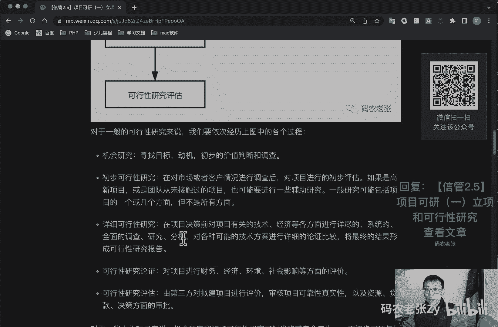
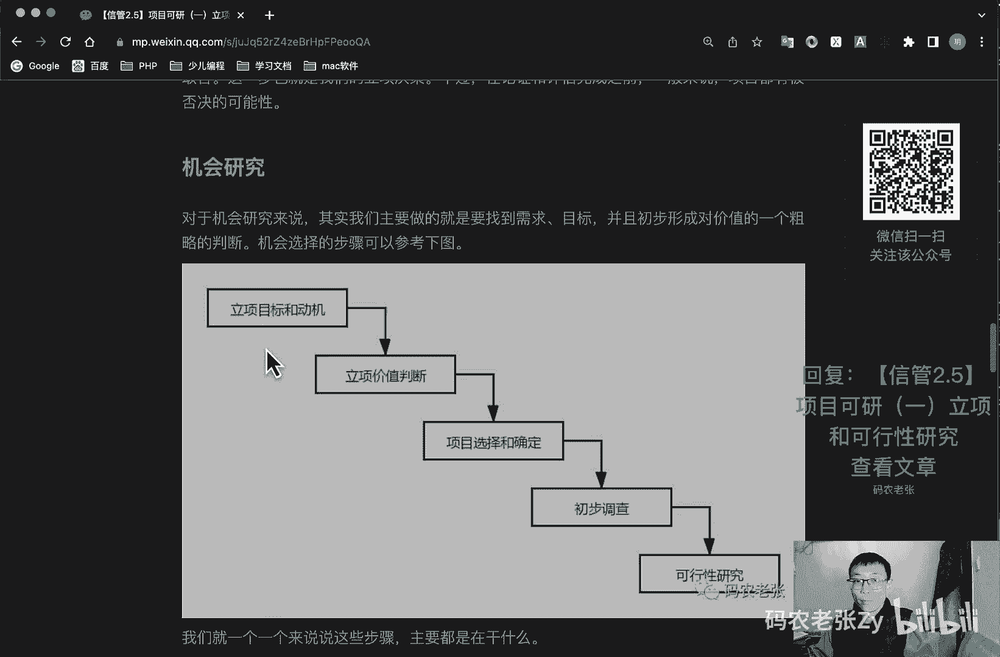
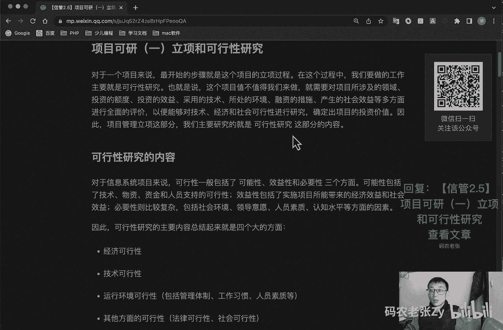

# 【信管2.5】项目可研（一）立项和可行性研究 - P1 - 码农老张Zy - BV1sY41117zx

哈喽大家好，今天呢我们来学习的是信息系统项目管理师，第二大篇章的第五篇文章，项目可研的第一篇文章，立项与可行性研究好，对一个项目来说呢，最开始的步骤呢就是这个项目的立项过程，在这个过程中呢。

我们要做的工作主要就是可行性研究，也就是说这个项目值不值得我们来做，就需要对项目所涉及的领域，投资的领域，投资的额度，投资的效益，采用的技术所处的环境，融资的措施，产生的社会效益等多方面进行全面的评价。

以便能够对技术，经济和社会可行性进行研究，确定出项目的投资价值，因此呢项目管理立项这一部分呢，我们主要研究的就是可行性研究，这部分的内容好，可行性研究的内容主要包括哪些呢，对于信息系统项目来说。

可行性一般包括了什么，包括可能性，效益性和必要性这三个方面，可能性包括了技术物资，资金和人员支持的可行性，效益性呢，包括了实施项目所带来的经济效益和社会效益，必要性比较复杂，包括社会环境，领导意愿。

人员素质，认知水平等方面的因素，因此呢可行性研究的主要内容，总结起来就是四个大的方面的内容，主要是什么呢，经济可行性，经济可行性，技术可行性，运行环境可能性，包括管理体制，工作习惯，人员素质等。

主要是前面这个运行环境可能性，还有其他方面的可行性主要是什么呢，法律可行性和社会可行性，这一块的内容呢是几关键词，经济的技术的，社会的环境呢，这样就比较好记了，好可行性研究的步骤啊。

可行性研究的步骤呢主要包括什么呢，就是就是这么七个步骤呃，第一个呢就是确定项目规规模和目标，第二个呢就是研究正在运行的一个系统啊，就是参考参考别人的，或者是你现在已有的。

第三个呢就是建立新系统的一个逻辑的模型，第四个呢就是导出和评价各种方案，第五呢是推荐可行性方案，第六个呢是编写可行性研究报告，第七步呢就是递交可行性研究报告，在第四部和第五部，也就是导出评价。

还有推荐可行性方案，这这两个部分我们会总结出一个候选系统，方案矩阵和可行性分析矩阵，当然了，更重要的就是第六包，就是编写我们最终产出的这个可行性研究报告，这个报告呢是我们项目是否可以正式立项。

开发的一个关键文档，后面呢我们会再详细的去说明好，我们看一下可行性研究的一个整体过程啊，看一下纯新研究呢，我们一开始从事通常是通过机会研究来进行的，就是发现一个机会对吧。

看我们这个机会是不是可以值得去做的，然后我们就可以进行一个初步的可行性研究，这非常简单的一个可行性研究，同时呢在这个研究过程中，可能还会有一些辅助的研究，也就是在这个整个要做的项目的某一方面。

去进行一个单独的一个研究，然后呢我们就转入到详细的可行性研究，在详细研可行研究呢，就是告诉我们应该这个东西应该怎么干对吧，应该怎么干，然后呢接下来呢就是可行性研究的一个论证，就是这这边说了怎么干了。

我们最后还要专家组啊，或者是我们公司领导啊什么之类的，来决定干不干吧，干不干就可行研究这个论证，最后对它进行一个评估，大概要投入多少啊，大概要怎么样啊，对不对，这个呢我们在这里也有详细的说明。

大家也可以仔细的过来去看一下好了，我们就先看第一部分就是机会研究，对机会研究来说呢，其实我们最主要的就是找到需求目标，并逐步初步形成对价值的一个粗略的一个判断，机会选择的步骤呢可以参考这个啊。

就是第一步。

我们可以看一下立项的目标和动机对吧，立项的目标呢其实就是我们想要做出来的项目，解决什么问题，进行基础研究，还是进行应用开发，或者是提供技术服务，又或者是被某些产品的使用者提供更好的服务。

而立项这个动机啊就更好理解了，主要就是我们市场需求，技术发展，运营需求以及客户的要求等等，立项价值判断，就这个立项价值判断呢是从最简单的，最直观的方向上，先对项目的基础价值做一个粗略的判断。

这个判断呢可能没有详细的定性和，定量的数据支撑，但是要是要先给一个总体的印象，判断我们的项目呢需要选择有核心价值的项目，并根据这个评估来选择的项目，评估项目呢就是多种实施方式对吧。

就这个项目选择和确定啊，平衡的去选择各种合适的方案，然后我们就去进行一个初步的调查，初步调查呢就是进行初步的需求分析，分析企业的基本情况，管理方式和基础数据管理的状况，以及现在的一个系统的一个情况。

最后呢就是转入到可行性研究状态了，好了，我们在可行性研究状态里面还分为两个什么，一个初步可行性研究，一个详细的可行性研究，初步可行性研究呢，一般是我们对市场或者是客户情况，进行调查之后呢。

对项目进行初步的评估，目的呢主要包括什么呢，目的主要就是分析项目的前途，从而决定是否应该继续深入进行调查研究，第二个呢就是初步估计和确定项目中的关键，技术以及核心的问题，你确定是否需要去解决这些问题。

第三个呢就是初步估计必须要进行的辅助研究，以解决项目的核心问题，并判断是否具备必要的技术实验，人力条件作为支持，初步可行性研究的内容包括哪些呢，呃主要包括市场和生产能力，主要就是进行市场需求分析的预测。

然后呢就是设备和材料投入分析，包括从需求设计开发，安装实施到运营的，所有设备与材料的一个投入的一个分析，然后就是网络规划，物理布局方案的选择，当然别的系统现在也有啊，然后呢就是项目设计。

包括项目总体规划，项目信息系统设计和呃设备计划，网络工程规划等等对吧，只是说在新系统里面，这些东西是比较重要的好了，项目进度安排，然后就是项目投资与成本估算，包括投资估算，成本估算。

筹措资金的渠道以及初步的筹集方案等等，然后初步可行性研究呢，一般会包含有四种结果啊，这四个结果要记一下，包括哪四个结果呢，一个是肯定肯定之后呢，就是对比对比较小的项目，就可以直接上马去开干了。

第二呢就是肯定也是给一个肯定，但是呢我们要转入一个详细的可行性研究，进入更深入更深更深入的分析研究，第三步呢就是展开专题研究，比如说市场考察，实验室实验啊，中间工厂实验等等。

然后我们再来确定它到底是肯定还是否定，最后那一种呢可不都说了就否定了，项目就不干了，马上下马对吧好呃，就是初步可行性研究呢，形成初步可行性研究的报告，这个报告可以作为正式的文献的供决策参考。

其实呢通过初步可行性研究报告，和前面的机会研究呢，我们就可以生成一个非常重要且正式的文档，那就是项目建议书，项目建议书，项目建议书通常是由初步可行性研究报，告和机会研究来得出的，好。

再来看一下项目建议书，又称立项申请，是项目建设单位向上级主管部门，提交项目申请时所必需的文件，是该项目建设筹建单位或者法人，根据国民经济的发展，国家和地方中中长期规划，产业政策，生产力布局。

国内外市场所在地的内外部条件等，单位的发展战略的，提出的某一具体项目的建议文件，是对拟建项目提出的框架性的，一个总体的一个设想，项目建议书呢是项目发展周期的初始阶段吧。

是国家或者上级主管部门选择项目的依据，也是可行性研究的一个论据，涉及利用外资的项目，在项目建议书批准之后方可开展对外工作，也就是说呢，项目建议书是给就是电子政务，与政府外包相关的项目的一个必需品啊。

是非常重要的一个东西，项目建议书的核心内容包括什么呢，就是项目的必要性啊，是项目的市场预测啊，产品方案或服务的市场预测，项目建设必须的条件，项目建议说的这四个内容呢，我们可以用必要市场方案条件八个字来。

即就是必要市场方案条件对吧，这是一个重点内容，好对于不同的项目来说，项目建议书的编制呢也是不同的，比如说跨地区跨行业的项目，国际民生有重大影响的项目，国内合资项目，这些类型的项目都是由有关部门与地区。

联合提出的，中外合资合作经营，在中外投资者达成意向性协议之后呢，再根据国内有关的投资政策与产业政策来编制，这个就是中外合资相关的了，然后大中型和限额以上拟建项目，上报建议书行了，应付初步可行性研究报告。

该报告由资有资格的设计单位，或者工程咨询公司编制，这些一般都是比较大型的项目的，由此也可以看出啊，项目建议书的编制的，一般是由第三方咨询机构来进行编制的，当然这也是针对上述这些非常大型的项目的。

如果是中小型公司内部项目，有项目经理或者是团队产品负责人提出，编制也是没什么问题的啊，好了，总结一下，今天我们学习的主要内容呢，就是可行性研究报告的说明，以及立项相关的内容。

在这里呢我们先接触到了可行性研究的前两部，也就是机会研究和初步研究，这两块内容呢相对来说还是比较好理解的，接下来呢我们就要用就是下下一节课，我们要用一整节课的时间来学习，可研中。

最重要的也就是详细的可行性研究的内容，这个东西呢就是非常重要的部分了，好了，今天的内容呢就是这些，大家可以回复文章的标题，信管2。5项目可研一立项和可行性研究，来获得这篇文章的具体内容。

好了，今天的内容呢就是这些。

