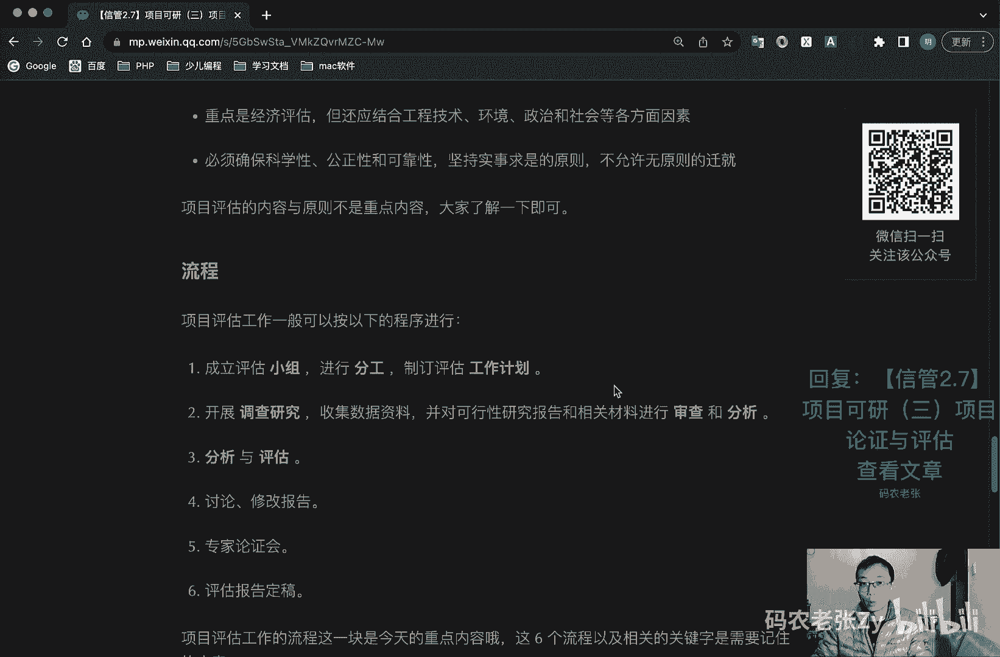

# 【信管2.7】项目可研（三）项目论证与评估 - P1 - 码农老张Zy - BV1mP4y1r7LP

哈喽大家好，今天呢我们来学习的是信息系统项目管理师，第二大篇章的第七篇文章，项目可言的第三篇文章，项目论证与评估，先论证后决定呢，是现代项目管理的一个基本原则，论证和评价。

一般是从专业的角度来对项目的可行性研究，结果进行最后的一个把关，也就是说在论证和评估之后，我们的前期准备工作也就差不多了，好我们先来看一下项目论证啊，项目论证呢是指对你实施项目，经济上的一个合理性啊。

盈利性啊，实施上的一个可能性啊，风险性啊，进行全面科学的综合分析，项目论证呢应该围绕着市场需求，开发技术，财务经济三个方面进行调查和分析，市场是前提，技术是手段，账务财务经济啊，这个应该财务经济是核心。

好我们看一下项目论证的一个作用，项目论证的作用主要体现在几个方面啊，第一个就是项目论证，是确定项目是否实施的一个依据，第二个呢项目论证是筹措资金向银行去借，怎么呢贷款的一个依据啊。

第三个呢就是项目论证是编制计划设计，采购施工以及机器机构设备呃，资源配置的一个依据，第四个呢项目论证是防范风险，提高项目效率的一个重要的什么，保证项目论证的一般程序是什么呢，项目论证啊是一个连续的过程。

它包括问题的提出，制定目标，拟定方案，最后从多种可行的方案当中，选出一个比较理想的最佳方案，投资者决策，具体来讲呢，具一般有以下几个，出七个以下七个主要的步骤，第一个呢就是明确项目的范围和业主目标。

第二个呢就是收集和分析相关的资料，第三个呢你定多种可行的，能够互相替代的一个实施方案，第四个呢就是多方案分析，第五个呢就选择最优的方案进行进行，进一步的详细的全面的论证，第六个呢就是编制项目论证报告。

环境影响报告书和采购方式审批报告，第七个呢就是编制资金筹措计划，和项目实施的一个进度计划，好，我们再来看一下项目，项目论证的一个阶段的一个划分啊，项目论证呢在机会初步和详细可研阶段。

都会出现对各个阶段的工作内容，费用时间的影响呢，需要记住就是下面这个表格就可以了，好这个表格呢有几个关键的地方，就是这个数字，这个数字大家可以详细的去看一下啊，这是什么呢，第一个我们在机会研究阶段啊。

机会研究阶段，我们论证的主要工作内容呢是寻求投资机会，见面投资方向，一般呢时间是1~3个月，然后占统总投资的多少呢，就是0。2%到1%，就花这么点钱，然后呢误差控制在正-30%左右。

就我们最后论证出来的结果，包括这些财务分析的结果呢，应该是大概误差应该在30%左右好，然后在初步可行性研究的阶段，我们初步判断项目是否有生命力，能否盈利，在这个阶段呢一般是花费4~6个月。

然后在这个就是初步可行性研究阶段的，一般会花费我们总投资的0。25%，到1。5%左右，然后大概误差呢，就是最后呃最后获得的那个项目，可行性研究报告的那个书，里面的误差呢大概是20%左右。

然后最后再详细可以进行研究阶段呢，我们主要是进行详细的技术论证，技术经济论证，在多种方案比较的基础上，选择最优的方案，一般是4~8个月，如果是大型的项目呢，可能就是八到12个月。

然后中小项目呢嗯在这个阶段呢，我们一般会占到总投资的1%到3%，然后大项目呢会占到总投资的0。2%的，1%，然后最后呢它的误差控制在10%左右，注意啊，这几个比较关键的地方就是0。1~1%，0。

25~1。5%，然后就是1% 3%，0。2%到1%这几个东西，然后呢还有就是像后面这个误差控制2%，十，百分之30 10%，它们分别对应的都是什么阶段，好这个地方呢可能考试有可能会考好。

这个就是项目论证，项目论证完了，我们再看一下项目评估，项目评估呢是指在项目可行性研究的基础上，由第三方国家银行会有关机构，根据国家颁布的政策法规，方法参数和条例等，从项目或企业国民经济社会角度出发。

对拟建项目建设的必要性，建设条件，生产条件，市场需求，工程技术，经济效益和社会效益等进行评价分析和论证，进而判断是否可行的一个评估过程，几个关键词啊，就是第三方，然后你将项目评价分析论证可行。

在项目评估中呢，最主要的就是评估项目的一个必要性啊，也就是说这个项目呢他有没有做的必要，如果连做的必要都没有，那么这个项目呢，其实也就没什么继续做的动力了啊，好，那么项目评估的目的呢。

是凭审查项目可行性研究的一个可靠性，真实性和客观性，为银行的贷款决策呢，或行政主管部门的审批呢，去提供一个科学的依据，项目评估的依据主要包括哪些内容呢，我们再仔细来看一下起诉几条好。

第一个呢就是项目建议书或其批准文件，第二个呢就是项目可行性研究报告，第三个呢就是报送单位的申请报告，及主管部门的审初审意见啊，这是初审意见，然后呢就是有关资源配件，燃料水电交通通信资金。

包括外汇等方面的一个协议文件，最后呢就是必须的其他的文件和资料，这块了解一下就行了，好最后呢项目评估的一个内容主要包括哪些呢，就是项目与企业的一个概况，项目建设的必要性评估项目建设的规模，资源配件。

燃料及公用设施的一个条件，评估网络物理布局条件的一个方案，评估技术和设备方案评估，信息安全评估，安装工程标准评估实施进度评估，项目组织劳动定员和人员培训计划的一个评估。

投资估算和资金筹措项目的财务效益评估，国民经济效益评估嗯，还有呢就是社会效益评估，项目风险评估呃，项目评估的一个原则主要有哪些呢，就是符合国民经济和社会发展规划，以及经济方针政策。

然后呢就是满足技术功能需要求与切实可行的，然后呢就是遵循可比原则，效率与费用计算口径是一致的，然后以动态分析为主，采用国家规定的一个动态指标啊，然后就是认证审核需求，预测技术方案等。

选择基础数据的一个准确性啊，评估的内容啊，深度啊，以及计算指标呢，应满足审批项目，建议书和设计任务书的一个要求啊，重点是非常重点的，就是经济评估啊，我们上回讲过什么呢，n p v现在想一想那几个公式啊。

那个表格还记不记得对吧，经济评估是很重要的，但是呢还应该结合工程技术环境，政治和社会等方面的因素，必须确保科学性，公正性和可靠性，坚持实事求是的原则，不允许无原则的迁就好，项目评估的内容与原则。

就上面这一大堆，我读的也非常快啊，这些都不是重点内容，大家了解一下就可以了，我们再来看一下流程啊，项目评估的一般工作流程呢，可以按以下工程进行以下程序进行啊，这个东西会比较重要一点。

好像我评估的流程呢主要是什么呢，第一个就是成立评估小组小组，然后进行分工，然后制定评估工作计划，加粗的地方啊，然后呢就是开展调查研究，收集数据资料，并对可行性研究报告和相关材料，进行审查和分析。

第三个呢就是分析与评估，第四个呢就是讨论和修改报告，第五个呢专家论证会，第六个评估报告定稿好，这个就是今天的最主要的一个内容，其实也比较好记啊，小组分工工作计划，第一步对吧，第二步是什么呢。

调查研究进行审查和分析，第三步什么呢，分析和评估，第四步的讨论和修改了第五部专家吗，专家主要来说一说吧，说吧专家论证会第六部就是定稿了，好这个呢就是项目评估工作的一个流程。

接着我们看一下建设方与承建方的一个立项管，理，建设方也就是甲方对吧，在项目的立项管理中呢，他主要负责什么呢，嗯甲方呢他主要负责的就是项目建议书的编写，申报和审批，项目的可行性研究，初步详细啊。

项目论证评估，项目可行性研究报告的编写提交和获得批准，然后呢就是项目招标，招标投标评委选定项目承建方对吧，其实也就是说呢，我们可行性研究大部分其实是由甲方来做的，而承建方呢，也就是乙方。

在立项管理中的主要的职责有哪些呢，第一个呢就是项目的一个识别，以及技术发展中去寻找一个项目的机会，第二个呢就是项目论证，乙方的内部呢，乙方内部也可以有一个可研的过程，对不对，主要是以乙方自己。

他去进行项目的技术可行性啊，人力啊，以及其他资源，财务风险，及其投标者的一个相关情况的一个分析，第三步呢我们就是承建方要干嘛呢，要去投标，对不对，收集各种资料，准备投标文件，参加投标会议等等。

这个投标这一块我们后面也会讲到啊，然后呢就是签订合同嗯，甲乙双方在立项中的职责呢，也是作为了解的内容，大家了解一下就可以了，好吧，我们今天的重点内容只有刚刚说的那一块，就是那个评估的过程好了。

总结一下今天的内容呢确实很简单，对不对，主要的核心内容呢就是项目论证阶段，划分的表格中的数据以及项目评估的流程啊，这两块内容呢接下来就可以了，从下节课开始，我们就正式进入到项目管理。

十大知识领域当中的学习，总算等到这一天了，对不对，加油吧，小伙伴们好啊，大家可以回复文章的标题，信管2。7，项目可研三，项目论证与评估来获得这篇文章的具体内容，具体内容呢还是要详细来看一下。

最重点的是什么呢，一个是这个表格对吧，前面说过了，表格当中最重要的是后面这一块对吧，后面这一块和前面的一个对应情况，第二个呢就是项目评估的一个什么流程，对不对，项目评估流程这六点也是比较重要的地方。

记关键词就可以了好了。

今天的内容呢就是这些。

