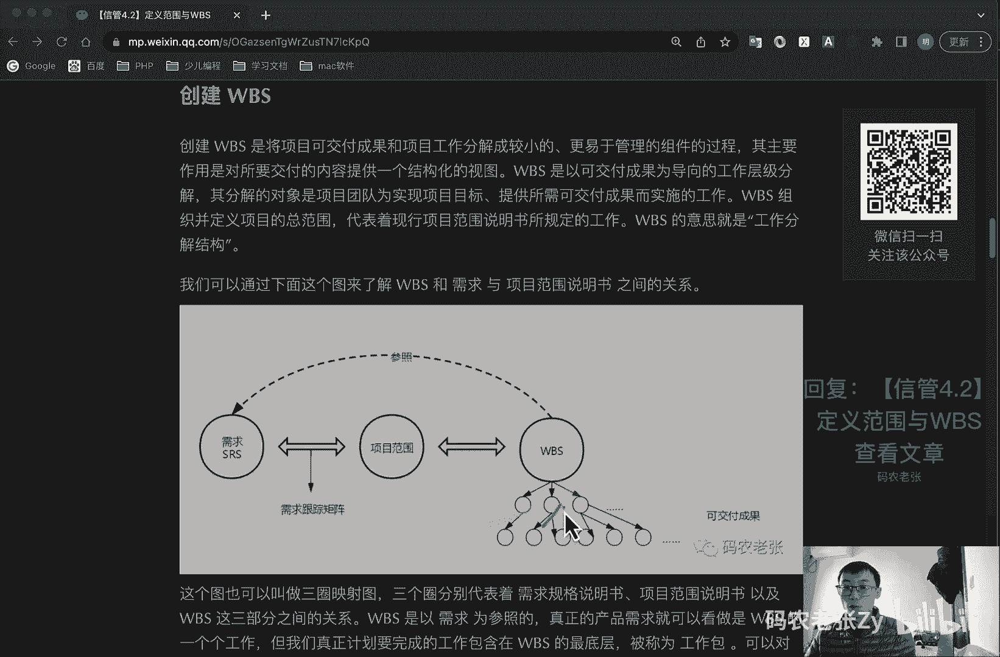
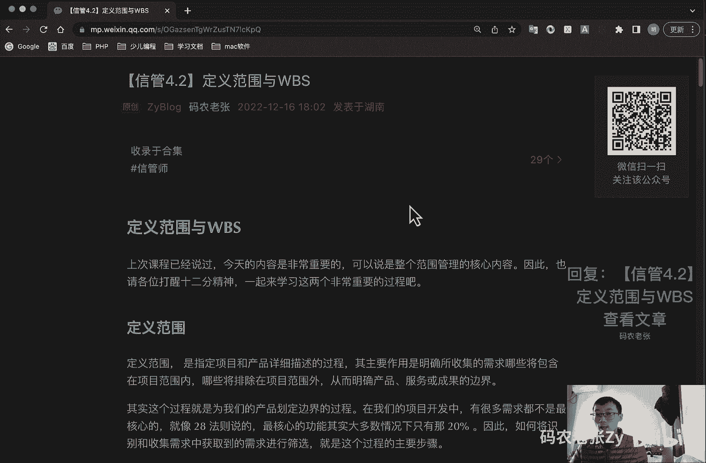

# 【信管4.2】定义范围与WBS - P1 - 码农老张Zy - BV18841137YF

hello，大家好，今天我们来学习，真的是信息系统项目管理师第四大篇章，项目范围这一块的第二篇文章，定义范围与w bs，就是我们后面的就是呃呃总共有六个过程，对不对，我们今天讲的是中间的另外两个过程了。

那么上次过程呢已经说过了，今天的内容那是非常重要的，可以说是整个范围管理的核心内容，因此也是请各位打起12分精神，一起来学习这两个非常重要的过程啊，第一个呢就是定义范围，定义范围啊。

就是指就是指定项目和产品详细描述的过程，其主要作用是明确所搜集的需求，哪些将包含在项目范围内，哪些将排除在下面范围之内，放范围外，从而明确产品服务或成果的一个边界，其实呢这个过程呢。

就是为我们的产品划定边界的一个过程，在我们的项目开发中，的很多需求都不是最核心的，就像二八法则所说的，就是我们最核心的功能呢，其实大多数情况下只有那20%，因此呢如何将识别和收集需求中。

获取到的需求进行筛选，就是这个过程的一个主要步骤，二八法则，不知道大家有没有了解过啊，就比如说我们在使用一个软件的时候，比如说你使用微信或者支付宝或者什么呃，各个或者或者抖音啊，各种软件的时候。

其实日常你用的最多的，只是那20%的功能，有80%的功能你根本不用的，或者说你根本都不知道的，这个就是二八法则好，另外做工作就是工作或者学习的时候，也也有这个200法则的问题啊，就是你最核心的知识。

最核心的只是还有你工作中干得最多的那些事，往往都是那20%的最核心的一些东西，而80%的那些知识啊，或者是一些相关的一些工作啊，其实都不是最核心的，只是一些辅助啊，或者是什么。

那那些内容的这些都是二八法则相关的内容，这个具体情况具体的具体的这个东西啊，大家可以自己去查一下，什么叫做二八法则，我们来看一下定义范围的一个工具与技术啊，通过上面的说明呢。

我们就可以推断出定义范围的工具与技术，很大可能性是与范围边界有关的，既然要确定边界的，那么必然就是要对产品进行一个详细的分析，好我们第一个看的工具呢就是产品分析，对于那些产品为可交付成果的项目呢。

产品分析是一个有效的工具，产品分析技术呢包括但不限于产品分解，系统分析，需求分析系统工程，价值，工程和价值分析等等，除了产品分析之外呢之外呢，备选方案生成呢，也是一种根据数据来进行分析的工具。

它是一种用来指定尽可能多的潜在可选方案，的一个技术，用于识别执行项目工作的不同方法，许多通用的管理技术都可以用于生成备选方案，比如说什么呢，比如说头脑风暴，逆向思维，横向思维啊，备选方案分析等等啊。

这些名词大家可以自己去查一下什么意思啊，但是你知道大概知道他们是在哪些工具，技术里面的就可以了，好呃，在定义范围这里呢，我们会形成一个项目范围说明书，就经经过定义范围这个过程之后呢。

输出的就是这个项目范围说明书，我们要详细的说一下这个项目范围说明书，项目范围说明书呢，代表的项目相关方之间的项目范围，所达成的共识，或者说是一个确定的需求方案，它的内容包括哪些呢，包括产品范围的描述。

需要验收的标准，可交付成果，项目的除外，责任制约因素，假设条件，假设条件，假设条件这个东西呢就是制定计划时，不需要我们去验证，就可以视它为正确的，真实的或者确定的一些因素。

好项目范围说明书的内容呢还是比较清晰的，同样的它的作用呢也是非常明确的，它作用是什么呢，第一个就是确定范围，描述了可交付成果和所要完成的工作，第二就是沟通的基础，表明项目干系人之间。

就项目范围所达成的一个共识，第三个呢就是规划和控制的依据，使项目团队呢开展更详细的规划，并可在执行过程中的指导项目团队的工作，下一个呢就是变更基准啊，为评价变更请求或者是额外工作。

是否超出项目边界提供基准，最后一个呢就是它规划机，它是一个规划的基础啊，为其他计划和滚动式规划提供了一个基础，最后我们再来了解一下项目章程，和项目范围说明书之间的关系啊，项目章程包括高层级的信息。

而项目范围说明书呢，则是对项目范围的详细描述呃，项目范围需要在项目过程中渐进明细，而项目章程呢一般是保持不变的，ok项目基准就是范围，基准里面第一个重要内容是什么，项目范围说明书，我们就是在这里了。

好后面两个东西创建wb，就是wb和wb s字典，就在这个过程里面创建w bs，创建w bs呢是将项目可交付成果和项目工作，分解成较小的，更易于管理的组件的过程，其主要的作用呢就是要对所交付的内容。

提供一个结构化的一个视图，wbs呢是可交付成果为导向的工作层级分解，其分解的对象呢是项目团队，为实现项目目标，提供所需可交付成果实而实施的工作，wb s组织并定义项目的总范围。

代表着现行项目范围说明书所规定的工作，w bs的意思呢，它是什么，一直说过了，前面已经强调过了，工作分解结构，我们可以通过下面这个图啊，来了解w b s和需求，与项目范围说明书之间的关系。

你看一下我们的需求对吧，srs需求说明文档对吧，srs然后根据需求跟踪矩阵对吧，也是上篇文章讲过的，然后变成什么呢，变成一个项目的范围，就项目范围，具体范围，项目范围说明书刚刚那个过程讲过的，最后呢。

我们通过将项目范围，说明书里面规定那些内容呢，分解成什么呢，分解成一个w b s，w b s就是它分解出来的工作包，分解出来的工作包。

然后最后呢，这个w b s当然也是参照这个需求规格，说明书的好，这个呢就是这个图案也叫做非常出名的，就叫做什么三圈映射图，三个圈分别代表着需求规格说明书，srs，需求范围说明书。

以及wb s这三部分之间的关系，w bs呢是以需求为参照的，真正的产品需求，就可以看作是w bs的一个个的工作，但我们真正计划要完成的工作呢，包含在wbs的最底层，被称为工作包，可以对工作包安排进度。

估算成本和实时监控，在工作分解结构这个词语中的工作，是指作为活动结果的工作产品和可交付成果，而不是活动，就是你这个工作具体本身，比如说写代码不能作为这个工作包，但是你这个代码要实现什么功能。

你做出来这个功能才叫做这个工作包，就是他的工作产品和可交付成果，如果准确无误的，就是如果准确无误的分解出w bs，并且这样的w bs呢，得到了客户等项目干系人的认可，那么凡是出现在w b s中的工作呢。

都应该属于项目的范围，就是应该完成的，注意啊，凡是没有出现在w b s当中的工作，就是不属于项目的范围，要想完成这样的工作呢，需要遵循变更控制流程，并经过变更控制委员会的批准的，不要自己随便去加工作啊。

好w bs的层次，w b s呢将项目整体或者主要的可交付成果，分解成容易管理，方便控制的若干个子项目或者工作包，公子项目呢需要分解为工作包，持续这个过程，然后直到整个项目都分解为可管理的工作包。

这些工作的包的总和呢就是项目的所有范围啊，你看一下他这个分解的这个形式，比如说我们要做一个远程的教育项目对吧，我们往下依次分解分解到这一层，这个硬件硬件需要什么呢，其实我还可以在硬件底下再去分解的。

对不对，然后这个呢就是第三方软件，然后我们系统功能有哪些呢，包括设备管理，维护管理啊，功能管理啊，这个还是分的比较粗的啊，好你看一下啊，这这这还是接下来的还有什么模块设计啊，什么代码什么什么这些的啊。

做采购管理，库存管理啊什么的系统接口啊，现场实施啊，这分的还是比较粗的一个wb好，这样分层的特点就是这种分层的特点是什么呢，就是每层中的所有要素之和呢，都是下一个就是每层，你看这个这一层所有要素之和呢。

就是下一个层层的工作之合，其实就是他这这一层的工作之和，每个工作要素呢应该具体就是只拍给一个层次，而不应该只派给多个层次，就这一个工作要素呢，只能出现在这一个层次里面，不要出现在多个层次里面。

第三个呢就是w b s，需要有投入工作的范围描述，这样才能使所有人对完成的工作，要有一个全面的一个了解啊，好在这其中的每个节点可以区分出不同的层次，包括什么呢，包括一些什么重要的里程碑，对不对。

这个这个图上没有表明出来啊，好里程碑，我们先了解一下，就是这个里程碑，里程碑就在甘特图里面，大家有没有看过甘特图啊，就是一个菱形的那个东西对吧，然后一个实心的菱形的那个东西，这个一般叫做里程碑。

里程碑呢表示的是重要的时时点或者是事件，标志着某个可交付成果，或者是阶段的一个正式的完成，第二个呢就是工作包，工作包就是我们刚刚说的，就是位于w版b s，w w b s每条分支最底层的可交付成果或项目。

工作组成部分，刚已经说过了，他是可交付成果或者项目工作组成部分，工作包的大小也是需要考虑的一个细节，就是如果工作包太大，则难以达到可管理和孔可控制的目标，如果工作包太小的话，则创建w bs。

需要消耗项目管理人员和项目团队成员，大量的时间和精力，同时呢由于工作报过多，会造成逻辑结构的一个复杂，作为一个经验法则，八八十月规则就是80小时规则，就是建议工作包的大小呢，应该至少需要八个小时来完成。

而完成时间段呢也不应该大于80个小时，就怎么说呢，就你这个工作包啊，就比如说我们下面这一块，下面这一块这个工作包，就比如说这个功能测试啊，我们应该是在五天，对不对，五天还是比较符合规范的。

就你最少应该是一天的工作量，最多的话也不要超过十天的工作量，这个就是w b s工作包的一个划分的，一个要一个这个基金法则好了，接下来呢就是控制账户，控制账户呢是一种管理控制点。

在该控制点上将范围预算就是预算，就包括资源计划，实际成本和进度加以整合，并将它们与正值进行比较，以测量绩效，控制账户呢是w bs某个层次上的一个要素，也可以是工作包。

也可以是比工作标更差高层次上的一个要素，一个控制账户呢就包括若干个工作包，但一个工作包呢它仅属于一个控制账户，控制账户呢大概的意思，其实也可以看成是这种分组的，看到没看到分组的。

这大概就可能就一个控制账户的意思，底下可以在再可以进行一个细分，也可以包含若干个工作包好，但是也也不完全是这个意思啊，好了，规划包，规划包呢是在控制账户之下，工作内容呢已知。

但尚缺乏详细进度活动的wb s组，就是你这个进度还没有确定的一些，可以叫做规划包，然后呢就是w bs字典，看到没有w bs，这点出现了，wb s字典也称为w bs的一个词汇表。

它描述w bs各组成部分的一个文件，可能包括账户编码标识，工作描述，假设条件和制约因素，负责人或组织单元进度里程碑相关的进度活动，所需资源成本估算，质量要求，验收标准，技术参考文献协议信息等等。

这个叫做w bs词典，好，我们再看一下分解啊，分解这个和和这个也是非常重要的一个工具啊，分解它是一个技术，它应该属于一个技术啊，分解是需要将整个项目分解为工作包，需要进行以下几个活动。

第一个呢就是识别和分析，可交付成果以及相关工作，你要搞清楚你要干嘛对吧，第二呢就是确定w bs的结构和编排方法，第三个呢就是自下自上而下逐层细化分解，一步一步的往下去分解。

第四个呢就是为wb s组件制定和分配标识，编码，就是前面我们看到这个图上，你看到没这个编码编码对吧，制定这个编码，然后呢就是最后呢就是为何时可交付成果，分解的程度是恰当的。

我们要确定这个这个分解的程度是恰当的，什么刚那个经验法则八八十，对不对，你的工作量好，其中呢在最后的核实过程中呢，我们要确定几个问题，就是最底层要素，对项目分解来说是必须而且充分的吗，然后就是每个组。

每个组成要素的定义是否清晰完整的，接下来呢就是每个组成要素是否能恰当地编制，值，出进度和预算是否能分配到具体的组织单元呢，好这个是分解这一块啊，然后还有呢就是分解结构，分解结构就在这里说了。

你看啊就是要确定w bs的结构和编排方法，这个地方就讲了，就是分解结构，在项目管理的实践中，我们可以按照下面的方式来进行分解，怎么分解呢，就将生命周期和各阶段作为分解的第二层，产品和项目可交付成果呢。

放在第三层，这什么意思呢，你看一下我们要做的这个企业管理信息系统，对不对，做的这个系统，然后我们第二层放什么呢，第二层放就是各个生命周期阶段，各个生命周期阶段，比如说我们在这里面什么需求调研阶段。

对不对，分析设计阶段对不对，这里是程序设计阶段，然后是软件测试阶段，然后呢，我们把产品和项目可交付成果去放在第三层，第三层放的是产品和可交付成果，看到没有看到没有。

然后具体的我们还可以再往下分那个工作包，对不对，那就再继续往下分了，但是前三层就前三层就是这个形式的，这个就是第一种这种分解的方式，这种分解结构的方式呢，就是将生命周期和各阶段注意阶段。

这个阶段比较重要，各阶段作为分解的一个第二层，第一层都是名字，第一层就是这个产品的名称，第二层注意在第二层，然后呢还有一种分法，就是将可交付成果作为分解的，第二次就是与就是上面这种方法。

把可交付成果放在第三层了，对不对，现在我们把它直接就放在第二层，我们不需要这个阶段去了，不需要这个阶段了，就是另外一种分法啊，就这种方法你看到没有，我们还是这个系统，还是这个系统。

然后呢我们就直接把这个oa系统啊，什么这个人事系统啊，什么营销系统啊，就放在这一层了，然后底下我们再去进行详细的划分了，好这个人呢就是第二种划分方法，然后还有一种呢就是整合。

可能由项目团队以外的组织来实施的各种组件，然后作为外包工作的一部分，卖方需要编制出相应的合同，w b s这个就交给别人了，交给谁呢，交给你的外包方或者你的乙方了，去解决这个问题了好了，这个我们就不管了。

ok我们再看一下分解的一个表现形式，还是这个地方看到没有结构和编排方法，这个表现形式就是这个编排方法好，这个分解的表现形式呢主要有塑形的组织结构，就是组织结构图示和表格形式的，就是列表式的。

就是上面我这个这个就是塑形的，这个就是塑形的，然后呢这个再往上这个地方，这种就是列表型的，这个就是列表形的，注意啊，就这两种啊，好这两种形式啊，它主要我们在这里看一下，就是它的一个优缺点啊。

就是树形结构的wb层次清晰直观，结构性很强，但是不不不太容易修改，对于大的复杂的项目，也很难表现出项目的一个全景，就非常复杂的项目，你得画多大对吧，那张图，然后呢在一些小中小型的项目中，应用的会比较多。

大型项目的w bs呢要首先分解为子项目，然后项目在进一步分析出自己的w bs，就画很很多张这种属性图，才能把那个大型的项目给他表示完全好了，另外呢就是列表形式，列表形式呢最好能带上缩进。

这样的话会更直观，能反映出项目中所有的工作要素，但直观性会比较差，就是就是就是怎么说呢，就是你一眼看不就一眼，不太可能看清楚它的一个具体的一个格式，所以说你带了缩镜之后，但是呢你不像那个树形图那么直观。

对不对，但是其实也也也还可以了，好这个呢就是列表形式了，它就比较适合用在一些大型的复杂项目中，因为它可以一直往下列的，对不对，因为有些项目在分解之后呢，内容分类较多，容量较大。

用缩进图标的形式呢会比较方便，也可以装订成册，在项目管理工具软件中呢，大多也会采用列表形式的wb，后面我们也会看到的好，再看一下分解原则和注意事项，这个东西呢是今天比较重要的一个东西啊。

w b s的分解原则和注意事项呢，是非常非常重点的内容，也是几条很短的小知识点啊，大家就是只要记下来就可以了，好第一个就是在各层次上要保持项目的完整性，避免遗漏必要的组成部分，也就是说百分之百规则。

这百分之百的规则怎么理解呢，就是所有的你分解出来的w bs工作包，要百分之百的能够满足你的需求，文件里面的内容，这个就是百分之百规则好，第二个呢就是一个工作单元，只能从属于某一个上层单元，避免交叉从属。

就是你这一个工作包，你你只有一个上级啊，你只有一个上级，你不要有多个上级，这样去避免交叉重数好了，下一个呢就是相同层次的工作单元呢，应该有相同的性质好，这个是相同层次的，就不用多说了。

然后呢就是工作单元呢应能分开，不同的责任者和不同的工作内容，每一个工作单元的有且只有一个人是负责的，就这一个人是必须要去负责的，必须要有一必须要有人负责，就是这个意思。

然后这个后面也会讲到一个就是工作责任矩阵，然后呢就是便于项目管理，进行计划和控制的管理的需要，这个就不用多说了，然后呢最底层工作呢应该具有可比性，是可管理的，是可检查的，就是80和八和80元规则。

那个就前面讲过的那个，然后呢就是因包括项目管理工作，因为管理是项目具体工作的一部分，包括分包出去的工作，然后最后呢就是w bs的最底层次的工作单元，呢是工作包一个项目的，blbs是否分解到工作包。

要跟项目的阶段，复杂程度和规模有关，一般来说早期或复杂或大规模的项目，其w bs的分解颗粒呢要稍微大一点，粗一点啊，然后后期呢就是这个也是可以去滚动规划的，越到后期越精细也是可以的。

也是可以随时去改动的，好再来看一下w bs的作用啊，当一个项目的w bs分解完成之后呢，项目干系人对完成的w bs应给予确认，并对此达成共识，然后呢才能据此进行时间估算和成本估算。

项目进度管理和项目成本管理的核心依据，全都是在这里啊，全都是在范围管理当中的，这个wb w b s的目的和用途呢，主要体现在以下几个方面，第一个呢就是明确和准确说明项目的范围。

项目团队成员能够清楚地理解任务的性质和，需要努力的一个方向，第二个呢就是清楚定义项目的一个边界，它提供了项目管理人员，项目产品或服务的用户，发项目发起人，项目团队成员等其他项目干系人一致认可的。

项目需要做的工作和不需要做的工作，第三个呢就是为各独立单元分派人员，规定这些人员的职责，可以确定完成项目所需要的技术和人力资源，下一个呢就是针对独立单元进行时间成本，资源需求量的一个估算。

提高估算的一个准确性，然后呢就是为计划预算，进度安排和费用控制奠定共同基础，确定项目进度和控制的一个基准，然后呢，就是将项目工作和项目的财务账目联系起来，接下来呢就是确定项目工作内容和工作顺序。

将项目分解成具体的工作任务，就可以按照工作任务的逻辑顺序来实施项目，最后呢就是有助于防止需求的蔓延，好了，需求蔓延，这是什么意思哈，我们下篇文章会再讲好了，总结一下今天学习的内容呢。

如果用一个词来说明的话，那就是范围基准，对不对，我们今天讲的内容定义范围里面生成的是什么，然后w bs生成了两个什么东西对吧，合起来就是范围基准，对不对，在这里面都说了范围说明书对吧。

wb s w b s4 点，他们一起形成了范围基准，还有上篇文章我们提到过了范围管理计划，是不是范围基准，不是啊，注意不是，再次强调今天内容中的范围，说明书的内容可以大致了解一下。

然后整个w b s的部分内容都是重点，是的你没看错，整各w bs部分的内容，就是创建w bs这个过程里面，所有的内容都是重点，不过相对来说呢，w bs这块内容呢其实不难理解啊。

就是如果你所在的团队的项目经理，或者说部门领导做过甘特图，甘特图这个东西大家有没有见过啊，如果你做过这个东西的话，你或者你看到过这个东西的话，或者你使用过一些项目管理软件的话，肯定都有这个东西。

比如说肠道什么之类的，对吧，他肯定有这个东西，那么w b s你就绝对不会陌生了，甘特图的内容，我们在下一节课也会大概的先给大家看一眼，然后在讲到进度管理的时候，就会进行一些更深入的一个学习，好了。

今天的内容呢就是这些，大家可以回复文章的标题，信管4。2，定义范围w b x来获得这篇文章的具体内容，以及详细的一些信息，详细的内容呢还是需要仔细的看一下。

理解一下，最后再记一下吧，好了，今天的内容就是这些。

