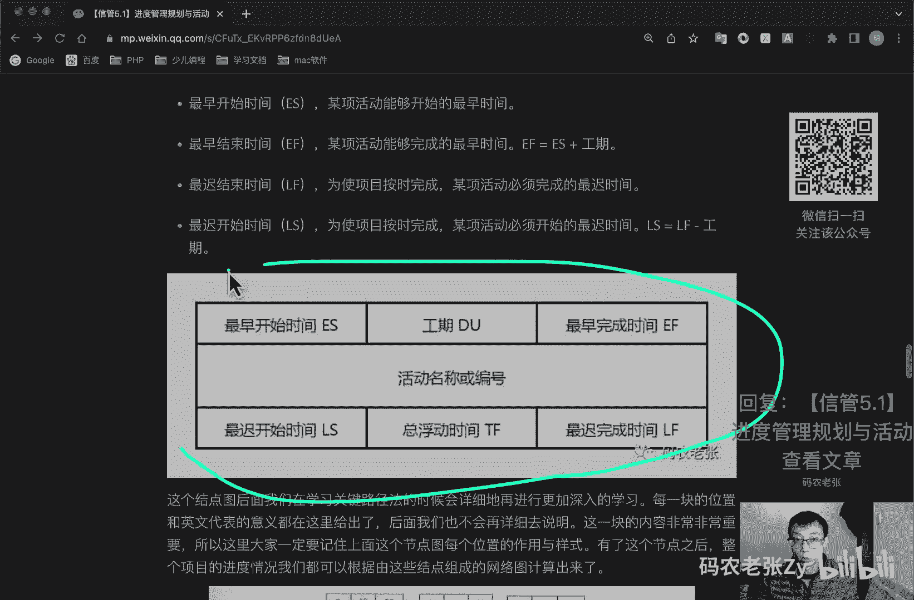
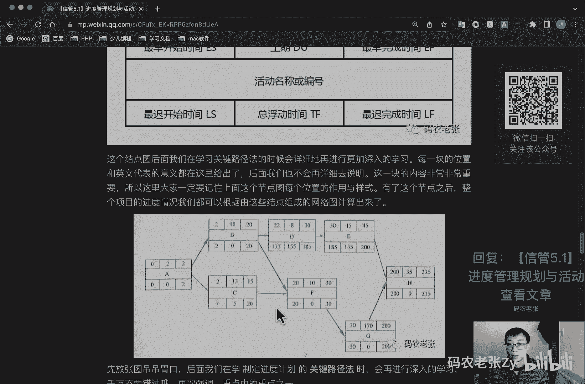
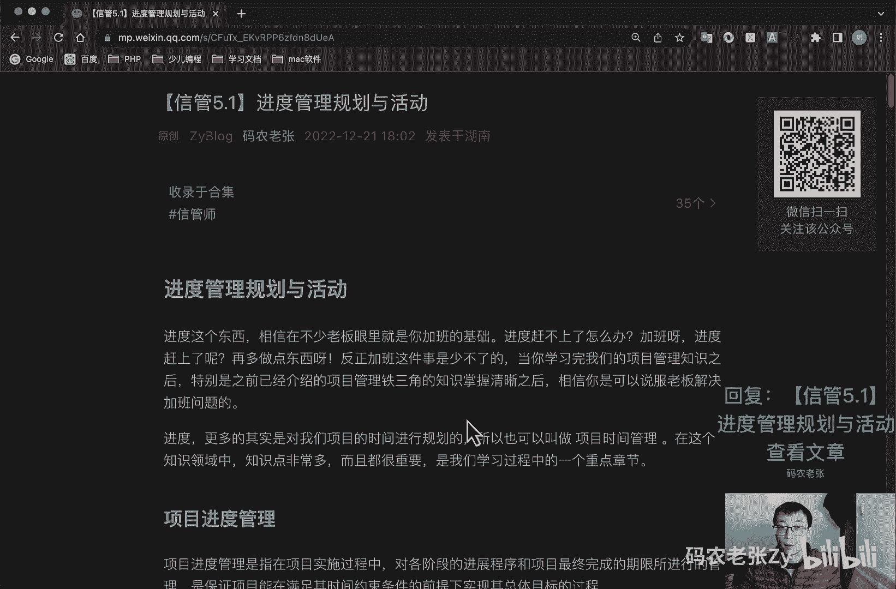

# 【信管5.1】进度管理规划与活动 - P1 - 码农老张Zy - BV1eM411i7nB

hello，大家好，今天呢我们来学习的信息系统项目管理师，第五大篇章的第一篇文章，进度管理规划与活动进度这个东西啊，相信在不少老板眼里，就是你加班的基础进度赶不上了，怎么办呢，加班啊，进度赶上了呢。

那他多做点东西，对不对，反正加班这件事呢是少不了的，当你学习完我们的项目管理知识之后呢，特别是之前已经介绍过的项目管理，铁三角的是是相关的知识，掌握清晰之后呢，相信你是可以说服老板去解决加班问题的。

进度啊，这个更多的其实是对我们的项目时间，进行规划的，所以它也可以叫做项目时间管理，在这个知识领域当中的知识点非常多，而且都很重要，是我们学习过程中的一个重点章节，好我们先来看一下项目进度管理啊。

项目进度管理呢是指在项目实施过程中，对各阶段的进展程序，和项目最终完成的期限所进行的管理，是保证项目能在满足其时间约束条件的前提下，体现其总体目标的一个过程，总的来说呢。

项目管理计划主要都是基于项目进度计划，管理计划来编制的，在项目的进度管理计划的基础上，编制项目成本管理计划，设备和设施采购计划，人力资源配置计划，风险管理计划和配置管理计划等等，可以看出来。

项目进度管理计划是非常非常核心的一个计划，当然了，他也有一个上家是谁呢，就是我们需要提前准备好的，就是一个范围基准，没有范围，你的进度自然也就无从编制的了，毕竟你连做什么都不知道，对不对。

并且进度计划的许多图表工具，其实都是针对范围中的w bs来进行制作的，还记得我们上回看过的那个甘特图对吧，好了，有关项目进度计划方，就是项目进度计划方法的信息实践呢，包括但不限于哪些呢。

第一个就是具有未完项的迭代型进度计划，这个主要就是我们之前学过的敏捷，另外呢就是按需进度计划经常用于此类项目，什么项目呢，就是在运营或持续环境中以增量方式研发产品，且任务的规模或范围相对类似。

或者可以按照规模或范围，对任务进行组合的一些项目，好，我们先看一下啊，项目进度管理的一些过程啊，项目进度管理过程比较多，有七个过程，那七个过程呢我们看一下这七个过程，然后分别是在规划过程组和监控过程组。

监控过程组只有一个就是控制进度好，我们一个来看一下规划项目进度管理，这个呢一般就是为规划编制管理，执行和控制项目进度，而制定政策程序和文档的过程，第二呢就是定义活动。

识别和记录未完成项目可交付成果而采取，而需采取具体行动的一个过程，接下来呢就是排列活动的顺序对吧，你先定义活动，然后排列活动顺序，然后估算活动资源，互相活动需要哪些资源对吧。

排列活动顺序呢是识别和记录项目，活动间逻辑关系的过程，估算活动资源呢，就是估算各种所需材料人员区别啊，呃和用品的种类和数量的过程，然后呢就是估算活动的持续时间对吧，你估算完资源了。

就要估算一下它的持续时间了，其实际上就是根据资源估算的结果，估算完成单项活动所需的工作时间段，的一个过程，最后呢就是上面的估算完了之后呢，我们就制定一个进度计划对吧，分析活动顺序，持续时间。

资源需求和进度制约因素，创建项目进度模型的一个过程好吧，监控过程组是贯穿整个项目的，对不对，我们要控制进度，监督项目活动的状态更新项目进展，管理进度基准变更，以实现计划的一个过程。

好在某些小项目中的定义活动排列，活动顺序，估算活动资源，估算活动持续时间，以及制定几度计划之间的联系非常密切，以至于就是这四个呢可以视为同一个，就视为一个过程，有一个人在较短的时间内完成。

但是对于我们的学习来说呢，我们肯定还是要把他们一个一个来看的对吧，这四个要分开来看的好，我们先来看前面的啊，先看第一个规划进度管理，规划项目进度管理是为实施项目进度管理，制定政策程序。

并形成文档化的项目进度管理计划的过程，本过程的主要作用呢是，如何在整个项目过程中的管理，执行和控制项目进度提供指南和方向，它的一个重要输出呢就是项目进度管理计划，它是整个项目管理计划的组成部分。

为编制监督和控制进度，建立准则和明确活动，根据项目需要的进度管理计划，可以是正式的，正式的或者非正式的，非常详细的，或者是高度概括的，其中应包括合适的控制临界值，好了，这个了解一下就行了。

直接看第二个活动啊，然后看第二个过程，第二个过程叫做定义活动，我们在项目范围管理的创建w bs活动中，已经可以识别出最底层的可交付成果，也就是工作包，但是为了更好的规划工作包。

工作包通常还应该更进一步细分为更小的部分，就是活动，活动呢，就是为完成工作包所需要进行的一些工作，是开展估算，编制进度计划，以及执行和监控项目工作的一个基础，而定义活动过程呢。

就是识别和记录未完成项目可交付成果，而需采取的所有活动，在定义活动中呢，我们有一个工具是什么，滚动式规划，这个呢也是我们之前提到过的一种规划技术，它也是一种迭代式的规划技术，即详细规划。

详细规划近期要完成的工作工作，同时在较高层级上粗略规划，远期工作就是近期详细预约，其粗略，这种规划技术呢也是现代项目管理的特征之一，在定义活动的输出中呢，有几个输出内容是我们需要关心的，包括什么呢。

第一个就是活动清单，一份包含项目所需的全部活动的一个综合清单，还包括每个活动的标识以及工作范围的详述，是项目团队成员，知道我们需要完成哪些工作，这个就是一个简单的一个单子就行了，123456789条。

这样练下来就行了，就是我们每我们根据上一回的那个w b s，然后w bs工作包分解完之后，再再再拆出来的活动，每一项具体的工作是什么，就放在这个清单里面就可以了，然后这个活动属性。

活动属性呢是活动轻松中描述，活动描述的一个扩展，属于时间演进，在项目初始阶段的活动属性，包括活动标识，w bs标识和活动标签或名称，在活动属性编制完成时呢，可能还包括活动编码，活动描述，紧前活动几号。

活动逻辑关系，提前量与之后量，资源需求，强制日期制约因素和假设条件等等，这中间一堆东西呢，我们后面都要学的，然后呢就是里程碑清单，里程碑呢是项目中重要的时间节点或者是实践，是完成项目阶段性工作的标志。

同类型的项目里程碑不同，一般在甘特图里面，它就是一个菱形的对吧，菱形的一个实心的，菱形的一个比标志，这个就是里程碑，然后呢就检查点，检查点呢是在规定的时间间隔内，对项目进行检查，比较实际计划之间的差异。

并根据差异呢来进行调整，这个后面我们在成本那边的时候会讲到的，然后呢就是机械，机械呢就是指定一个或者是一组配置项，在项目生命周期的不同时间节点上，通过正式详审而进入正式受控的一种状态。

机械呢是一个重要的里程碑，但相关交付成果呢通过要通过正式详审，并作为后续工作的基准和出发点，机械呢一旦建立后，其变化需要受到控制，除了进度外呢，范围成本质量都有其相应的机械，并并且都应遵循机械的特点。

就是签字确认变化收购，这个机械就是就比如说你这个项目啊，你会有一个基准的这一条线，你这一条线呢就是在京都啊，成本啊范围这一块的你都不能对吧，你你起码你要在这个基本的这一条线上面，去进行一个操作。

你不能跟他差距太大对吧，而且这条线应该是非常重要的一条线，所以说就是需要去高层去签字确认的一条，就是基础基准线，基准线对不对，就就这样一条这个东西呢就叫做基线好，这个呢就是定义活动啊。

我们再接着往下看啊，第三个了就是排列活动顺序，排列活动顺序呢是识别和记录项目活动之间，关系的过程，除了首尾两项活动之外呢，每项活动和每个里程碑都至少有一项紧前活动，和一项紧后活动。

可以按逻辑关系将活动排序，来创建一个切实的项目进度计划，排序呢可以由项目管理软件，手动或自动化的工具来完成，这个紧前活动和井号活动，你看我们看下这个图就知道了啊，你看我们在这里面有个箭头表示对不对。

我们有个a活动，对不对，还有个b活动，这个b活动前面的这个活动叫做a活动，这个就是他的a就叫做b的紧前活动，而这个b就叫做a的紧后活动，看到这个箭头没有，这个就是颈前和颈后的意思。

然后你看这个g这个g它有三个颈前活动，看到没有，它有三个箭头，所以说它有三个紧前活动，同样的这个h它有三个紧后活动，看到没有，他有三个箭头出来了，他所以说他就有三个紧后活动，好在排列活动顺序。

这个过程中，我们要接触到一个非常重要的工具，这个就是pdm紧前关系图法，也可以叫做前导图法，活动依赖图，就是这张图，就这张图啊，前面已经解释过了，什么叫紧前活动，以什么叫紧后活动对吧。

好像像像这个图里面只有节点编号的，就只有这种节点编号的pdm图，也可以称作单代号网络图，或者说是活动节点图，a o n这几个名词要记住啊，单代号网络图，活动节点图，看到这张图都知道，就就就这个图啊。

它也叫pdm图对吧，这种图示呢大多为大多数项目管理软件所采用，从图中我们可以看出，方框代表的节点呢就是我们的活动，而箭头则是活动之间的关系，活动与活动之间的关系呢被称为逻辑关系，比如说在这个图上面。

我们写了23个逻辑，就是23条线了，23个逻辑关系表示的这些活动之间的，有23个箭头线段，而真正的活动逻辑的类型呢其实只有四种，哪四种呢，我们来看一下啊，紧急活动这四个字的意思呢。

其实就表明了一种逻辑关系，表示这个活动是在某活动之前的，也就是紧挨着当前这个活动之前的活动，同理还有紧后活动这一说，前面已经解释了，在上面那个pdm图中呢，我其实我们看到的都是从某一活动开始。

然后指向下一活动，直到最后全部指向结束，这样就形成了一个不断向后的一个紧后关系图，你看它这个箭头都是不断向后的对吧，一般来说呢图形的标识都是一路向后的，但是逻辑关系并不是只有单一的，前后两个方向而已。

它还有更复杂的概念，我们在pdm图中，一般会有四种类型的逻辑关系图，哪四种呢，这个东西也是比较重要的，第一种就是结束开始的关系，fs型就是这种形式的最常见的，最常见的上面我们那个pdm图里面就是这样的。

最常见的就是这种图啊，就一个箭头a指向b对吧，这个就是fs，就这个表明什么意思呢，就是这个a要这个a活动结束了，这个b活动才开始去做，这个就叫做结束开始的关系，就叫做fs关系。

finish that对吧，这个就叫做finish sad好，这个是第一种图，然后第二种图叫做结束和结束关系的图对吧，这种结束和结束关系图叫做f f图，你看它这个图画的就有意思了，他这样下来的。

然后到这样他也指向b的后面，看到没，它也指，你看这个地方从a的后面指向b的前面，对不对，这个地方呢是从a的后面指向b的后面，这个图的意思啊，就是说a结束了，b也要结束，就a结束了，必要结束对吧。

这个叫做f f finish，finish，finish to finish好，同样的对应的也有s to s对吧，s to s就start to start，就是你看从开始划到这边来开始。

也就是说a活动开始了，那么b活动也要开始好，这个有例子吗，我这里应该写的例子啊，看呃开始涂开始开始就前序活动开始，后续活动才能开始，比如说主从数据开始同步了，那么负载均衡导量也可以开始了啊。

这个这个可能做做开发的话就会比较了解啊，前面这个例子，前面这个f f的例子就是呃，网络设备的安装与调试是同步穿插进行的，那么只有两个都完成了网络，整个网络设备的工作才算是做完了对吧，f f两个都完成了。

整个工作才算完成了，第一个就变得简单了，结束开始的关系就不用多说了，就比如说我们先先先先打打好测试环境了对吧，我们才能开始去测试好，最后还有一种就是开始结束的关系，就是a活动开始了，b减b活动才能结束。

这个就很诡异啊，这个这个也比较少啊，这个例子呢就是比如说新系统完成上线后，才能关闭它的老系统，但是你这么说的话，就是这个逻辑关系其实是很牵强的，这个就s f s f就start to finish。

这种类型的，我们也可以把它换个位置，我们可以说老把老老系统关闭了之后，新系统再上线对吧，这样也可以对吧，其实他他逻辑性没有那么强，只是说按正常来说的话，我们肯定是新系统做完了之后，才会去关闭老的系统。

但是呢，同时我们还可能两个系统一块一起去跑一会儿，对不对，跑一阵，所以说呢最常见的还是这个fs类型的好，这里也说了，通常来说fs是最常见的，sf是最少见的，毕竟sf这个概念很绕。

如果把新系统当成紧前活动，那么其实这个sf的例子就是个fs的例子，对不对，另外呢fs呢代表着一种线性的工作方式，而s呢代表一种定性的工作，s就这个s s它是代表一种定型的工作方式，并行啊。

限行啊是什么意思啊是吧，做开发的都了解啊，大家想一想啊，就是这个就是他完成了他才必须要完成，对不对，那s s它定型的是什么意思呢，就是他开始了，他也可以开始了，他们完成，他没有说他们完成的问题，对不对。

就是他们可以同时去操作，这个呢就叫做一个并行的一个形式，用技术的话来讲就是一个单线程多线程了对吧，好在pdm图中的每项活动，都有唯一的一个活动号，就是a b这个东西就是活动号。

每项活动都标明了预计的工期，活动的持续时间，通常每个节点的活动会有几个时间，这些时间呢包括什么，最早开始时间，就这个活动你最早什么时候能开始，然后就是最早结束的时间。

最早结束的时间呢其实就是你最早开始的时间，加上你的工期之后呢，就是你最早的一个结束的时间，然后呢还有一个最最迟的一个结束时间，就是l f就是为使项目按时完成了某项活动，必须完成的最迟的一个时间。

另外呢还有最迟开始时间，就ios这个呢是卫士项目按时完成了某项活动，必须开始了一个最迟时间，l s呢就是就是这个最迟结束时间，减去你的工期好，这张图呢很重要很重要，但是呢我们今天并不是并不要求。

你把它完全的给拿下，因为我们后面还会再讲这个东西的好了，但是你一定要有个印象，这个图啊，这个单节点，单节点网络图画的最复杂的形式，就是这个样子的，还有个e有个d o是工期，然后那个e f在上面这三块好。

中间呢我们就写那个a b c d就可以了，然后下面呢就是l s t f，还有个l f好，这个节点图呢，后面我们在学习关键路径法的时候，会详细的进行更加深入的学习，每一块的位置和英文代表的意义呢。

在这里面我们都给出来了，后面我们再也不会再去详细的说明，如果到时候我们讲的时候，你不记得了，可以再回来看一下，因为我们篇幅有限对吧，但是呢这几个词你今天是肯定要记住的。

一个e一个e f1 l1 l f这个东西呢，你要记住好这一块内容非常非常重要，所以大家一定要记住上面这个节点的这个呃，这这几个单词的含义，还有作用以及样式这个作用啊，我们到时候讲那个讲那个计算的时候。

我们会详细的去讲的好，有这个节点之后呢，整个项目的进度情况呢，我们都可以根据由这些节点组成了一个网络图，就可以计算出来了，就是大概这样一张网络图好，先把这个图放在这里，调到胃口，后面。

关键路径法的时候呢，还会再进行更深入的学习，千万不要错过，再次强调这个东西是重点中的重点啊，重点中的重点好了，上述这些逻辑，依赖关系和工期图示的这些内容呢，在这个ms project或者是plan。

以及各类项目管理软件中都会有对应的实现，并且对于我们后面的进度计算也非常重要，第三次强调重点中的重点，第三次强调了，除了这种逻辑上依赖关系之外的活动与项目，本情况本身还有各种依赖，ok我说的这个重点啊。

我说的这个重点，并不是上面这个这四个依赖关系啊，当然这个依赖性关系也很重要，你起码要知道什么意思啊，但是其实我们最主要的用的全是这个fs型，我们我说的这个非常非常重点的，其实是这一块。

这四个e s e f l f l s什么意思，然后包括这这个图这个节点是什么意思。

就这张图这张图大概的你现在要有个印象，要能记下来。

能记下来最好好，我们再来看依赖关系啊，活动与活动，以及活动与项目或环境之间的依赖关系呢，可能是强制的，或者是选择了内部或者外部的这四种，他们互相组合呢，又可以组合成强制性外部依赖关系。

强制性内部依赖关系，选择性外部依赖关系和选择性内部依赖关系，不过归根结底，我们还是要以上面四种基础的依赖关系为标准，进行学习，那我就一个一个来看一下，第一个呢就是强制性依赖关系。

是法律或合同要求的或工作内在性质决定的，依赖关系，往往与客观限制有关，强制性依赖关系呢又称为硬逻辑关系，或者印尼来关系，这些东西就简单的记住一下就可以了，然后呢就是选择性依赖关系。

有时又可以成为首选依赖关系，优先逻辑关系或者是软逻辑关系，它通常是基于具体应用领域的最佳实践，或者是基于项目的某些特殊性质而设定的，即便还有其他顺序可以选用，但项目团队仍缺省。

按照此种特殊的顺序安排活动，然后呢就是外部依赖关系，是项目活动与非项目活动之间的依赖关系，这依赖关系呢往往不在项目团队的控制范围内，例如软建项目的测试活动，取决于外部硬件的到货，建筑项目的现场准备呢。

可能要在政府的环境听证会之后才能开始，最后呢就是内部依赖关系，是项目活动之间的紧前关系，通常在项目团队的控制之中，好这几个东西加粗的地方，加粗的地方注意的，然后内部外部哪些是可以项目团队控制的。

这些东西，那接下来就好了，好我们再来看一下接线图法与前导图不同，间线图法线图法看到没有，名字不一样了，前面那个p p d m对吧，这个叫做a d m是用电线表示活动节点，表示事件的一种网络图绘制法。

就像下面这个图一样，它是这个样子的，你看他的活动名称，这个a放在这个地方了，然后这里写的1234对吧，然后通常它也可以叫做双代号网络图，为什么呢，它有一个a代号，然后还有个一代号对吧。

节点和界限都需要编号对吧，就是这个意思，然后呢或者说活动线图叫做aoa，前面那个图也有好几个叫法，对不对，想一想啊，想一想啊，记住要记住他们之间的区别，然后注意他和上面pdm中的单代号网络图。

以及活动简简图对吧，这里也写出来了a a o n a o a，然后就是单代号网络图，然后这个叫做双代号网络图，然后这a d m那个叫pdm，这四个名词很接近，就这不止四个名词了对吧。

1234566个名词也很容易混淆他们，他们之间题型出题也很容易混淆的好，从这个图中呢，你可以看出键线上也是标了一个字母的，这个和我们在pdm节点装中的活动，编号或者名称和类似。

在这样的绘图法中的键线这个界限啊，它是表示具体的一个活动，它是占用时间并且消耗资源的同时呢，途中还有一些虚线，这个是它的一个特点啊，这个虚线标识的活动叫做虚活动，这些活动不消耗时间，也不消耗资源。

只是为了弥补界线图，在表达活动依赖关系方面的不足，可以更清楚地表达活动之间的关系，最后这些节点表示的一二，这些的代表的就是前后工作的一个交接点，也表示工作之间的逻辑，在这些图法中呢有三个基本原则。

第一个呢就是图中的每一个活动和每个事件，都必须有唯一一个代号及网络，图中不会有相同的代号，第二个呢就是，任意两项活动的警前事件和颈后事件，代号至少有一个不同节点，代号沿界线的方向越来越大。

最后呢就是流入流出同一节点的活动，均有共同的颈后颈后活动，或者说是紧前活动好根据这三个原则，你就知道为什么要加入虚活动了，目的就是为了保持完整的一个逻辑关系，比如说一个节点可能有多个警衔活动事件。

另外呢间线图法有严格严禁有环路，就在上面这个图里面，它它是不能有环路的，你不能从这个地方再回到这个地方，这个是不行的，他不能有环路，好这些只能自左向右去延伸，节点，也同样只能从小到大不重复。

因此呢一项工作对应一条界线和一对节点编号，最后间线图法还要避免间线的交叉，肩线交叉什么意思啊，就是这个肩线就是这个肩线，你画的时候你不能去，比如说你这样去跟他交叉的，这样去画，这中间是不要去交叉的。

好这一堆内容呢小编你也知道了，接线图法呢也是我们的重点内容，但是不过相对来说比pm好一点，要重点程度没有那么高，只是很多概念要记住，就是上面这些加粗的这些地方啊，这些概念的去记住一下就好了。

我们再来看一下提前量与滞后量，在活动之间加入时间，提前量与滞后量呢，可以更加准确的表达活动之间的逻辑关系，提前量呢就相当于警前活动，紧后活动可以提前的时间量，提前量往往表示为负数值。

你在图上图里面看到这个什么fs，然后有个负数的，后面加一个数字的，一般表示的就是提前量，然后之后量呢相当于警前活动，紧后活动需要推迟的时间量，之后呢往往表示为正数正数，你看这个是fs正-5。

f s s正十，这个就是就是一个滞后量的意思啊，那这些东西呢这个图上有的话，你知道是什么意思就可以了，好嗯，后面我们学习估算活动持续时间，是在那里计算的，活动呢就是我们在后面去学习计算的时候。

它是不包含这个提前量和之后量的，所以说这个东西你记住概念，记住在这个图上他怎么表示的，一个负，一个是表示为负数，一个表示为正数，这个就可以了，好总结一下，今天我们主要学习的是关于项目进度管理的。

概念的过程，以及详细了解了制定积木项项目进度计划，定义活动和排列活动顺顺序三部分的内容，很明显，排列活动顺序中的pdm图逻辑关系，依赖关系进行除法，都是我们需要重点关注的内容，进度管理的七个过程呢。

也同样是需要我们记下来的，对于我们的论文和简答的都是非常非常重要的，好今天的内容呢就是这些，大家可以回复文章的标题，信管5。1，进度管理规划与活动，来获得这篇文章的具体内容，以及更加详细的一些资料啊。

这个内容还是比较多的，还是需要详细的来看一下的好了，今天的内容呢就是这些。

