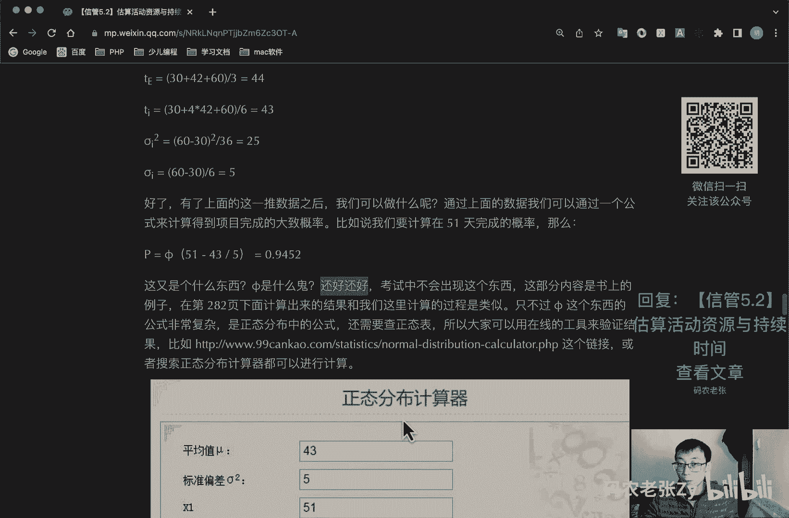
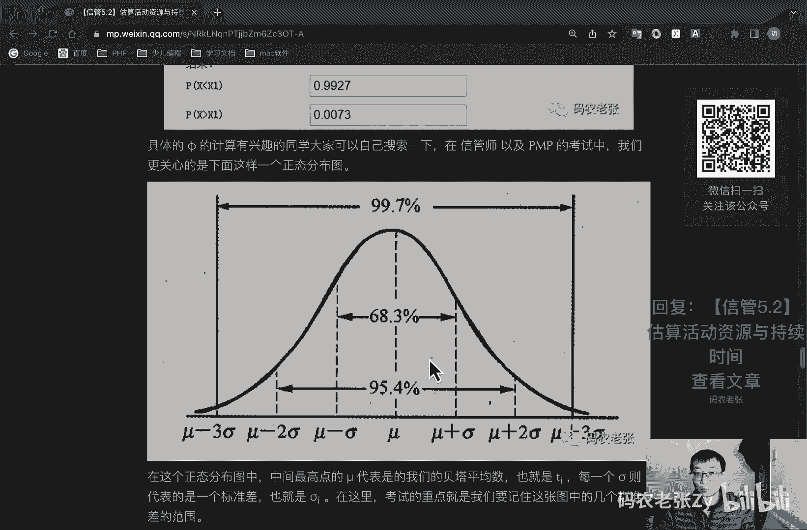
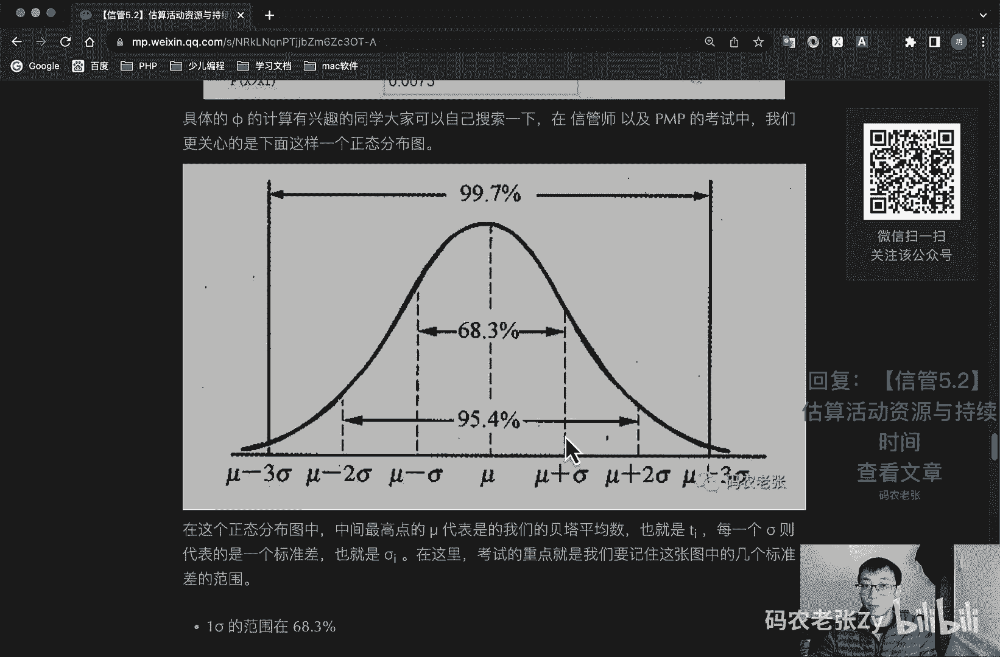
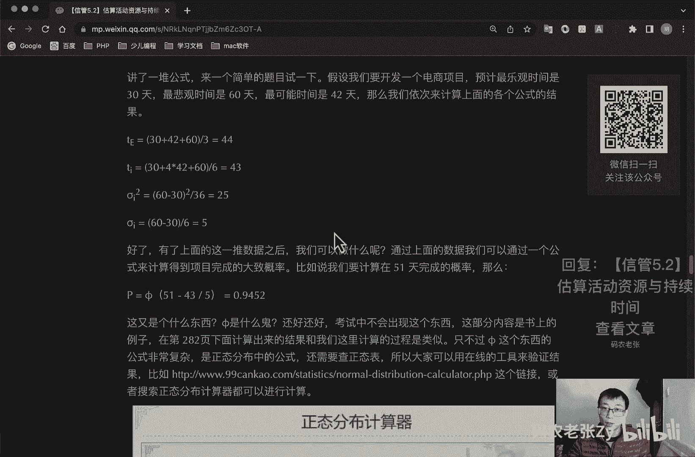
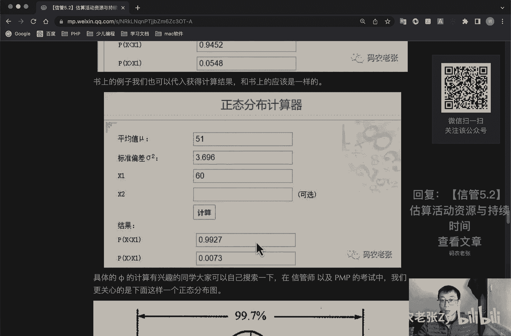

# 【信管5.2】估算活动资源与持续时间 - P1 - 码农老张Zy - BV14G4y1D7ay

哈喽大家好，今天呢我们来学习的是信息系统项目管理师，第五大篇章的第二篇文章，估算活动资源与持续时间，经过上次课程的学习之后呢，我们已经了解到了进度活动的概念与定义，并且简单的学习了一下。

活动顺序和如何排列的一些工具技术，今天呢我们学习的主要方向是，估算活动资源与估算活动持续时间这两个过程，另外呢我们还会将进度管理最后一个过程，控制进度一起放到今天的内容中一起学习，原因其实很简单的。

就是因为进度管理的重点，或者说是重中之重，是在制定进度计划这个过程当中，在这个过程我们要学习的内容比较多，所以我们把它放到最后再去学习啊，当然了，今天的内容也不会很轻松。

进度呢是个非常重要的一个知识领域，它的每一个过程相比范围来说都会多很多内容，大家一定要跟上我们的脚步啊，好了，我们来看一下估算活动资源，估算活动资源是估算执行各项活动所需的材料。

人员设备或用品的种类和数量的过程，这个过程的主要作用是完成活动所需的资源，种类数量和特性，以便做出更准确的成本和持续时间的一个估算，在这里呢我们要重点关注的是，估算活动资源过程与估算成本过程紧密相关的。

估算成本的过程是在项目成本管理中，我们要学习到的内容，在估算活动资源的输入中，有两个工具是我们需要关注的，第一个是项目日历，编排开展计划活动的工作日或轮流班次，以及不开展计划活动的非工作日的日历。

项目日历影响所有的活动，项目日历是开展项目工作的基准日历，不包括节假日，注意项目日历不包括节假日，然后资源日历，资源日历呢是记录了确定使用某种资源，如人员或物资日期的工作日。

或不使用某种具体的资源日期的非工作日，项目，资源日历呢一般根据资源的种类标识，各自的节假日，以及可以使用资源的时间，资源日历影响到与某种具体资源或资源种类，相关的活动，其实就是资源的可用。

工作日或翻车日历是客观存在的，日历这两个日历啊，资源日历，项目日历是要搞清楚他们的概念的，然后估算活动资源的工具与技术呢，可以参考下面这个表格好，第一个就是专家判断，通过借鉴历史信息呢。

专家判断能够对项目环境进行有价值的分析，并提供以往类似项目的相关信息，正在判断呢，也可以用来决定是否联合使用多种估算方法，第二个呢就是备选方案的一个分析，很多进度活动呢都有若干种可选的实施方案。

如使用能力或技术水平，不同的资源，使用不同的规模或类型的机器，使用不同的工具，手工或者自动化，以及决定是自制还是购买相关的一个资源，第三个呢就是出版的一个估算数据。

一些公司会定期发布最新的生产率和资源单价，这些信息呢涉及门类众多的劳务材料和设备，并覆盖许多国家及其所属的一个地区，下一个呢就是自下而上的估算，对工作组成部分进行估算的一种方法。

如果无法以合理的可信度对活动进行估算，则应将活动进一步的细分，然后估算资源需求，接着再把这些资源需求汇总得到，每一个活动的资源需求，准确性，取决于单个活动和工作包的规模和复杂程度。

最后呢就项目管理软件了，项目管理软件有助于规划组织和管理可用资源，以及编制资源估算，利用先进的软件的可以确定资源分解结构，资源可用性，资源费率和各种资源日历，从而有助于优化资源的一个使用估算。

活动资源的输出呢有两个比较重要的内容，第一个呢就是活动资源需求，明确了工作包中，每个活动所需的资源类型和数量，然后把这些需求汇总，从每个工作包和每个工作时段的资源估算，在每个活动的资源需求文件中呢。

都应说明每种资源的一个估算依据，以及未确定资源类型，可用性和所需数量所做的一个假设，然后呢就是资源分解结构rbs，我们后面还会讲到一个也叫做r b s的，是风险风险的结构，我们这里要区分开啊。

当然这个没有那个重要啊，如果如果考试中提到r b s，大部分情况下应该是风险那边那个，但是也有可能会问到这个资源分解结构，资源一类别和类型的层级展，现资源类别包括人力材料，设备和用品。

在p m p的第六版中的估算，活动资源被移动到了项目资源管理，这个指示域中，其实就是将原来的p m p第五版的项目，人力资源管理给改了一下，将人力资源的概念扩展到了整个资源的概念。

不管人力物力活动都成为了资源，当然在信息系统项目管理师中呢，我们学习到的估算活动资源，依然还是在项目进度管理当中的，这个就是呃大概的扩展一下知识点啊，在第六版里面是这样的，好我们看下一个过程。

估算活动持续时间，估算活动持续时间呢是根据资源估算的结果，估算完成单项活动所需工作时段的，树立一个过程，本过程的主要作用是确定完成每个工作，所每个活动所需花的花费的时间量。

为制定进度计划的过程提供主要的一个输入，估算活动持续时间的依据的信息，包括活动工作范围，所需资源类型，估算的资源数量和资源日历，这些信息呢来自于项目团队最熟悉的，具体工作内容和性质的个人或集体。

对持续时间的估算呢应该渐进明细，估算过程呢要考虑数据依据的有无与质量，估算完成计划活动所需公示单位数目，有时必须考虑因具体工作类型，工作的要求而流逝的时间，项目总持续时间呢在制定进度计划过程中。

计算是制定进度计划过程的成果，在这里需要注意的是，在实际应用中估算一定是估计的啊，他一定是估计的啊，不要说是时间啊，给自己留条后路好不好，预预留好储备时间是非常非常重要的，做项目经理啊，一定要会这个啊。

一定要会这个，在估算活动持续时间的这个过程中呢，我们最主要关心，并且重点学习的是他的一些工具和技术，这些内容呢在成本相关的一些过程中也会出现，而且它的意思都是一样的，只是服务的范围不同而已。

在这里呢我们就先来学习一遍，这些内容也是非常重要的，好第一个就是软件的工作量的估算，软件开发项目通通常用l o c就是line of code，来衡量项目规模。

line l o c呢指所有的可执行的源代码行数，包括可交付工作控制语言什么job control lang language，j l j cl语句，数据定义，数据类型声明等价声明。

输入输出格式声明等等，好第二个就是德尔菲法，这个之前我们说过了对吧，简单说过一点啊，我们今天来详细说，这个呢，其实就是我们在收集需求时讲过的第二非技术，当时我们提到过，德尔菲是一种背靠背的专家型技术。

那我们今天来看一下它具体的一个过程，从而明白一下，这个过程为什么被称作是背靠背的好，它的过程是什么呢，好第一步，我们的协调人啊，我们协调人向，向各个专家提供项目规格和估计表格，现在专家还是没有见面的。

他们互相不认识的，然后呢，然后协调人调集召集小组，会与各专家讨论与规模相关的因素，各专家匿名填写迭代表格，然后呢，协调人整理出一个估计总结，以迭代表的形式返回给专家。

然后协调人召集小组会讨论较大的估计差异，然后专家复查结果总结，并在迭代表上提交另一个匿名估计，然后重复4~6的步骤达，直到达到一个最低和最高估计的一致好，具体什么意思啊，看专家专家专家专家专家对吧。

中间有一个什么，中间有个协调人，就假设中间有个协调人啊，好我们这个协调人呢，这几个专家现在都是可以从头到尾，他他们都是不见面的，然后呢我们把这些项目资料发给发给这些专家。

然后首先让他们来预估一个项目完成的时间，交给这个协调人对吧，他们预估完了之后，可能他们每个人预估的时间差别会非常非常大，比如说他预估六天，他预估18天，他预估35天，他预估90天，什么这样的。

他预估什么呃，25天，对不对，然后呢，这中间那个协调人再把这些综合，他们每个人预估的结果去综合汇总一下，汇总完了之后呢，形成一个迭代表格，然后把这个表格呢再分分发给这些专家，然后这个专家啊就匿名的。

这个是匿名的，这个专家并不知道，这20就是25或者是90天估预估的，这些专家是谁，他只知道这两个数字，然后呢也会有他们的一些见解，就是为什么他是预估到90天，为什么他预估到25天。

然后这个专家呢会根据他们的信息呢再去进，这样对自己的数据进行一个预估，比如说他可能会预估追加变成了20天了，对不对，然后他们几个都会去去修改一下，修改完了之后就这么来回的去走几轮，走几轮，走几轮。

他们之间的数据会越来越接近，越来越接近，可能最后就会有一个非常非常低，就是相对来说就是从专家的角度来说，比较准确的一个数值了，这个就是一个德尔菲法，现在你明白什么叫做背靠背，这个德尔菲他是怎么做的。

对吧，就是说在专家在进行估计判断的时候呢，都是自己进行独立判断的，互相之间的不是面对面的交流意见，所有的差异呢，都是通过协调人来在中间进行传达的，德尔菲呢它适用于评定过去与将来。

新技术与特定程序之间的差别，但专家的水平，对项目的理解程度呢是工作的一个难点，好我们再来看一下类比估算法，类比估算法啊，它是适合评估一些与历史项目在应用领域，环境和复杂度等方面相似的项目。

通过新项目与历史项目的比较得到规模估计，由于类比估算法估计结果的精度，取决于历史项目数据的完整性和准确度，因此呢用好类比估算法的前提条件之一，就是组织建立起较好的项目后评价与分析机制。

对历史项目的数据分析呢是可信可依赖的，类比估算的基本步骤如下，第一个就是整理出项目功能列表，和实现每个功能的代码行，然后标识出每个功能列表，与历史项目的相同点和不同点，特别注意历史项目做的不够的地方。

然后通过一和二得出各个功能的估计值，最后产生规模估计，其实呢类比估算，就是通过过去类似项目的参数值，比如说持续时间啊，预算规格，重量和复杂性等为基础，来估算未来项目的同类参数获得指标。

因此这种估算方式比较粗略啊，但是成本低，耗时少，另外它的准确性也比较低，比较适合比较前期的项目来使用，软件项目中用类比估算的，往往还要解决可重用代码的估算问题，估算出新项目可重用的代码。

需要重新设计代码的百分比，需要重新编码或者修改代码的百分比呃，需要重新测试的代码百分比等等，通过这三个百分比呢，就可以用一个公式来计算等价的新代码行，等价代码行呢等于重新设计百分比，加上重新编码百分比。

加上重新测试百分比除以3x5的代码行，大概一个公式就是这个样子啊，这个这个公式你了解一下就行了，不一定会考，如果以往活动是本质上，而不是表面上类似的，并且从事估算的项目，团队成员具备必要的基础知识。

那么类比估算就是最为可靠的一种估算，什么意思呢，就是你之前做过类似的项目，那那你这个类比估算那肯定是最可靠的，对不对，你这个东西你玩玩的非常熟了对吧好，下一个呢就是参数估算法。

参数规范呢是一种基于历史数据的和项目参数，使用某种算法来计算成本和工期的估算技术，参数，估算的是利用历史数据之间的统计关系，和其他变量，比如说代码行来估计估算出成本，预算和持续时间等活动参数。

比如说我们团队一天可以写出1000行代码，那么完成1万行代码就需要十天，参数估算的准确性呢，取决于参数模型的成熟度和基础数据的可靠性，参数估算呢，可以针对整个项目或项目中的某个部分。

并可与其他估算方法联合使用，参数估算与类比估算，最大的不同就是它基于模型的一种估算啊，它是一种它是有一个算法对应的，而且有一定的具体的数值参数，估算呢适合于机械重复类的项目，比如说就是工业流水线。

或者是传统工程之类的项目，对那个项目很很固定，很固定，所有的流程都是非常固定的，什么垒墙啊，砌砖啊，做装修啊，什么类型的，所有的工艺啊什么的都是很固定的，你直接就可以通过一些参数。

就可以估算出后面一个具体的一个数值，好储备分析，在进行工作量或者是工作工期评估时，需考虑应急储备，有时成为时间储备或者是缓冲时间，并将其纳入项目进度计划当中，用来应对进度方面的不确定性。

而应急储备是包含在进度基准当中的，一段持续的时间，与已知未知的风险相关，这个我们后面讲风险的时候，还会再讲这个什么叫做已知未知的啊，是项目经理可以使用的政治计算的一部分，除了应急储备之外呢。

还有一种就是管理储备，它是为管理控制目的而特别流出的项目时段，用于应对项目范围中不可预见的工作，他应对的是未知未知的风险，管理储备呢不包括在进度基准中，项目经理无法直接使用。

只能通过上级批准之后才能使用好，你现在知道就行了，一个是管理储备，应急储备，一个项目经理可以用，一个项目经理不能用，一个是应对已知未知的，一个是应对未知未知的，好了，记住这几个点就可以了，好三点估算啊。

这个是比较重要的，今天比较重要的一个东西啊，三点估算，通过考虑估算中的不确定性和风险，可以提高持续时间，估算的持续时间，估算的准确性，使用三点估算，有助于界定活动持续时间的近似区间。

三点估算的主要是针对三个数据的一个计算，它们分别是什么数据呢，第一个呢就是最可能时间，tm或者是o m标识都可以的，这个基于最可能获得的资源，最可能取得的资源生产率，对资源可用时间的限时。

预计资源对其他参与者的可能依赖关系，及可能发生的各种干扰等，所估算的活动持续时间，就是最可能的一个时间啊，然后呢最最乐观的时间，基于活动的最好情况，所估算的持续时间一般是比较少的。

然后最悲观时间一般是比较多的，就是基于活动的最差情况，所是所估算的一个持续时间，通过这三个时间的预估呢，就可以计算出他们一个假定分布情况，可以计算期望持续时间，t e o e它那是一个常用公式。

为三角分布的一个公式，就是三角分布，三角分布的公式，就是这个t等于t加上tm加上tp除以三，就是前面这三个可能时间加，乐观时间加悲观时间除以三，这个就是三角分布，历史数据不充分，或者使用判断数据时。

使用三角分布，基于三点的假定分布，估算出期望持续时间，并说明期望持续时间的不确定区间，其实说白了就是估算出整个项目，在某个时间内完成的概率，下面的公式啊，就这个公式只是它的一部分，真正的三点估算呢。

我们继续往下看，三点估算，还有一个名称就是大名鼎鼎的计划评审技术，叫做p e r t，就提到p r t了，你就想到他是要算三点估算了，除了上面这个三角分布这个公式之外呢。

我们还要实现一个就是一个非常重要的一个，贝塔分布的计算，贝塔分布计算怎么算呢，就是最好家最坏，然后四然后乘以呃，就是加上一个四倍的最可能，然后除以一个六，这个呢就叫做贝塔分布的计算叫ti。

别问我为什么要乘以四，最后再除以六公式就是这样的，这个是统计学概率论相关的知识，有兴趣的同学可以再深入的去研究一下，贝塔分布，就是统计学相关的内容，或者是你去看一下管理学相关的一些指。

那个是是相关的一些书，里面也都会讲到一个这一块的内容啊，一般考试的时候呢，如果说他问分布的话，那么用的全都是这个贝塔分布的公式来计算，如果他特别提到了三角分布的话，那用这个公式如果他没有提到。

他只说到一个分布的话，那么就使用这个公式来计算，它代表的也是我们最期望的一个工期，根据贝塔分布呢，我们继续推导它的方差与标准差公式，方差公式呢就是最最差劲，最好的平方除以六的平方就除以36。

然后呢还有一个就是标准差公式，就是最差减最好除以六好，下面两个公式，就是这个平方就表表示的方差公式，然后这个普通的就是表示的是个标准差的公式，这个叫什么西格玛对吧，讲了一堆公式呢。

再来一个再来一个简单的题目，试一下啊，就是我们上面讲了一堆都没对吧，讲讲拿一个题目来试一下，就假设我们要开发一个电商项目，那么预计最乐观的时间是30天就可以做完了，最悲观的时间呢我们要做60天。

那么最可能的时间呢，我们42天应该就可以做完了，那么依次来计算上面这个公式的结果，好，我们现在记住了，就什么最呃乐观是多乐观，30悲观60可能42对吧，第一个三角分布是什么，30+42+60÷3。

对不对，那就是44嘛对吧，三角分布的结果是44贝塔分布呃，差加好，然后是四倍的，最可能对吧，然后除以六，最后的结果就是443，然后呢方差方差就是差减好对吧，60-30的平方，然后除以36，方差就是25。

然后标准差标准差就是差整好除以六，结果就是五，它的方程标准差值是五好了，有上面这一堆数据之后呢，我们可以做什么呢，通过上面的数据呢，我们就可以通过一个公式来计算，得到项目完成的大概大致概率。

就比如说我们要计算在51天完成的概率，那么就是它的概率等于这个这个符号，然后加上这个什么51-43÷5，等于0。9452，这个呢是一个常量值，这个东西啊，你还好好，就是考试中呢它不会出现。

就是考试中是不会出现这个公式的，这个东西的这部分内容呢是书上的例子，在第228页下面计算出来的，结果呢和我们这里计算出来的过程是类似的，只不过只不过说这个东西这个是什么，fi是这个东西的公式非常复杂。

是正态分布当中的一个公式，还需要查正态表。

所以说大家可以用在线的一个工具，就这个工具大家可以自己去试一下，然后把你就是把我们上面计算的，这个数据填上来，就比如说我们的平均值是43，标准差是五，然后这第一个什么什么五五十一。

这个最后你去点一下计算，然后他算出来的结果就是0。9452，就是这个就是这个结果，然后书上的例子呢代入之后呢，也可以获得一个计算的结果和书上的例子，书上的例子的结果是0。99272。

好具体的这个five的计算的，有兴趣的大家同对，同学呢大家可以自己搜索一下，在信管是已经偏僻的考试中呢，我们更关心的就是下面这样一个分布图，这个呢就是一个正态的分布图，分布图是什么意思呢。

就是说我们最高的中间这个点的这个mu，代表的是这个东西，代表的是我们的贝塔平均数，也就是这个t i，也就是那个贝塔分布的那个平均数，那个ti对吧，然后每一个c每一个标准差，西格玛就代表一个标准差。

也就是这个也是我们计算的那个标准差，在这里面考试的重点呢，就是我们要记住这张图中的几个标准差的范围，你看到没有，我们在这上面，我们前面计算的那个贝塔分布是多少，43是吧，看一下43对吧。

就假如说这个地方这个地方是40呃，这个地方是43，这43，然后每一个每一个sigma代表的是五，代表的是五，然后这样的话我们就是在43对吧，43+5和减五，43+5是48，就在这个点，这个点是48。

然后减五的话，这个地方应该是38，对不对，38也就在38和48天的范围之内的，它的完成的概率是68。3%，这个图就是这个意思啊，就是这个意思，然后这里是两个标准差，两个标准差，这个就是33对吧。

33+10嘛，这个呃这个减十嘛，这个是加十嘛，这个就是53 53，两个标准差之间的，两个标准差之间的，完成的概率就是95。4%，如果我是在我，如果我这个题目，我问你30天之内完成的一个概率是多少。

就是95。4%，你只要回答这个就行了，然后最后一个最第三个标准差，第三个标准差就是99。7%了，对不对，好，这个就是这个就是这这样一个正态分布分布的。

一个意思，就是这三个东西你要记住啊，一个标准差的范围是68。3，两个标准差的范围是95。5，三个标准差的范围是99。7，好就是这个东西这个东西你一定要记住啊，好了我们再来看一下啊，再来看一下。

通常来说呢，考试不会去手算精确的概率，而是给出大概的数值，是计算标准差的范围，好我们看下这个例题，比如说a任务持续时间悲观估计为36天，最大可能为21天，乐观估计为六天，那么a任务在16~26天之间。

完成的概率有多大呢，这个其实就是我们要先去计算标准差，非常简单，标准差怎么算，36-6，对不对，就是悲观且乐观嘛对吧，悲观是多少，被关是36天，然后减乐观对吧，三三十30÷6就是五嘛，这个也是五啊。

这个也是五，然后呢计算平均数，平均数就是什么呢，就是一个标准差对吧，平均数就是那个三角分布对吧，三角分布6+21+36，然后除以3=21对吧，好了之后平均数有了之后呢，平均数有了之后呢。

我们就去我们就去直接就算它的标准差嘛，这个减5-51个标准差，然后加五两个标准差16~26之间，对不对，就是他提的问题对不对，就他提的问题，接下来我们就知道16~26的范围呢。

是一个一个sigma的范围，那么在这个时间段内，完成任务的概率就是68。3，不管是计算还是选择天理，都可以放心大胆的去写出这个数字了，简单的了解完三点估算之后呢，相信大家就已经建立起了一个关于三点估算。

大致的概念，更多的题型呢，还是需要通过做真题来进行练习的，信息系统项目管理师也有不少参考辅导资料的，大家可以选择1~2本进行练习，推荐的是今年的真题练习，这个三点估算也很重要。

但是大部分情况下，他一般不管是这个问百分比的。

还是说你上他上面去算什么方差，标准差这些的这些公式的计算，大部分情况下，应该是选择题出现的概率会比较高，然后呃计算题就是问答题里面的，也有可能会有一两个小问题。

上面会问到这个东西啊，但是它的分值应该不会占的特别特别高，但是这个东西也很重要对吧，这个分套公式的这种东西啊，分尽量不要丢，好吧好。

我们再来看一下下一个过程，这个过程就是控制进度了，控制进度呢是监督项目活动状态，更新项目进展，管理进度基准变更，以实现计划的过程，有效，项目进度控制的关键是监控项目的实际进度。

及时定期的将它与计划进度进行比较，并立即采取必要的纠偏措施，控制进度的内容呢主要包括，确定项目进度的当前状态，对引起进度变更的因素呢施加影响，以保证这种变化朝着有利的方向发展，确定项目进度已经变更。

当变更发生时呢，管理实际的变更，控制进度的步骤呢主要包括分析进度，找出哪些地方需要采取纠正措施，确定应采取哪些具体的纠正措施，修改计划，将纠正措施列入计划，重新计算进度，估计计划采取纠正措施的一个效果。

反正他都在纠正对吧，好在这里，我们主要关注两个控制进度的工具与技术，一个是分析进度偏差，另外一个是项目进度计划的一个调整，这两个工具呢是有个前后关系的，我们需要先分析完偏差之后呢，再根据分析后的结果。

来对进度计划来进行一个调整，我们看一下分析进度偏差，当项目进度出现偏差时呢，应该分析偏差对后续工作及总工期的影响，主要从以下几个方面进行分析，第一个呢就是分析产生进度偏差的工作呢，是否为关键活动。

若出现偏差的工作是关键活动，则无论其偏差的大小，对后续工作几种工期都会产生影响，必须进行进度跟计划更新，而出现偏差的工作呢为非关键活动，则需根据偏差值与总时差与自由时差的大小关，系。

确定其对后续工作和工期的影响，是不是关键活动，是的话有没有影响，不是的话，有没有超过总总时差和自由时差好，这些东西什么叫总时差，什么叫自由时差，还看不懂是吧，没关系，下节课我们就会讲这些东西了。

然后第二个呢，就是分析进度偏差是否大于总时差，如果工作的进度总偏差大于总时差，则必将影响后续工作和总工期，应采取相应的调整措施，若工作的进度偏差小于等于该工作的总时差，则表明对总工期无影响。

但其对后续工作有影响，需要将其偏差与自由时差相比，才能做出判断，是否大于总时差，分析进度偏差是否大于自由时差，如果工作的进度偏差呢大于该工作的自由时差，则会对后续工作产生影响，如何调整。

只因根据对后续工作影响程度而定，如果工作的进度偏差呢，小于或等于该工作的自由时差呢，则对后续工作无影响，进度计划呢可以不进行更新调整，是否大于自由时差，这几个括号里面的大家记一下就行了。

好下面我们提到的什么自由时差，总时差，这些内容都会在下一节课进行学习，这里呢大家先了解一下就可以了，而对于进度产生偏差的产生原因呢，其实也可以归结到人财物法，还就是人员因素，工具设备因素，方法技术因素。

资金因素和环境因素好，最后一个就是项目进度计划的一个调整，项目进度计划的调整呢往往是一个持续的过程，一般有以下几种方法，第一个就是关键活动调整法，关键活动调整法呢，呃关键活动的实际进度叫计划进度提前。

也就是我们的进度超前了，这是好事，所以说可以降低资源的强度以及费用，选择后续关键活动中，资源消耗量大或者直接费用高的予以适当延长，这个就是说你现在进度是比较好的情况下，我们不用去太管它对吧。

第二呢就是关键活动的实际进计划进度落后，主要是缩短后续关键活动的持续时间，然后第二个呢就是非关键活动调整法，因为它不影响关键活动，所以对总攻气魄有太大影响，因此在必要时可以在总时差范围之内。

延长非关键活动的持续时间，缩短工作的持续时间，调整工作的开始或完成时间，然后呢就是增减工作项目法，直接修改项目范围，增加或者减少要做的内容，从而达到要修整进度的时间的效果，一旦进行了调整。

就需要重新计算所有的网络时间参数，最后呢就是资源调整法，若资源供应发生异常时，可以通过资源优化来进行调整，在这些操作中，最常见的，最重要的其实就是缩短工期的一个操作，我们再次根据上述方法来专门探讨。

在缩短工期的操作中的一些工具技术的应用，你要缩短工期啊，最主要的什么呢，关键度活动调整，快速跟进，通过调整自由时差，并且能够并行的，将能够并行的工作并行操作来实现快速跟进，可能导致并行活动的相互干扰。

资源冲突，甚至反攻，用写代码的语言来说，就是把单线程变成多线程，就是能够同时一起做的工作，我们就尽量一块去做好非关键活动的调整呢，和上面的类似，就不多说了，然后就是投入更多资源来加速。

主要就是以赶工的方式来实现的，这个赶工呢在偏僻和这个新冠是里面，说白了他就是加班，既然是加班了，那么就会增加各种成本，比如说人力成本，上班时间，资源成本，加班费电费的，所以他是花钱来赶进度啊。

在国内不一定啊，老板不一定是会给你发加班工资的，对不对，所以说这个不一定啊，在国内来说，不就是在现实情况下来说是不一定的，但是在考试的情况下，在pp里面的话，它确实是要花费成本的好，只派更有经验的人。

是利用人才的经验，这个比较适合于之前有做过相同项目经验的人，然后就是减少活动范围或降低要求，没错，项目管理铁三角要变更其一个，其他三个，其他两个也要跟着变，想要速度快，那么就减少范围，降低质量。

速度自然也就快起来了，然后呢就是改进方法或者技术，提高生产效率，这个前提就是对新方法或者技术，有一定的了解和经验，避免做到一半的时候发现很多功能无法实现，最后有导致什么反攻，反攻就得不偿失了对吧，好。

总结一下今天学习到的内容呢非常多，主要是估算活动资源和估算活动持续时间，最后还简单的介绍了一下控制进度相关的内容，在估算活动持续实践中讲的那些工具，要明白他们的意思，能够分清楚类比和参数估算的区别。

当然更重要的是对于计划评审技术，也就是三点估算的几个公式的了解，以及它们的应用，接下来呢我们就要进入到进度管理中，最重要的一个过程学习，那就是制定进度计划，重点也是在于计算啊。

下篇文章非常非常重要的好了，今天的内容就是这些，大家可以回复文章的标题，信管5。2，估算活动资源与持续时间，来获得这篇文章的具体内容，以及相关的一些公公式啊，这些公式非常非常重要啊。

一定要仔细的去学习一下好了，今天的内容就这些。

