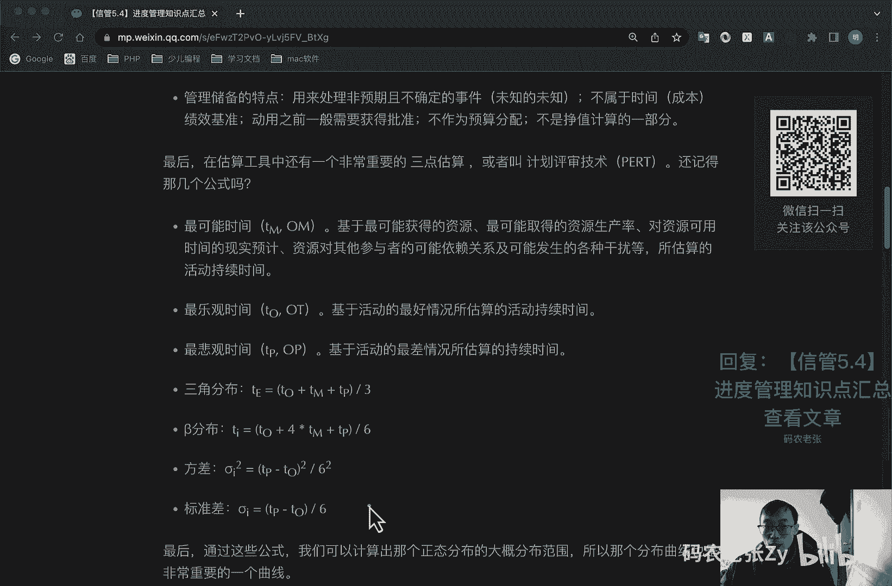
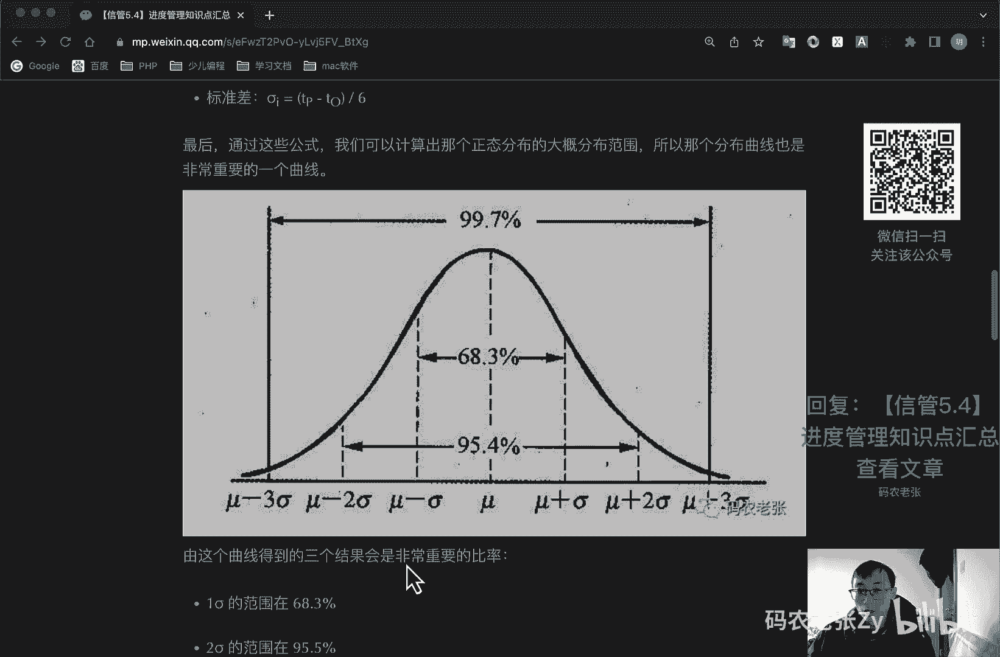
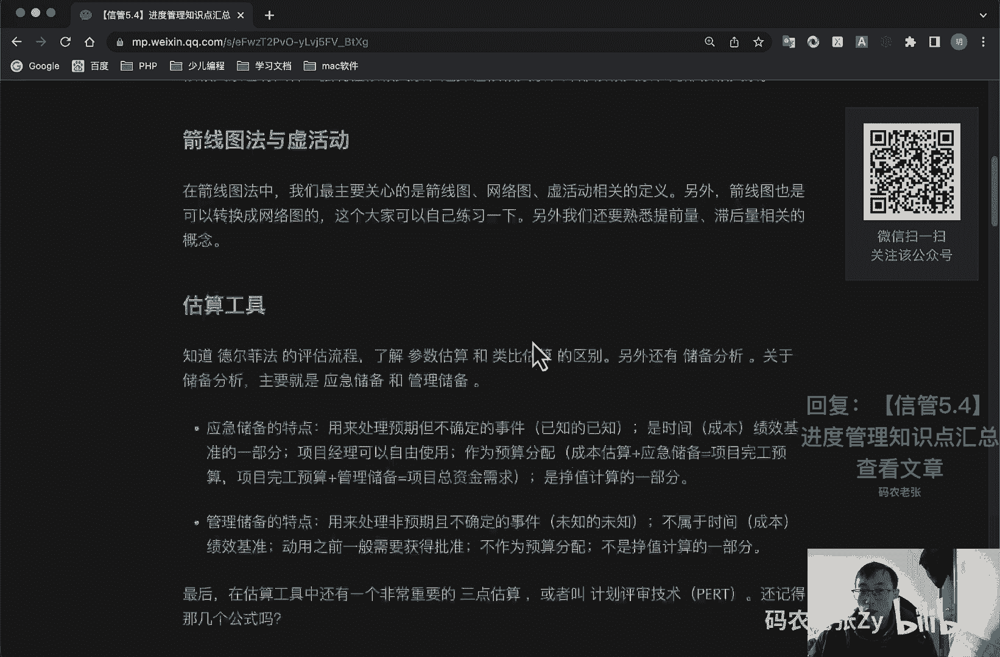

# 【信管5.4】进度管理知识点汇总 - P1 - 码农老张Zy - BV1de4y1A7YY

哈喽大家好，今天呢我们来学习的是信息系统项目管理师，第五大篇章的第四篇文章，进度管理知识点的汇总，在项目进度管理这一块呢，我们突然一下就接触到了不少的计算操作，而且也接触到的工具和概念。

也相比范围管理来说多了很多，因此呢我们在这里进行一次小的总结，好，我们第一个要了解的就是活动顺序与逻辑关系，还记得什么是活动吧，活动就是w bs再次分解之后的内容，有了活动之后呢。

我们最先要做的就是排列活动顺序，而在排列活动顺序中，我们更需要关注的就是活动的逻辑关系和，依赖关系，逻辑关系呢有四种，就是结束开始的关系，fs型，然后结束结束的关系，s f f型开始开始的关系。

s型以及开始结束的关系，s f型依赖关系呢也有四种，叫做强制性依赖关系，选择性依赖关系，外部依赖关系和内部依赖关系都是什么意思啊，都要想起来好了，第二个呢就是建线图法与虚活动，在建线图法中呢。

我们最主要关心的是建线图，网络图区活动相关的定义，另外呢接线图也是可以转换成网络图的，这个大家也可以自己去练习一下，另外我们还要熟悉一下提前量，滞后量相关的概念，要是哪个是负数，哪个是正数，对不对。

好了，下一个呢就是估算工具，我们要知道德尔菲法的评估流程，了解参数估算和类比估算的区别，另外还有储备分析，关于储备分析呢，最主要的就是应急储备和管理储备，应急储备的特点呢，它是用来处理预期的。

但不确定的事件就已知的，已知有预期的，但是不确定的时间就叫做已知的，已知是时间成本绩效基准的一部分，项目经理呢可以去自由使用的，作为预算分配的，成本估算加上应急储备等于项目完工预算。

然后项目完工预算加上管理储备，等于项目总资金需求，这个就是在成本这一块的，我们现在还没讲到啊，后面也会说到的，然后呢，这个应急储备呢它也是正值计算的一部分，然后管理储备，管理储备的特点呢。

就是用来处理非预期的不确定的事件，就是所以它叫做未知的未知，它不属于时间成本绩效基准的，它不属于基准里面的动用，之前呢一般要获得批准，不作为预算分配，不是政治计算的一部分，项目经理呢不能直接去抄去使用。

这个呢就是他们俩的一个区别和特点，一定要记住好，最后在估算中呢，还有一个非常重要的叫做三点估算，或者叫做计划评审技术，还记得这几个公式还记不记得啊，最可能时间对吧，最可能的时间，最乐观的时间。

最悲观的时间都是什么意思，然后呢就是三角分布，三角分布其实就是平均数，对不对，三角分布三个加起来除以三，然后就是贝塔分布，就是最最乐观的，加上最悲观的，然后乘以四倍，最可能的，然后最后除以一个六对吧。

然后方差方差就是最悲观的减去最乐观的平方，然后除以一个36对六的平方嘛，然后就是标准差就是最悲观点是最乐观，然后去除以一个六，这个叫做标准差，标准差也叫什么sigma对吧。

一个标准差就一个西格玛，然后呢通过这些公式，我们可以计算出那个正态分布的，大概的分布范围，这个分布曲线也是非常重要的一个曲线，要记住几个值对吧，一个西格玛范围的就是一个sigma范围的，是什么68。3。

然后两个西格玛范围的是95。4，然后三个sigma范围的就是什么99。7，这个东西呢也是就是死记硬背的啊。

死记硬背的东西，这个公式非常简单非常简单，然后死记硬背，所以这种题啊，这种题千万不要去丢分好了，接下来呢就是关键路径法去计算活动，关键路径法计算活动的最核心的就是这个东西，对不对，最核心的就是这个东西。

然后每每一个点上面的一个计算的方式，还记得吗，计算方式这个e是什么，e就是max前活动的ef就是最大的警前活动的ef，最大的警前活动的ef，也就是当前这个节点最早开始时间。

是在这个节点之前所有活动中最大的那个e f，然后就是e f等于e s加上d u e，e f就等于这个e s去加上这个du对吧，这个呢就是上上面这几个就出来了，然后lf lf呢。

就是最小的紧后活动的这个l s，最小的紧后活动，这个l s这个指的是最迟完成时间的确定，应该是这个节后续所有节点中，最小的那个ios的值，一般的第一个节点，第一个节点它是零对吧，最后一个节点的话。

它就是总工期，对不对，他就是总工期，然后拿它去减去这个工期，就等于这个l s对吧，同时也在这里，然后中间这个总浮动时间总时差，总浮动时间总时差都可以啊，这两个这两个名词都是一样的。

表示这tf他呢就是l f去减去这个e f，或者是l s去减去e s前面说过了对吧，对等的对等的好，最后还有一个自由时差，自由时差，就是mini最小的后活动的e去减去。

这个e最小的紧后活动的e减去这个e f紧，后活动最小的那个e去减去当前这个活动的ef，就是当前这个活动的自由时差，自由时差指的就是它不影响后面那个活动，他并且后面的活动总时差。

指的就是它不影响整个关键路径上的活动，注意啊，他们俩之间的区别好，如何正推，如何逆推，分别计算是什么内容，这些想必也不用我多说了，这些公式都是重点中的重点，整个考试中的两大计算之一。

重要程度呢我已经是很很多很多遍了啊，剩下的就是不停的刷题做题了，另外也提供一些关键点啊，什么关键点的第一个最强的路径，它肯定是关键路径，注意啊，关键路径有可能是一条，也有可能是多条，这个前面也说过了。

关键路径越多，风险就越大，为什么呢，关键路径越多的话，它上面的活动也越多，活动越多的话，就买哪一个活动出问题，你说不好对吧，所以说它的风险就越大，然后呢就是总时差决定进度的安排的灵活性。

自由时差决定后续活动安排的一个灵活性好，接下来就是关键练法，资源优化和进度压缩关键链法的两个缓冲对吧，这波缓冲还有一个什么，还有个项目缓冲，对不对，资源优化的资源平衡和资源平滑，是什么意思对吧。

进度压缩的赶工和快速跟进是什么意思，最后还有一个就是我们缩短工期的一些方法，关键路径活动的调整就会快速跟进，然后非关键路径的调整，然后投入更多的资源，加速活动进程，这个就是管赶工，赶工是什么。

赶工就是加班，然后指派经验更丰富的人去完成，或者帮助完成工作项目对吧，然后就是减少活动范围或降低活动要求，这个就是啊，然后就是改进方法或技术，提高生产效率对吧，之前的都是学过的东西了，不记得了。

再回去看一下，ok总结一下这一课内容呢，就是整个进度管理的核心重点内容，当然了，更具体的内容，还需要大家在之前的课程中进行更深入的学习，了解，更重要的是计算相关的内容，一定一定一定要多刷题。

最核心的对不对，关键路径法画网络图的时候，最核心的我说过的是什么，一定要把那个图画出来啊，这个只要那个图画出来了，剩下的什么问题都好解决好，今天的内容呢就这些非常简单，是关于进度知识管理。

进度管理知识点的一个简单的一个汇总，大家可以回复文章的标题，信管5。4，进度管理知识点汇总，来获得这篇文章的具体内容好了。

今天的内容就是这些。

