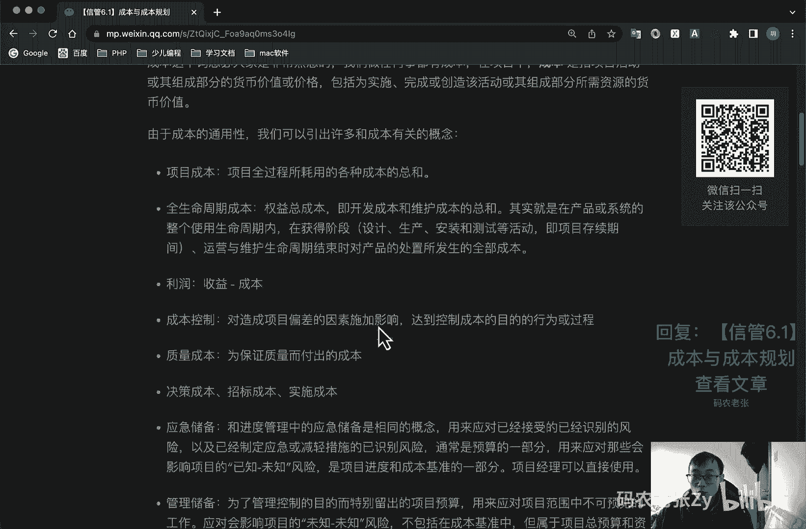

# 【信管6.1】成本与成本规划 - P1 - 码农老张Zy - BV18G4y1N7Wu

哈喽大家好，今天呢我们来学习的是信息系统项目管理师，第六大篇章成本这一篇章的第一篇文章，成本与成本规划，项目成本管理呢，是要确保在批准的预算内完成项目，虽然项目成本管理。

主要关心的是完成项目活动所需资源的成本，但也必须考虑项目决策对项目，产品服务或成果的使用成本的一个影响，总之呢，项目成本管理，是项目管理铁三角的最后一个支点，在项目管理中占有非常非常非常重要的地位。

铁三角还记得是什么东西吗，我们可以在这里再简单的去回顾一下，项目管理的一个铁三角，是这个样子的一个范围，进度成本上面这个叫做范围对吧，下面这个叫范围，然后这边有个进度，然后这边就是成本。

这个就是项目管理的一个铁三角，当然有的是有的书上面呢还会把质量放在中间，所以说这个范进制程，也是我们非常非常重要的东西啊，在项目管理领域是非常非常重要的东西，好成本成本这个词想必大家是非常熟悉的。

我们做任何事情都有成本，在项目中的成本，是指项目活动或组成部分的货币价值，或者是价格，包括为实施完成或创造该活动或者其组成部分，所需资源的一个货币价值，关于成本的通用性呢。

我们可以引出许多和成本有关的概念，这个其实前面也其实前面我们也学过一点啊，我们就再来看一遍，第一个就是项目成本，项目成本呢指的是项目全过程所耗用的，各种成本的一个总和，ok这个就不用多说了。

第二呢就是全生命周期成本，也叫权益总成本及开发成本和维护成本的总和，其实呢就是在产品或系统的整个，使用生命周期内，在获得阶段，获得阶段，就是在你的设计生产，然后还有运营以及维护生命周期结束时。

对产品处置所发生了一个全部的成本，好利润利润很简单啊，就是收益减成本就肯定就是你获得的利润嘛，就是我们要赚钱，就是赚利润对吧，然后呢就是成本控制对造成项目偏差，对造成项目偏差的因素施加影响。

达到控制成本的目的的行为和过程，然后呢就是质量成本，为保证质量而付出的成本，比如说维修啊，售后啊对吧，然后就是决策成本，招标成本，实施成本好，我们再看一下应急储备和管理储备啊。

这个之前我们在进度里面也讲过一点啊，应急储备和进度管理中的应急储备，是相同的概念，用来应对已接受的已经识别的风险，对已知已知的风险以及应对，以及制定应急或者是减轻措施的，以识别风险，通常是预算的一部分。

用来应对那些会影响项目的已知未知的风险，是项目进度和成本基准的一部分，项目经理可以直接使用这个前面一直在说了啊，然后管理储备，管理储备是为了管理控制的目的，而特别流出的项目预算。

用来应对项目范围中不可预见的工作，应对会影响项目的未知的未知的风险，不包括在成本基准中，但属于项目总预算和资金需求的一部分，项目经理使用管理储备需要获得批准，不纳入正值计算。

它不是我们那个基准的一部分对吧，这个之前我们之前上一篇，上上一节课也刚刚讲过的吧，之前也讲过好，我们再来看一下成本基准，成本基准基准又来了，成本基准是经过批准的，按时间安排的成本支出计划，成本支出计划。

第三个基准啊，并随时反映了经批准的项目成本变更，所增加或减少的项目资金数，被用于度量和监督项目的实际执行成本，它是制定预算过程的输出，结果可能是一个s型的曲线图，后面我们也会学习到好。

这些内容呢是和项目管理相关的，一些成本的概念，其中应急储备和管理储备的内容呢，是完全一样的啊，他们都是储备分析相关的这个工具，相关的内容，大家只需要知道进度和成本都可以，预留这两种储备就可以了。

除此之外呢，还有一些成本类型是需要我们记住的，这些内容呢也是普通管理学和会计入门选手，必须了解的，之前我们也讲过的啊，这些东西好，第一个叫做可变成本，可变成本呢是随着生产量，工作量或时间而变的。

成本较为可变成本，比如说做衣服，你要生产的越多对吧，你就需要越多的厂房和越多的工人，你的材原材料也需要的越多，这个东西呢就叫做成本，随着产量要增加了，这部分成本就叫做可变成本，第二个叫做固定成本。

也叫做不可变成本，不随生产量，工作量或时间的变化而变化的非重复的成本，比如说员工的工资在合同期范围之内，员工的工资其实是相对固定的对吧，你要变工资的话，其实你合同要重新签了，对不对。

所有的东西都是相对固定的啊，一定是在某一个时间内是相对固定的，不存在绝对的固定，类似的还有预算期内的广告费用啊，设备折旧啊，财产税费，培训费等等，好下一个就是直接成本，直接成本可以归属于项目工作的成本。

就直接可以归属于项目工作的成本，成为直接成本，比如说项目团队的差旅费啊，工资啊，项目使用的物料以及设备使用费等等，这个这个直接成本有直接的也有间接，间接成本呢就是来自一般管理费用科目。

或者是几个项目共同担负的项目成本，分所分摊给项目的费用，也就是不能或不便于进入某一成本，计算对象的成本，比如说啊税金额外福利保卫费用，管理人员工资等等，叫做间接成本好下面一个叫做机会成本。

利用一定的时间或者资源生产一种商品时，失去了利用这些资源生产其他产品机会，就是机会成本，比如说啊，比如说我们现在有资源，可以生产a b c3 种产品，最后我们选择生产的谁啊，b产品。

那么a和c产品所能盈利的数额，那就是我们的机会成本损失，这个之前我们在讲那个可研的时候，也学过这个东西对吧，机会成本好，沉没成本，这个也是之前讲过的，由于过去的决策已经发生了。

不能由现在或者将来的任何决策改变的成本，它是一种历史的成本，比如说我们上过大学交过的学费，对于现在的你来说呢，这些都是沉没成本了，你没办法，你没有办法再去改变你的大学，就是你的第一学历啊。

你你可以再读别的大学，没关系啊，但是你第一学历肯定没没有办法变了，他对于现有决策是不可控的一种成本，会很大程度上影响人们的行为方式与决策，在投资决策时呢应该排除沉没成本的一个干扰，好。

这些成本类型的都是普通管理学中必备的知识，也是极容易出现在选择题当中的内容，同时呢掌握这些成本概念也没啥坏处对吧，对于项目经理来说呢，在商务谈判的时候，这些概念呢也会经常出现。

也是会经常出现的内容成本失控的原因啊，就像进度失控，延期或者范围失败，就是出现镀金和范围蔓延一样，还记得什么意思吧，镀金什么意思啊，范围蔓延什么意思啊，成本失控。

超支也是我们在项目管理中经常会出现的情况，因此呢成本管理呢，你会发现范围进度成本呢都是会经常失控的，外加一个质量，因此呢项目管理也一直是将这四个内容，视为最核心的内容，前面我也说过了啊。

一般来说成本失控常见的原因有哪些呢，其实说白了还是那几个人才无法还好，我们再来看一下，第一个就是对工程项目的认识不足，对信息系统项目的特点认识不足，难度估计不足，工程项目的规模不合理。

设计及实施人员缺乏成本意识，对项目成本的使用缺乏责任感，第二个呢就是组织制度不健全，制度不完善，责任不落实，没有明确的投资分工，第三个呢就是方法问题啊，缺乏数据报表处理方法，程序控制方法等等。

第四个呢就是技术的制约，对于项目相关信息了解不足，估算方法不恰当，物资设备价格浮动等等，最后呢就是需求管理不当，需求分析失误，然后项目范围变更频繁对吧，这些都是可能造成成本失控的一个原因。

好我们看一下成本的管理过程，这个就少很多了，成本管理过程只有四个，然后前面三个都是在规划过程组的，最后一个呢是在监控过程组，监控过程组呢就一个控制成本，它就是监控项目的状态。

已更新项目成本管理成本基准变更的一个过程，然后在监控过程组呢主要就是一个规划成本，为规划管理花费和控制项目成本，而制定政策程序和文档的一个过程，第二个呢就是估算成本。

对完成项目活动所需资金进行近似估算的过程，还有一个呢就是制定预算，汇总所有单个活动或工作包的估算成本，建立一个经批准的成本基准的一个过程，好看的不多对吧，但是整个项目管理理论中，除了进度网络图之外。

另一个最重要的计算过程也就是正值计算，正值计算啊，这个正正值计算，就是在控制成本这个过程中当中，不过在这之前呢，我们还是要可以先轻松的学习一下，其他的这些过程中好，我们先来看一下第一个规划，成本。

规划成本管理的，也可以叫做制定成本管理计划过程，它是为规划管理花费和控制项目成本，而制定政策程序和文档的过程，这个过程的主要作用是在整个项目中，如何为如何管理项目成本提供指南和方向，在这个过程中呢。

我们要注意一些折旧成本的计算，比如说我们的资产折旧越快，我们交的税其实也就越少了好，第二个就是折旧方式有什么呢，有双倍余额递减法，直线法，年数总和法等等，第三个就是双倍的折旧最快，直线的最慢。

这几个记住就行了，具体怎么算呢，不要求你去算好吧，呃如果你想了解的话，去看一下管理学相关的内容啊，这几个都有的，或者会计相关的内容，这些都有的好吧，关于资产折旧这块的内几个内容，了解一下就好了。

自规划成本，最主要的内容是输出一个成本管理计划，它描述一张如何规划安排和控制项目成本，成本管理过程以及其工具和技术记录，在成本管理计划中一般包括哪些东西啊，我们来看一下啊，第一个就是计量单位。

需要规定每一种资源的计量单位，比如说米深蹲人时任天等等，延迟就是一个人工作的时间对吧，明天就是一个人工作一天大的工作量好，精确度，精确度主要是根据活动范围和项目规模。

设定成本估算向上或向下取整的一个程度，然后呢就是准确度，为活动成本估算规定一个可接受的区间，其中可能包括一些数量的应急储备，然后呢就是组织程序链接，通过wbs开发成本估算预算和控制。

然后那种控制临界值偏差，临界值用于监督成本的绩效，然后呢就是绩效的测量规则，包括控制账户，跟踪方法，测量技术等等，接下来就报个格式啊，过程描述啊，其他细节等等，这个都是这个项目成本管理计划里面的内容了。

好总结一下啊，今天我们先简单的入门学习了一下，项目成本管理，了解到了项目成本管理的概念以及成本的概念，呃，其中比较重要的就是成本的那些衍生出来的分，类，都是一大堆的名词解释，相信大家还是比较好理解的。

之前在讲那个在讲那个可言的时候，其实我们也讲过一部分了好了，今天的内容呢就是这些，大家可以回复文章的标题，信管6。1，成本与成本规划来获得这篇文章的具体内容。

好了，今天的内容就是这些。

