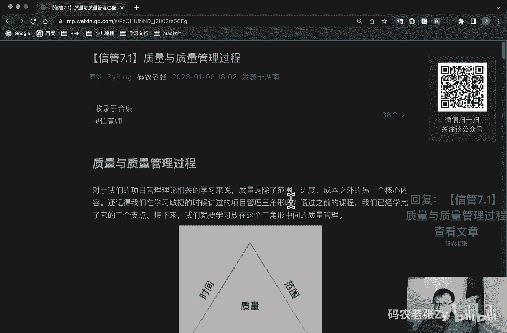
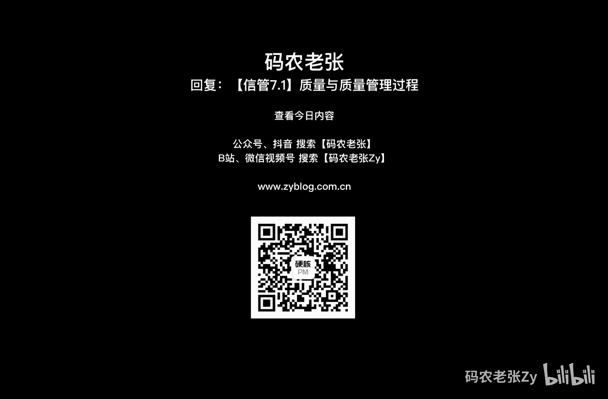

# 【信管7.1】质量与质量管理过程 - P1 - 码农老张Zy - BV1ZG4y1P7V9

哈喽大家好，今天呢我们来学习的是信息系统项目管理师，第七大片章的第一篇文章，质量与质量管理过程，第七大篇章讲的主要就是质量这一块了，对于我们的项目管理理论相关的学习来说呢，质量是除了范围。

进度成本之外的另一个核心内容，范进制成，范进制成非常重要，还记得我们学习敏捷的时候，讲过的项目管理三角形吗，通过之前的课程，我们已经学完了，它的三个支点，分别就是进步解决时间范围，还有成本。

然后质量这个它有的三角形里面，它会把它放在中间的，会放在外面，但是呢它都是非常非常重要的三角形，项目管理三角形一定就是范进制成，ok我们先来看一下质量的定义，国际化标准组织iso对质量的定义。

是反映实体满足主体和隐含需要的能力的特性，的一个总和，特性呢它就是指可区分的一个特征，可以是固有的或者是赋予的，定性的，或者是定量的，有各种类别的，包括物理的，感官的，行为的，时间的功能的等等。

而明确的隐含需求则是指明确需求，是指标准规范，同样技术要求，合同或者其他文件中，用户明确提出的要求需要，而隐含需求呢是指用户和社会通过市场调研，对实体的期望，以及公认的不必明确的需要求。

需要对其加以分析和研究，ok这个东西呢其实啊就是说质量这一块，他有一些是明确的标准，比如说你肯定不能你你你做一个网站，不能一天到晚都崩，对不对，但是呢它也有一些隐含的需求，这隐含的需求呢。

就是为了实现上面那个什么不会经常崩啊，或者什么那些的，我们肯定要去给它的配置啊，或者是做一些特殊的一些啊操作啊，什么之类的进行，就是让他能够保证出现，就是保证他明确的需求能够完成这种需求的。

叫做隐含的需求，总总之它都是对这个质量去产生影响的一块内，容，好了，我们再看一下质量与等级啊，在这里我们要了解一个重点的一个问题啊，就是质量与等级的关系，这个是今天非常重要的一个东西啊。

就质量作为实现的性能或成果，是一系列内在特性满足要求的程度对吧，还是前面那个定义的问题啊，就一系列内在特性满足满足要求的一个程度，等级呢，它作为设计意图啊，是对用图相同。

但技术特性不同的可交付成果的一个级别分类，好，这个是特性的等级的一个特点啊，上面那个是质量的定义和特点，好项目经理呢以及项目管理团队负责权衡，以使同时达到所要求的质量与等级水平。

质量水平未达到质量要求肯定是个是个问题，而低等级的产品呢实际上不是一个问题，比如说好一个低等级的低等级，一般来说呢就是功能有限的，然后高质量的就是没有明显的缺陷，用户手册一读的软件产品呢。

该软件产品是适合一般使用的，可以被认可的，也就是说他可以用对吧，他最起码可以用好一个高等级的功能繁多，一般来说就是功能繁多的，然后低质量就他有许多权限啊，用户手册杂乱无章啊，用一会儿就崩了。

这种软件产品，该产品的功能呢会因质量低劣而无效，或者是非常低效，不会被使用者接受，怎么理解这两个怪概念呢，就是之前呢我们一般都会说什么，之前我们就会拿苹果手机和安卓手机来举例子。

当然现在这个例子可能已经不是特别恰当了，但是相信大家还能体会到两者差别的，就说啊这个苹果手机是典型的，他特别典型的一个什么呢，低等级高质量的一个代表什么意思啊，就像现在在安卓手机中早已实现了各种功能。

比如说这个屏下指纹对吧，还有高刷等等高刷屏，这些呢在苹果手机就我写这篇文章的时候，iphone 13啊，现在已经是iphone 14了，对不对，在这些手机上面，在苹果。

苹果的这些系列手机上面还是没有实现对吧，还是没这些功能呢，屏下指纹啊，什么高高刷屏啊，这些都还没有呢，但是许多苹果和安卓都使用过的用户，却会评价说苹果手机更经久耐用一些。

它是非常典型的一个低等级高质量的一个代表，功能比较少，但是质量非常好，然后呢就是安卓手机，就像上面说的，它是高等级低质量，但是现在呢其实也不算特别低质量啊，对对对，国产的安卓手机都还是可以的。

当然这个低质量的问题现在已经好很多了，如果时间再往前推个78年的话，安卓阵营机皇的，它的质量感觉和苹果也完全不在一个档次上，只是说从机器人来看，在相对价位的质量上。

安卓阵营的品牌确实已经是能够拿得出手的，还是相当不错的了啊，好那么我们做互联网做软件开发的话，哪种更好呢，我当然是更倾向于低等级高质量的，如果想要高质量，那么就要减少范围。

减少范围其实是减少一些功能对吧，要么就增加人手，增加人手肯定会增加什么，增加成本，然后要么就调整进度，如果你想要范围范围，就是功能也多，然后还不想加长手，不想增加成本，那么进度还不能延长，那么对不起。

质量我就没有办法保证了，好现在知道就是项目，项目那个铁三角要怎么去跟你的领导去说了，对吧，知道学习项目管理的好处了对吧，对于向上沟通或者平行沟通来说，下面铁三角都是神器啊，对吧好。

我们再来看一下项目质量啊，项目质量呢是体现在性能和使用价值上，即项目的产品质量，项目质量呢是应顾客的要求进行的，不同的顾客呢有着不同的质量要求，其意图反映在项目合同中，因此呢。

项目合同通常是进行项目质量管理的主要依据，项目质量管理的趋势，它包括哪些呢，第一个呢就是客户满意，包括了解评估定义和管理需求，以满足客户的期望需要，把符合要求，就是确保项目产出预定的成果和适合使用。

产品或服务，必须满足实际需求去给它结合起来，最后他会得到一个用户，客户满意，然后呢就是持续改进啊，由希哈特提出的，并由代明完善的一个计划实施改进行动，也就是说我们之前讲过的p dc。

这个循环呢是质量改进的一个基础，其实呢在敏捷以及我们在第二大章节，介绍项目管理的时候，就提到过pdc这个东西，可以说这玩意儿是整个项目管理的一个基础，灵魂之一，除了pvc之外呢，还有全面质量管理。

还有六席格玛，后面我们都会说的管理层的一个责任，项目的成功呢需要项目团队全员的一个参与，管理层呢在其质量职责内，肩负着，为项目提供具有足够能力的资源的相应责任，一般来说呢质量问题。

管理层要占85%的责任，这个数字很关键啊，在考试的时候数字很关键，你想知道他怎么来的，自己去查一下相关资料好了，我们再来看一下质量成本，质量成本呢一般来说是根据预防有关的，大家可以思考一个问题。

就是说我们发生质量问题在什么时候是最好的，化，最划算的，或者说是解决质量问题代价最小的一个情况，估计不少人都会马上就说出来了，那就是说我们的产品在出厂之前，就被发现质量问题。

这个时候代价肯定是最小的对吧，而代价更小的则是提前预防出现质量问题，这个就很典型的地方，就是那个汽车对吧，汽车经常会有什么什么汽车召回，对不对，出问题了，把所有的那个已经卖出去的汽车召回。

其实这个成本非常非常高对吧，你已经把这个东西交给客户了，然后从客户那里再给他召回，然后再进行修理对吧，这个质量成本就是非常高的，最好的一种情况，就是出厂之前我们发现这个问题了。

就是把这一批车型呢全都已经搞好了，这个问题就对吧，这个成本就降低很多了，更好的是我们预防不要出现这个问题，是不是这个就是这个就是最高的一种，解决质量成本的一个问题，好预防生育检查，预防错误的成本呢。

通常远低于在检查或者使用中，发现并纠正错误的成本，这也是质量成本，质量成本叫做c o k的一个概念，包括在产品生命周期中，为预防不符合要求，为平价产品或服务是否符合要求，以及应未达到要求。

未未达到要求就返工嘛，就召回嘛，而发生的所有成本，而失败成本呢则被称为劣质成本，它通过分为内部成本，就是项目团队自己发现的，叫做内部内内部质量成本，然后和外部成本，那个质量成本呢就是由客户发现的两类。

不用我多说了，就是客户发现的肯定就是最麻烦的对吧，就像很多就我前面说过的，很多的汽车召回一样的，而内部发行成本呢就略低一些，它主要通过检查来进行发现，可能会推迟交付，但真正最好的肯定就是预防了对吧。

防患于未然的代价总是小于纠正时，发生错误的代价啊，反正非常重要对吧好，这个呢我们后面还会再详细的说这一块啊，好了，项目团队呢应该了解以下术语之间的差别，就是预防和检查的差别。

预防是保证过程不出现差错对吧，就是预防，然后检查呢就是保证错误不落到客户的手中，对吧，这是一个内内部检查的一个过程，然后呢就是属性抽样和变量抽样，属性抽样呢就是结果为合格或者不合格，变量抽样呢。

就是在连续量表上标明结果所处的位置，表示合格的一个程度好了，这个了解一下就行了，就是问到选择题里面，问到的时候，你起码要知道是什么意思对吧，然后就是公差和控制界限，公差呢就是结果的可接受范围。

然后控制界限呢就是在传统意义上，稳定的过程和过程，绩效的一个普通偏差的一个边界，好在这几个名词啊，记住什么意思就行了，好我们再来看一下质量管理，质量管理这个这两个名词应该很多人会见过，一个叫q a。

一个叫qc对吧，qc就是就是质量那个英文也可以，就这个英文，然后加上一个那个control，就是质量控制对吧，然后质量保证对吧，这就是q a好，我们看一下质量管理。

质量管理呢就是qm对吧management，然后这个呢是指确定质量方针目标和职责，并通过质量体系中的质量规划，质量保证和质量控制以及质量改进来洗，使其实现所有管理职能的全部活动。

其实质量管理呢就是为实现质量目标而进行的，所有有质量性质的一个活动，在这里呢，我们主要看的就是质量保证和质量控制，的一个区别啊，呃呃就是那个新款式和p m p里面，主要就是这个质量保证和质量控制这两块。

后面我们看那个他的管理过程，就可以看到好质量保证qa，它是质量管理的一部分，致力于满足质量要求的能力，也就是说质量保证呢是为了提供足够的信任，表明实体能够满足质量要求，而在质量体系中的实施。

并根据要求进行全部计划和有系统的一个活动，质量保证分为内部质量保证和外部质量保证，内部质量保证是企业管理的一种手段，目的是为了取得企业领导的信任，外部质量保障呢是在合同环境中。

呃供供方取信于虚方信任的一种手段，好了，质量控制，q c质量控制呢是管理质量管理的一部分，至于致力于满足需求，质量控制的目标，是确保产品的质量能够满足顾客，法律法规等方面所提出的质量要求，如适用性。

可靠性，安全性等等，质量控制的范围呢，涉及产品质量形成全过程的各个环节，如设计过程的采购过程，生产过程，安全安装过程等等，尽量控制的工作内容呢包括作业技术和活动，也就是包括专业技术和管理技术两个方面。

好了，这两个概念呢也是大概要能区分清楚，他们是什么概念呢，质量保证和质量控制的，也是我们整个项目质量管理的两个重要过程组，我前面说过了，后面我们就会学习具体的学习到，除此之外呢。

还有质量方针和质量目标呢，也是需要我们了解的，质量方针呢是指由组织的最高管理者，正式发布的，该组织的质量宗旨和方向，它是一个方针对吧，它体现了该组织项目的一个质量意识和质量追，求，是组织内部的行为准则。

也体现了顾客的期望和对顾客做出的承诺，质量方针呢是总方针的一个组成部分，由最高的管理者来批准的，质量目标呢它指的就是在质量方面的有追求，所追求的一个目的，是落实质量方针的具体要求啊。

但他它是比那个质量方程要小的，它是一个具体的要求，然后从属于质量方针，它属于质量方针的，然后呢英语利润目标，成本目标，进度目标等相协调，质量目标呢必须明确具体，尽量用定量化的语言进行描述。

保证质量目标容易被沟通和理解，质量目标应分解落实到各部门，以及项目的全体成员，以便于实施检查和考核，质量管理的原则主要包括哪些呢，就是以实用为核心的多元要求，然后系统工程职工参与管理，保护消费者权益。

面向国际市场，它的流程主要有四个步骤，第一个呢就是确立质量标准体系，第二个呢就是对呃项目实施进行质量监控，第三个呢就是将实际与标准对照，最后呢就是纠偏纠错，接下来呢我们再看一下。

质量管理方面的一些理论以及相关体系，这些也是管理学或者是质量管理学当中，相关的一些必备知识，第一个呢就是io 9000啊，这个大家应该多少都听过一点对吧，io呢它是国际化组织，一个叫做国际标准化组织。

然后9000系列呢是对产品质量发布的一套，标准体系，组注意9000它不是一个具体的标准，而是一组标准啊，它用于帮助各种类型和规模的组织实施并运行，有效的质量管理体系，增进客户满意度。

在这个标准体现呢主要包括几种，就是主要我们要了解的就这三种，第一个呢就是iso 99009001，这个呢是规定质量管理体系的要求，用于组织证实其具有，提供满足顾客要求和适用的法规要求的，产品的能力。

目的在于增进顾客的满意度，这个是最基本的一个质量要求，注意关键字，最基本的质量要求是iso 9001，然后是iso 9004，它是提供考虑，注意关键词，考虑质量管理体系的有效性和效率。

力量方面的一个指南，该标准的目的呢是组织业绩改进，和顾客以及其他集以及相关方的一个满意，这个是iso 9004啊，然后呢就是iso 19011，他呢是提供审核，注意审核就是iso 19011。

质量和环境管理体系的一个指南，so 9000呢有八条基本原则，这八条基本原则呢我当时考试的时候，简答题里面考过，这个印象就非常深刻了，这八个基本原则是什么呢，就是以顾客为中心，领导作用。

全员参与过程方法，然后管理的系统方法持续改进，基于事实的决策方法，与供方互利的一个关系，怎么进呢，还是找关键字啊，就是固定全过系辞绝户好，这个没什么特别的意义啊，差不多能记住就行了。

我们再来看一下全面质量管理，前面提到过对吧，它的简称是tq m，它那是一种全员的全过程的全企业的品质管理，它也可以简称叫做三权管理对吧，那个汤圆对吧，三全汤圆对吧，以满足用户需求为导向，不断改善。

然后最终达到用户的全面满足，全员参与为基础，进行全过程的质量控制，这个了解一下就行了，全面质量管理呢有四个核心特征，全员参与的质量管理，全过程的质量管理，然后全面方法的质量管理，和全面结果的质量管理。

主要记得他就是各种权对吧，好下一个就叫做六西格玛，还是这个标志，好熟悉这个标志，对不对，好六西格玛这个呢是由摩托罗拉公司提出的，代表是六倍的标准差，在质量上表表示。

第pmo就是100万个机会中出现缺陷的机会，少于3。4，就100万个产品里面只有3。4个产品是呃，出现那个有缺陷的，一般企业的缺陷率，大概在三个西格玛到四个西格玛之间，他强调的是对组织过程。

满足顾客要求能力进行一个量化，并在基础上确定改进目标和寻求改进的机会，核心是将所有工作作为一种流程，采用量化的方法分析流程中影响质量的因素，找出最关键的因素加以改进，从而达到最高的客户满意度。

也就是采用d m a i c简写啊，它包括的意思就是确定测量分析，改进和控制方法，对组织的关键流程进行一个改进，六西格玛的优越之处在于，从项目实施过程中改进和保证质量，而不是从结果中检查检验控制质量好。

六西格玛就是这个东西了解一下啊，然后呢就是软件过程改进和能力成熟度模型呃，软件过程改进，帮助企业软件，企业对软件制作过程的改变和改进呢，进行计划措施制定以及呃以及实施。

它的实施对象呢就是软件企业的软件过程，也就是软件产品的生产过程，当然也包括软件维护之类的维护过程，而对于其他的过程并不关注，实施软件过程改进，最大的利益在于，它能够极大的提高项目成功的概率。

软件过程改进的原则包括注重问题啊，强调知识创新啊，不断的改进，关于能力成熟度模型的内容呢，其实我觉得我们之前讲过的c m m i，我之前在那个新版1。9就是软件工程三。

软件设计与过程管理这篇文章里面讲过啊，这这里就不再重复去说了，不记得的小伙伴们可以点这个链接，回去再看一下，好我们再看一下其他理论啊，除了教材中提到的，上述那几个理论和实践之外呢。

我们再补充两个小知识点，大家知道就好了，有兴趣的同学可以自己查一下详细的资料，第一个呢就是朱兰的质量螺旋曲线，提出了合适就是最好的观点，好这个选择题也容易出啊，然后呢就是克劳斯比。

他提出了一个叫做零缺陷理论，他的观点呢是一次做对的，成本是最低的，好我们来看一下，回到主题就是项目质量管理的过程啊，是不是我们看一下它这个叫什么，实施质量保证对吧，还有一个叫做控制质量对吧。

他们一个是执行过程组的，一个是监控过程组的，另外还有规划过程组的规划质量管理，规划质量管理呢，它主要就是识别项目及其产品，质量要求和或标准，并书面描述，项目将要如何达到这些要求和标准的一个过程，好。

他就是那个规划质量管理，然后呢实施质量保证，就是审计质量要求和质量控制，测量结果，确保采用合理的质量标准和操作性，定义的一个过程，然后控制质量就是检测并记录，执行质量活动的结果，从而评估绩效。

并建议必须要改变的一个过程，好这就是我们质量管理的一个过程，就有三个啊，好我们先来看第一个就是规划质量管理，规划质量管理呢是识别项目及其可交付成果的，质量要求和标准，并准备对策，确保符合质量要求的过程。

本过程的主要作用是什么呢，就是为整个项目中，如何管理和确认项目质量提供了指南和方向，规划质量呢主要的活动包括收集资料，编制项目的质量计划，学会使用工具和技术形成项目计划书呃，质量计划书。

它的主要作用是明确质量的标准或者是策略啊，标准质量的标准或者质量的策略，确定质量标准获得的关键因素，明确质量的一个目标，建立控制流程，规划质量管理，在输入中呢，我们要了解对于质量管理的一个规划。

干系人登记册，风险登记册都是非常重要的一个输入条件啊，这两个一个是在干系人，相关那个相关方管理里面出来的，另外一个就是风险啊，管理这个过程里面出来的两个东西，然后另外呢再加上需求文件，三大基准等。

共同通过以下工具与技术输出，质量管理计划和过程改进计划，过程改进计划，记得吗，11个计划里面多出来了，多出来的那两个，有一个是需求管理计划对吧，还有一个就是过程改进计划，这个之前我们都说过了啊，好了。

我们看一下，有，就是通过哪出哪些工具与技术来规划质量管理，第一个呢叫做成本效益分析法，对每个质量活动进行成本效益分析，就是要比较其可能的成本与预期的收益，达到质量要求的主要收益包括减少返工，提高生产率。

降低成本，提升干洗人满意度以及提升盈利能力等等，第二个呢就是质量成本法，是指在产品生命周期中所发生的所有成本，包括为预防不符合要求，为平价产品或服务是否符合要求，以因未达到要求而发生的所有成本。

就是我们前端的那个质量成本对吧，下面这个质量成本的图呢很重要，就是这个质量成本的图啊，你看它会分为这个一致性成本和非一致性成本，其实一个就是内部的啊，这个就是内部的，然后呃这个这边呢就是一个内部的。

这边呢就是一个外部的对吧，他这里有内部和外部的，然后呢在这里这里我们可以看到预防成本，预防成本主要就是一个培训对吧，我们可以培训，然后可以流程文档化，然后包括设备，然后包括选择正确的做事的时间。

通过这些呢，我们就可以起到一个预防的一个作用，然后呢就是评价成本全面成本的，就是内部的一个检查对吧，这个测试，然后破坏性测试，然后包括一个内部的一个检查，就是你这个产品出库之前进行一个检查。

然后还有一个内部失败成本呢，就主要就是通过反攻反攻，就是这个东西要重新做了，对不对，然后另外就是废废品，然后外部成本，外部外部外部的一个失败成本，外部失败成本呢就是你这个有客户发现的，对不对。

你这个产品已经卖出去了，对不对，对吧，他这里就从这个地方是分那个内部和外部的，然后这个一致性和非一致性呢，还不是那个内外的一个区分的一个关键点啊，那你就要注意到一致性的是，包括这个预防和评价。

预防里面主要有一个培训，有一个检查，然后非执行成本呢就是分为内部和外部的，对不对，内部外部的有一个反光，有个废品，然后内部有个反光，有个废品，然后外部呢主要就是一个责任保修，和一个业务的一个流失。

那肯定就是外部的这个这个成本的，那个质量成本就是花费了非常大的了对吧，这个图也是非常重要的，你要记住这几个名词，这几个名词它是属于预防还是属于评价，还是属于内部，还是属于外部，是一致性的还是非抑制性的。

就是这个图的作用了，好我们再来看一下标杆对照，对实际或者计划的项目实践，与科比项目的实践进行对照，以便识别最佳实践，形成改进意见，并为绩效考核呢提供一个依据，好实验设计啊，叫做doe，一种统计方法。

用来识别哪些会对正在生产的产品，或者正在开发的流程的特定变量产生影响，可以在质量规划管理过程中使用，以确定测试的数量和类别，以及这些测试对质量成本的一个影响，然后呢就是系统抽样。

系统抽样是从目标总体中选取部分样本，用于检查，然后流程图对一个过程的图形化表示，用来显示该过程中各个步骤之间的相互关系，然后就是专有的质量管理方法，包括六西格玛精益，六西格玛质量功能展开以及cmi。

前面都讲了好了，还有就是其它质量规划工具，包括新老七种质量工具，我们下节课会讲非常重要的，质量管理里面非常重要的内容，就是这个东西好，通过上述工具与技术呢，我们可以输出两个质量管理相关的计划。

以及一个质量测量的一个指标，先来看第一个啊，叫做质量管理计划，它是项目管理计划的组成部分，描述如何实施组织的质量政策，以及项目管理团队准备，如何达到项目的质量要求，质量管理计划呢可以是正式的。

可以是非常详细的，也可以是高度概括的，其风格与详细程度取决于项目的具体需要，下一个呢就是过程改进计划是吧，就多出来那两个计划，其中之一，过程改进计划是项目管理计划的子计划，或者组成部分，详细说明。

对项目管理过程和产品开发过程，进行分析的各个步骤，以识别政治活动需要考虑的方面，包括第一个就是过程边界，描述过程的目的，过程的开始和结束，过程的输入和输出过程负责任和干系人，第二个呢就是过程配置。

还有确定界面的过程图形，以便于分析，第三个呢就是过程测量指标与控制界限一起，用于分析过程的效率，第四个呢就是绩效改进指标，用于指导过程的改进活动，好过程改进计划也是非常重要的啊。

最后一个就是质量测量的指标，用于描述项目或者产品属性，以及控制质量过程将如何对属性进行一个测量，好，今天的内容呢还是概念性的内容比较多啊，我们那也比较长，重点在于质量的定义，质量保证和质量控制的区别。

soo 9000，然后全面质量管理的三权规划，质量管理的那些工具和技术以及概念等等，另外呢质量成本的那张图非常重要的，就是前面说的这个图一致性的，非一致性的，什么内部的，外部的。

还有检查预防的评价的对吧，这个图非常重要，好，要能通过图中的名词反向说出，这是属于哪种质量成本，总之呢质量管理非常非常重要对吧，概念也非常非常的繁多，同时呢，整个管理学领域呢。

也是有专门的质量管理的课程的，是一个非常大的一个管理学分支课程，大家一定要掌握好，我们学习到了其实只是质量管理的皮毛，也就是入门知识而已好了，简单的内容呢就是这些，大家可以回复文章的标题，信管7。1。

质量与质量管理过程呢，获得这篇文章的具体内容好了，这些内容呢还是要详细的来看一下的，概念非常多，需要记忆和背诵的东西也非常多。

好了，提前内容呢就这些。

